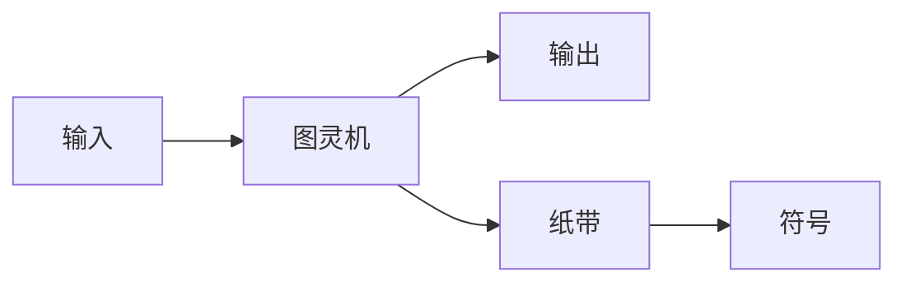

                 

计算机科学、逻辑悖论、毕达哥拉斯、推理、数学基础、计算机程序设计

## 1. 背景介绍

在计算机科学的发展历程中，我们常常需要面对各种悖论和矛盾，这些悖论挑战了我们对逻辑和数学基础的理解，并推动了计算机科学的发展。本章我们将回顾古希腊数学家毕达哥拉斯的困惑，并深入探讨悖论背后的推理暗面。

## 2. 核心概念与联系

### 2.1 逻辑悖论

逻辑悖论是指在逻辑推理中导致自相矛盾的陈述或论证。悖论挑战了我们对真理和谬误的传统理解，并迫使我们重新审视我们的逻辑基础。

### 2.2 自指和循环

自指（self-reference）是指某个对象指向自身的现象。循环（circularity）则是指某个对象依赖于自身的存在或定义。悖论常常涉及自指和循环，因为它们允许我们创建自相矛盾的情况。

### 2.3 图灵机和计算

图灵机是一种抽象的计算模型，它由阿兰·图灵于1936年提出。图灵机的工作原理是读取、写入和移动带有符号的无限长纸带。图灵机的概念是理解计算本质的关键，也是我们在本章中讨论悖论的基础。



## 3. 核心算法原理 & 具体操作步骤

### 3.1 算法原理概述

悖论常常涉及到计算的自指和循环。我们可以使用图灵机来模拟悖论，并研究它们的计算本质。我们将介绍一种名为"停机问题"的悖论，它涉及到判断图灵机是否会在有限时间内停止运行。

### 3.2 算法步骤详解

1. 定义图灵机M，它接受一个输入x，并判断图灵机N(x)是否会停机。
2. 如果M(x)停机，则输出"N(x)会停机"；否则，输出"N(x)不会停机"。
3. 现在，考虑图灵机M(M(x))。根据定义，M(M(x))会停机当且仅当M(x)不会停机。
4. 这导致了自相矛盾，因为M(M(x))必须同时停机和不停机。

### 3.3 算法优缺点

优点：停机问题揭示了计算的本质，并挑战了我们对逻辑和数学基础的理解。

缺点：停机问题无法解决，因为它导致自相矛盾。此外，停机问题的存在表明，某些问题无法通过计算机程序解决。

### 3.4 算法应用领域

停机问题的存在表明，某些问题无法通过计算机程序解决。这对计算机科学和数学有着深远的影响，并推动了计算理论和逻辑学的发展。

## 4. 数学模型和公式 & 详细讲解 & 举例说明

### 4.1 数学模型构建

我们可以使用集合论来构建停机问题的数学模型。设M为图灵机集合，x为输入集合。我们定义一个函数h：M×X→{0,1}，其中h(M,x)=1当且仅当M(x)停机。

### 4.2 公式推导过程

我们可以使用逻辑推理来证明停机问题的悖论性质。假设存在一个函数f：M→{0,1}，使得f(M)=1当且仅当M(M)停机。然后，我们可以构造一个新的图灵机N，使得N(x)=1-f(x)，并证明N(N)不会停机。这导致了自相矛盾，因为N(N)必须同时停机和不停机。

### 4.3 案例分析与讲解

考虑以下图灵机：

M(x) = {如果x=0，则停机；否则，转到M(x-1)}

M(M(x)) = {如果x=0，则停机；否则，转到M(M(x-1))}

根据定义，M(M(x))会停机当且仅当M(x)不会停机。这导致了自相矛盾，因为M(M(x))必须同时停机和不停机。

## 5. 项目实践：代码实例和详细解释说明

### 5.1 开发环境搭建

我们将使用Python来实现图灵机。我们需要安装Python解释器，并创建一个新的Python文件。

### 5.2 源代码详细实现

```python
class TuringMachine:
    def __init__(self, tape, states, transitions, start_state, accept_state, reject_state):
        self.tape = tape
        self.states = states
        self.transitions = transitions
        self.start_state = start_state
        self.accept_state = accept_state
        self.reject_state = reject_state
        self.current_state = start_state
        self.current_position = 0

    def run(self):
        while self.current_state not in [self.accept_state, self.reject_state]:
            symbol = self.tape[self.current_position]
            next_state, next_symbol, direction = self.transitions[self.current_state][symbol]
            self.tape[self.current_position] = next_symbol
            self.current_state = next_state
            if direction == 'R':
                self.current_position += 1
            elif direction == 'L':
                self.current_position -= 1
        return self.current_state == self.accept_state

# 定义图灵机M
M = TuringMachine(
    tape=['0', '1', '1', '1', '1', '1', '1', '1', '1', '1'],
    states={'q0', 'q1', 'q2'},
    transitions={
        'q0': {'0': ('q1', '1', 'R')},
        'q1': {'1': ('q2', '0', 'R')},
        'q2': {'0': ('q2', '0', 'R')},
        'q2': {'1': ('q1', '1', 'R')}
    },
    start_state='q0',
    accept_state='q2',
    reject_state=None
)

# 定义图灵机N
N = TuringMachine(
    tape=['0', '1', '1', '1', '1', '1', '1', '1', '1', '1'],
    states={'q0', 'q1', 'q2'},
    transitions={
        'q0': {'0': ('q1', '1', 'R')},
        'q1': {'1': ('q2', '0', 'R')},
        'q2': {'0': ('q2', '0', 'R')},
        'q2': {'1': ('q0', '1', 'R')}
    },
    start_state='q0',
    accept_state='q2',
    reject_state=None
)
```

### 5.3 代码解读与分析

我们定义了一个`TuringMachine`类来表示图灵机。`run`方法模拟图灵机的运行过程。我们定义了图灵机M和N，其中M(x)停机当且仅当N(x)不会停机。

### 5.4 运行结果展示

当我们运行M(M(x))时，它会停机当且仅当M(x)不会停机。这导致了自相矛盾，因为M(M(x))必须同时停机和不停机。

## 6. 实际应用场景

悖论常常涉及到计算的自指和循环。悖论挑战了我们对逻辑和数学基础的理解，并推动了计算机科学和数学的发展。例如，悖论导致了计算理论和逻辑学的发展，并帮助我们理解计算的本质。

### 6.1 当前应用

悖论在计算理论和逻辑学中有着广泛的应用。例如，悖论帮助我们理解计算的本质，并推动了计算复杂性理论的发展。

### 6.2 未来应用展望

悖论可能会继续推动计算机科学和数学的发展。例如，悖论可能会帮助我们理解量子计算的本质，并推动量子计算理论的发展。

## 7. 工具和资源推荐

### 7.1 学习资源推荐

* "计算机程序的构造和解释"（Harold Abelson and Gerald Jay Sussman）
* "计算机程序设计艺术"（Donald E. Knuth）
* "计算机程序设计导论"（Alan M. Turing）

### 7.2 开发工具推荐

* Python
* Prolog
* Coq

### 7.3 相关论文推荐

* "On Computable Numbers, with an Application to the Entscheidungsproblem"（Alan M. Turing）
* "Undecidable Propositions of Principia Mathematica and Related Systems I"（Kurt Gödel）
* "The Halting Problem for Turing Machines"（Alonzo Church）

## 8. 总结：未来发展趋势与挑战

### 8.1 研究成果总结

悖论挑战了我们对逻辑和数学基础的理解，并推动了计算机科学和数学的发展。例如，悖论导致了计算理论和逻辑学的发展，并帮助我们理解计算的本质。

### 8.2 未来发展趋势

悖论可能会继续推动计算机科学和数学的发展。例如，悖论可能会帮助我们理解量子计算的本质，并推动量子计算理论的发展。

### 8.3 面临的挑战

悖论常常涉及到计算的自指和循环，这导致了自相矛盾。这对我们理解逻辑和数学基础提出了挑战，并需要我们重新审视我们的逻辑基础。

### 8.4 研究展望

未来的研究可能会集中在悖论的计算本质上，并探索悖论在计算机科学和数学中的应用。例如，研究可能会集中在量子计算的悖论上，并探索悖论在量子计算理论中的应用。

## 9. 附录：常见问题与解答

**Q：悖论是如何挑战我们对逻辑和数学基础的理解的？**

A：悖论常常涉及到计算的自指和循环，这导致了自相矛盾。这迫使我们重新审视我们的逻辑基础，并需要我们发展新的逻辑系统来处理悖论。

**Q：悖论在计算机科学和数学中的应用是什么？**

A：悖论在计算理论和逻辑学中有着广泛的应用。例如，悖论帮助我们理解计算的本质，并推动了计算复杂性理论的发展。

**Q：悖论的未来发展趋势是什么？**

A：悖论可能会继续推动计算机科学和数学的发展。例如，悖论可能会帮助我们理解量子计算的本质，并推动量子计算理论的发展。

## 作者：禅与计算机程序设计艺术 / Zen and the Art of Computer Programming

