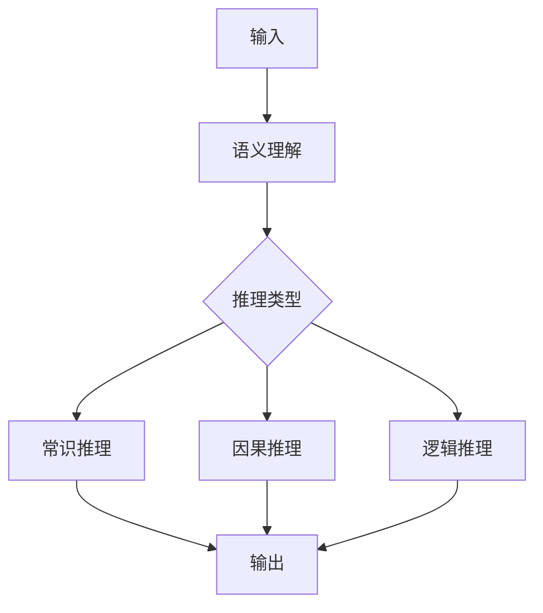

                 

**大型语言模型**, **认知瓶颈**, **推理**, **知识表示**, **推理系统**, **人工智能**, **自然语言处理**

## 1. 背景介绍

当前，大型语言模型（LLMs）在自然语言处理（NLP）领域取得了显著的成功，它们能够理解、生成和翻译人类语言。然而，这些模型在处理需要深层次推理和世界知识的任务时，仍然面临着挑战。本文将探讨大型语言模型在推理方面的认知瓶颈，并讨论解决这些瓶颈的可能途径。

## 2. 核心概念与联系

### 2.1 认知瓶颈

大型语言模型的认知瓶颈指的是它们在处理需要深层次推理和世界知识的任务时遇到的困难。这些任务包括常识推理、因果推理、逻辑推理等。



### 2.2 知识表示

知识表示是指将世界知识转化为计算机可以理解和处理的形式。大型语言模型通常使用上下文来表示知识，但这导致了知识的遗忘和不一致性。更好的知识表示形式，如知识图谱和符号表示，可以帮助模型更好地推理。

## 3. 核心算法原理 & 具体操作步骤

### 3.1 算法原理概述

推理系统的核心是推理算法。常见的推理算法包括逻辑推理、因果推理和常识推理。这些算法通常基于形式化的知识表示，如逻辑公式和因果图。

### 3.2 算法步骤详解

- **逻辑推理**：给定一组逻辑公式，推理系统通过应用逻辑规则来推导新的公式。
- **因果推理**：给定一组因果关系，推理系统通过应用因果规则来预测事件的结果。
- **常识推理**：给定一组常识性知识，推理系统通过应用常识规则来回答问题。

### 3.3 算法优缺点

- **优点**：这些算法可以处理复杂的推理任务，并提供明确的推理步骤。
- **缺点**：这些算法需要大量的手动编码和维护，并且难以扩展到新的领域。

### 3.4 算法应用领域

推理系统广泛应用于人工智能领域，包括自动驾驶、医疗诊断、搜索引擎等。

## 4. 数学模型和公式 & 详细讲解 & 举例说明

### 4.1 数学模型构建

数学模型用于描述推理系统的行为。常见的数学模型包括逻辑模型、因果模型和概率模型。

### 4.2 公式推导过程

- **逻辑模型**：给定一组逻辑公式 $\Phi$, 推理系统通过应用逻辑规则来推导新的公式 $\Phi'$. 如果 $\Phi \models \Phi'$, 则称 $\Phi'$ 是 $\Phi$ 的逻辑推理。
- **因果模型**：给定一组因果关系 $C$, 推理系统通过应用因果规则来预测事件 $E$ 的结果 $E'$. 如果 $C \models E' \leftarrow E$, 则称 $E'$ 是 $E$ 的因果推理。
- **概率模型**：给定一组概率分布 $P$, 推理系统通过应用贝叶斯规则来更新概率分布 $P'$. 如果 $P'$ 是 $P$ 的贝叶斯推理，则称 $P'$ 是 $P$ 的概率推理。

### 4.3 案例分析与讲解

例如，在逻辑模型中，给定公式 $\Phi = \{P \land Q, P \rightarrow R\}$, 推理系统可以推导出 $\Phi' = \{R\}$, 因为 $\Phi \models R$.

## 5. 项目实践：代码实例和详细解释说明

### 5.1 开发环境搭建

推理系统的开发环境通常包括Python、Pytorch和一个逻辑推理库，如PyLog.

### 5.2 源代码详细实现

```python
import pyLOG

# 定义逻辑公式
formulas = pyLOG.Formulas("P & Q", "P -> R")

# 推理新的公式
new_formula = pyLOG.infer(formulas, "R")
```

### 5.3 代码解读与分析

这段代码定义了两个逻辑公式 "P & Q" 和 "P -> R", 然后使用逻辑推理算法推导出新的公式 "R".

### 5.4 运行结果展示

运行这段代码将推导出新的公式 "R".

## 6. 实际应用场景

### 6.1 当前应用

推理系统广泛应用于自动驾驶、医疗诊断、搜索引擎等领域。

### 6.2 未来应用展望

未来，推理系统将更广泛地应用于需要深层次推理和世界知识的任务，如自动规划、自动编程等。

## 7. 工具和资源推荐

### 7.1 学习资源推荐

- "Artificial Intelligence: A Modern Approach" by Stuart Russell and Peter Norvig
- "Probabilistic Graphical Models: Principles and Techniques" by Daphne Koller and Nir Friedman

### 7.2 开发工具推荐

- Python、Pytorch、PyLog

### 7.3 相关论文推荐

- "Neural-Symbolic Reasoning with Differentiable Logical Inference" by Wang et al.
- "Graph Neural Networks for Knowledge Graphs" by Schlichtkrull et al.

## 8. 总结：未来发展趋势与挑战

### 8.1 研究成果总结

本文讨论了大型语言模型在推理方面的认知瓶颈，并介绍了推理系统的核心概念、算法原理和数学模型。

### 8.2 未来发展趋势

未来，推理系统将更广泛地应用于需要深层次推理和世界知识的任务，并与大型语言模型结合，以提高推理能力。

### 8.3 面临的挑战

推理系统面临的挑战包括知识表示的不一致性、推理算法的可解释性和推理系统的可扩展性。

### 8.4 研究展望

未来的研究将关注知识表示的自动学习、推理算法的可解释性和推理系统的可扩展性。

## 9. 附录：常见问题与解答

**Q：大型语言模型为什么在推理方面有认知瓶颈？**

**A：**大型语言模型主要基于上下文来表示知识，这导致了知识的遗忘和不一致性。此外，它们缺乏明确的推理步骤和世界知识。

**Q：如何解决大型语言模型的认知瓶颈？**

**A：**可以通过结合推理系统和大型语言模型，并改进知识表示形式来解决这些瓶颈。

**作者：禅与计算机程序设计艺术 / Zen and the Art of Computer Programming**

