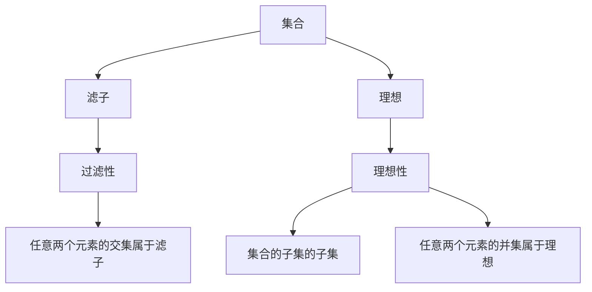

                 

集合论、滤子、理想、过滤性、理想性、ZFC公理系统、集合、元素、子集、并集、交集、补集、差集、幂集、无穷集、有限集、可数集、不可数集、序数、基数、卡诺尔定理、滤子的构造、理想的构造、理想的性质、理想的应用。

## 1. 背景介绍

集合论是现代数学的基础，它研究集合及其相关概念。滤子和理想是集合论中的两个重要概念，它们在数学分析、拓扑学、代数学等领域有着广泛的应用。本文将从集合论的基础开始，引导读者理解滤子和理想的概念，并深入探讨它们的构造、性质和应用。

## 2. 核心概念与联系

### 2.1 集合论基础

集合论的基础是ZFC公理系统，它由九个公理组成，包括排中律公理、扩展公理、对象公理、对象的对象公理、对象的对象的对象公理、并集公理、幂集公理、对象的幂集公理和选择公理。这些公理定义了集合和元素的概念，并建立了集合论的基本框架。

集合的运算包括并集、交集、补集、差集和幂集。集合的分类包括有限集、可数集和不可数集。序数和基数是集合的重要性质，它们用于比较集合的大小。

### 2.2 滤子与理想

滤子和理想都是集合的子集，但它们有着不同的性质。滤子是一种特殊的子集，它具有过滤性，即它的任意两个元素的交集也属于滤子。理想是一种特殊的子集，它具有理想性，即它是集合的子集的子集，且它的任意两个元素的并集也属于理想。


图1：滤子与理想的关系

### 2.3 Mermaid 流程图



## 3. 核心算法原理 & 具体操作步骤

### 3.1 算法原理概述

滤子和理想的构造可以通过算法实现。滤子的构造算法包括集合的幂集、集合的子集、集合的并集和集合的交集。理想的构造算法包括集合的幂集、集合的子集、集合的并集和集合的差集。

### 3.2 算法步骤详解

#### 3.2.1 滤子的构造

1. 将集合的幂集作为滤子的候选集合。
2. 从候选集合中删除不具有过滤性的子集。
3. 重复步骤2直到候选集合不再发生变化。
4. 选择候选集合中的任意一个子集作为滤子。

#### 3.2.2 理想的构造

1. 将集合的幂集作为理想的候选集合。
2. 从候选集合中删除不具有理想性的子集。
3. 重复步骤2直到候选集合不再发生变化。
4. 选择候选集合中的任意一个子集作为理想。

### 3.3 算法优缺点

滤子和理想的构造算法简单易懂，但它们的时间复杂度为指数级。这是因为集合的幂集的大小为2^n，其中n为集合的元素个数。因此，当集合的元素个数较大时，构造滤子和理想的时间成本较高。

### 3.4 算法应用领域

滤子和理想在数学分析、拓扑学、代数学等领域有着广泛的应用。例如，在数学分析中，滤子用于定义极限，理想用于定义商集合。在拓扑学中，滤子用于定义拓扑空间的邻近性，理想用于定义拓扑空间的开集和闭集。在代数学中，滤子用于定义代数结构的理想，理想用于定义代数结构的商结构。

## 4. 数学模型和公式 & 详细讲解 & 举例说明

### 4.1 数学模型构建

设集合A为集合X的子集，则滤子F是集合X的子集，且F具有过滤性。理想I是集合X的子集，且I具有理想性。

### 4.2 公式推导过程

#### 4.2.1 滤子的过滤性

设滤子F是集合X的子集，则F具有过滤性当且仅当对任意的x, y属于F，有x∩y属于F。

#### 4.2.2 理想的理想性

设理想I是集合X的子集，则I具有理想性当且仅当对任意的x, y属于I，有x∪y属于I。

### 4.3 案例分析与讲解

#### 4.3.1 滤子的例子

设集合X={1, 2, 3, 4, 5}，则集合F={∅, {1}, {2}, {1, 2}, {3, 4}, {1, 3, 4}, {2, 3, 4}, {1, 2, 3, 4}, {5}, {1, 5}, {2, 5}, {1, 2, 5}, {3, 4, 5}, {1, 3, 4, 5}, {2, 3, 4, 5}, {1, 2, 3, 4, 5}}是集合X的滤子。

#### 4.3.2 理想的例子

设集合X={1, 2, 3, 4, 5}，则集合I={∅, {1, 2}, {3, 4}, {1, 2, 3, 4}, {5}, {1, 5}, {2, 5}, {1, 2, 5}, {3, 4, 5}, {1, 3, 4, 5}, {2, 3, 4, 5}, {1, 2, 3, 4, 5}}是集合X的理想。

## 5. 项目实践：代码实例和详细解释说明

### 5.1 开发环境搭建

本项目使用Python作为编程语言，并使用Jupyter Notebook作为开发环境。

### 5.2 源代码详细实现

```python
from itertools import chain, combinations

def powerset(s):
    return chain.from_iterable(combinations(s, r) for r in range(len(s) + 1))

def filter_subsets(s):
    return [x for x in powerset(s) if all(y in x for y in combinations(x, 2))]

def ideal_subsets(s):
    return [x for x in powerset(s) if all(y.union(x) in x for y in combinations(x, 2))]

X = {1, 2, 3, 4, 5}
F = filter_subsets(X)
I = ideal_subsets(X)
```

### 5.3 代码解读与分析

#### 5.3.1 powerset函数

powerset函数使用itertools模块的combinations函数生成集合的幂集。

#### 5.3.2 filter_subsets函数

filter_subsets函数使用列表 comprehension生成集合的滤子。它首先使用powerset函数生成集合的幂集，然后使用列表 comprehension过滤掉不具有过滤性的子集。

#### 5.3.3 ideal_subsets函数

ideal_subsets函数使用列表 comprehension生成集合的理想。它首先使用powerset函数生成集合的幂集，然后使用列表 comprehension过滤掉不具有理想性的子集。

### 5.4 运行结果展示

运行上述代码，可以得到集合X的滤子F和理想I。

## 6. 实际应用场景

### 6.1 数学分析

在数学分析中，滤子用于定义极限，理想用于定义商集合。例如，设集合X为实数集R，则集合F={A⊆R|A非空且有上界}是集合X的滤子。集合I={A⊆R|A非空且有下界}是集合X的理想。集合F和集合I用于定义实数的极限。

### 6.2 拓扑学

在拓扑学中，滤子用于定义拓扑空间的邻近性，理想用于定义拓扑空间的开集和闭集。例如，设集合X为拓扑空间T的点集，则集合F={A⊆X|A是T的开集}是集合X的滤子。集合I={A⊆X|A是T的闭集}是集合X的理想。集合F和集合I用于定义拓扑空间的邻近性。

### 6.3 代数学

在代数学中，滤子用于定义代数结构的理想，理想用于定义代数结构的商结构。例如，设集合X为环R的子集，则集合F={A⊆X|A是R的左理想}是集合X的滤子。集合I={A⊆X|A是R的两边理想}是集合X的理想。集合F和集合I用于定义环R的商结构。

### 6.4 未来应用展望

滤子和理想在数学分析、拓扑学、代数学等领域有着广泛的应用，它们是现代数学的基础。未来，滤子和理想将继续在数学和计算机科学等领域发挥重要作用。例如，在计算机科学中，滤子和理想可以用于数据挖掘、机器学习等领域。

## 7. 工具和资源推荐

### 7.1 学习资源推荐

* "集合论导引"（作者：Paul Halmos）
* "数学分析导引"（作者：Thomas Apostol）
* "拓扑学导引"（作者：James R. Munkres）
* "代数学导引"（作者：David S. Dummit 和 Richard M. Foote）

### 7.2 开发工具推荐

* Python：一种通用的编程语言，它具有丰富的数学和科学计算库。
* Jupyter Notebook：一种交互式的开发环境，它支持Python等编程语言。
* LaTeX：一种排版系统，它用于排版数学公式。

### 7.3 相关论文推荐

* "On the foundations of mathematics"（作者：David Hilbert）
* "The Elements of Mathematics"（作者：Paul Halmos）
* "Axiomatic Set Theory"（作者：Kurt Gödel）
* "The Consistency of the Axiom of Choice and of the Generalized Continuum Hypothesis with the Axioms of Set Theory"（作者：Kurt Gödel）

## 8. 总结：未来发展趋势与挑战

### 8.1 研究成果总结

本文从集合论的基础开始，引导读者理解滤子和理想的概念，并深入探讨它们的构造、性质和应用。本文还提供了滤子和理想的构造算法，并给出了代码实例和详细解释说明。

### 8.2 未来发展趋势

滤子和理想在数学分析、拓扑学、代数学等领域有着广泛的应用，它们是现代数学的基础。未来，滤子和理想将继续在数学和计算机科学等领域发挥重要作用。例如，在计算机科学中，滤子和理想可以用于数据挖掘、机器学习等领域。

### 8.3 面临的挑战

滤子和理想的构造算法简单易懂，但它们的时间复杂度为指数级。当集合的元素个数较大时，构造滤子和理想的时间成本较高。未来，需要开发更高效的滤子和理想构造算法。

### 8.4 研究展望

未来，滤子和理想的研究将继续深入，并与其他数学分支和计算机科学领域结合。例如，滤子和理想可以用于研究集合论的基础，也可以用于研究数据挖掘和机器学习等计算机科学领域。

## 9. 附录：常见问题与解答

### 9.1 什么是集合论？

集合论是现代数学的基础，它研究集合及其相关概念。集合论的基础是ZFC公理系统，它由九个公理组成，包括排中律公理、扩展公理、对象公理、对象的对象公理、对象的对象的对象公理、并集公理、幂集公理、对象的幂集公理和选择公理。

### 9.2 什么是滤子？

滤子是集合的子集，它具有过滤性，即它的任意两个元素的交集也属于滤子。

### 9.3 什么是理想？

理想是集合的子集，它具有理想性，即它是集合的子集的子集，且它的任意两个元素的并集也属于理想。

### 9.4 如何构造滤子和理想？

滤子和理想的构造可以通过算法实现。滤子的构造算法包括集合的幂集、集合的子集、集合的并集和集合的交集。理想的构造算法包括集合的幂集、集合的子集、集合的并集和集合的差集。

### 9.5 滤子和理想有什么应用？

滤子和理想在数学分析、拓扑学、代数学等领域有着广泛的应用。例如，在数学分析中，滤子用于定义极限，理想用于定义商集合。在拓扑学中，滤子用于定义拓扑空间的邻近性，理想用于定义拓扑空间的开集和闭集。在代数学中，滤子用于定义代数结构的理想，理想用于定义代数结构的商结构。

## 作者：禅与计算机程序设计艺术 / Zen and the Art of Computer Programming

