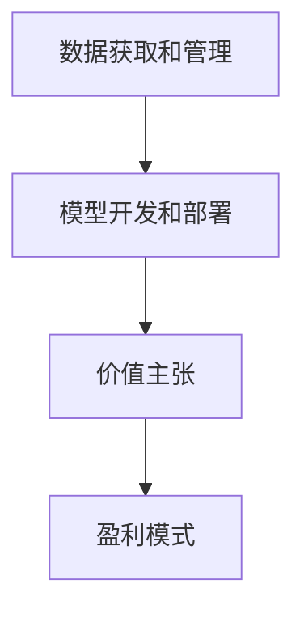

                 

**AI大模型创业：如何构建未来可持续的商业模式？**

**作者：禅与计算机程序设计艺术 / Zen and the Art of Computer Programming**

## 1. 背景介绍

当前，人工智能（AI）和大模型技术正在迅速发展，为各行各业带来了颠覆性的变化。然而，如何构建未来可持续的商业模式，以利用这些技术创造价值，仍然是一个挑战。本文将探讨AI大模型创业的关键因素，提供指南帮助读者构建未来可持续的商业模式。

## 2. 核心概念与联系

### 2.1 AI大模型的定义

AI大模型是指能够理解、学习和生成人类语言的复杂模型。它们通过处理大量数据，学习人类语言的结构和含义，从而能够理解、生成和翻译人类语言。

### 2.2 商业模式的定义

商业模式是指一家企业如何创造、交付和获取价值的系统。它描述了企业的核心活动、资源配置和利益相关者的互动。

### 2.3 AI大模型商业模式的关键因素

AI大模型商业模式的关键因素包括：

- **数据获取和管理**：大模型需要大量数据进行训练和优化。企业需要考虑如何获取、管理和保护这些数据。
- **模型开发和部署**：开发和部署大模型需要专业的技术团队和昂贵的硬件资源。企业需要考虑如何最有效地利用这些资源。
- **价值主张**：企业需要明确大模型为客户创造了什么价值，并将其转化为清晰的价值主张。
- **盈利模式**：企业需要确定如何从大模型的使用中获利，这可能涉及到各种商业模式，如订阅模式、广告模式或licensing模式。

### 2.4 关键因素关系图



## 3. 核心算法原理 & 具体操作步骤

### 3.1 算法原理概述

AI大模型通常基于深度学习算法，如transformer模型，开发而成。这些模型使用注意力机制和自注意力机制来理解和生成语言。

### 3.2 算法步骤详解

1. **数据预处理**：收集、清洗和预处理数据，以便模型可以学习。
2. **模型训练**：使用预处理的数据训练模型，优化模型参数以最小化预测误差。
3. **模型评估**：评估模型的性能，使用指标如BLEU分数或PERPLEXITY分数。
4. **模型部署**：将模型部署到生产环境，以便可以为客户提供服务。
5. **模型更新**：定期更新模型，以保持其性能和有效性。

### 3.3 算法优缺点

**优点**：

- **理解能力**：大模型可以理解复杂的语言结构和含义。
- **生成能力**：大模型可以生成人类语言，用于文本生成、翻译等任务。

**缺点**：

- **计算资源**：大模型需要大量计算资源进行训练和部署。
- **数据依赖**：大模型的性能严重依赖于训练数据的质量和量。
- **解释性**：大模型的决策过程通常是不透明的，很难解释。

### 3.4 算法应用领域

AI大模型的应用领域包括：

- **文本生成**：如自动写作、新闻写作等。
- **翻译**：如机器翻译、跨语言搜索等。
- **对话系统**：如虚拟助手、客户服务等。
- **搜索**：如语义搜索、问答系统等。

## 4. 数学模型和公式 & 详细讲解 & 举例说明

### 4.1 数学模型构建

大模型通常基于transformer架构构建，其数学模型可以表示为：

$$h_t = \text{Attention}(Q_t, K_t, V_t)$$
$$Q_t = f(W^Q \cdot h_{t-1})$$
$$K_t = f(W^K \cdot h_{t-1})$$
$$V_t = f(W^V \cdot h_{t-1})$$

其中，$h_t$是时间步长$t$的隐藏状态，$Q_t$, $K_t$, $V_t$是查询、键和值向量，$W^Q$, $W^K$, $W^V$是学习参数，$f$是激活函数。

### 4.2 公式推导过程

 transformer模型使用自注意力机制来理解和生成语言。自注意力机制允许模型在处理序列时考虑到序列的上下文。其公式推导过程如下：

$$h_t = \text{Attention}(Q_t, K_t, V_t)$$
$$Q_t = h_t$$
$$K_t = V_t = h$$

其中，$h_t$是时间步长$t$的隐藏状态，$h$是所有时间步长的隐藏状态。

### 4.3 案例分析与讲解

例如，在机器翻译任务中，大模型需要将源语言翻译成目标语言。数学模型可以表示为：

$$P(y|x) = \prod_{t=1}^{T} P(y_t|y_{t-1}, x)$$

其中，$P(y|x)$是目标语言$y$给定源语言$x$的概率，$T$是目标语言的长度，$y_t$是时间步长$t$的目标语言单词。

## 5. 项目实践：代码实例和详细解释说明

### 5.1 开发环境搭建

开发大模型需要一个强大的开发环境，包括：

- **硬件**：高性能的GPU和大量内存。
- **软件**：Python、PyTorch或TensorFlow等深度学习框架，以及NVIDIA CUDA等GPU加速软件。

### 5.2 源代码详细实现

以下是transformer模型的简单实现示例：

```python
import torch
import torch.nn as nn

class Transformer(nn.Module):
    def __init__(self, d_model, n_head, n_layers, vocab_size):
        super(Transformer, self).__init__()
        self.embedding = nn.Embedding(vocab_size, d_model)
        self.pos_encoding = PositionalEncoding(d_model)
        self.transformer = nn.Transformer(d_model, n_head, n_layers)
        self.linear = nn.Linear(d_model, vocab_size)

    def forward(self, x):
        x = self.embedding(x) * torch.sqrt(torch.tensor(0.02, dtype=torch.float32))
        x = self.pos_encoding(x)
        x = self.transformer(x)
        x = self.linear(x)
        return x
```

### 5.3 代码解读与分析

该代码定义了一个简单的transformer模型，包括嵌入层、位置编码层、transformer层和线性层。模型接受整数序列作为输入，并输出预测的下一个单词的概率分布。

### 5.4 运行结果展示

在机器翻译任务上训练的大模型可以将源语言翻译成目标语言。例如：

输入（源语言）："Hello, how are you?"
输出（目标语言）："Bonjour, comment ça va?"

## 6. 实际应用场景

### 6.1 当前应用

AI大模型当前已广泛应用于文本生成、翻译、对话系统和搜索等领域。

### 6.2 未来应用展望

未来，AI大模型有望应用于更多领域，如：

- **知识图谱**：大模型可以帮助构建和维护知识图谱，用于知识管理和问答系统。
- **自动驾驶**：大模型可以帮助理解和生成语言指令，用于自动驾驶和物流等领域。
- **医疗保健**：大模型可以帮助理解和生成医疗文本，用于疾病诊断和药物开发等领域。

## 7. 工具和资源推荐

### 7.1 学习资源推荐

- **课程**：斯坦福大学的"CS224n Natural Language Processing with Deep Learning"课程。
- **书籍**："Attention is All You Need"论文和"Natural Language Processing with Python"书籍。

### 7.2 开发工具推荐

- **框架**：PyTorch、TensorFlow、Hugging Face Transformers等。
- **硬件**：NVIDIA GPUs、TPUs等。

### 7.3 相关论文推荐

- "Attention is All You Need"论文。
- "BERT: Pre-training of Deep Bidirectional Transformers for Language Understanding"论文。

## 8. 总结：未来发展趋势与挑战

### 8.1 研究成果总结

本文介绍了AI大模型的原理、算法、数学模型和商业模式。我们讨论了大模型的关键因素，提供了指南帮助读者构建未来可持续的商业模式。

### 8.2 未来发展趋势

未来，AI大模型有望继续发展，以更好地理解和生成人类语言。我们预计会看到更大、更复杂的模型，以及更先进的训练技术。

### 8.3 面临的挑战

然而，大模型面临着几个挑战，包括：

- **计算资源**：大模型需要大量计算资源进行训练和部署。
- **数据依赖**：大模型的性能严重依赖于训练数据的质量和量。
- **解释性**：大模型的决策过程通常是不透明的，很难解释。

### 8.4 研究展望

未来的研究将关注于解决这些挑战，并开发更先进的大模型技术。我们预计会看到更多的研究关注于模型的解释性、数据效率和计算效率。

## 9. 附录：常见问题与解答

**Q：大模型需要多少计算资源？**

**A**：大模型需要大量计算资源进行训练和部署。例如，训练一个大型transformer模型需要数千个GPU小时。

**Q：大模型的数据需求是什么？**

**A**：大模型需要大量、高质量的数据进行训练。数据的质量和量都会影响模型的性能。

**Q：大模型的解释性如何？**

**A**：大模型的决策过程通常是不透明的，很难解释。未来的研究将关注于改善大模型的解释性。

**作者：禅与计算机程序设计艺术 / Zen and the Art of Computer Programming**

