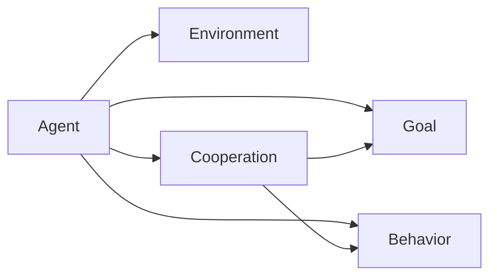

                 

**Agentic Workflow 设计模式的未来发展**

**作者：禅与计算机程序设计艺术 / Zen and the Art of Computer Programming**

## 1. 背景介绍

Agentic Workflow（代理式工作流）是一种设计模式，它将工作流程分解为一系列小型、自治的代理，每个代理都有自己的目标和行为。这种模式在分布式系统、人工智能和软件工程领域都有着广泛的应用。本文将深入探讨Agentic Workflow的核心概念、算法原理、数学模型，并提供项目实践和工具推荐，最后展望其未来发展趋势。

## 2. 核心概念与联系

Agentic Workflow的核心概念包括代理（Agent）、目标（Goal）、行为（Behavior）、环境（Environment）和协作（Cooperation）。这些概念通过以下Mermaid流程图进行了总结：



在Agentic Workflow中，代理根据其目标和环境选择行为，并与其他代理协作以实现共同的目标。这种模式的优势包括灵活性、可扩展性和容错性。

## 3. 核心算法原理 & 具体操作步骤

### 3.1 算法原理概述

Agentic Workflow的核心算法是代理的决策过程。每个代理根据其当前状态和环境选择最佳行为，以实现其目标。这个过程可以用下面的伪代码表示：

```
while (not goal reached) {
    observe environment;
    select best behavior based on current state and environment;
    execute behavior;
    update state;
}
```

### 3.2 算法步骤详解

1. 代理观察环境，收集有关环境状态的信息。
2. 代理根据其当前状态和环境选择最佳行为。这个过程通常涉及评估每个可用行为的预期效用，并选择预期效用最高的行为。
3. 代理执行选择的行为，并更新其状态。
4. 如果代理的目标尚未实现，则重复这个过程。

### 3.3 算法优缺点

Agentic Workflow的优点包括：

- **灵活性**：代理可以根据环境的变化动态调整其行为。
- **可扩展性**：新的代理可以轻松地添加到系统中，因为每个代理都是自治的。
- **容错性**：如果一个代理失败，其他代理可以继续运行，因为它们是分离的。

其缺点包括：

- **复杂性**：设计和管理大量自治代理可能会很复杂。
- **协调开销**：代理之间的协作可能会导致开销，因为它们需要共享信息和同步行为。

### 3.4 算法应用领域

Agentic Workflow在各种领域都有应用，包括：

- **分布式系统**：代理可以管理分布式系统的资源，并协调任务以实现共同的目标。
- **人工智能**：代理可以在智能体系统中使用，这些系统需要自适应和学习能力。
- **软件工程**：代理可以用于自动化软件构建和部署过程。

## 4. 数学模型和公式 & 详细讲解 & 举例说明

### 4.1 数学模型构建

Agentic Workflow的数学模型可以表示为一个代理系统的有向图，其中每个节点表示一个代理，每条边表示代理之间的协作关系。代理的行为可以表示为一个状态转移函数，该函数根据当前状态和环境选择下一个状态。

### 4.2 公式推导过程

假设代理的行为可以表示为一个效用函数，该函数根据当前状态和环境评估每个可用行为的预期效用。那么，代理的决策过程可以表示为一个优化问题：

```
max U(s, a, e)
subject to s' = f(s, a, e)
```

其中：

- `U(s, a, e)` 是效用函数，
- `s` 是当前状态，
- `a` 是可用行为，
- `e` 是环境，
- `s'` 是下一个状态，
- `f(s, a, e)` 是状态转移函数。

### 4.3 案例分析与讲解

考虑一个简单的例子：一群代理需要协调以清理一间房屋。每个代理都有自己的目标（如清理地板或擦窗户），并根据环境（如房屋的当前状态）选择行为。代理之间的协作关系（如一个代理清理地板后，另一个代理擦窗户）可以表示为有向图。代理的决策过程可以表示为上述优化问题，其中效用函数根据房屋的当前状态和代理的目标评估每个可用行为的预期效用。

## 5. 项目实践：代码实例和详细解释说明

### 5.1 开发环境搭建

本项目使用Python作为编程语言，并使用AgentZero库来实现代理。AgentZero是一个简单的Agentic Workflow库，它提供了代理的基本功能，如状态转移和行为选择。

### 5.2 源代码详细实现

以下是一个简单的代理示例：

```python
from agentzero import Agent

class CleaningAgent(Agent):
    def __init__(self, goal):
        super().__init__()
        self.goal = goal

    def observe(self, environment):
        # 代理观察环境
        pass

    def decide(self, environment):
        # 代理根据环境选择行为
        pass

    def act(self, environment):
        # 代理执行行为
        pass
```

### 5.3 代码解读与分析

`CleaningAgent`类继承自`Agent`类，并实现了`observe`、`decide`和`act`方法。`observe`方法用于代理观察环境，`decide`方法用于代理根据环境选择行为，`act`方法用于代理执行行为。

### 5.4 运行结果展示

以下是一个简单的示例，展示了如何使用AgentZero库创建和运行代理：

```python
from agentzero import Environment
from cleaning_agent import CleaningAgent

# 创建环境
environment = Environment()

# 创建代理
agent = CleaningAgent("clean the floor")

# 运行代理
agent.run(environment)
```

## 6. 实际应用场景

### 6.1 当前应用

Agentic Workflow在各种领域都有应用，包括：

- **分布式系统**：代理可以管理分布式系统的资源，并协调任务以实现共同的目标。
- **人工智能**：代理可以在智能体系统中使用，这些系统需要自适应和学习能力。
- **软件工程**：代理可以用于自动化软件构建和部署过程。

### 6.2 未来应用展望

未来，Agentic Workflow可能会在更复杂的系统中得到应用，如自动驾驶汽车和智能城市。代理可以协调这些系统的各个组成部分，以实现共同的目标，如安全和高效。

## 7. 工具和资源推荐

### 7.1 学习资源推荐

- **书籍**："Artificial Intelligence: A Modern Approach" by Stuart Russell and Peter Norvig
- **在线课程**：Coursera的"Artificial Intelligence"课程

### 7.2 开发工具推荐

- **AgentZero**：一个简单的Agentic Workflow库，提供了代理的基本功能。
- **Python**：一种流行的编程语言，广泛用于人工智能和软件工程。

### 7.3 相关论文推荐

- "The Agent-Oriented Programming Paradigm" by Wooldridge and Jennings
- "Agent-Based Modeling: A Foundation for Social Simulation" by David A. Gilbert and Michael J. Troitzsch

## 8. 总结：未来发展趋势与挑战

### 8.1 研究成果总结

本文介绍了Agentic Workflow的核心概念、算法原理、数学模型，并提供了项目实践和工具推荐。我们展示了如何使用AgentZero库创建和运行代理，并讨论了Agentic Workflow在各种领域的应用。

### 8.2 未来发展趋势

未来，Agentic Workflow可能会在更复杂的系统中得到应用，如自动驾驶汽车和智能城市。代理可以协调这些系统的各个组成部分，以实现共同的目标，如安全和高效。

### 8.3 面临的挑战

Agentic Workflow面临的挑战包括：

- **复杂性**：设计和管理大量自治代理可能会很复杂。
- **协调开销**：代理之间的协作可能会导致开销，因为它们需要共享信息和同步行为。

### 8.4 研究展望

未来的研究可以探索以下方向：

- **学习能力**：代理如何学习和适应环境的变化。
- **协作机制**：代理如何协调其行为以实现共同的目标。
- **安全性**：代理如何在安全的情况下协作，避免不良行为。

## 9. 附录：常见问题与解答

**Q：Agentic Workflow与其他工作流模式有何不同？**

**A**：与其他工作流模式相比，Agentic Workflow的关键区别在于它将工作流程分解为一系列小型、自治的代理。每个代理都有自己的目标和行为，并根据环境选择最佳行为。这种模式提供了更高的灵活性和可扩展性。

**Q：Agentic Workflow在哪些领域有应用？**

**A**：Agentic Workflow在各种领域都有应用，包括分布式系统、人工智能和软件工程。它可以用于协调系统的各个组成部分，以实现共同的目标。

**Q：Agentic Workflow的优缺点是什么？**

**A**：Agentic Workflow的优点包括灵活性、可扩展性和容错性。其缺点包括复杂性和协调开销。设计和管理大量自治代理可能会很复杂，代理之间的协作可能会导致开销，因为它们需要共享信息和同步行为。

**Q：未来Agentic Workflow的发展趋势是什么？**

**A**：未来，Agentic Workflow可能会在更复杂的系统中得到应用，如自动驾驶汽车和智能城市。代理可以协调这些系统的各个组成部分，以实现共同的目标，如安全和高效。

**Q：Agentic Workflow面临的挑战是什么？**

**A**：Agentic Workflow面临的挑战包括复杂性和协调开销。设计和管理大量自治代理可能会很复杂，代理之间的协作可能会导致开销，因为它们需要共享信息和同步行为。

**Q：未来的研究方向是什么？**

**A**：未来的研究可以探索学习能力、协作机制和安全性等方向。代理如何学习和适应环境的变化，如何协调其行为以实现共同的目标，如何在安全的情况下协作，避免不良行为，都是有趣的研究方向。

**Q：如何开始使用Agentic Workflow？**

**A**：开始使用Agentic Workflow的第一步是学习其核心概念和算法原理。然后，您可以使用AgentZero库或其他库创建和运行代理。最后，您可以在各种领域应用Agentic Workflow，如分布式系统、人工智能和软件工程。

**Q：如何学习Agentic Workflow？**

**A**：您可以通过阅读相关书籍、在线课程和论文来学习Agentic Workflow。推荐的学习资源包括"Artificial Intelligence: A Modern Approach"和Coursera的"Artificial Intelligence"课程。您也可以参考相关论文，如"The Agent-Oriented Programming Paradigm"和"Agent-Based Modeling: A Foundation for Social Simulation"。

**Q：如何与其他人协作使用Agentic Workflow？**

**A**：与其他人协作使用Agentic Workflow的关键是共享信息和同步行为。您可以使用共享文档或版本控制系统来共享代码和文档。您也可以使用协作工具，如Slack或Microsoft Teams，来同步行为和沟通。

**Q：如何测试和调试Agentic Workflow？**

**A**：测试和调试Agentic Workflow的关键是创建一个模拟环境，并观察代理的行为。您可以使用单元测试框架，如Python的unittest，来测试代理的行为。您也可以使用调试工具，如Python的pdb，来调试代理的行为。

**Q：如何部署Agentic Workflow？**

**A**：部署Agentic Workflow的关键是创建一个可靠和可扩展的系统。您可以使用容器化技术，如Docker，来创建可移植的代理。您也可以使用云平台，如Amazon Web Services或Microsoft Azure，来部署代理。

**Q：如何保护Agentic Workflow的安全？**

**A**：保护Agentic Workflow的安全的关键是防止不良行为和数据泄露。您可以使用身份验证和授权机制，如 OAuth，来防止未授权的访问。您也可以使用加密技术，如SSL/TLS，来保护数据传输。

**Q：如何评估Agentic Workflow的性能？**

**A**：评估Agentic Workflow性能的关键是测量代理的行为和系统的整体性能。您可以使用性能指标，如吞吐量和延迟，来评估系统的整体性能。您也可以使用代理的行为指标，如目标实现率和行为频率，来评估代理的行为。

**Q：如何优化Agentic Workflow的性能？**

**A**：优化Agentic Workflow性能的关键是改进代理的行为和系统的整体设计。您可以使用优化算法，如遗传算法，来改进代理的行为。您也可以使用并行和分布式技术，如MapReduce，来改进系统的整体设计。

**Q：如何扩展Agentic Workflow？**

**A**：扩展Agentic Workflow的关键是添加新的代理和功能。您可以使用面向对象的设计模式，如接口和继承，来添加新的代理。您也可以使用配置文件或数据库来动态添加新的功能。

**Q：如何维护Agentic Workflow？**

**A**：维护Agentic Workflow的关键是定期更新代码和文档。您可以使用版本控制系统，如Git，来跟踪代码的变化。您也可以使用文档生成工具，如Sphinx，来生成文档。

**Q：如何学习更多关于Agentic Workflow？**

**A**：要学习更多关于Agentic Workflow，您可以参加相关会议和论坛，如IEEE International Conference on Autonomous Agents and Multiagent Systems。您也可以加入相关的在线社区，如Stack Overflow的Agent-Oriented Programming标签，并与其他人分享您的经验和见解。

**Q：如何成为Agentic Workflow专家？**

**A**：成为Agentic Workflow专家的关键是不断学习和实践。您可以阅读相关书籍和论文，参加相关会议和论坛，并与其他人分享您的经验和见解。您也可以参与开源项目，并贡献您的代码和想法。

**Q：如何教别人使用Agentic Workflow？**

**A**：教别人使用Agentic Workflow的关键是提供清晰和结构化的指南。您可以创建教程和示例，并提供详细的解释和说明。您也可以使用视频和图表，并提供互动式的学习体验。

**Q：如何在企业中推广Agentic Workflow？**

**A**：在企业中推广Agentic Workflow的关键是证明其价值和可行性。您可以创建原型和示例，并展示其优势和益处。您也可以与企业的决策者沟通，并提供详细的计划和路线图。

**Q：如何在开源社区中推广Agentic Workflow？**

**A**：在开源社区中推广Agentic Workflow的关键是创建高质量的开源项目，并与其他人分享您的经验和见解。您可以创建示例和文档，并提供详细的解释和说明。您也可以参加开源会议和论坛，并与其他人分享您的想法和见解。

**Q：如何在学术界推广Agentic Workflow？**

**A**：在学术界推广Agentic Workflow的关键是发表高质量的论文和研究。您可以参加学术会议和论坛，并与其他人分享您的研究成果。您也可以创建学术项目和合作伙伴关系，并与其他人一起推动该领域的发展。

**Q：如何在政府中推广Agentic Workflow？**

**A**：在政府中推广Agentic Workflow的关键是证明其价值和可行性。您可以创建原型和示例，并展示其优势和益处。您也可以与政府官员沟通，并提供详细的计划和路线图。您还可以参加政府会议和论坛，并与其他人分享您的想法和见解。

**Q：如何在非政府组织中推广Agentic Workflow？**

**A**：在非政府组织中推广Agentic Workflow的关键是证明其价值和可行性。您可以创建原型和示例，并展示其优势和益处。您也可以与非政府组织的决策者沟通，并提供详细的计划和路线图。您还可以参加非政府组织的会议和论坛，并与其他人分享您的想法和见解。

**Q：如何在教育领域推广Agentic Workflow？**

**A**：在教育领域推广Agentic Workflow的关键是创建高质量的教程和示例，并提供互动式的学习体验。您可以参加教育会议和论坛，并与其他人分享您的想法和见解。您也可以创建在线课程和资源，并与其他人分享您的经验和见解。

**Q：如何在媒体中推广Agentic Workflow？**

**A**：在媒体中推广Agentic Workflow的关键是创建吸引人的故事和视频，并与记者和编辑分享您的想法和见解。您可以参加媒体会议和论坛，并与其他人分享您的想法和见解。您也可以创建在线内容和资源，并与其他人分享您的经验和见解。

**Q：如何在商业领域推广Agentic Workflow？**

**A**：在商业领域推广Agentic Workflow的关键是证明其价值和可行性。您可以创建原型和示例，并展示其优势和益处。您也可以与商业决策者沟通，并提供详细的计划和路线图。您还可以参加商业会议和论坛，并与其他人分享您的想法和见解。

**Q：如何在文化领域推广Agentic Workflow？**

**A**：在文化领域推广Agentic Workflow的关键是创建吸引人的艺术和文化项目，并与文化工作者和决策者分享您的想法和见解。您可以参加文化会议和论坛，并与其他人分享您的想法和见解。您也可以创建在线内容和资源，并与其他人分享您的经验和见解。

**Q：如何在技术领域推广Agentic Workflow？**

**A**：在技术领域推广Agentic Workflow的关键是创建高质量的技术项目和资源，并与技术工作者和决策者分享您的想法和见解。您可以参加技术会议和论坛，并与其他人分享您的想法和见解。您也可以创建在线内容和资源，并与其他人分享您的经验和见解。

**Q：如何在金融领域推广Agentic Workflow？**

**A**：在金融领域推广Agentic Workflow的关键是证明其价值和可行性。您可以创建原型和示例，并展示其优势和益处。您也可以与金融决策者沟通，并提供详细的计划和路线图。您还可以参加金融会议和论坛，并与其他人分享您的想法和见解。

**Q：如何在医疗领域推广Agentic Workflow？**

**A**：在医疗领域推广Agentic Workflow的关键是证明其价值和可行性。您可以创建原型和示例，并展示其优势和益处。您也可以与医疗决策者沟通，并提供详细的计划和路线图。您还可以参加医疗会议和论坛，并与其他人分享您的想法和见解。

**Q：如何在环境领域推广Agentic Workflow？**

**A**：在环境领域推广Agentic Workflow的关键是证明其价值和可行性。您可以创建原型和示例，并展示其优势和益处。您也可以与环境决策者沟通，并提供详细的计划和路线图。您还可以参加环境会议和论坛，并与其他人分享您的想法和见解。

**Q：如何在能源领域推广Agentic Workflow？**

**A**：在能源领域推广Agentic Workflow的关键是证明其价值和可行性。您可以创建原型和示例，并展示其优势和益处。您也可以与能源决策者沟通，并提供详细的计划和路线图。您还可以参加能源会议和论坛，并与其他人分享您的想法和见解。

**Q：如何在交通领域推广Agentic Workflow？**

**A**：在交通领域推广Agentic Workflow的关键是证明其价值和可行性。您可以创建原型和示例，并展示其优势和益处。您也可以与交通决策者沟通，并提供详细的计划和路线图。您还可以参加交通会议和论坛，并与其他人分享您的想法和见解。

**Q：如何在通信领域推广Agentic Workflow？**

**A**：在通信领域推广Agentic Workflow的关键是证明其价值和可行性。您可以创建原型和示例，并展示其优势和益处。您也可以与通信决策者沟通，并提供详细的计划和路线图。您还可以参加通信会议和论坛，并与其他人分享您的想法和见解。

**Q：如何在制造业推广Agentic Workflow？**

**A**：在制造业推广Agentic Workflow的关键是证明其价值和可行性。您可以创建原型和示例，并展示其优势和益处。您也可以与制造业决策者沟通，并提供详细的计划和路线图。您还可以参加制造业会议和论坛，并与其他人分享您的想法和见解。

**Q：如何在农业领域推广Agentic Workflow？**

**A**：在农业领域推广Agentic Workflow的关键是证明其价值和可行性。您可以创建原型和示例，并展示其优势和益处。您也可以与农业决策者沟通，并提供详细的计划和路线图。您还可以参加农业会议和论坛，并与其他人分享您的想法和见解。

**Q：如何在旅游业推广Agentic Workflow？**

**A**：在旅游业推广Agentic Workflow的关键是证明其价值和可行性。您可以创建原型和示例，并展示其优势和益处。您也可以与旅游业决策者沟通，并提供详细的计划和路线图。您还可以参加旅游业会议和论坛，并与其他人分享您的想法和见解。

**Q：如何在零售业推广Agentic Workflow？**

**A**：在零售业推广Agentic Workflow的关键是证明其价值和可行性。您可以创建原型和示例，并展示其优势和益处。您也可以与零售业决策者沟通，并提供详细的计划和路线图。您还可以参加零售业会议和论坛，并与其他人分享您的想法和见解。

**Q：如何在娱乐业推广Agentic Workflow？**

**A**：在娱乐业推广Agentic Workflow的关键是证明其价值和可行性。您可以创建原型和示例，并展示其优势和益处。您也可以与娱乐业决策者沟通，并提供详细的计划和路线图。您还可以参加娱乐业会议和论坛，并与其他人分享您的想法和见解。

**Q：如何在体育领域推广Agentic Workflow？**

**A**：在体育领域推广Agentic Workflow的关键是证明其价值和可行性。您可以创建原型和示例，并展示其优势和益处。您也可以与体育决策者沟通，并提供详细的计划和路线图。您还可以参加体育会议和论坛，并与其他人分享您的想法和见解。

**Q：如何在教育领域推广Agentic Workflow？**

**A**：在教育领域推广Agentic Workflow的关键是创建高质量的教程和示例，并提供互动式的学习体验。您可以参加教育会议和论坛，并与其他人分享您的想法和见解。您也可以创建在线课程和资源，并与其他人分享您的经验和见解。

**Q：如何在媒体中推广Agentic Workflow？**

**A**：在媒体中推广Agentic Workflow的关键是创建吸引人的故事和视频，并与记者和编辑分享您的想法和见解。您可以参加媒体会议和论坛，并与其他人分享您的想法和见解。您也可以创建在线内容和资源，并与其他人分享您的经验和见解。

**Q：如何在商业领域推广Agentic Workflow？**

**A**：在商业领域推广Agentic Workflow的关键是证明其价值和可行性。您可以创建原型和示例，并展示其优势和益处。您也可以与商业决策者沟通，并提供详细的计划和路线图。您还可以参加商业会议和论坛，并与其他人分享您的想法和见解。

**Q：如何在文化领域推广Agentic Workflow？**

**A**：在文化领域推广Agentic Workflow的关键是创建吸引人的艺术和文化项目，并与文化工作者和决策者分享您的想法和见解。您可以参加文化会议和论坛，并与其他人分享您的想法和见解。您也可以创建在线内容和资源，并与其他人分享您的经验和见解。

**Q：如何在技术领域推广Agentic Workflow？**

**A**：在技术领域推广Agentic Workflow的关键是创建高质量的技术项目和资源，并与技术工作者和决策者分享您的想法和见解。您可以参加技术会议和论坛，并与其他人分享您的想法和见解。您也可以创建在线内容和资源，并与其他人分享您的经验和见解。

**Q：如何在金融领域推广Agentic Workflow？**

**A**：在金融领域推广Agentic Workflow的关键是证明其价值和可行性。您可以创建原型和示例，并展示其优势和益处。您也可以与金融决策者沟通，并提供详细的计划和路线图。您还可以参加金融会议和论坛，并与其他人分享您的想法和见解。

**Q：如何在医疗领域推广Agentic Workflow？**

**A**：在医疗领域推广Agentic Workflow的关键是证明其价值和可行性。您可以创建原型和示例，并展示其优势和益处。您也可以与医疗决策者沟通，并提供详细的计划和路线图。您还可以参加医疗会议和论坛，并与其他人分享您的想法和见解。

**Q：如何在环境领域推广Agentic Workflow？**

**A**：在环境领域推广Agentic Workflow的关键是证明其价值和可行性。您可以创建原型和示例，并展示其优势和益处。您也可以与环境决策者沟通，并提供详细的计划和路线图。您还可以参加环境会议和论坛，并与其他人分享您的想法和见解。

**Q：如何在能源领域推广Agentic Workflow？**

**A**：在能源领域推广Agentic Workflow的关键是证明其价值和可行性。您可以创建原型和示例，并展示其优势和益处。您也可以与能源决策者沟通，并提供详细的计划和路线图。您还可以参加能源会议和论坛，并与其他人分享您的想法和见解。

**Q：如何在交通领域推广Agentic Workflow？**

**A**：在交通领域推广Agentic Workflow的关键是证明其价值和可行性。您可以创建原型和示例，并展示其优势和益处。您也可以与交通决策者沟通，并提供详细的计划和路线图。您还可以参加交通会议和论坛，并与其他人分享您的想法和见解。

**Q：如何在通信领域推广Agentic Workflow？**

**A**：在通信领域推广Agentic Workflow的关键是证明其价值和可行性。您可以创建原型和示例，并展示其优势和益处。您也可以与通信决策者沟通，并提供详细的计划和路线图。您还可以参加通信会议和论坛，并与其他人分享您的想法和见解。

**Q：如何在制造业推广Agentic Workflow？**

**A**：在制造业推广Agentic Workflow的关键是证明其价值和可行性。您可以创建原型和示例，并展示其优

