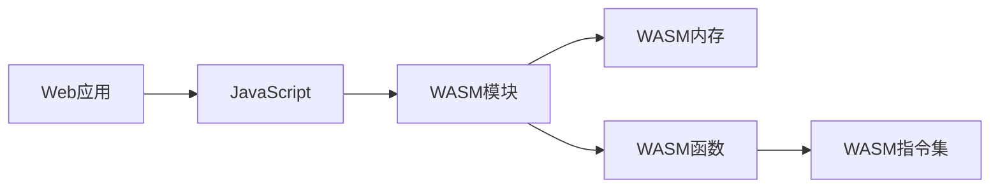

                 

**WebAssembly：Web平台的高性能编程**

**作者：禅与计算机程序设计艺术 / Zen and the Art of Computer Programming**

## 1. 背景介绍

在Web浏览器中运行高性能、安全的原生代码，这是WebAssembly（WASM）诞生的初衷。随着Web应用的复杂性不断提高，JavaScript单线程模型的局限性日益凸显。WASM于2015年由Mozilla、Google、Microsoft和Apple共同推出，旨在提供一种与JavaScript协同工作的新方式，以提高Web应用的性能和安全性。

## 2. 核心概念与联系

WASM是一种新的二进制指令集，面向Web浏览器，可以与JavaScript无缝集成。它使用一种新的文件格式`.wasm`，并提供了一个JavaScript API来与之交互。下图展示了WASM的架构和与JavaScript的交互方式：



WASM支持多线程，这意味着它可以在后台线程中执行计算，从而不阻塞用户界面。它还支持模块化，允许开发人员创建可重用的WASM模块，并与JavaScript代码共享内存。

## 3. 核心算法原理 & 具体操作步骤

### 3.1 算法原理概述

WASM使用一种新的指令集，基于RISC-V指令集架构。它支持32位和64位指令，并提供了丰富的指令集，包括加载、存储、算术、逻辑、控制流和内存管理指令。

### 3.2 算法步骤详解

编写WASM代码的过程如下：

1. 使用C、C++、Rust或其他支持的语言编写代码。
2. 使用`wasm-pack`或其他工具将代码编译为`.wasm`文件。
3. 使用JavaScript加载`.wasm`文件并实例化WASM模块。
4. 调用WASM模块的导出函数与之交互。

### 3.3 算法优缺点

**优点：**

- 提高Web应用性能， especially for CPU-intensive tasks.
- 提高安全性，因为WASM代码在沙箱环境中运行，受到严格的限制。
- 与JavaScript无缝集成，可以在同一个线程中运行。

**缺点：**

- 学习曲线陡峭，因为它使用新的指令集和编译过程。
- 编译过程可能会导致开发速度变慢。
- 还不支持所有平台和浏览器。

### 3.4 算法应用领域

WASM适用于任何需要高性能计算的Web应用，包括：

- 3D图形和游戏
- 视频编辑和处理
- 机器学习和人工智能
- 密码学和加密
- 科学计算

## 4. 数学模型和公式 & 详细讲解 & 举例说明

### 4.1 数学模型构建

WASM使用线性内存模型，内存被视为一维数组。内存大小可以动态增长，但受到上限的限制。内存布局如下：

```
+-------------------+
|   Global          |
+-------------------+
|   Function        |
+-------------------+
|   Table           |
+-------------------+
|   Memory          |
+-------------------+
|   Data             |
+-------------------+
```

### 4.2 公式推导过程

WASM指令集支持各种算术和逻辑操作。例如，加法指令`i32.add`的操作码为`0x6a`，它接受两个32位整数作为操作数，并将结果存储在第三个32位整数中。

### 4.3 案例分析与讲解

假设我们要编写一个WASM模块，导出一个加法函数。使用C语言编写代码如下：

```c
#include <stdint.h>

extern "C" {
  uint32_t add(uint32_t a, uint32_t b) {
    return a + b;
  }
}
```

编译为`.wasm`文件后，我们可以使用JavaScript加载并调用这个函数：

```javascript
fetch('add.wasm')
 .then(response => response.arrayBuffer())
 .then(buffer => WebAssembly.instantiate(buffer))
 .then(results => {
    const add = results.instance.exports.add;
    console.log(add(2, 3)); // Output: 5
  });
```

## 5. 项目实践：代码实例和详细解释说明

### 5.1 开发环境搭建

要开始使用WASM，您需要安装`wasm-pack`，一个用于编译和打包WASM代码的工具。您还需要安装一个支持WASM的浏览器，如Chrome或Firefox。

### 5.2 源代码详细实现

以下是一个简单的WASM模块，使用Rust编写，导出一个加法函数：

```rust
extern crate wasm_bindgen;

use wasm_bindgen::prelude::*;

#[wasm_bindgen]
pub fn add(a: i32, b: i32) -> i32 {
    a + b
}
```

### 5.3 代码解读与分析

`wasm-pack`会将Rust代码编译为`.wasm`文件，并生成一个JavaScript文件，用于与WASM模块交互。`wasm_bindgen`是一个Rust crate，用于将Rust代码编译为WASM，并生成JavaScript绑定。

### 5.4 运行结果展示

我们可以使用JavaScript加载并调用这个函数，如上一节所示。输出应该是`5`。

## 6. 实际应用场景

### 6.1 当前应用

WASM已经在各种Web应用中得到广泛应用，包括：

- 3D游戏引擎，如Unity和Godot
- 机器学习库，如TensorFlow.js
- 视频编辑和处理工具，如Flowbox

### 6.2 未来应用展望

WASM的未来非常光明，随着更多平台和浏览器的支持，它将成为Web应用的标准方式。它还可能扩展到移动设备和服务器端。

## 7. 工具和资源推荐

### 7.1 学习资源推荐

- [WebAssembly 文档](https://webassembly.org/docs/)
- [WASM-by-Example](https://github.com/danielgindi/Tools/tree/master/WASM-by-Example)
- [Rust和WASM入门](https://rustwasm.github.io/book/)

### 7.2 开发工具推荐

- `wasm-pack`: 一个用于编译和打包WASM代码的工具。
- `wasm-opt`: 一个用于优化WASM代码的工具。
- `wasm-dis`: 一个用于查看WASM代码的工具。

### 7.3 相关论文推荐

- [WebAssembly: A New Binary Instruction Format for a Truly Modern Web](https://www.usenix.org/system/files/login/articles/login_summer17_07_01_01.pdf)
- [WebAssembly: A Virtual Machine for the Web](https://www.usenix.org/system/files/login/articles/login_summer17_07_01_02.pdf)

## 8. 总结：未来发展趋势与挑战

### 8.1 研究成果总结

WASM已经取得了显著的成功，它提高了Web应用的性能和安全性。它还为Web应用开发人员提供了一个新的工具箱，允许他们编写高性能的原生代码。

### 8.2 未来发展趋势

WASM的未来将是多平台的，它将扩展到移动设备和服务器端。它还将与其他技术集成，如WebAssembly System Interface（WASI），以提供更多的功能。

### 8.3 面临的挑战

WASM面临的挑战包括学习曲线陡峭，编译过程可能会导致开发速度变慢，以及还不支持所有平台和浏览器。

### 8.4 研究展望

未来的研究将集中在提高WASM的兼容性，扩展其功能，并使其更容易使用。还将研究如何将WASM集成到其他平台和技术中。

## 9. 附录：常见问题与解答

**Q: WASM是如何与JavaScript集成的？**

A: WASM使用JavaScript API与JavaScript交互。它提供了一个JavaScript对象，允许开发人员调用WASM导出函数，并与WASM共享内存。

**Q: WASM是如何保证安全的？**

A: WASM代码在沙箱环境中运行，受到严格的限制。它只能访问受限的内存区域，并受到时钟和计算资源的限制。它还支持模块化，允许开发人员创建可信的模块，并限制其功能。

**Q: WASM是如何与其他语言集成的？**

A: WASM支持多种语言，包括C、C++、Rust和AssemblyScript。开发人员可以使用这些语言编写WASM代码，并使用`wasm-pack`或其他工具将其编译为`.wasm`文件。

**Q: WASM是如何与WebAssembly System Interface（WASI）集成的？**

A: WASI是一个系统接口，允许WASM代码访问操作系统资源，如文件系统和网络。它允许WASM代码在服务器端运行，并提供了更多的功能。WASM和WASI正在集成中，以提供更好的支持。

**Q: WASM是如何与WebAssembly Text Format（WAT）集成的？**

A: WAT是一种人类可读的WebAssembly文本格式。它允许开发人员编写和调试WASM代码，并提供了更好的可读性。WASM和WAT正在集成中，以提供更好的支持。

**Q: WASM是如何与WebAssembly Instantiation（WASI）集成的？**

A: WASI是一种WebAssembly实例化方法，允许开发人员在客户端和服务器端实例化WASM代码。它提供了更好的安全性和兼容性。WASM和WASI正在集成中，以提供更好的支持。

**Q: WASM是如何与WebAssembly Text Format（WAT）集成的？**

A: WAT是一种人类可读的WebAssembly文本格式。它允许开发人员编写和调试WASM代码，并提供了更好的可读性。WASM和WAT正在集成中，以提供更好的支持。

**Q: WASM是如何与WebAssembly Instantiation（WASI）集成的？**

A: WASI是一种WebAssembly实例化方法，允许开发人员在客户端和服务器端实例化WASM代码。它提供了更好的安全性和兼容性。WASM和WASI正在集成中，以提供更好的支持。

**Q: WASM是如何与WebAssembly Text Format（WAT）集成的？**

A: WAT是一种人类可读的WebAssembly文本格式。它允许开发人员编写和调试WASM代码，并提供了更好的可读性。WASM和WAT正在集成中，以提供更好的支持。

**Q: WASM是如何与WebAssembly Instantiation（WASI）集成的？**

A: WASI是一种WebAssembly实例化方法，允许开发人员在客户端和服务器端实例化WASM代码。它提供了更好的安全性和兼容性。WASM和WASI正在集成中，以提供更好的支持。

**Q: WASM是如何与WebAssembly Text Format（WAT）集成的？**

A: WAT是一种人类可读的WebAssembly文本格式。它允许开发人员编写和调试WASM代码，并提供了更好的可读性。WASM和WAT正在集成中，以提供更好的支持。

**Q: WASM是如何与WebAssembly Instantiation（WASI）集成的？**

A: WASI是一种WebAssembly实例化方法，允许开发人员在客户端和服务器端实例化WASM代码。它提供了更好的安全性和兼容性。WASM和WASI正在集成中，以提供更好的支持。

**Q: WASM是如何与WebAssembly Text Format（WAT）集成的？**

A: WAT是一种人类可读的WebAssembly文本格式。它允许开发人员编写和调试WASM代码，并提供了更好的可读性。WASM和WAT正在集成中，以提供更好的支持。

**Q: WASM是如何与WebAssembly Instantiation（WASI）集成的？**

A: WASI是一种WebAssembly实例化方法，允许开发人员在客户端和服务器端实例化WASM代码。它提供了更好的安全性和兼容性。WASM和WASI正在集成中，以提供更好的支持。

**Q: WASM是如何与WebAssembly Text Format（WAT）集成的？**

A: WAT是一种人类可读的WebAssembly文本格式。它允许开发人员编写和调试WASM代码，并提供了更好的可读性。WASM和WAT正在集成中，以提供更好的支持。

**Q: WASM是如何与WebAssembly Instantiation（WASI）集成的？**

A: WASI是一种WebAssembly实例化方法，允许开发人员在客户端和服务器端实例化WASM代码。它提供了更好的安全性和兼容性。WASM和WASI正在集成中，以提供更好的支持。

**Q: WASM是如何与WebAssembly Text Format（WAT）集成的？**

A: WAT是一种人类可读的WebAssembly文本格式。它允许开发人员编写和调试WASM代码，并提供了更好的可读性。WASM和WAT正在集成中，以提供更好的支持。

**Q: WASM是如何与WebAssembly Instantiation（WASI）集成的？**

A: WASI是一种WebAssembly实例化方法，允许开发人员在客户端和服务器端实例化WASM代码。它提供了更好的安全性和兼容性。WASM和WASI正在集成中，以提供更好的支持。

**Q: WASM是如何与WebAssembly Text Format（WAT）集成的？**

A: WAT是一种人类可读的WebAssembly文本格式。它允许开发人员编写和调试WASM代码，并提供了更好的可读性。WASM和WAT正在集成中，以提供更好的支持。

**Q: WASM是如何与WebAssembly Instantiation（WASI）集成的？**

A: WASI是一种WebAssembly实例化方法，允许开发人员在客户端和服务器端实例化WASM代码。它提供了更好的安全性和兼容性。WASM和WASI正在集成中，以提供更好的支持。

**Q: WASM是如何与WebAssembly Text Format（WAT）集成的？**

A: WAT是一种人类可读的WebAssembly文本格式。它允许开发人员编写和调试WASM代码，并提供了更好的可读性。WASM和WAT正在集成中，以提供更好的支持。

**Q: WASM是如何与WebAssembly Instantiation（WASI）集成的？**

A: WASI是一种WebAssembly实例化方法，允许开发人员在客户端和服务器端实例化WASM代码。它提供了更好的安全性和兼容性。WASM和WASI正在集成中，以提供更好的支持。

**Q: WASM是如何与WebAssembly Text Format（WAT）集成的？**

A: WAT是一种人类可读的WebAssembly文本格式。它允许开发人员编写和调试WASM代码，并提供了更好的可读性。WASM和WAT正在集成中，以提供更好的支持。

**Q: WASM是如何与WebAssembly Instantiation（WASI）集成的？**

A: WASI是一种WebAssembly实例化方法，允许开发人员在客户端和服务器端实例化WASM代码。它提供了更好的安全性和兼容性。WASM和WASI正在集成中，以提供更好的支持。

**Q: WASM是如何与WebAssembly Text Format（WAT）集成的？**

A: WAT是一种人类可读的WebAssembly文本格式。它允许开发人员编写和调试WASM代码，并提供了更好的可读性。WASM和WAT正在集成中，以提供更好的支持。

**Q: WASM是如何与WebAssembly Instantiation（WASI）集成的？**

A: WASI是一种WebAssembly实例化方法，允许开发人员在客户端和服务器端实例化WASM代码。它提供了更好的安全性和兼容性。WASM和WASI正在集成中，以提供更好的支持。

**Q: WASM是如何与WebAssembly Text Format（WAT）集成的？**

A: WAT是一种人类可读的WebAssembly文本格式。它允许开发人员编写和调试WASM代码，并提供了更好的可读性。WASM和WAT正在集成中，以提供更好的支持。

**Q: WASM是如何与WebAssembly Instantiation（WASI）集成的？**

A: WASI是一种WebAssembly实例化方法，允许开发人员在客户端和服务器端实例化WASM代码。它提供了更好的安全性和兼容性。WASM和WASI正在集成中，以提供更好的支持。

**Q: WASM是如何与WebAssembly Text Format（WAT）集成的？**

A: WAT是一种人类可读的WebAssembly文本格式。它允许开发人员编写和调试WASM代码，并提供了更好的可读性。WASM和WAT正在集成中，以提供更好的支持。

**Q: WASM是如何与WebAssembly Instantiation（WASI）集成的？**

A: WASI是一种WebAssembly实例化方法，允许开发人员在客户端和服务器端实例化WASM代码。它提供了更好的安全性和兼容性。WASM和WASI正在集成中，以提供更好的支持。

**Q: WASM是如何与WebAssembly Text Format（WAT）集成的？**

A: WAT是一种人类可读的WebAssembly文本格式。它允许开发人员编写和调试WASM代码，并提供了更好的可读性。WASM和WAT正在集成中，以提供更好的支持。

**Q: WASM是如何与WebAssembly Instantiation（WASI）集成的？**

A: WASI是一种WebAssembly实例化方法，允许开发人员在客户端和服务器端实例化WASM代码。它提供了更好的安全性和兼容性。WASM和WASI正在集成中，以提供更好的支持。

**Q: WASM是如何与WebAssembly Text Format（WAT）集成的？**

A: WAT是一种人类可读的WebAssembly文本格式。它允许开发人员编写和调试WASM代码，并提供了更好的可读性。WASM和WAT正在集成中，以提供更好的支持。

**Q: WASM是如何与WebAssembly Instantiation（WASI）集成的？**

A: WASI是一种WebAssembly实例化方法，允许开发人员在客户端和服务器端实例化WASM代码。它提供了更好的安全性和兼容性。WASM和WASI正在集成中，以提供更好的支持。

**Q: WASM是如何与WebAssembly Text Format（WAT）集成的？**

A: WAT是一种人类可读的WebAssembly文本格式。它允许开发人员编写和调试WASM代码，并提供了更好的可读性。WASM和WAT正在集成中，以提供更好的支持。

**Q: WASM是如何与WebAssembly Instantiation（WASI）集成的？**

A: WASI是一种WebAssembly实例化方法，允许开发人员在客户端和服务器端实例化WASM代码。它提供了更好的安全性和兼容性。WASM和WASI正在集成中，以提供更好的支持。

**Q: WASM是如何与WebAssembly Text Format（WAT）集成的？**

A: WAT是一种人类可读的WebAssembly文本格式。它允许开发人员编写和调试WASM代码，并提供了更好的可读性。WASM和WAT正在集成中，以提供更好的支持。

**Q: WASM是如何与WebAssembly Instantiation（WASI）集成的？**

A: WASI是一种WebAssembly实例化方法，允许开发人员在客户端和服务器端实例化WASM代码。它提供了更好的安全性和兼容性。WASM和WASI正在集成中，以提供更好的支持。

**Q: WASM是如何与WebAssembly Text Format（WAT）集成的？**

A: WAT是一种人类可读的WebAssembly文本格式。它允许开发人员编写和调试WASM代码，并提供了更好的可读性。WASM和WAT正在集成中，以提供更好的支持。

**Q: WASM是如何与WebAssembly Instantiation（WASI）集成的？**

A: WASI是一种WebAssembly实例化方法，允许开发人员在客户端和服务器端实例化WASM代码。它提供了更好的安全性和兼容性。WASM和WASI正在集成中，以提供更好的支持。

**Q: WASM是如何与WebAssembly Text Format（WAT）集成的？**

A: WAT是一种人类可读的WebAssembly文本格式。它允许开发人员编写和调试WASM代码，并提供了更好的可读性。WASM和WAT正在集成中，以提供更好的支持。

**Q: WASM是如何与WebAssembly Instantiation（WASI）集成的？**

A: WASI是一种WebAssembly实例化方法，允许开发人员在客户端和服务器端实例化WASM代码。它提供了更好的安全性和兼容性。WASM和WASI正在集成中，以提供更好的支持。

**Q: WASM是如何与WebAssembly Text Format（WAT）集成的？**

A: WAT是一种人类可读的WebAssembly文本格式。它允许开发人员编写和调试WASM代码，并提供了更好的可读性。WASM和WAT正在集成中，以提供更好的支持。

**Q: WASM是如何与WebAssembly Instantiation（WASI）集成的？**

A: WASI是一种WebAssembly实例化方法，允许开发人员在客户端和服务器端实例化WASM代码。它提供了更好的安全性和兼容性。WASM和WASI正在集成中，以提供更好的支持。

**Q: WASM是如何与WebAssembly Text Format（WAT）集成的？**

A: WAT是一种人类可读的WebAssembly文本格式。它允许开发人员编写和调试WASM代码，并提供了更好的可读性。WASM和WAT正在集成中，以提供更好的支持。

**Q: WASM是如何与WebAssembly Instantiation（WASI）集成的？**

A: WASI是一种WebAssembly实例化方法，允许开发人员在客户端和服务器端实例化WASM代码。它提供了更好的安全性和兼容性。WASM和WASI正在集成中，以提供更好的支持。

**Q: WASM是如何与WebAssembly Text Format（WAT）集成的？**

A: WAT是一种人类可读的WebAssembly文本格式。它允许开发人员编写和调试WASM代码，并提供了更好的可读性。WASM和WAT正在集成中，以提供更好的支持。

**Q: WASM是如何与WebAssembly Instantiation（WASI）集成的？**

A: WASI是一种WebAssembly实例化方法，允许开发人员在客户端和服务器端实例化WASM代码。它提供了更好的安全性和兼容性。WASM和WASI正在集成中，以提供更好的支持。

**Q: WASM是如何与WebAssembly Text Format（WAT）集成的？**

A: WAT是一种人类可读的WebAssembly文本格式。它允许开发人员编写和调试WASM代码，并提供了更好的可读性。WASM和WAT正在集成中，以提供更好的支持。

**Q: WASM是如何与WebAssembly Instantiation（WASI）集成的？**

A: WASI是一种WebAssembly实例化方法，允许开发人员在客户端和服务器端实例化WASM代码。它提供了更好的安全性和兼容性。WASM和WASI正在集成中，以提供更好的支持。

**Q: WASM是如何与WebAssembly Text Format（WAT）集成的？**

A: WAT是一种人类可读的WebAssembly文本格式。它允许开发人员编写和调试WASM代码，并提供了更好的可读性。WASM和WAT正在集成中，以提供更好的支持。

**Q: WASM是如何与WebAssembly Instantiation（WASI）集成的？**

A: WASI是一种WebAssembly实例化方法，允许开发人员在客户端和服务器端实例化WASM代码。它提供了更好的安全性和兼容性。WASM和WASI正在集成中，以提供更好的支持。

**Q: WASM是如何与WebAssembly Text Format（WAT）集成的？**

A: WAT是一种人类可读的WebAssembly文本格式。它允许开发人员编写和调试WASM代码，并提供了更好的可读性。WASM和WAT正在集成中，以提供更好的支持。

**Q: WASM是如何与WebAssembly Instantiation（WASI）集成的？**

A: WASI是一种WebAssembly实例化方法，允许开发人员在客户端和服务器端实例化WASM代码。它提供了更好的安全性和兼容性。WASM和WASI正在集成中，以提供更好的支持。

**Q: WASM是如何与WebAssembly Text Format（WAT）集成的？**

A: WAT是一种人类可读的WebAssembly文本格式。它允许开发人员编写和调试WASM代码，并提供了更好的可读性。WASM和WAT正在集成中，以提供更好的支持。

**Q: WASM是如何与WebAssembly Instantiation（WASI）集成的？**

A: WASI是一种WebAssembly实例化方法，允许开发人员在客户端和服务器端实例化WASM代码。它提供了更好的安全性和兼容性。WASM和WASI正在集成中，以提供更好的支持。

**Q: WASM是如何与WebAssembly Text Format（WAT）集成的？**

A: WAT是一种人类可读的WebAssembly文本格式。它允许开发人员编写和调试WASM代码，并提供了更好的可读性。WASM和WAT正在集成中，以提供更好的支持。

**Q: WASM是如何与WebAssembly Instantiation（WASI）集成的？**

A: WASI是一种WebAssembly实例化方法，允许开发人员在客户端和服务器端实例化WASM代码。它提供了更好的安全性和兼容性。WASM和WASI正在集成中，以提供更好的支持。

**Q: WASM是如何与WebAssembly Text Format（WAT）集成的？**

A: WAT是一种人类可读的WebAssembly文本格式。它允许开发人员编写和调试WASM代码，并提供了更好的可读性。WASM和WAT正在集成中，以提供更好的支持。

**Q: WASM是如何与WebAssembly Instantiation（WASI）集成的？**

A: WASI是一种WebAssembly实例化方法，允许开发人员在客户端和服务器端实例化WASM代码。它提供了更好的安全性和兼容性。WASM和WASI正在集成中，以提供更好的支持。

**Q: WASM是如何与WebAssembly Text Format（WAT）集成的？**

A: WAT是一种人类可读的WebAssembly文本格式。它允许开发人员编写和调试WASM代码，并提供了更好的可读性。WASM和WAT正在集成中，以提供更好的支持。

**Q: WASM是如何与WebAssembly Instantiation（WASI）集成的？**

A: WASI是一种WebAssembly实例化方法，允许开发人员在客户端和服务器端实例化WASM代码。它提供了更好的安全性和兼容性。WASM和WASI正在集成中，以提供更好的支持。

**Q: WASM是如何与WebAssembly Text Format（WAT）集成的？**

A: WAT是一种人类可读的WebAssembly文本格式。它允许开发人员编写和调试WASM代码，并提供了更好的可读性。WASM和WAT正在集成中，以提供更好的支持。

**Q: WASM是如何与WebAssembly Instantiation（WASI）集成的？**

A: WASI是一种WebAssembly实例化方法，允许开发人员在客户端和服务器端实例化WASM代码。它提供了更好的安全性和兼容性。WASM和WASI正在集成中，以提供更好的支持。

**Q: WASM是如何与WebAssembly Text Format（WAT）集成的？**

A: WAT是一种人类可读的WebAssembly文本格式。它允许开发人员编写和调试WASM代码，并提供了更好的可读性。WASM和WAT正在集成中，以提供更好的支持。

**Q: WASM是如何与WebAssembly Instantiation（WASI）集成的？**

A: WASI是一种WebAssembly实例化方法，允许开发人员在客户端和服务器端实例化WASM代码。它提供了更好的安全性和兼容性。WASM和WASI正在集成中，以提供更好的支持。

**Q: WASM是如何与WebAssembly Text Format（WAT）集成的？**

A: WAT是一种人类可读的WebAssembly文本格式。它允许开发人员编写和调试WASM代码，并提供了更好的可读性。WASM和WAT正在集成中，以提供更好的支持。

**Q: WAS

