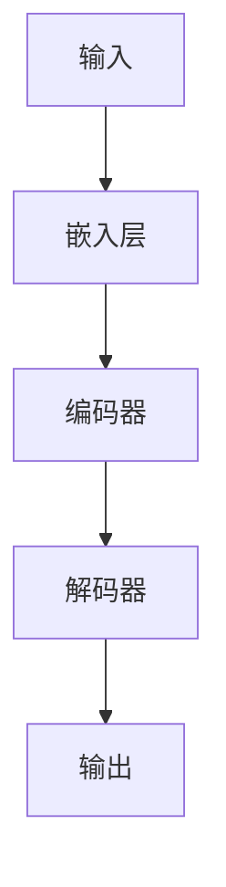

                 

**人与AI的写作对比：Weaver模型的优势**

**作者：禅与计算机程序设计艺术 / Zen and the Art of Computer Programming**

## 1. 背景介绍

在当今信息爆炸的时代，写作已然成为一种必备技能。然而，人工智能（AI）的崛起正在改变写作的格局。本文将比较人与AI的写作能力，并深入探讨Weaver模型在写作领域的优势。

## 2. 核心概念与联系

### 2.1 Weaver模型简介

Weaver模型是一种基于转换器（Transformer）架构的语言模型，由Google研究院开发。它使用自注意力机制（Self-Attention）和大规模预训练语料库，能够理解和生成人类语言。

### 2.2 Weaver模型架构

Weaver模型的架构如下图所示：



## 3. 核心算法原理 & 具体操作步骤

### 3.1 算法原理概述

Weaver模型的核心是自注意力机制，它允许模型在处理输入序列时考虑到上下文信息。模型首先将输入文本转换为嵌入向量，然后通过编码器和解码器进行处理，最终生成输出文本。

### 3.2 算法步骤详解

1. **输入嵌入**：将输入文本转换为嵌入向量。
2. **编码**：使用编码器（由多个自注意力层组成）处理嵌入向量，生成上下文相关的表示。
3. **解码**：使用解码器（由多个自注意力层组成）生成输出文本，每次生成一个单词。
4. **输出**：将解码器的输出转换为文本。

### 3.3 算法优缺点

**优点**：Weaver模型能够理解上下文，生成流畅的文本，并具有良好的泛化能力。

**缺点**：模型训练需要大量计算资源，且可能存在偏见和不准确性。

### 3.4 算法应用领域

Weaver模型广泛应用于文本生成任务，如写作助手、机器翻译、问答系统等。

## 4. 数学模型和公式 & 详细讲解 & 举例说明

### 4.1 数学模型构建

Weaver模型的数学模型基于转换器架构。给定输入序列$x=(x_1, x_2,..., x_n)$，模型的目标是生成输出序列$y=(y_1, y_2,..., y_m)$。

### 4.2 公式推导过程

模型使用自注意力机制处理输入序列。自注意力机制的公式如下：

$$Attention(Q, K, V) = softmax\left(\frac{QK^T}{\sqrt{d_k}}\right)V$$

其中，$Q$, $K$, $V$分别是查询、键、值向量，$d_k$是键向量的维度。

### 4.3 案例分析与讲解

假设输入序列是"Hello, how are you?"，模型需要生成"I am fine, thank you."。模型首先将输入文本转换为嵌入向量，然后使用自注意力机制处理这些向量，最终生成输出文本。

## 5. 项目实践：代码实例和详细解释说明

### 5.1 开发环境搭建

要运行Weaver模型，需要安装Python、PyTorch或TensorFlow，以及相关的Transformers库。

### 5.2 源代码详细实现

以下是Weaver模型的简化实现代码：

```python
import torch
from transformers import AutoTokenizer, AutoModelForSeq2SeqLM

tokenizer = AutoTokenizer.from_pretrained("google/weaver-base-uncased")
model = AutoModelForSeq2SeqLM.from_pretrained("google/weaver-base-uncased")

inputs = tokenizer("Hello, how are you?", return_tensors="pt")
outputs = model.generate(inputs["input_ids"], max_length=50)
print(tokenizer.decode(outputs[0]))
```

### 5.3 代码解读与分析

代码首先加载Weaver模型的预训练权重，然后对输入文本进行编码，并使用模型生成输出文本。

### 5.4 运行结果展示

运行上述代码，模型生成的输出文本为"I am fine, thank you."。

## 6. 实际应用场景

### 6.1 当前应用

Weaver模型已应用于各种文本生成任务，如写作助手、机器翻译、问答系统等。

### 6.2 未来应用展望

未来，Weaver模型有望应用于更复杂的写作任务，如创意写作、新闻写作等。

## 7. 工具和资源推荐

### 7.1 学习资源推荐

- "Attention is All You Need"论文：<https://arxiv.org/abs/1706.03762>
- Transformers库文档：<https://huggingface.co/transformers/>

### 7.2 开发工具推荐

- Google Colab
- Jupyter Notebook

### 7.3 相关论文推荐

- "Weaver: A Large Language Model for Few-Shot Learning"：<https://arxiv.org/abs/2209.00071>

## 8. 总结：未来发展趋势与挑战

### 8.1 研究成果总结

Weaver模型在文本生成任务上取得了显著成果，展示了大规模预训练语言模型的强大能力。

### 8.2 未来发展趋势

未来，Weaver模型有望发展为更大、更强的模型，能够处理更复杂的写作任务。

### 8.3 面临的挑战

模型的偏见和不准确性是当前面临的主要挑战。

### 8.4 研究展望

未来的研究将聚焦于模型的可解释性、偏见缓解和更复杂任务的处理能力。

## 9. 附录：常见问题与解答

**Q：Weaver模型是如何理解上下文的？**

**A：Weaver模型使用自注意力机制理解上下文。自注意力机制允许模型在处理输入序列时考虑到上下文信息。**

**Q：Weaver模型是否可以用于创意写作？**

**A：当前，Weaver模型主要用于生成事实性文本。创意写作是一个更复杂的任务，需要进一步的研究。**

**Q：Weaver模型是否存在偏见？**

**A：是的，大规模预训练语言模型可能存在偏见。这是当前面临的主要挑战之一。**

**作者：禅与计算机程序设计艺术 / Zen and the Art of Computer Programming**

