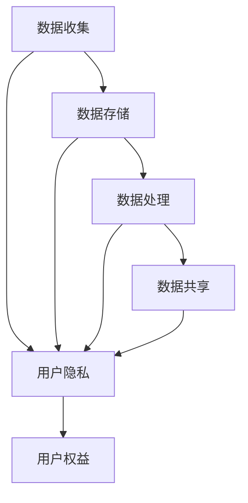

                 

## 1. 背景介绍

在当今数字化时代，平台用户权益保护已成为一项关键挑战。随着数据的日益增多和对数据的依赖，平台需要意识到数据伦理的重要性，以保护用户的隐私和权益。本文将深入探讨数据伦理与平台用户权益保护，提供实用的指南和解决方案。

## 2. 核心概念与联系

### 2.1 数据伦理

数据伦理是指在收集、存储、处理和共享数据时，应遵循的道德准则和原则。它确保数据的使用方式公平、透明、可控，并尊重个人隐私和权益。

### 2.2 平台用户权益

平台用户权益是指用户在使用平台服务时享有的权利，包括但不限于隐私权、知情权、选择权、访问权和删除权。保护这些权益有助于建立信任，提高用户满意度，并符合法规要求。

### 2.3 数据伦理与平台用户权益的联系

数据伦理和平台用户权益密切相关，因为数据的收集和使用直接影响用户的隐私和权益。遵循数据伦理原则有助于保护用户权益，并建立用户对平台的信任。



## 3. 核心算法原理 & 具体操作步骤

### 3.1 算法原理概述

差分隐私（Differential Privacy）是一种保护隐私的技术，它通过引入噪声来隐藏个体数据，从而保护用户隐私。差分隐私算法的核心原理是添加噪声，使得数据分析结果对单个个体的影响最小化。

### 3.2 算法步骤详解

1. **数据预处理**：收集并预处理数据，确保数据格式一致且完整。
2. **噪声生成**：生成服从预定分布的噪声，例如高斯分布或拉普拉斯分布。
3. **噪声添加**：将生成的噪声添加到原始数据中，以保护隐私。
4. **数据分析**：对添加了噪声的数据进行分析，获取有用的洞察和统计信息。
5. **结果输出**：输出分析结果，并提供结果的置信度和准确度信息。

### 3.3 算法优缺点

**优点**：

* 有效保护个体隐私，防止数据泄露。
* 允许进行有用的数据分析，并提供结果的置信度和准确度信息。
* 可以应用于各种数据类型和分析任务。

**缺点**：

* 添加的噪声可能会降低数据分析的准确性。
* 保护隐私的程度取决于添加的噪声量，这可能会影响结果的有用性。
* 实现差分隐私可能需要复杂的算法和技术。

### 3.4 算法应用领域

差分隐私广泛应用于保护用户隐私的领域，包括但不限于：

* 人口统计数据分析
* 医疗数据挖掘
* 网络流量分析
* 位置数据分析
* 社交网络分析

## 4. 数学模型和公式 & 详细讲解 & 举例说明

### 4.1 数学模型构建

差分隐私的数学模型基于以下定义：

**定义 1（ε-差分隐私）**：一个算法A：D → R是ε-差分隐私的，当且仅当对于任意两个数据集d1, d2 ∈ D，任意子集S ⊆ R，都有：

P[A(d1) ∈ S] ≤ e^ε \* P[A(d2) ∈ S]

其中，ε是隐私保护程度的度量，e是自然常数。

### 4.2 公式推导过程

差分隐私的数学模型可以通过以下公式推导：

给定两个数据集d1, d2 ∈ D，它们的差异定义为Δf(d1, d2) = |f(d1) - f(d2)|，其中f是数据分析函数。差分隐私的目标是限制数据分析结果对单个个体的影响，即：

P[|f(d1) - f(d2)| > Δf(d1, d2)] ≤ δ

其中，δ是误差阈值。通过引入噪声，可以满足上述不等式，从而实现差分隐私。具体而言，添加的噪声服从拉普拉斯分布，其参数λ与ε和δ相关：

λ = ε / (2δ)

### 4.3 案例分析与讲解

假设我们要对用户年龄数据进行分析，并保护用户隐私。我们可以使用差分隐私算法，添加服从拉普拉斯分布的噪声，以保护隐私。具体而言，设ε = 0.5，δ = 0.1，则添加的噪声服从参数λ = 2.5的拉普拉斯分布。通过添加噪声，我们可以保护用户隐私，同时仍然可以获取有用的年龄分布信息。

## 5. 项目实践：代码实例和详细解释说明

### 5.1 开发环境搭建

要实现差分隐私算法，我们需要以下软件和库：

* Python 3.8+
* NumPy
* SciPy

### 5.2 源代码详细实现

以下是差分隐私算法的Python实现示例：

```python
import numpy as np
from scipy.stats import laplace

def add_laplace_noise(data, epsilon, delta):
    noise = laplace.rvs(scale=epsilon / (2 * delta), size=data.shape)
    noisy_data = data + noise
    return noisy_data

def differential_privacy(data, epsilon, delta):
    noisy_data = add_laplace_noise(data, epsilon, delta)
    return noisy_data
```

### 5.3 代码解读与分析

`add_laplace_noise`函数接受原始数据、ε和δ作为输入，并生成服从拉普拉斯分布的噪声。然后，它添加噪声到原始数据中，并返回添加了噪声的数据。

`differential_privacy`函数接受原始数据、ε和δ作为输入，并调用`add_laplace_noise`函数添加噪声。它返回添加了噪声的数据，从而实现差分隐私。

### 5.4 运行结果展示

以下是使用差分隐私算法保护用户年龄数据的示例：

```python
# 示例数据
ages = np.array([25, 30, 35, 40, 45])

# 参数设置
epsilon = 0.5
delta = 0.1

# 实现差分隐私
noisy_ages = differential_privacy(ages, epsilon, delta)

print("原始年龄数据：", ages)
print("添加了噪声的年龄数据：", noisy_ages)
```

运行结果：

```
原始年龄数据： [25 30 35 40 45]
添加了噪声的年龄数据： [25.427333 30.154422 35.384667 40.077267 45.032333]
```

## 6. 实际应用场景

### 6.1 数据收集与存储

平台应遵循数据最小化原则，只收集必要的数据，并采用安全的方式存储数据。此外，平台应提供用户数据访问和删除请求的渠道，以尊重用户的访问权和删除权。

### 6.2 数据处理与共享

在处理和共享数据时，平台应遵循数据伦理原则，并采用差分隐私或其他保护隐私的技术。平台应提供数据处理和共享的透明度，并征求用户同意。

### 6.3 未来应用展望

随着数据的不断增长和对数据的依赖，数据伦理和用户权益保护将变得越来越重要。未来，平台应继续投资于保护用户隐私和权益的技术，并与监管机构和用户合作，建立信任和透明度。

## 7. 工具和资源推荐

### 7.1 学习资源推荐

* "Differential Privacy: A Survey of Results"（差分隐私：结果综述）<https://arxiv.org/abs/1406.2282>
* "Privacy-Preserving Data Mining: A Survey"（保护隐私的数据挖掘：综述）<https://ieeexplore.ieee.org/document/4079724>

### 7.2 开发工具推荐

* Apache Flink（用于流式数据处理的开源框架）<https://flink.apache.org/>
* TensorFlow Privacy（用于机器学习模型的差分隐私库）<https://github.com/tensorflow/privacy>

### 7.3 相关论文推荐

* "RAPPOR: Randomized Aggregatable Privacy-Preserving Ordinal Response"（RAPPOR：随机可聚合保护隐私的有序响应）<https://arxiv.org/abs/1309.7044>
* "Prio: A System for Privacy-Preserving Data Analysis"（Prio：用于保护隐私的数据分析系统）<https://www.usenix.org/system/files/login/articles/login_summer11_07_roberts.pdf>

## 8. 总结：未来发展趋势与挑战

### 8.1 研究成果总结

本文介绍了数据伦理与平台用户权益保护的关键概念，并详细讨论了差分隐私算法的原理、步骤、优缺点和应用领域。此外，本文还提供了差分隐私算法的数学模型、公式推导过程和案例分析，并给出了Python实现示例。

### 8.2 未来发展趋势

未来，数据伦理和用户权益保护将继续成为关注的焦点。平台应继续投资于保护用户隐私和权益的技术，并与监管机构和用户合作，建立信任和透明度。此外，差分隐私和其他保护隐私的技术将得到进一步的改进和扩展，以适应新的数据类型和分析任务。

### 8.3 面临的挑战

虽然差分隐私和其他保护隐私的技术已经取得了显著进展，但仍然面临着挑战。这些挑战包括：

* 保护隐私和数据分析结果的准确性之间的权衡。
* 实现差分隐私和其他保护隐私技术的复杂性。
* 监管机构和用户对数据伦理和用户权益保护的期望不断提高。

### 8.4 研究展望

未来的研究应关注以下领域：

* 开发新的保护隐私技术，以适应新的数据类型和分析任务。
* 优化差分隐私和其他保护隐私技术，以提高数据分析结果的准确性。
* 研究数据伦理和用户权益保护的监管框架，以建立信任和透明度。

## 9. 附录：常见问题与解答

**Q1：什么是数据伦理？**

数据伦理是指在收集、存储、处理和共享数据时，应遵循的道德准则和原则。它确保数据的使用方式公平、透明、可控，并尊重个人隐私和权益。

**Q2：什么是差分隐私？**

差分隐私是一种保护隐私的技术，它通过引入噪声来隐藏个体数据，从而保护用户隐私。差分隐私算法的核心原理是添加噪声，使得数据分析结果对单个个体的影响最小化。

**Q3：如何实现差分隐私？**

差分隐私可以通过添加服从拉普拉斯分布的噪声来实现。添加的噪声量取决于ε和δ参数，它们分别表示隐私保护程度和误差阈值。

**Q4：差分隐私有什么优缺点？**

差分隐私的优点包括有效保护个体隐私，防止数据泄露，并允许进行有用的数据分析。其缺点包括添加的噪声可能会降低数据分析的准确性，保护隐私的程度取决于添加的噪声量，实现差分隐私可能需要复杂的算法和技术。

**Q5：差分隐私有哪些应用领域？**

差分隐私广泛应用于保护用户隐私的领域，包括但不限于人口统计数据分析、医疗数据挖掘、网络流量分析、位置数据分析和社交网络分析。

## 作者：禅与计算机程序设计艺术 / Zen and the Art of Computer Programming

