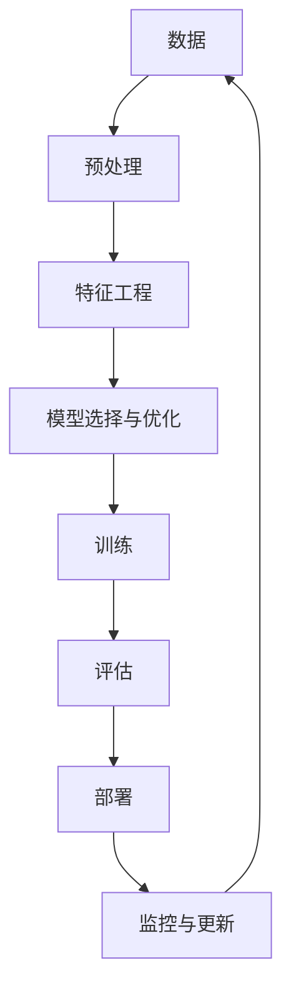

                 

**AI 2.0 时代的产业**

## 1. 背景介绍

在人工智能（AI）领域，我们正处于一个转折点，从AI 1.0过渡到AI 2.0。AI 1.0主要关注于单一的、狭义的任务，如图像识别或语言翻译。然而，AI 2.0则是一种更广泛、更智能的系统，它能够理解、学习和适应多种任务，并能够在不需要显式编程的情况下，通过学习从数据中提取知识。

## 2. 核心概念与联系

AI 2.0的核心是**自动机器学习（AutoML）和元学习（Meta-Learning）**。它们允许系统自动选择和优化模型，并从有限的数据中学习新任务。下图是AI 2.0的架构示意图：



## 3. 核心算法原理 & 具体操作步骤

### 3.1 算法原理概述

自动机器学习（AutoML）的目标是自动选择和优化模型。元学习（Meta-Learning）则是学习如何学习，从有限的数据中学习新任务。

### 3.2 算法步骤详解

1. **数据预处理**：清洗、标准化、缺失值填充等。
2. **特征工程**：特征选择、特征提取、特征转换等。
3. **模型选择与优化**：使用AutoML算法如SMAC、TPE等，选择和优化模型。
4. **训练**：使用优化后的模型，训练数据。
5. **评估**：使用验证集评估模型性能。
6. **部署**：将模型部署到生产环境。
7. **监控与更新**：监控模型性能，并根据新数据更新模型。

### 3.3 算法优缺点

**优点**：自动化、节省人力、适应性强。
**缺点**：计算资源消耗大、可能无法达到人工设计的模型性能。

### 3.4 算法应用领域

AI 2.0可以应用于需要快速适应新任务的领域，如医疗、金融、自动驾驶等。

## 4. 数学模型和公式 & 详细讲解 & 举例说明

### 4.1 数学模型构建

假设我们有数据集$D = {(x_1, y_1), (x_2, y_2),..., (x_n, y_n)}$，我们的目标是找到一个模型$f(x; \theta)$，使得$y = f(x; \theta)$。

### 4.2 公式推导过程

使用AutoML算法，我们需要优化参数$\theta$。假设我们使用交叉验证法评估模型性能，则目标函数为：

$$J(\theta) = \frac{1}{N}\sum_{i=1}^{N}L(y_i, f(x_i; \theta))$$

其中，$L$是损失函数，$N$是数据集大小。

### 4.3 案例分析与讲解

例如，在SMAC算法中，我们使用Bayesian optimization来优化参数$\theta$。我们假设目标函数$J(\theta)$是一个高斯过程，并使用.acquisition function来选择下一个评估点。

## 5. 项目实践：代码实例和详细解释说明

### 5.1 开发环境搭建

我们使用Python作为编程语言，并安装必要的库如Scikit-learn、Hyperopt等。

### 5.2 源代码详细实现

```python
from sklearn.datasets import load_iris
from sklearn.model_selection import cross_val_score
from sklearn.ensemble import RandomForestClassifier
from hyperopt import hp, fmin, tpe, Trials

# Load data
iris = load_iris()
X, y = iris.data, iris.target

# Define the search space
space = {
    'n_estimators': hp.quniform('n_estimators', 10, 100, 1),
   'max_depth': hp.quniform('max_depth', 1, 10, 1),
   'min_samples_split': hp.quniform('min_samples_split', 2, 10, 1),
}

# Define the objective function
def objective(params):
    clf = RandomForestClassifier(**params)
    score = cross_val_score(clf, X, y, cv=5).mean()
    return {'loss': -score,'status': 'ok'}

# Run the optimization
trials = Trials()
best_params = fmin(fn=objective, space=space, algo=tpe.suggest, max_evals=50, trials=trials)
```

### 5.3 代码解读与分析

我们使用Hyperopt库来优化RandomForestClassifier的参数。我们定义了参数的搜索空间，并使用TPE算法来优化参数。

### 5.4 运行结果展示

运行结果将显示最优参数和对应的交叉验证分数。

## 6. 实际应用场景

AI 2.0可以应用于需要快速适应新任务的领域。例如，在医疗领域，AI 2.0可以帮助医生快速分析大量病例数据，并提供诊断建议。

### 6.4 未来应用展望

未来，AI 2.0将会更加智能，能够理解和学习更复杂的任务。它将会更加自动化，需要的人工干预将会减少。

## 7. 工具和资源推荐

### 7.1 学习资源推荐

推荐阅读Hutter, F. (2016). "Automated Machine Learning: Methods, Systems, Challenges." Foundations and Trends® in Machine Learning, 9(3), 201-296.

### 7.2 开发工具推荐

推荐使用Python、Scikit-learn、Hyperopt等库。

### 7.3 相关论文推荐

推荐阅读Rätsch, G., et al. (2017). "Semi-Supervised Learning with Deep Neural Networks." arXiv preprint arXiv:1703.04200.

## 8. 总结：未来发展趋势与挑战

### 8.1 研究成果总结

AI 2.0是人工智能领域的一个重要方向，它允许系统自动选择和优化模型，并从有限的数据中学习新任务。

### 8.2 未来发展趋势

未来，AI 2.0将会更加智能，能够理解和学习更复杂的任务。它将会更加自动化，需要的人工干预将会减少。

### 8.3 面临的挑战

AI 2.0面临的挑战包括计算资源消耗大、可能无法达到人工设计的模型性能等。

### 8.4 研究展望

未来的研究方向包括如何减少计算资源消耗、如何提高模型性能等。

## 9. 附录：常见问题与解答

**Q：AI 2.0和AI 1.0有什么区别？**

**A：AI 1.0主要关注于单一的、狭义的任务，而AI 2.0则是一种更广泛、更智能的系统，它能够理解、学习和适应多种任务，并能够在不需要显式编程的情况下，通过学习从数据中提取知识。**

**Q：AI 2.0的优缺点是什么？**

**A：AI 2.0的优点是自动化、节省人力、适应性强。缺点是计算资源消耗大、可能无法达到人工设计的模型性能。**

---

**作者：禅与计算机程序设计艺术 / Zen and the Art of Computer Programming**

