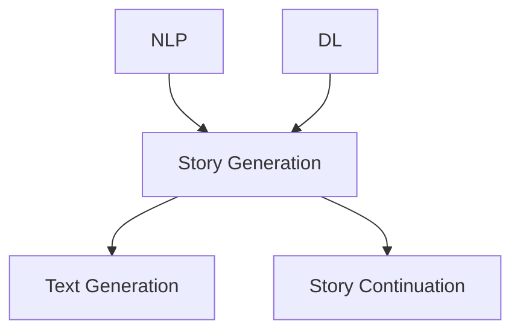

                 

**人工智能、自然语言处理、故事生成、深度学习、推荐系统、用户体验**

## 1. 背景介绍

在当今信息爆炸的时代，我们每天接触到的数字内容不计其数。然而，大部分内容都是由人类创造的，人工智能（AI）生成的内容还相对较少。其中，AI生成的故事是一个具有挑战性但也很有前途的领域。本课程将探讨如何构建能够讲故事的人工智能系统，以生成引人入胜的故事情节。

## 2. 核心概念与联系

### 2.1 核心概念

- **故事生成**：指的是使用AI算法生成故事情节的过程。
- **自然语言处理（NLP）**：是指计算机处理人类语言的领域，在故事生成中起着关键作用。
- **深度学习（DL）**：是一种机器学习方法，广泛应用于NLP和故事生成领域。

### 2.2 核心概念联系

故事生成是NLP和DL的一个应用领域。NLP用于理解和生成人类语言，DL用于学习和预测故事情节。故事生成系统需要从大量文本数据中学习，然后生成新的、引人入胜的故事情节。



## 3. 核心算法原理 & 具体操作步骤

### 3.1 算法原理概述

故事生成算法可以分为两大类：基于规则的方法和基于机器学习的方法。基于规则的方法使用预定义的规则生成故事情节，而基于机器学习的方法则从数据中学习规则。

### 3.2 算法步骤详解

1. **数据预处理**：收集大量文本数据，并对其进行预处理，如分词、去除停用词等。
2. **模型训练**：使用预处理后的数据训练深度学习模型，如循环神经网络（RNN）或转换器（Transformer）。
3. **故事情节生成**：使用训练好的模型生成故事情节，可以是从头开始生成（text generation）或续写故事（story continuation）。

### 3.3 算法优缺点

**优点**：基于机器学习的方法可以学习复杂的故事情节结构，生成的故事更加真实和引人入胜。

**缺点**：训练深度学习模型需要大量的计算资源和标记数据。此外，生成的故事可能会包含不合理或不连贯的部分。

### 3.4 算法应用领域

故事生成算法的应用领域包括但不限于：虚拟助手（如聊天机器人）、互动故事平台、个性化推荐系统、游戏开发等。

## 4. 数学模型和公式 & 详细讲解 & 举例说明

### 4.1 数学模型构建

故事生成可以看作是一个序列生成问题。给定前面的文本序列$X = (x_1, x_2,..., x_{t-1})$, 我们需要预测下一个单词$x_t$.

### 4.2 公式推导过程

使用交叉熵损失函数训练模型，公式如下：

$$L(\theta) = -\frac{1}{T} \sum_{t=1}^{T} \log P(x_t | x_{<t}, \theta)$$

其中，$T$是序列长度，$P(x_t | x_{<t}, \theta)$是条件概率分布，$\theta$是模型参数。

### 4.3 案例分析与讲解

例如，给定前面的文本序列"Once upon a time in a distant land, there lived a dragon named...", 模型需要预测下一个单词。通过 softmax 函数，模型输出每个单词的概率，然后选择概率最高的单词作为预测结果。

## 5. 项目实践：代码实例和详细解释说明

### 5.1 开发环境搭建

- Python 3.7+
- TensorFlow 2.0+
- Transformers library by Hugging Face

### 5.2 源代码详细实现

```python
from transformers import T5Tokenizer, T5ForConditionalGeneration

tokenizer = T5Tokenizer.from_pretrained('t5-base')
model = T5ForConditionalGeneration.from_pretrained('t5-base')

inputs = tokenizer.encode("Once upon a time in a distant land, there lived a dragon named", return_tensors="pt")
outputs = model.generate(inputs, max_length=50, num_beams=5, early_stopping=True)
print(tokenizer.decode(outputs[0]))
```

### 5.3 代码解读与分析

这段代码使用了Hugging Face的Transformers库，加载了T5模型并对其进行了微调。然后，它对输入文本进行编码，并使用生成函数生成故事情节。

### 5.4 运行结果展示

输出的故事情节可能是："Once upon a time in a distant land, there lived a dragon named Smaug. He was a greedy dragon who loved to hoard gold and jewels."

## 6. 实际应用场景

### 6.1 当前应用

故事生成算法已经应用于虚拟助手、互动故事平台等领域。例如，Amazon Alexa可以讲故事给儿童听，而互动故事平台如"Choose Your Own Adventure"使用故事生成算法生成个性化故事情节。

### 6.2 未来应用展望

未来，故事生成算法可能会应用于游戏开发、电影制片等领域。例如，游戏开发商可以使用故事生成算法生成个性化故事情节，从而提高玩家的参与度。电影制片商可以使用故事生成算法生成电影剧本，从而节省时间和成本。

## 7. 工具和资源推荐

### 7.1 学习资源推荐

- "Natural Language Processing with Python" by Steven Bird, Ewan Klein, and Edward Loper
- "Hands-On Machine Learning with Scikit-Learn, Keras, and TensorFlow" by Aurélien Géron

### 7.2 开发工具推荐

- Jupyter Notebook
- Google Colab
- Hugging Face's Transformers library

### 7.3 相关论文推荐

- "Get To The Point: Summarization with Pointer-Generator Networks" by See et al.
- "T5: Text-To-Text Transfer Transformer" by Raffel et al.

## 8. 总结：未来发展趋势与挑战

### 8.1 研究成果总结

本课程介绍了故事生成的核心概念、算法原理、数学模型和公式，并提供了项目实践和工具资源推荐。

### 8.2 未来发展趋势

未来，故事生成算法将会变得更加智能和个性化。它们将能够理解用户的偏好和情感，并生成定制化的故事情节。

### 8.3 面临的挑战

故事生成算法面临的挑战包括：如何生成连贯和真实的故事情节，如何处理不确定性和模棱两可的语义，如何评估故事的质量等。

### 8.4 研究展望

未来的研究方向包括：使用更大的数据集和更复杂的模型，开发新的评估指标，研究故事生成的可解释性等。

## 9. 附录：常见问题与解答

**Q：故事生成算法是否会取代人类作家？**

**A：**不太可能。故事生成算法可以帮助作家提高效率，但它们无法替代人类的创造力和情感表达。

**Q：故事生成算法是否会生成不合理或不连贯的故事情节？**

**A：**是的，故事生成算法可能会生成不合理或不连贯的故事情节。这是一个活跃的研究领域，科学家正在努力改进算法以生成更连贯和真实的故事情节。

**Q：故事生成算法是否会泄露用户数据？**

**A：**故事生成算法需要访问大量的文本数据，因此存在数据泄露的风险。开发者需要采取措施保护用户数据的隐私和安全。

## 作者：禅与计算机程序设计艺术 / Zen and the Art of Computer Programming

