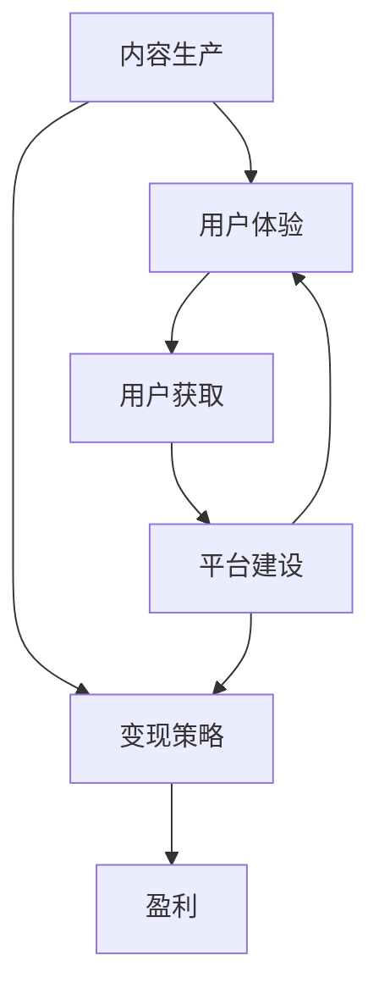

                 

**关键词：知识付费、创业、核心原理、商业模式、内容生产、用户体验、变现策略、平台建设、行业趋势**

## 1. 背景介绍

知识付费是指通过付费获取有价值的知识和信息的商业模式。随着互联网的发展和移动设备的普及，知识付费行业正在蓬勃发展。本文将深入分析知识付费创业的核心原理，帮助读者理解这一商业模式的本质，并提供实践指南。

## 2. 核心概念与联系

### 2.1 关键概念

- **内容生产**：知识付费的基础是优质内容的生产。内容可以是文字、音频、视频、课程等形式。
- **用户体验**：良好的用户体验是知识付费平台成功的关键。这包括内容的易于访问、平台的易用性，以及与用户的互动。
- **变现策略**：知识付费平台需要有效的变现策略，包括定价、付费渠道和促销活动。
- **平台建设**：平台的技术架构、安全性和可靠性对知识付费平台的成功至关重要。

### 2.2 核心概念联系



## 3. 核心算法原理 & 具体操作步骤

### 3.1 算法原理概述

知识付费平台的核心算法原理是内容推荐算法。内容推荐算法的目的是为每个用户提供个性化的内容推荐，提高用户体验和付费转化率。

### 3.2 算法步骤详解

1. **用户画像**：收集用户的注册信息、浏览历史、购买历史等数据，建立用户画像。
2. **内容标签**：为每个内容打上标签，如主题、作者、难度等。
3. **相似度计算**：计算用户画像和内容标签之间的相似度。
4. **排序**：根据相似度对内容进行排序，为用户推荐最相关的内容。
5. **反馈调整**：根据用户的点击、购买等反馈，调整推荐算法。

### 3.3 算法优缺点

**优点**：提高了用户体验，增加了付费转化率。

**缺点**：算法的准确性取决于数据的质量和算法的复杂度。如果数据不足或算法不够精确，推荐结果可能不准确。

### 3.4 算法应用领域

内容推荐算法广泛应用于各种知识付费平台，如在线课程平台、电子书平台、音频平台等。

## 4. 数学模型和公式 & 详细讲解 & 举例说明

### 4.1 数学模型构建

内容推荐算法的数学模型可以使用协同过滤或内容基于特征的方法构建。这里我们使用内容基于特征的方法，假设用户-内容矩阵为**R**，用户画像向量为**u**，内容标签向量为**c**。则推荐分数可以表示为：**s = u^T * c**。

### 4.2 公式推导过程

推荐分数**s**表示用户**u**对内容**c**的偏好程度。通过最大化**s**，我们可以为用户推荐最相关的内容。

### 4.3 案例分析与讲解

假设用户**u**的画像向量为[0.8, 0.2, 0.5]，内容**c**的标签向量为[0.6, 0.3, 0.4]。则推荐分数**s**为0.76。这表示用户**u**对内容**c**的偏好程度为0.76。

## 5. 项目实践：代码实例和详细解释说明

### 5.1 开发环境搭建

我们使用Python和NumPy来实现内容推荐算法。

### 5.2 源代码详细实现

```python
import numpy as np

# 用户画像向量
user_profile = np.array([0.8, 0.2, 0.5])

# 内容标签向量
content_tags = np.array([0.6, 0.3, 0.4])

# 计算推荐分数
recommend_score = np.dot(user_profile, content_tags)
```

### 5.3 代码解读与分析

我们使用NumPy的点积（dot）函数计算用户画像向量和内容标签向量的点积，得到推荐分数。

### 5.4 运行结果展示

推荐分数**s**为0.76，表示用户对内容的偏好程度为0.76。

## 6. 实际应用场景

### 6.1 当前应用

知识付费平台广泛应用于在线教育、电子书、音频等领域。

### 6.2 未来应用展望

未来，知识付费平台将更加注重个性化内容推荐，并结合人工智能技术提供更好的用户体验。

## 7. 工具和资源推荐

### 7.1 学习资源推荐

- [推荐系统实践](https://www.jianshu.com/p/9c6566656565)
- [内容推荐算法](https://www.cnblogs.com/guoyaohua/p/8693253.html)

### 7.2 开发工具推荐

- Python
- NumPy
- Pandas
- Scikit-learn

### 7.3 相关论文推荐

- [The Netflix Recommender System: Algorithms, Business Value, and Innovation](https://www.netflixtechblog.com/the-netflix-recommender-system-algorithms-business-value-and-innovation)
- [Amazon.com: Improving Search and Recommendations](https://www.allthingsdistributed.com/files/amazon-2006-search.pdf)

## 8. 总结：未来发展趋势与挑战

### 8.1 研究成果总结

本文分析了知识付费创业的核心原理，介绍了内容推荐算法的原理和实现，并提供了代码实例。

### 8.2 未来发展趋势

知识付费行业将继续发展，个性化内容推荐和人工智能技术将成为关键。

### 8.3 面临的挑战

数据安全和隐私保护是知识付费平台面临的主要挑战之一。

### 8.4 研究展望

未来的研究将关注如何更好地理解用户需求，如何使用人工智能技术提供更好的用户体验。

## 9. 附录：常见问题与解答

**Q：如何选择内容推荐算法？**

**A：这取决于平台的特点和用户的需求。如果平台的内容种类繁多，用户的兴趣也很广泛，那么基于内容的推荐算法可能更合适。如果平台的内容种类有限，用户的兴趣也比较集中，那么基于协同过滤的推荐算法可能更合适。**

**Q：如何提高内容推荐算法的准确性？**

**A：收集更多的用户数据，改进算法模型，并定期调整算法都是提高推荐准确性的有效方法。**

**Q：如何平衡内容推荐算法的准确性和多样性？**

**A：这需要在算法中平衡准确性和多样性的权重。通常，平台会根据用户的反馈调整权重，以提供更好的用户体验。**

**作者：禅与计算机程序设计艺术 / Zen and the Art of Computer Programming**

