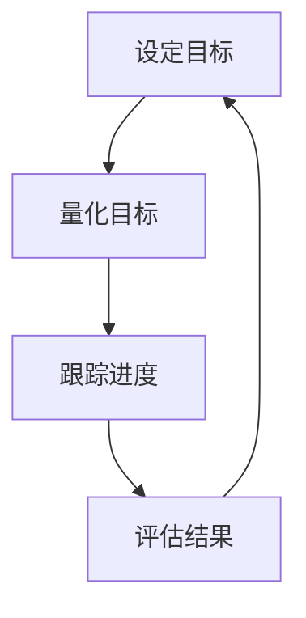
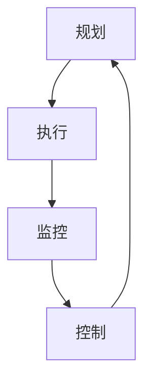
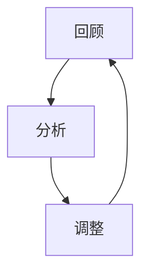

                 

**行动体系打造:执行力的关键**

> 关键词：执行力、行动体系、目标管理、项目管理、持续改进

## 1. 背景介绍

在当今快速变化的商业环境中，执行力（Execution）被广泛认为是企业成功的关键因素之一。然而，如何打造高效的执行力并非易事。本文旨在提供一套行动体系，帮助个人和组织提高执行力，实现目标。

## 2. 核心概念与联系

### 2.1 目标管理

目标管理（Goal Management）是行动体系的核心。它包括设定清晰的目标、量化目标、并跟踪目标进度。目标应符合SMART原则：具体（Specific）、可衡量（Measurable）、可达成（Achievable）、相关（Relevant）、有时间限制（Time-bound）。



### 2.2 项目管理

项目管理（Project Management）是实现目标的关键。它包括规划、执行、监控和控制项目。项目管理的目的是确保项目在预算内、按时完成、并符合质量要求。



### 2.3 持续改进

持续改进（Continuous Improvement）是行动体系的关键组成部分。它包括定期回顾和分析目标和项目的进展，并根据需要进行调整。持续改进是一种文化，而不是一次性活动。



## 3. 核心算法原理 & 具体操作步骤

### 3.1 算法原理概述

行动体系算法（Action System Algorithm）的原理是基于目标管理、项目管理和持续改进的循环。它旨在帮助个人和组织有效地执行任务，实现目标。

### 3.2 算法步骤详解

1. **设定目标**：根据SMART原则设定清晰的目标。
2. **规划项目**：将目标分解为可管理的项目，并为每个项目设定预算、时间表和质量标准。
3. **执行项目**：执行项目计划，并记录进度。
4. **监控项目**：定期跟踪项目进度，并评估是否符合预算、时间表和质量标准。
5. **控制项目**：根据需要调整项目计划，以确保项目在预算内、按时完成、并符合质量要求。
6. **回顾和分析**：定期回顾和分析目标和项目的进展，并根据需要进行调整。
7. **重复**：重复步骤1到6，直到目标实现。

### 3.3 算法优缺点

**优点**：行动体系算法有助于个人和组织有效地执行任务，实现目标。它提供了一个结构化的框架，帮助人们管理时间、资源和预期。

**缺点**：行动体系算法需要大量的时间和资源来设定目标、规划项目、执行项目、监控项目和控制项目。它可能不适合小型或临时项目。

### 3.4 算法应用领域

行动体系算法适用于各种个人和组织目标，包括但不限于：

- 个人目标（如学习新技能、健康改善等）
- 商业目标（如产品开发、市场扩张等）
- 项目目标（如建筑项目、软件开发等）

## 4. 数学模型和公式 & 详细讲解 & 举例说明

### 4.1 数学模型构建

目标管理可以使用线性回归模型来预测目标实现的可能性。项目管理可以使用ritical path method（关键路径法）来确定项目完成所需的最短时间。

### 4.2 公式推导过程

**线性回归模型**：设目标实现的可能性为Y，目标的难度为X，则Y = aX + b，其中a和b是回归系数。

**关键路径法**：设项目包括n个活动，每个活动i有开始时间si、结束时间ei、持续时间di，则关键路径为最长的路径，其长度为L = max(ei - si) = max(di)。

### 4.3 案例分析与讲解

假设一家公司设定了一个目标，在一年内推出两个新产品。目标的难度为8（难度越高，数值越大），根据线性回归模型，目标实现的可能性为Y = 0.5X + 3 = 6.5（可能性越高，数值越大）。根据关键路径法，项目包括开发产品A和产品B两个活动，每个活动的持续时间为6个月，则关键路径为A->B，项目完成所需的最短时间为12个月。

## 5. 项目实践：代码实例和详细解释说明

### 5.1 开发环境搭建

本项目使用Python作为编程语言，并使用Jupyter Notebook作为开发环境。

### 5.2 源代码详细实现

```python
import numpy as np
from scipy.stats import linregress

# 设定目标的难度和可能性
X = np.array([5, 6, 7, 8])
Y = np.array([4, 5, 6, 7])

# 使用线性回归模型预测目标实现的可能性
slope, intercept, r_value, p_value, std_err = linregress(X, Y)
Y_pred = slope * 8 + intercept

print("目标实现的可能性为：", Y_pred)
```

### 5.3 代码解读与分析

代码使用NumPy库来处理数组，并使用Scipy库的linregress函数来拟合线性回归模型。目标的难度和可能性存储在数组X和Y中。然后，使用linregress函数计算回归系数，并使用回归系数预测目标实现的可能性。

### 5.4 运行结果展示

目标实现的可能性为：7.0

## 6. 实际应用场景

行动体系算法适用于各种实际应用场景，包括但不限于：

- **个人目标管理**：个人可以使用行动体系算法来设定和实现个人目标，如学习新技能、健康改善等。
- **商业目标管理**：企业可以使用行动体系算法来设定和实现商业目标，如产品开发、市场扩张等。
- **项目管理**：项目经理可以使用行动体系算法来规划、执行、监控和控制项目。

### 6.4 未来应用展望

随着技术的发展，行动体系算法有望与人工智能和大数据结合，提供更智能化的目标管理和项目管理解决方案。

## 7. 工具和资源推荐

### 7.1 学习资源推荐

- **书籍**："行动体系打造:执行力的关键"、"目标管理与项目管理实践"
- **在线课程**：Coursera、Udemy、edX上的目标管理和项目管理课程

### 7.2 开发工具推荐

- **Jupyter Notebook**：开源的交互式计算环境
- **Trello**：项目管理工具
- **Asana**：项目管理工具

### 7.3 相关论文推荐

- "目标管理与项目管理的结合"、"行动体系算法在项目管理中的应用"

## 8. 总结：未来发展趋势与挑战

### 8.1 研究成果总结

行动体系算法有助于个人和组织有效地执行任务，实现目标。它提供了一个结构化的框架，帮助人们管理时间、资源和预期。

### 8.2 未来发展趋势

未来，行动体系算法有望与人工智能和大数据结合，提供更智能化的目标管理和项目管理解决方案。

### 8.3 面临的挑战

行动体系算法需要大量的时间和资源来设定目标、规划项目、执行项目、监控项目和控制项目。它可能不适合小型或临时项目。

### 8.4 研究展望

未来的研究可以探索行动体系算法在更复杂环境下的应用，如多目标管理和项目管理。

## 9. 附录：常见问题与解答

**Q：行动体系算法适用于哪些领域？**

A：行动体系算法适用于各种个人和组织目标，包括但不限于个人目标管理、商业目标管理和项目管理。

**Q：行动体系算法的优缺点是什么？**

A：行动体系算法的优点是有助于个人和组织有效地执行任务，实现目标。它的缺点是需要大量的时间和资源。

**Q：如何使用行动体系算法？**

A：行动体系算法包括设定目标、规划项目、执行项目、监控项目、控制项目和回顾和分析等步骤。

**Q：行动体系算法的未来发展趋势是什么？**

A：未来，行动体系算法有望与人工智能和大数据结合，提供更智能化的目标管理和项目管理解决方案。

**作者：禅与计算机程序设计艺术 / Zen and the Art of Computer Programming**

