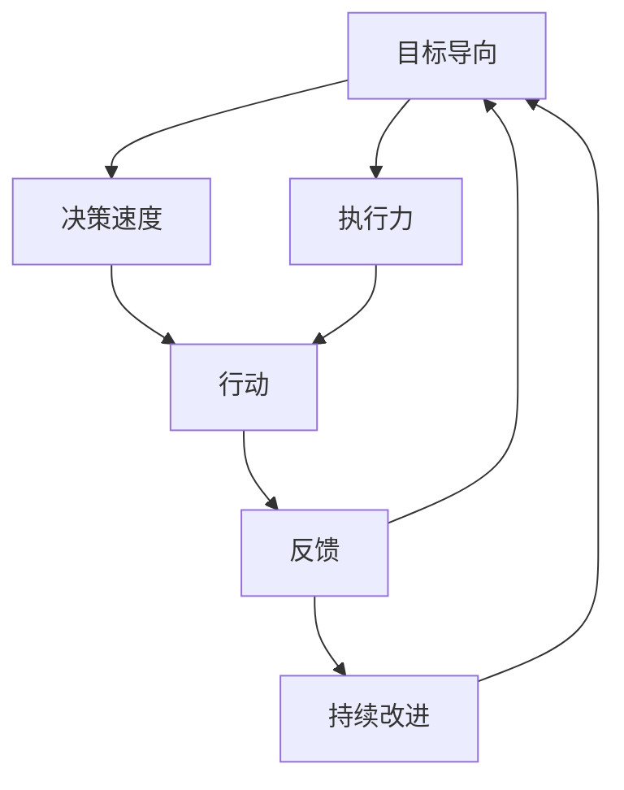

                 

**行动导向：高效管理的基础**

**作者：禅与计算机程序设计艺术 / Zen and the Art of Computer Programming**

## 1. 背景介绍

在当今快速变化的商业环境中，高效管理至关重要。然而，管理并不只是坐在办公室里发号施令，而是需要不断的行动和决策。本文将探讨行动导向管理的核心概念，并提供实用的工具和技巧，帮助管理者提高效率，带领团队取得成功。

## 2. 核心概念与联系

行动导向管理的核心概念是**目标导向、决策速度、执行力和持续改进**。这些概念是相互联系的，共同构成了高效管理的基础。下图是这些概念的关系图：



## 3. 核心算法原理 & 具体操作步骤

### 3.1 算法原理概述

行动导向管理的核心算法是**PDCA循环（计划、执行、检查、行动）**。这是一个简单但强大的工具，帮助管理者不断改进和提高效率。

### 3.2 算法步骤详解

1. **计划（Plan）**：明确目标，制定行动计划。
2. **执行（Do）**：执行计划，采取行动。
3. **检查（Check）**：检查结果，收集反馈。
4. **行动（Act）**：根据反馈，采取行动改进。

### 3.3 算法优缺点

**优点**：PDCA循环简单易用，有助于不断改进，提高效率。

**缺点**：过分依赖PDCA循环可能导致管理者忽略长期战略，只关注短期目标。

### 3.4 算法应用领域

PDCA循环适用于各种管理场景，包括项目管理、运营管理、质量管理等。

## 4. 数学模型和公式 & 详细讲解 & 举例说明

### 4.1 数学模型构建

管理效率可以用**目标达成率（TAR）**来度量：

$$
TAR = \frac{Actual\ Results}{Planned\ Results}
$$

### 4.2 公式推导过程

TAR公式反映了管理者的目标导向和执行力。理想情况下，TAR应接近1。

### 4.3 案例分析与讲解

假设一位管理者计划在一个月内完成10个任务，但只完成了8个。那么，其TAR为：

$$
TAR = \frac{8}{10} = 0.8
$$

这表明管理者的执行力还有改进的空间。

## 5. 项目实践：代码实例和详细解释说明

### 5.1 开发环境搭建

本示例使用Python和Jupyter Notebook。

### 5.2 源代码详细实现

```python
# 定义任务数量和完成情况
tasks_planned = 10
tasks_completed = 8

# 计算目标达成率
def calculate_tar(planned, completed):
    return completed / planned

tar = calculate_tar(tasks_planned, tasks_completed)
print(f'Target Achievement Rate: {tar}')
```

### 5.3 代码解读与分析

这段代码计算并打印目标达成率。

### 5.4 运行结果展示

运行这段代码将输出：

```
Target Achievement Rate: 0.8
```

## 6. 实际应用场景

### 6.1 当前应用

行动导向管理在各种组织中广泛应用，帮助管理者提高效率，带领团队取得成功。

### 6.2 未来应用展望

未来，行动导向管理将与人工智能和大数据结合，帮助管理者做出更明智的决策。

## 7. 工具和资源推荐

### 7.1 学习资源推荐

- 书籍：《行动导向管理》（Deming, W. E.）
- 课程：Coursera上的"行动导向管理"课程

### 7.2 开发工具推荐

- Jupyter Notebook
- Trello（项目管理工具）

### 7.3 相关论文推荐

- Deming, W. E. (1986). "Out of the Crisis." MIT Center for Quality Management.

## 8. 总结：未来发展趋势与挑战

### 8.1 研究成果总结

行动导向管理是高效管理的基础，PDCA循环是其核心工具。

### 8.2 未来发展趋势

未来，行动导向管理将与人工智能和大数据结合，帮助管理者做出更明智的决策。

### 8.3 面临的挑战

管理者可能会过分依赖短期目标，忽略长期战略。

### 8.4 研究展望

未来的研究应关注行动导向管理与人工智能的结合，以及如何帮助管理者平衡短期目标和长期战略。

## 9. 附录：常见问题与解答

**Q：行动导向管理适用于哪些场景？**

**A：行动导向管理适用于各种管理场景，包括项目管理、运营管理、质量管理等。**

**Q：如何平衡短期目标和长期战略？**

**A：管理者应定期回顾长期战略，并将其与短期目标结合起来。**

**Q：如何提高目标达成率？**

**A：管理者应明确目标，制定行动计划，并不断改进。**

**作者：禅与计算机程序设计艺术 / Zen and the Art of Computer Programming**

