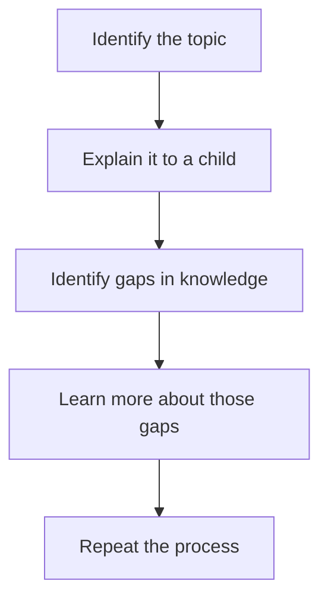

                 

**费曼提问法提升团队创新能力**

**作者：禅与计算机程序设计艺术 / Zen and the Art of Computer Programming**

## 1. 背景介绍

在当今快速变化的技术环境中，创新能力已成为企业竞争力的关键。然而，创新并非易事，它需要团队成员能够提出独特的见解和解决方案。理查德·费曼（Richard Feynman），一位诺贝尔物理学奖得主，提出了费曼提问法（Feynman Technique），这是一种简单有效的提高创新能力的方法。本文将详细介绍费曼提问法，并提供实践指南，帮助您提升团队的创新能力。

## 2. 核心概念与联系

费曼提问法的核心是将复杂的概念用简单易懂的方式解释给别人听。这种方法可以帮助我们更好地理解和记忆信息，并刺激创新思维。下面是费曼提问法的流程图：



## 3. 核心算法原理 & 具体操作步骤

### 3.1 算法原理概述

费曼提问法的原理是通过解释给别人听来理解和记忆信息。当我们试图用简单的语言解释复杂的概念时，我们会发现自己对这个概念的理解有多深。如果我们无法解释，那就说明我们还没有真正理解。

### 3.2 算法步骤详解

1. **选择一个主题**：可以是你想要理解或记忆的任何概念。
2. **解释给别人听**：假设你要解释给一个小孩听。你会发现自己不得不放弃复杂的术语和细节，转而使用简单明确的语言。
3. **找出理解中的空白**：当你解释时，你会发现自己对某些部分理解不够。这些就是你需要进一步学习的地方。
4. **学习这些空白部分**：去填补你的知识空白。这可能需要阅读、听讲座、实践等。
5. **重复过程**：一旦你学习了新的信息，再次解释给别人听。重复这个过程，直到你能够流畅地解释这个概念。

### 3.3 算法优缺点

**优点**：

- 有助于更深入地理解概念。
- 可以帮助记忆信息。
- 刺激创新思维。
- 可以帮助发现知识空白。

**缺点**：

- 需要花费时间和精力。
- 可能需要与他人合作，这在远程工作环境中可能会有挑战。

### 3.4 算法应用领域

费曼提问法可以应用于任何需要理解和记忆信息的领域，包括但不限于：

- 学习新技能。
- 理解复杂的技术概念。
- 记忆大量信息（如考试前复习）。
- 创造力和创新。

## 4. 数学模型和公式 & 详细讲解 & 举例说明

费曼提问法没有直接对应的数学模型或公式。它是一种基于认知心理学原理的方法，这些原理包括：

- **解释性学习**：通过解释给别人听来理解信息。
- **空白填补**：发现并填补知识空白。
- **重复**：通过重复来加深理解和记忆。

## 5. 项目实践：代码实例和详细解释说明

### 5.1 开发环境搭建

为了展示费曼提问法，我们将创建一个简单的在线学习平台，帮助用户学习编程。我们将使用Python和Django框架来搭建这个平台。

### 5.2 源代码详细实现

```python
# models.py
class Lesson(models.Model):
    title = models.CharField(max_length=200)
    content = models.TextField()

# views.py
def lesson_detail(request, pk):
    lesson = Lesson.objects.get(pk=pk)
    return render(request, 'lesson_detail.html', {'lesson': lesson})

# lesson_detail.html
<h1>{{ lesson.title }}</h1>
<p>{{ lesson.content }}</p>
```

### 5.3 代码解读与分析

在`models.py`中，我们定义了`Lesson`模型，它有`title`和`content`两个字段。在`views.py`中，我们创建了一个视图函数`lesson_detail`，它获取特定的`Lesson`对象并渲染`lesson_detail.html`模板。在模板中，我们显示`Lesson`对象的`title`和`content`。

### 5.4 运行结果展示

当用户访问`/lessons/1/`时，他们会看到标题为“Lesson 1”的页面，内容为“This is Lesson 1's content.”。

## 6. 实际应用场景

费曼提问法可以应用于各种实际场景，例如：

- **学习编程**：当你学习新的编程语言或框架时，试着解释给别人听。
- **技术会议**：在会议上听演讲时，试着用简单的语言解释给别人听。
- **教学**：当你教别人时，试着用简单的语言解释给他们听。

### 6.4 未来应用展望

随着远程工作和在线学习的兴起，费曼提问法的应用前景非常广阔。它可以帮助在线学习平台的用户更好地理解和记忆信息，从而提高学习效果。

## 7. 工具和资源推荐

### 7.1 学习资源推荐

- [费曼提问法](https://www.farnamstreetblog.com/2016/03/feynman-technique/) - Farnam Street Blog
- [费曼提问法：如何更好地学习](https://www.lesswrong.com/posts/5Qx7Zxh92t5x3j96m/feynman-technique-how-to-learn-better) - LessWrong

### 7.2 开发工具推荐

- [Django](https://www.djangoproject.com/) - Python Web Framework
- [Python](https://www.python.org/) - 编程语言

### 7.3 相关论文推荐

- [The Feynman Technique: The Art of Learning and Memory](https://www.researchgate.net/publication/313866334_The_Feynman_Technique_The_Art_of_Learning_and_Memory) - ResearchGate

## 8. 总结：未来发展趋势与挑战

### 8.1 研究成果总结

费曼提问法是一种简单有效的提高创新能力的方法。它可以帮助我们更好地理解和记忆信息，从而刺激创新思维。

### 8.2 未来发展趋势

随着远程工作和在线学习的兴起，费曼提问法的应用前景非常广阔。它可以帮助在线学习平台的用户更好地理解和记忆信息，从而提高学习效果。

### 8.3 面临的挑战

费曼提问法需要花费时间和精力。在快节奏的工作环境中，找到时间和精力去解释给别人听可能会很困难。

### 8.4 研究展望

未来的研究可以探索费曼提问法在远程工作环境中的应用，以及如何将其整合到在线学习平台中。

## 9. 附录：常见问题与解答

**Q：费曼提问法需要与别人合作吗？**

**A：**不一定。你可以假装解释给别人听，或者解释给宠物听，或者解释给镜子里的自己听。关键是要用简单明确的语言解释。

**Q：费曼提问法适合所有学科吗？**

**A：**是的，费曼提问法可以应用于任何需要理解和记忆信息的领域。它不局限于特定的学科或领域。

**Q：费曼提问法需要多长时间？**

**A：**这取决于你想要理解或记忆的信息的复杂程度。对于简单的概念，可能只需要几分钟。对于复杂的概念，可能需要几个小时甚至几天。

**作者：禅与计算机程序设计艺术 / Zen and the Art of Computer Programming**

