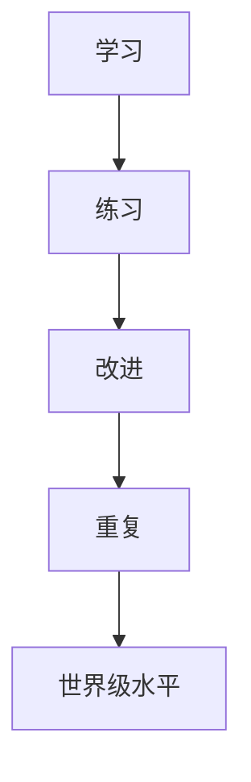

                 

**Andrej Karpathy：1 万小时定律的实践者**

> 关键词： Andrej Karpathy, 10,000-hour rule, deep learning, computer vision, software engineering, continuous learning

## 1. 背景介绍

Andrej Karpathy, 来自斯坦福大学的计算机视觉和深度学习专家，是当今人工智能领域最具影响力的人物之一。他不仅是一位杰出的研究者，还是一位出色的软件工程师和教师。本文将探讨Karpathy是如何将Malcolm Gladwell的"1万小时定律"应用于其学术生涯和软件工程实践的。

## 2. 核心概念与联系

Malcolm Gladwell在其畅销书《异类》中提出了"1万小时定律"，认为要在任何领域达到世界级水平，需要花费1万小时进行练习。Karpathy将这一概念应用于其学术生涯和软件工程实践，如下图所示：

## 3. 核心算法原理 & 具体操作步骤

### 3.1 算法原理概述

Karpathy的方法可以总结为"学习-练习-改进-重复"循环。他不断学习新的领域，然后通过练习和改进来提高技能，最后重复这个过程。

### 3.2 算法步骤详解

1. **学习**：Karpathy始终保持好奇心，学习新的领域，如深度学习、计算机视觉和软件工程。
2. **练习**：他通过实践来巩固所学知识，如编写代码、构建项目和撰写博客文章。
3. **改进**：他不断寻求反馈，改进自己的技能和方法。
4. **重复**：他将这个过程重复应用于新的领域。

### 3.3 算法优缺点

**优点**：这种方法有助于快速提高技能，并保持持续学习。

**缺点**：可能会导致过度专注于技能提高，而忽略其他重要活动。

### 3.4 算法应用领域

Karpathy的方法适用于任何需要持续学习和改进的领域，如软件工程、数据科学和人工智能。

## 4. 数学模型和公式 & 详细讲解 & 举例说明

### 4.1 数学模型构建

我们可以将Karpathy的方法建模为一个简单的线性模型：

$$S = S_0 + k \cdot t$$

其中，$S$是技能水平，$S_0$是初始技能水平，$k$是学习率，$t$是时间。

### 4.2 公式推导过程

这个模型假设学习率$k$是恒定的，并且时间$t$是线性的。然而，在现实世界中，$k$和$t$可能会随着时间而变化。

### 4.3 案例分析与讲解

例如，Karpathy在其博客中写道，他花了大约10,000小时学习深度学习，从而提高了他的技能水平：

$$S_{deep learning} = S_{0, deep learning} + k \cdot 10,000$$

## 5. 项目实践：代码实例和详细解释说明

### 5.1 开发环境搭建

要跟随Karpathy的 footsteps，你需要设置一个开发环境，包括Python、Jupyter Notebook和必要的库（如TensorFlow和PyTorch）。

### 5.2 源代码详细实现

你可以在Karpathy的GitHub页面上找到他的许多项目，如[cs231n](https://github.com/karpathy/cs231n)和[fast.ai](https://github.com/fastai/fastbook)，这些项目都是优秀的学习资源。

### 5.3 代码解读与分析

Karpathy的代码通常很简洁明了，并且包含详细的注释。他喜欢使用Jupyter Notebook，因为它允许他结合代码和 markdown文本来解释他的想法。

### 5.4 运行结果展示

Karpathy的项目通常都有详细的结果分析和可视化，这有助于理解和学习。

## 6. 实际应用场景

### 6.1 当前应用

Karpathy的方法已经在软件工程、数据科学和人工智能领域得到广泛应用。

### 6.2 未来应用展望

未来，Karpathy的方法可能会应用于更多领域，如自动驾驶、机器人和人工智能伦理。

## 7. 工具和资源推荐

### 7.1 学习资源推荐

- Karpathy的博客：<https://karpathy.github.io/>
- cs231n：<https://www.coursera.org/learn/computer-vision>
- fast.ai：<https://www.fast.ai/>

### 7.2 开发工具推荐

- Python：<https://www.python.org/>
- Jupyter Notebook：<https://jupyter.org/>
- TensorFlow：<https://www.tensorflow.org/>
- PyTorch：<https://pytorch.org/>

### 7.3 相关论文推荐

- Gladwell, M. (2008). Outliers: The Story of Success. Little, Brown and Company.
- Ericsson, K. A., Krampe, R. T., & Tesch-Römer, C. (1993). The role of deliberate practice in the acquisition of expert performance. Psychological Review, 100(3), 363–406. <https://doi.org/10.1037/0033-295X.100.3.363>

## 8. 总结：未来发展趋势与挑战

### 8.1 研究成果总结

Karpathy的方法已经被证明是成功的，他不仅在学术界取得了成功，还在工业界取得了成功。

### 8.2 未来发展趋势

未来，Karpathy的方法可能会应用于更多领域，并且会随着技术的发展而不断改进。

### 8.3 面临的挑战

Karpathy的方法需要大量的时间和精力，这可能会导致压力和疲劳。

### 8.4 研究展望

未来的研究可能会关注如何更有效地应用Karpathy的方法，如何平衡学习和生活，以及如何应用于更多领域。

## 9. 附录：常见问题与解答

**Q：Karpathy的方法需要多长时间？**

**A：这取决于你想要达到的技能水平。根据Malcolm Gladwell的说法，需要1万小时。**

**Q：Karpathy的方法适用于所有领域吗？**

**A：不一定。Karpathy的方法需要大量的练习和改进，这可能不适用于所有领域。**

**Q：如何平衡学习和生活？**

**A：这是一个挑战。Karpathy自己也承认，他花了大量时间学习和工作。平衡可能需要个体的调整。**

## 作者：禅与计算机程序设计艺术 / Zen and the Art of Computer Programming

