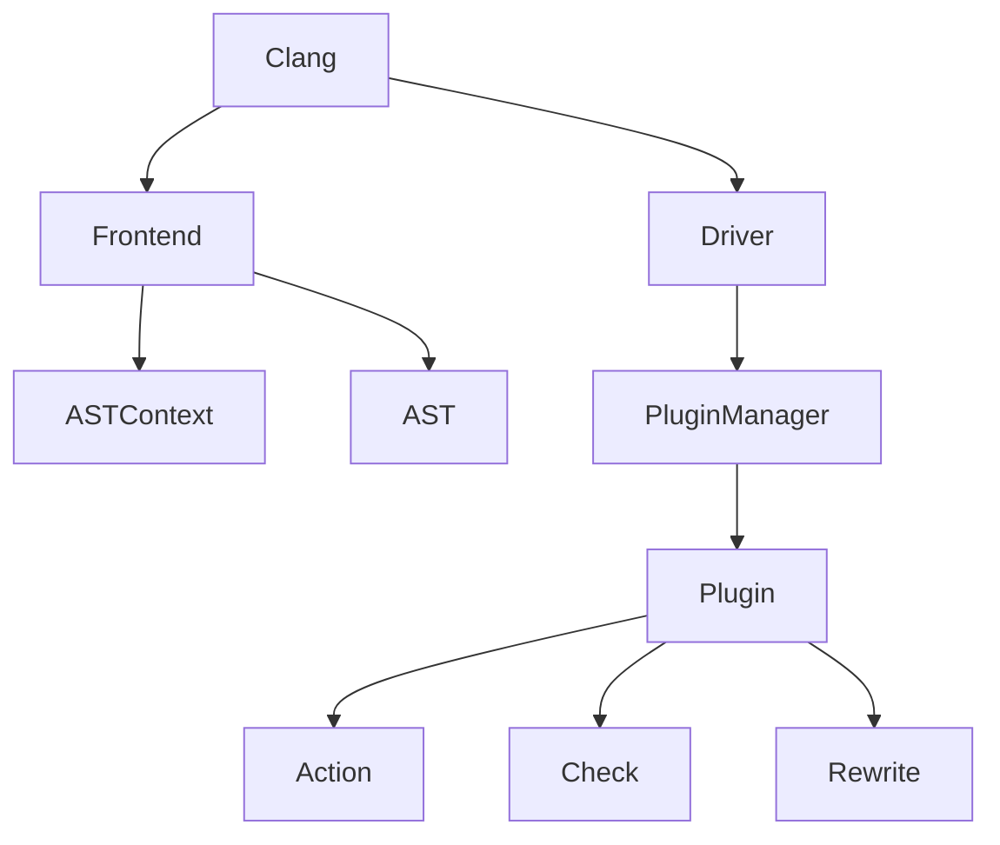

                 

## 1. 背景介绍

在当今软件开发领域，代码质量和安全性至关重要。编译器是编写代码的第一道防线，它可以帮助我们发现错误和潜在的安全漏洞。Clang是一个功能强大的编译器，它提供了插件开发的能力，允许我们扩展其功能，进行代码检查和分析。本文将深入探讨Clang插件开发，并提供实践指南，帮助您构建自己的代码检查工具。

## 2. 核心概念与联系

### 2.1 Clang插件架构

Clang插件架构如下图所示：



在Clang中，插件通过`PluginManager`与编译器交互。插件可以注册`Action`、`Check`和`Rewrite`等回调函数，在编译过程中执行自定义代码检查和修改。

### 2.2 ClangAST

Clang使用抽象语法树（AST）表示源代码的结构。AST是编译器内部表示源代码的一种方式，它提供了访问和分析源代码的便捷接口。Clang插件可以访问AST，并对其进行分析和修改。

## 3. 核心算法原理 & 具体操作步骤

### 3.1 算法原理概述

Clang插件开发的核心是注册回调函数，在编译过程中执行代码检查和修改。插件可以在编译器的各个阶段注册回调函数，例如语法分析、语义分析和中间代码生成。

### 3.2 算法步骤详解

1. **编写插件**：创建一个C++文件，包含Clang的头文件，并定义插件类，继承自`clang::Plugin`。
2. **注册插件**：在插件类的构造函数中，注册插件并指定其名称和版本。
3. **注册回调函数**：在插件类中，注册`Action`、`Check`和`Rewrite`等回调函数，指定其执行时机和行为。
4. **访问AST**：在回调函数中，使用Clang提供的AST访问接口，分析和修改源代码。
5. **编译插件**：使用Clang编译插件代码，生成动态链接库（.so或.dylib文件）。
6. **加载插件**：在编译源代码时，使用`-load`选项加载插件动态链接库。

### 3.3 算法优缺点

**优点：**

* Clang插件开发允许我们扩展编译器的功能，进行代码检查和分析。
* Clang提供了丰富的AST访问接口，方便我们分析和修改源代码。
* Clang插件可以在编译过程中执行，无需额外的编译步骤。

**缺点：**

* Clang插件开发需要掌握C++和Clang的相关知识。
* Clang插件的性能可能会影响编译速度，需要进行优化。
* Clang插件的开发和维护需要跟随Clang的版本变化。

### 3.4 算法应用领域

Clang插件开发可以应用于各种代码检查和分析领域，例如：

* 静态代码分析：检查代码中的错误、警告和潜在的安全漏洞。
* 代码格式化：自动格式化代码，使其符合编码风格规范。
* 代码重构：自动重构代码，提高代码的可读性和可维护性。
* 代码生成：根据源代码生成其他文件，例如文档或测试用例。

## 4. 数学模型和公式 & 详细讲解 & 举例说明

在Clang插件开发中，数学模型和公式主要应用于代码分析和检查。例如，在进行静态代码分析时，我们可以使用控制流图（CFG）和数据流分析来检查代码中的错误和漏洞。

### 4.1 数学模型构建

控制流图（CFG）是表示程序控制流的有向图，其节点表示基本块，边表示控制流的转移。CFG可以用于表示程序的执行路径，并进行数据流分析。

### 4.2 公式推导过程

数据流分析是一种静态程序分析技术，用于推断程序中变量的值和属性。数据流分析的公式推导过程如下：

1. 定义数据流函数：例如，用于计算变量的可能值集合的函数。
2. 定义初始值和边界条件：例如，变量的初始值和输入值的边界条件。
3. 定义传播规则：例如，如何在控制流图的边上传播数据流信息。
4. 使用固定点迭代算法：不断迭代更新数据流信息，直到收敛。

### 4.3 案例分析与讲解

假设我们要检查代码中的空指针访问。我们可以使用数据流分析来跟踪指针的生命周期，并检查其是否为空。

```c
int* ptr = NULL;
*ptr = 10; // 空指针访问
```

在构建CFG后，我们可以使用数据流分析来跟踪指针`ptr`的值。在数据流函数中，我们可以定义指针的可能值集合，并使用传播规则在控制流图的边上传播数据流信息。在固定点迭代算法中，我们可以检查指针是否为空，并报告空指针访问的错误。

## 5. 项目实践：代码实例和详细解释说明

### 5.1 开发环境搭建

要开发Clang插件，我们需要安装Clang和LLVM开发环境。可以参考[Clang和LLVM的官方文档](https://clang.llvm.org/get_started.html)进行安装。

### 5.2 源代码详细实现

以下是一个简单的Clang插件示例，用于检查代码中的空指针访问：

```cpp
#include "clang-c/Index.h"
#include "clang/AST/RecursiveASTVisitor.h"
#include "clang/Frontend/CompilerInstance.h"
#include "clang/Frontend/FrontendAction.h"
#include "clang/Tooling/CommonOptionsParser.h"
#include "clang/Tooling/Tooling.h"
#include "llvm/Support/CommandLine.h"

using namespace clang;
using namespace clang::driver;
using namespace clang::tooling;
using namespace llvm;

static cl::OptionCategory CheckEmptyPointerCategory("CheckEmptyPointer options");

class CheckEmptyPointerVisitor
    : public RecursiveASTVisitor<CheckEmptyPointerVisitor> {
public:
  explicit CheckEmptyPointerVisitor(ASTContext &Context) : Context(Context) {}

  bool VisitStmt(Stmt *S) {
    if (auto *DerefExpr = dyn_cast<DereferenceExpr>(S)) {
      auto *Pointee = DerefExpr->getPointee();
      if (Pointee->isNullPointerConstant(Context)) {
        diag(Pointee->getLocation(), "dereferencing null pointer");
      }
    }
    return true;
  }

private:
  ASTContext &Context;
};

class CheckEmptyPointerAction
    : public PluginASTAction {
public:
  std::unique_ptr<ASTConsumer> CreateASTConsumer(CompilerInstance &CI,
                                                 StringRef InFile) override {
    return std::make_unique<CheckEmptyPointerConsumer>(CI.getASTContext());
  }

  bool ParseArgs(const CompilerInstance &CI,
                 const std::vector<std::string> &Args) override {
    return true;
  }

  void PrintHelp(llvm::raw_ostream &ros, const char *argv0) override {}
};

class CheckEmptyPointerConsumer : public ASTConsumer {
public:
  explicit CheckEmptyPointerConsumer(ASTContext &Context)
      : Visitor(Context) {}

  void HandleTranslationUnit(ASTContext &Context) override {
    Visitor.TraverseDecl(Context.getTranslationUnitDecl());
  }

private:
  CheckEmptyPointerVisitor Visitor;
};

static FrontendPluginRegistry::Add<CheckEmptyPointerAction>
    X("check-empty-pointer", "check empty pointer");

int main(int argc, const char **argv) {
  CommonOptionsParser OptionsParser(argc, argv,
                                     CheckEmptyPointerCategory);
  ClangTool Tool(OptionsParser.getCompilations(),
                 OptionsParser.getSourcePathList());
  return Tool.run(newFrontendActionFactory<CheckEmptyPointerAction>().get());
}
```

### 5.3 代码解读与分析

在上述示例中，我们定义了一个`CheckEmptyPointerVisitor`类，继承自`RecursiveASTVisitor`。在`VisitStmt`方法中，我们检查表达式是否为空指针的解引用，如果是，则报告错误。

我们还定义了`CheckEmptyPointerAction`和`CheckEmptyPointerConsumer`类，用于注册插件并创建AST消费者。在`main`函数中，我们使用`ClangTool`运行插件。

### 5.4 运行结果展示

编译并运行上述示例，我们可以检查代码中的空指针访问。例如，在以下代码中：

```c
int* ptr = NULL;
*ptr = 10; // 空指针访问
```

插件会报告以下错误：

```
error: dereferencing null pointer
    *ptr = 10;
```

## 6. 实际应用场景

Clang插件开发可以应用于各种实际应用场景，例如：

* **静态代码分析**：在软件开发过程中，静态代码分析是一种有效的方法，用于检查代码中的错误、警告和潜在的安全漏洞。Clang插件可以扩展编译器的功能，进行静态代码分析。
* **代码格式化**：在软件开发过程中，代码格式化是一种有效的方法，用于保持代码的可读性和可维护性。Clang插件可以自动格式化代码，使其符合编码风格规范。
* **代码重构**：在软件开发过程中，代码重构是一种有效的方法，用于提高代码的可读性和可维护性。Clang插件可以自动重构代码，例如提取方法或重命名变量。
* **代码生成**：在软件开发过程中，代码生成是一种有效的方法，用于根据源代码生成其他文件，例如文档或测试用例。Clang插件可以根据源代码生成其他文件。

## 7. 工具和资源推荐

### 7.1 学习资源推荐

* [Clang和LLVM的官方文档](https://clang.llvm.org/docs/index.html)
* [Clang插件开发指南](https://clang.llvm.org/docs/ClangPlugins.html)
* [LLVM和Clang编程指南](https://llvm.org/docs/ProgrammersManual.html)

### 7.2 开发工具推荐

* [Clang和LLVM开发环境](https://clang.llvm.org/get_started.html)
* [Clang-Tidy](https://clang.llvm.org/extra/clang-tidy/): 一个基于Clang的代码检查和格式化工具。
* [Clang-Format](https://clang.llvm.org/docs/ClangFormat.html): 一个基于Clang的代码格式化工具。

### 7.3 相关论文推荐

* [Clang: A C/C++ Compiler Infrastructure](https://llvm.org/Papers/2007-06-05-Clang.pdf)
* [LLVM: A Compilation Infrastructure for Modern Processors](https://llvm.org/Papers/2004-06-08-LLVM.pdf)

## 8. 总结：未来发展趋势与挑战

### 8.1 研究成果总结

在本文中，我们介绍了Clang插件开发的核心概念和算法原理，并提供了实践指南，帮助读者构建自己的代码检查工具。我们还讨论了数学模型和公式在代码分析和检查中的应用，并提供了项目实践示例。

### 8.2 未来发展趋势

Clang插件开发是一个活跃且不断发展的领域。未来，我们可以期待以下发展趋势：

* **更多的插件**：随着Clang和LLVM的发展，我们可以期待更多的插件被开发出来，扩展编译器的功能，进行代码检查和分析。
* **更强大的分析工具**：我们可以期待更强大的代码分析和检查工具被开发出来，帮助我们发现更多的错误和漏洞。
* **更好的集成**：我们可以期待Clang插件与其他工具和框架的更好集成，例如IDE和持续集成系统。

### 8.3 面临的挑战

虽然Clang插件开发是一个强大且有前途的领域，但它也面临着挑战：

* **学习曲线**：Clang插件开发需要掌握C++和Clang的相关知识，这可能会对新手构成一定的学习曲线。
* **性能**：Clang插件的性能可能会影响编译速度，需要进行优化。
* **维护**：Clang插件的开发和维护需要跟随Clang的版本变化，这可能会对维护者构成一定的负担。

### 8.4 研究展望

未来，我们可以在以下领域展开研究：

* **新的分析技术**：开发新的代码分析和检查技术，帮助我们发现更多的错误和漏洞。
* **更好的集成**：改进Clang插件与其他工具和框架的集成，提高开发者的生产力。
* **更好的性能**：优化Clang插件的性能，减少对编译速度的影响。

## 9. 附录：常见问题与解答

**Q：如何安装Clang和LLVM开发环境？**

A：可以参考[Clang和LLVM的官方文档](https://clang.llvm.org/get_started.html)进行安装。

**Q：如何编写Clang插件？**

A：可以参考本文的项目实践部分，并阅读[Clang插件开发指南](https://clang.llvm.org/docs/ClangPlugins.html)和[LLVM和Clang编程指南](https://llvm.org/docs/ProgrammersManual.html)进行学习。

**Q：如何使用Clang-Tidy和Clang-Format？**

A：可以参考[Clang-Tidy的官方文档](https://clang.llvm.org/extra/clang-tidy/)和[Clang-Format的官方文档](https://clang.llvm.org/docs/ClangFormat.html)进行学习。

**Q：如何在Clang插件中进行数据流分析？**

A：可以参考本文的数学模型和公式部分，并阅读相关文献进行学习。

## 作者：禅与计算机程序设计艺术 / Zen and the Art of Computer Programming

