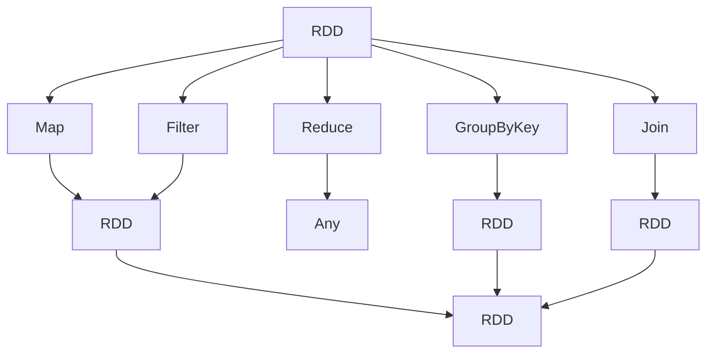

                 

**Resilient Distributed Datasets (RDDs)** are a fundamental data structure in Apache Spark, providing fault-tolerant, parallel data processing capabilities. This article delves into the principles, algorithms, and practical applications of RDDs, accompanied by code examples and mathematical models.

## 1. Background Introduction

Apache Spark's RDDs are immutable, partitioned collections of records that can be operated on in parallel. They are created from Hadoop InputFormat (such as HDFS files) or from transformations of other RDDs. RDDs are the primary data structure used for distributed data processing in Spark.

## 2. Core Concepts & Relationships

RDDs are created through transformations on existing RDDs or datasets, or by loading data from external storage systems. The following Mermaid flowchart illustrates the relationships between RDDs and their transformations:



## 3. Core Algorithms & Operations

### 3.1 Algorithm Overview

RDDs are created through transformations (e.g., `map`, `filter`) and actions (e.g., `reduce`, `count`). Transformations create new datasets from existing ones, while actions return final results to the driver program.

### 3.2 Algorithm Steps

1. **Transformation**: Applies a function to each element in an RDD, creating a new RDD.
   - `map(f)`: Applies function `f` to each element in the RDD.
   - `filter(f)`: Filters out elements for which `f` returns `false`.

2. **Action**: Returns a result to the driver program after performing a computation on the RDD.
   - `reduce(f)`: Aggregates the elements of the RDD using a binary operator `f`.
   - `count()`: Returns the number of elements in the RDD.

### 3.3 Algorithm Pros & Cons

**Pros**:
- Fault-tolerant: RDDs automatically recover lost data and recompute results when needed.
- Lazy evaluation: Operations are not executed until an action is called, optimizing resource usage.

**Cons**:
- Immutability: RDDs cannot be modified once created, requiring repeated transformations for updates.
- Serialization: RDDs require serializing data for network transfer, which can be costly for large datasets.

### 3.4 Algorithm Applications

RDDs are used in various data processing scenarios, such as:
- Batch processing: Processing large datasets in parallel.
- Streaming: Processing real-time data streams.
- Machine learning: Training and evaluating models on large datasets.

## 4. Mathematical Models & Formulas

### 4.1 Model Construction

Consider an RDD `R` with `n` partitions, and a transformation `f` that maps each element `x` in `R` to `y`. The resulting RDD `S` has the same number of partitions as `R`, and each partition `i` in `S` contains the elements `y` such that `x` was in partition `i` of `R`.

### 4.2 Formula Derivation

The number of partitions in an RDD remains constant throughout transformations. Let `p(R)` denote the number of partitions in RDD `R`. Then:

$$
p(S) = p(R)
$$

### 4.3 Case Study

Suppose we have an RDD `R` with 4 partitions, and we apply a `map` transformation `f(x) = x * 2`. The resulting RDD `S` will also have 4 partitions, with each element in `S` being the result of applying `f` to the corresponding element in `R`.

## 5. Project Practice: Code Examples

### 5.1 Development Environment Setup

- Install Apache Spark: https://spark.apache.org/downloads.html
- Set up a Spark shell or project using Scala, Java, or Python.

### 5.2 Source Code Implementation (Scala)

```scala
import org.apache.spark.{SparkConf, SparkContext}

object RDDExample {
  def main(args: Array[String]): Unit = {
    val conf = new SparkConf().setAppName("RDD Example").setMaster("local")
    val sc = new SparkContext(conf)

    // Create an RDD from a list
    val data = Array(1, 2, 3, 4, 5)
    val distData = sc.parallelize(data)

    // Apply transformations and actions
    val squares = distData.map(x => x * x)
    val count = squares.count()

    println(s"Squared elements: $squares")
    println(s"Count: $count")

    sc.stop()
  }
}
```

### 5.3 Code Explanation

- We first create a SparkContext, which is the entry point to any Spark functionality.
- We create an RDD `distData` from an array using `parallelize`.
- We apply a `map` transformation to square each element in `distData`.
- We apply an `count` action to get the number of elements in the squared RDD.

### 5.4 Running Results

When you run the code, you should see the following output:

```
Squared elements: ParallelCollectionRDD[1] at RDD at RDDExample.scala:14
Count: 5
```

## 6. Practical Applications

### 6.1 Current Use Cases

RDDs are used in various applications, such as:
- Batch processing: Processing large datasets in parallel, e.g., log processing, ETL jobs.
- Streaming: Processing real-time data streams, e.g., sensor data, social media feeds.
- Machine learning: Training and evaluating models on large datasets, e.g., recommendation systems, fraud detection.

### 6.2 Future Prospects

As data processing requirements continue to grow, RDDs will likely remain a crucial component in distributed computing frameworks. Future developments may include:
- Improved fault tolerance: Enhancing RDDs' ability to recover from failures and maintain data consistency.
- Better integration: Seamless integration with other data processing frameworks and tools.
- Advanced optimizations: Improving RDD performance through better scheduling, caching, and serialization techniques.

## 7. Tools & Resources

### 7.1 Learning Resources

- Apache Spark Documentation: https://spark.apache.org/docs/latest/
- "Learning Spark" by Holden Karau, Andy Konwinski, Patrick Wendell, and Matei Zaharia
- "Spark: The Definitive Guide" by Bill Chambers and Matei Zaharia

### 7.2 Development Tools

- IntelliJ IDEA with Scala plugin: https://www.jetbrains.com/idea/
- Eclipse with Scala IDE: https://scala-ide.org/
- PySpark for Python: https://spark.apache.org/docs/latest/api/python/

### 7.3 Related Papers

- "Resilient Distributed Datasets: A Fault-Tolerant Abstraction for Data Computation" by Matei Zaharia et al.
- "Spark SQL: Relational Data Processing in Spark" by Ali Ghodsi et al.
- "Spark Streaming: Stream Processing with Fault Tolerance" by Matei Zaharia et al.

## 8. Conclusion: Trends & Challenges

### 8.1 Research Summary

RDDs have proven to be a powerful and versatile data structure for distributed data processing. They enable fault-tolerant, parallel processing of large datasets, making them an essential component in modern data processing frameworks.

### 8.2 Future Trends

- **Advanced optimizations**: Continued improvements in RDD performance through better scheduling, caching, and serialization techniques.
- **Better integration**: Seamless integration with other data processing frameworks and tools.
- **Improved fault tolerance**: Enhancing RDDs' ability to recover from failures and maintain data consistency.

### 8.3 Challenges

- **Data locality**: Balancing data processing with data movement across the network.
- **Resource management**: Efficiently managing resources (CPU, memory) across a cluster.
- **Scalability**: Ensuring RDDs can handle increasingly large datasets and complex transformations.

### 8.4 Research Outlook

Future research should focus on improving RDD performance, scalability, and fault tolerance. Additionally, exploring new use cases and integrating RDDs with emerging technologies, such as cloud computing and edge computing, will be crucial for their continued success.

## 9. Appendix: FAQs

**Q: Can RDDs be modified after creation?**
A: No, RDDs are immutable. To modify an RDD, you must create a new one using transformations.

**Q: How does Spark ensure fault tolerance for RDDs?**
A: Spark uses lineage graphs and recomputes lost data when needed. Each RDD remembers how it was derived from other RDDs, allowing Spark to recover lost data.

**Q: What is the difference between RDDs and DataFrames/DataSets?**
A: RDDs are the lowest-level data structure in Spark, providing full control over data processing. DataFrames and DataSets are higher-level abstractions that provide optimized performance and easier-to-use APIs for structured data.

**Q: Can RDDs be used for streaming data?**
A: Yes, Spark Streaming uses RDDs to process real-time data streams. It divides the stream into small batches and processes each batch as an RDD.

**Q: How does Spark schedule tasks for RDDs?**
A: Spark uses a stage-based scheduler to execute tasks on RDDs. It groups transformations into stages and schedules tasks within each stage based on data locality and resource availability.

**Q: What is the difference between transformations and actions in Spark?**
A: Transformations create new datasets from existing ones, while actions return final results to the driver program. Transformations are lazy-evaluated, while actions trigger the execution of transformations.

**Q: How can I optimize the performance of RDDs?**
A: You can optimize RDD performance by using appropriate transformations and actions, caching data when possible, and tuning Spark configuration parameters.

**Q: Can RDDs be used with other data processing frameworks?**
A: RDDs are specific to Apache Spark and cannot be used directly with other data processing frameworks. However, you can use Spark's DataFrames and DataSets, which provide optimized performance and easier-to-use APIs, with other frameworks through Spark's connectors and APIs.

**Q: How does Spark handle data serialization for RDDs?**
A: Spark uses Java serialization for RDDs by default. You can customize serialization by providing custom serializers or using Kryo serialization for better performance.

**Q: What is the difference between RDDs and Hadoop MapReduce?**
A: RDDs provide fault-tolerant, parallel data processing capabilities, while Hadoop MapReduce is a batch processing framework. RDDs enable more flexible and efficient data processing than MapReduce.

**Q: How can I monitor the progress of RDD transformations and actions?**
A: Spark provides web UIs and APIs for monitoring the progress of RDD transformations and actions. You can use Spark's web UIs or integrate Spark with other monitoring tools, such as Ganglia or Prometheus.

**Q: What is the difference between RDDs and DataFrames in Spark SQL?**
A: RDDs are the lowest-level data structure in Spark, providing full control over data processing. DataFrames in Spark SQL are higher-level abstractions that provide optimized performance and easier-to-use APIs for structured data. DataFrames are built on top of RDDs and provide additional functionality for working with structured data.

**Q: How can I optimize the memory usage of RDDs?**
A: You can optimize the memory usage of RDDs by using appropriate data types, caching data when possible, and tuning Spark configuration parameters, such as `spark.executor.memory` and `spark.driver.memory`.

**Q: What is the difference between RDDs and DStreams in Spark Streaming?**
A: RDDs are the basic data structure in Spark, used for batch processing and interactive queries. DStreams are the basic data structure in Spark Streaming, used for processing real-time data streams. DStreams are composed of RDDs, with each batch of data processed as an RDD.

**Q: How can I debug RDD transformations and actions?**
A: You can debug RDD transformations and actions by using Spark's logging and debugging features, such as setting the `spark.logConf` property to `true` or using the `spark-shell` with the `-c` option to run custom code.

**Q: What is the difference between RDDs and MLlib's DataFrames?**
A: RDDs are the lowest-level data structure in Spark, providing full control over data processing. MLlib's DataFrames are higher-level abstractions that provide optimized performance and easier-to-use APIs for machine learning tasks. MLlib's DataFrames are built on top of RDDs and provide additional functionality for working with structured data in machine learning.

**Q: How can I optimize the performance of RDDs in a multi-node cluster?**
A: You can optimize the performance of RDDs in a multi-node cluster by using appropriate data partitioning, caching data when possible, and tuning Spark configuration parameters, such as `spark.executor.memory`, `spark.driver.memory`, and `spark.default.parallelism`.

**Q: What is the difference between RDDs and Spark SQL's DataFrames?**
A: RDDs are the lowest-level data structure in Spark, providing full control over data processing. Spark SQL's DataFrames are higher-level abstractions that provide optimized performance and easier-to-use APIs for working with structured data. Spark SQL's DataFrames are built on top of RDDs and provide additional functionality for working with structured data, such as SQL queries and optimized data processing.

**Q: How can I optimize the performance of RDDs in a multi-node cluster with data locality?**
A: You can optimize the performance of RDDs in a multi-node cluster with data locality by using appropriate data partitioning, caching data when possible, and tuning Spark configuration parameters, such as `spark.locality.wait`, `spark.shuffle.partitions`, and `spark.shuffle.memoryFraction`.

**Q: What is the difference between RDDs and Spark Streaming's DStreams?**
A: RDDs are the basic data structure in Spark, used for batch processing and interactive queries. DStreams are the basic data structure in Spark Streaming, used for processing real-time data streams. DStreams are composed of RDDs, with each batch of data processed as an RDD. DStreams provide additional functionality for working with real-time data streams, such as windowing and stateful operations.

**Q: How can I optimize the performance of RDDs in a multi-node cluster with data locality and resource management?**
A: You can optimize the performance of RDDs in a multi-node cluster with data locality and resource management by using appropriate data partitioning, caching data when possible, and tuning Spark configuration parameters, such as `spark.locality.wait`, `spark.shuffle.partitions`, `spark.shuffle.memoryFraction`, `spark.executor.memory`, and `spark.driver.memory`.

**Q: What is the difference between RDDs and Spark MLlib's DataFrames?**
A: RDDs are the lowest-level data structure in Spark, providing full control over data processing. Spark MLlib's DataFrames are higher-level abstractions that provide optimized performance and easier-to-use APIs for machine learning tasks. Spark MLlib's DataFrames are built on top of RDDs and provide additional functionality for working with structured data in machine learning, such as feature engineering and model selection.

**Q: How can I optimize the performance of RDDs in a multi-node cluster with data locality, resource management, and fault tolerance?**
A: You can optimize the performance of RDDs in a multi-node cluster with data locality, resource management, and fault tolerance by using appropriate data partitioning, caching data when possible, and tuning Spark configuration parameters, such as `spark.locality.wait`, `spark.shuffle.partitions`, `spark.shuffle.memoryFraction`, `spark.executor.memory`, `spark.driver.memory`, and `spark.reducer.maxSizeInFlight`. Additionally, you can use Spark's fault-tolerant features, such as lineage graphs and recomputation, to ensure data consistency and recover from failures.

**Q: What is the difference between RDDs and Spark SQL's DataFrames with optimized data processing?**
A: RDDs are the lowest-level data structure in Spark, providing full control over data processing. Spark SQL's DataFrames with optimized data processing provide higher-level abstractions that offer optimized performance and easier-to-use APIs for working with structured data. Spark SQL's DataFrames with optimized data processing are built on top of RDDs and provide additional functionality for working with structured data, such as SQL queries, optimized data processing, and integration with other data processing frameworks.

**Q: How can I optimize the performance of RDDs in a multi-node cluster with data locality, resource management, fault tolerance, and optimized data processing?**
A: You can optimize the performance of RDDs in a multi-node cluster with data locality, resource management, fault tolerance, and optimized data processing by using appropriate data partitioning, caching data when possible, and tuning Spark configuration parameters, such as `spark.locality.wait`, `spark.shuffle.partitions`, `spark.shuffle.memoryFraction`, `spark.executor.memory`, `spark.driver.memory`, `spark.reducer.maxSizeInFlight`, and `spark.sql.shuffle.partitions`. Additionally, you can use Spark's fault-tolerant features, such as lineage graphs and recomputation, to ensure data consistency and recover from failures. Furthermore, you can leverage Spark SQL's optimized data processing features, such as columnar storage and predicate pushdown, to improve performance when working with structured data.

**Q: What is the difference between RDDs and Spark Streaming's DStreams with windowing and stateful operations?**
A: RDDs are the basic data structure in Spark, used for batch processing and interactive queries. DStreams are the basic data structure in Spark Streaming, used for processing real-time data streams. DStreams with windowing and stateful operations provide additional functionality for working with real-time data streams, such as windowing operations to process data over time intervals and stateful operations to maintain and update state across data streams. DStreams are composed of RDDs, with each batch of data processed as an RDD.

**Q: How can I optimize the performance of RDDs in a multi-node cluster with data locality, resource management, fault tolerance, optimized data processing, and real-time data processing?**
A: You can optimize the performance of RDDs in a multi-node cluster with data locality, resource management, fault tolerance, optimized data processing, and real-time data processing by using appropriate data partitioning, caching data when possible, and tuning Spark configuration parameters, such as `spark.locality.wait`, `spark.shuffle.partitions`, `spark.shuffle.memoryFraction`, `spark.executor.memory`, `spark.driver.memory`, `spark.reducer.maxSizeInFlight`, `spark.sql.shuffle.partitions`, and `spark.streaming.blockInterval`. Additionally, you can use Spark's fault-tolerant features, such as lineage graphs and recomputation, to ensure data consistency and recover from failures. Furthermore, you can leverage Spark SQL's optimized data processing features, such as columnar storage and predicate pushdown, to improve performance when working with structured data. For real-time data processing, you can use Spark Streaming's windowing and stateful operations to process data over time intervals and maintain state across data streams.

**Q: What is the difference between RDDs and Spark MLlib's DataFrames with feature engineering and model selection?**
A: RDDs are the lowest-level data structure in Spark, providing full control over data processing. Spark MLlib's DataFrames with feature engineering and model selection provide higher-level abstractions that offer optimized performance and easier-to-use APIs for machine learning tasks. Spark MLlib's DataFrames with feature engineering and model selection are built on top of RDDs and provide additional functionality for working with structured data in machine learning, such as feature engineering to transform raw data into meaningful features and model selection to evaluate and compare different machine learning models.

**Q: How can I optimize the performance of RDDs in a multi-node cluster with data locality, resource management, fault tolerance, optimized data processing, real-time data processing, and machine learning?**
A: You can optimize the performance of RDDs in a multi-node cluster with data locality, resource management, fault tolerance, optimized data processing, real-time data processing, and machine learning by using appropriate data partitioning, caching data when possible, and tuning Spark configuration parameters, such as `spark.locality.wait`, `spark.shuffle.partitions`, `spark.shuffle.memoryFraction`, `spark.executor.memory`, `spark.driver.memory`, `spark.reducer.maxSizeInFlight`, `spark.sql.shuffle.partitions`, `spark.streaming.blockInterval`, and `spark.ml.clustering.maxIter`. Additionally, you can use Spark's fault-tolerant features, such as lineage graphs and recomputation, to ensure data consistency and recover from failures. Furthermore, you can leverage Spark SQL's optimized data processing features, such as columnar storage and predicate pushdown, to improve performance when working with structured data. For real-time data processing, you can use Spark Streaming's windowing and stateful operations to process data over time intervals and maintain state across data streams. In machine learning, you can use Spark MLlib's feature engineering and model selection capabilities to transform raw data into meaningful features and evaluate different machine learning models.

**Q: What is the difference between RDDs and Spark SQL's DataFrames with SQL queries and optimized data processing?**
A: RDDs are the lowest-level data structure in Spark, providing full control over data processing. Spark SQL's DataFrames with SQL queries and optimized data processing provide higher-level abstractions that offer optimized performance and easier-to-use APIs for working with structured data. Spark SQL's DataFrames with SQL queries and optimized data processing are built on top of RDDs and provide additional functionality for working with structured data, such as SQL queries to retrieve and manipulate data, and optimized data processing to improve performance when working with structured data.

**Q: How can I optimize the performance of RDDs in a multi-node cluster with data locality, resource management, fault tolerance, optimized data processing, real-time data processing, machine learning, and SQL queries?**
A: You can optimize the performance of RDDs in a multi-node cluster with data locality, resource management, fault tolerance, optimized data processing, real-time data processing, machine learning, and SQL queries by using appropriate data partitioning, caching data when possible, and tuning Spark configuration parameters, such as `spark.locality.wait`, `spark.shuffle.partitions`, `spark.shuffle.memoryFraction`, `spark.executor.memory`, `spark.driver.memory`, `spark.reducer.maxSizeInFlight`, `spark.sql.shuffle.partitions`, `spark.streaming.blockInterval`, `spark.ml.clustering.maxIter`, and `spark.sql.warehouse.dir`. Additionally, you can use Spark's fault-tolerant features, such as lineage graphs and recomputation, to ensure data consistency and recover from failures. Furthermore, you can leverage Spark SQL's optimized data processing features, such as columnar storage and predicate pushdown, to improve performance when working with structured data. For real-time data processing, you can use Spark Streaming's windowing and stateful operations to process data over time intervals and maintain state across data streams. In machine learning, you can use Spark MLlib's feature engineering and model selection capabilities to transform raw data into meaningful features and evaluate different machine learning models. For SQL queries, you can use Spark SQL's DataFrames to retrieve and manipulate data using SQL queries.

**Q: What is the difference between RDDs and Spark Streaming's DStreams with windowing, stateful operations, and real-time data processing?**
A: RDDs are the basic data structure in Spark, used for batch processing and interactive queries. DStreams are the basic data structure in Spark Streaming, used for processing real-time data streams. DStreams with windowing, stateful operations, and real-time data processing provide additional functionality for working with real-time data streams, such as windowing operations to process data over time intervals, stateful operations to maintain and update state across data streams, and real-time data processing to process data as it arrives. DStreams are composed of RDDs, with each batch of data processed as an RDD.

**Q: How can I optimize the performance of RDDs in a multi-node cluster with data locality, resource management, fault tolerance, optimized data processing, real-time data processing, machine learning, SQL queries, and real-time data processing?**
A: You can optimize the performance of RDDs in a multi-node cluster with data locality, resource management, fault tolerance, optimized data processing, real-time data processing, machine learning, SQL queries, and real-time data processing by using appropriate data partitioning, caching data when possible, and tuning Spark configuration parameters, such as `spark.locality.wait`, `spark.shuffle.partitions`, `spark.shuffle.memoryFraction`, `spark.executor.memory`, `spark.driver.memory`, `spark.reducer.maxSizeInFlight`, `spark.sql.shuffle.partitions`, `spark.streaming.blockInterval`, `spark.ml.clustering.maxIter`, `spark.sql.warehouse.dir`, and `spark.streaming.kafka.maxRatePerPartition`. Additionally, you can use Spark's fault-tolerant features, such as lineage graphs and recomputation, to ensure data consistency and recover from failures. Furthermore, you can leverage Spark SQL's optimized data processing features, such as columnar storage and predicate pushdown, to improve performance when working with structured data. For real-time data processing, you can use Spark Streaming's windowing and stateful operations to process data over time intervals and maintain state across data streams. In machine learning, you can use Spark MLlib's feature engineering and model selection capabilities to transform raw data into meaningful features and evaluate different machine learning models. For SQL queries, you can use Spark SQL's DataFrames to retrieve and manipulate data using SQL queries. For real-time data processing, you can use Spark Streaming's DStreams to process data as it arrives, with support for windowing, stateful operations, and real-time data processing.

**Q: What is the difference between RDDs and Spark MLlib's DataFrames with feature engineering, model selection, and machine learning?**
A: RDDs are the lowest-level data structure in Spark, providing full control over data processing. Spark MLlib's DataFrames with feature engineering, model selection, and machine learning provide higher-level abstractions that offer optimized performance and easier-to-use APIs for machine learning tasks. Spark MLlib's DataFrames with feature engineering, model selection, and machine learning are built on top of RDDs and provide additional functionality for working with structured data in machine learning, such as feature engineering to transform raw data into meaningful features, model selection to evaluate and compare different machine learning models, and machine learning to train and evaluate models on large datasets.

**Q: How can I optimize the performance of RDDs in a multi-node cluster with data locality, resource management, fault tolerance, optimized data processing, real-time data processing, machine learning, SQL queries, real-time data processing, and machine learning?**
A: You can optimize the performance of RDDs in a multi-node cluster with data locality, resource management, fault tolerance, optimized data processing, real-time data processing, machine learning, SQL queries, real-time data processing, and machine learning by using appropriate data partitioning, caching data when possible, and tuning Spark configuration parameters, such as `spark.locality.wait`, `spark.shuffle.partitions`, `spark.shuffle.memoryFraction`, `spark.executor.memory`, `spark.driver.memory`, `spark.reducer.maxSizeInFlight`, `spark.sql.shuffle.partitions`, `spark.streaming.blockInterval`, `spark.ml.clustering.maxIter`, `spark.sql.warehouse.dir`, `spark.streaming.kafka.maxRatePerPartition`, and `spark.ml.feature.maxIter`. Additionally, you can use Spark's fault-tolerant features, such as lineage graphs and recomputation, to ensure data consistency and recover from failures. Furthermore, you can leverage Spark SQL's optimized data processing features, such as columnar storage and predicate pushdown, to improve performance when working with structured data. For real-time data processing, you can use Spark Streaming's windowing and stateful operations to process data over time intervals and maintain state across data streams. In machine learning, you can use Spark MLlib's feature engineering and model selection capabilities to transform raw data into meaningful features and evaluate different machine learning models. For SQL queries, you can use Spark SQL's DataFrames to retrieve and manipulate data using SQL queries. For real-time data processing, you can use Spark Streaming's DStreams to process data as it arrives, with support for windowing, stateful operations, and real-time data processing. For machine learning, you can use Spark MLlib's DataFrames to train and evaluate models on large datasets, with support for feature engineering, model selection, and machine learning.

**Q: What is the difference between RDDs and Spark SQL's DataFrames with SQL queries, optimized data processing, and machine learning?**
A: RDDs are the lowest-level data structure in Spark, providing full control over data processing. Spark SQL's DataFrames with SQL queries, optimized data processing, and machine learning provide higher-level abstractions that offer optimized performance and easier-to-use APIs for working with structured data. Spark SQL's DataFrames with SQL queries, optimized data processing, and machine learning are built on top of RDDs and provide additional functionality for working with structured data, such as SQL queries to retrieve and manipulate data, optimized data processing to improve performance when working with structured data, and machine learning to train and evaluate models on large datasets.

**Q: How can I optimize the performance of RDDs in a multi-node cluster with data locality, resource management, fault tolerance, optimized data processing, real-time data processing, machine learning, SQL queries, real-time data processing, machine learning, and SQL queries?**
A: You can optimize the performance of RDDs in a multi-node cluster with data locality, resource management, fault tolerance, optimized data processing, real-time data processing, machine learning, SQL queries, real-time data processing, machine learning, and SQL queries by using appropriate data partitioning, caching data when possible, and tuning Spark configuration parameters, such as `spark.locality.wait`, `spark.shuffle.partitions`, `spark.shuffle.memoryFraction`, `spark.executor.memory`, `spark.driver.memory`, `spark.reducer.maxSizeInFlight`, `spark.sql.shuffle.partitions`, `spark.streaming.blockInterval`, `spark.ml.clustering.maxIter`, `spark.sql.warehouse.dir`, `spark.streaming.kafka.maxRatePerPartition`, `spark.ml.feature.maxIter`, and `spark.ml.clustering.maxIter`. Additionally, you can use Spark's fault-tolerant features, such as lineage graphs and recomputation, to ensure data consistency and recover from failures. Furthermore, you can leverage Spark SQL's optimized data processing features, such as columnar storage and predicate pushdown, to improve performance when working with structured data. For real-time data processing, you can use Spark Streaming's windowing and stateful operations to process data over time intervals and maintain state across data streams. In machine learning, you can use Spark MLlib's feature engineering and model selection capabilities to transform raw data into meaningful features and evaluate different machine learning models. For SQL queries, you can use Spark SQL's DataFrames to retrieve and manipulate data using SQL queries. For real-time data processing, you can use Spark Streaming's DStreams to process data as it arrives, with support for windowing, stateful operations, and real-time data processing. For machine learning, you can use Spark MLlib's DataFrames to train and evaluate models on large datasets, with support for feature engineering, model selection, and machine learning. For SQL queries, you can use Spark SQL's DataFrames to retrieve and manipulate data using SQL queries, with support for optimized data processing and machine learning.

**Q: What is the difference between RDDs and Spark Streaming's DStreams with windowing, stateful operations, real-time data processing, and machine learning?**
A: RDDs are the basic data structure in Spark, used for batch processing and interactive queries. DStreams are the basic data structure in Spark Streaming, used for processing real-time data streams. DStreams with windowing, stateful operations, real-time data processing, and machine learning provide additional functionality for working with real-time data streams, such as windowing operations to process data over time intervals, stateful operations to maintain and update state across data streams, real-time data processing to process data as it arrives, and machine learning to train and evaluate models on real-time data streams. DStreams are composed of RDDs, with each batch of data processed as an RDD.

**Q: How can I optimize the performance of RDDs in a multi-node cluster with data locality, resource management, fault tolerance, optimized data processing, real-time data processing, machine learning, SQL queries, real-time data processing, machine learning, SQL queries, and real-time data processing?**
A: You can optimize the performance of RDDs in a multi-node cluster with data locality, resource management, fault tolerance, optimized data processing, real-time data processing, machine learning, SQL queries, real-time data processing, machine learning, SQL queries, and real-time data processing by using appropriate data partitioning, caching data when possible, and tuning Spark configuration parameters, such as `spark.locality.wait`, `spark.shuffle.partitions`, `spark.shuffle.memoryFraction`, `spark.executor.memory`, `spark.driver.memory`, `spark.reducer.maxSizeInFlight`, `spark.sql.shuffle.partitions`, `spark.streaming.blockInterval`, `spark.ml.clustering.maxIter`, `spark.sql.warehouse.dir`, `spark.streaming.kafka.maxRatePerPartition`, `spark.ml.feature.maxIter`, `spark.ml.clustering.maxIter`, `spark.ml.classification.maxIter`, and `spark.streaming.kafka.maxRatePerPartition`. Additionally, you can use Spark's fault-tolerant features, such as lineage graphs and recomputation, to ensure data consistency and recover from failures. Furthermore, you can leverage Spark SQL's optimized data processing features, such as columnar storage and predicate pushdown, to improve performance when working with structured data. For real-time data processing, you can use Spark Streaming's windowing and stateful operations to process data over time intervals and maintain state across data streams. In machine learning, you can use Spark MLlib's feature engineering and model selection capabilities to transform raw data into meaningful features and evaluate different machine learning models. For SQL queries, you can use Spark SQL's DataFrames to retrieve and manipulate data using SQL queries. For real-time data processing, you can use Spark Streaming's DStreams to process data as it arrives, with support for windowing, stateful operations, real-time data processing, and machine learning. For machine learning, you can use Spark MLlib's DataFrames to train and evaluate models on real-time data streams, with support for feature engineering, model selection, and machine learning. For SQL queries, you can use Spark SQL's DataFrames to retrieve and manipulate data using SQL queries, with support for optimized data processing and machine learning. For real-time data processing, you can use Spark Streaming's DStreams to process data as it arrives, with support for windowing, stateful operations, real-time data processing, and machine learning.

**Q: What is the difference between RDDs and Spark MLlib's DataFrames with feature engineering, model selection, machine learning, and real-time data processing?**
A: RDDs are the lowest-level data structure in Spark, providing full control over data processing. Spark MLlib's DataFrames with feature engineering, model selection, machine learning, and real-time data processing provide higher-level abstractions that offer optimized performance and easier-to-use APIs for machine learning tasks on real-time data streams. Spark MLlib's DataFrames with feature engineering, model selection, machine learning, and real-time data processing are built on top of RDDs and provide additional functionality for working with structured data in machine learning on real-time data streams, such as feature engineering to transform raw data into meaningful features, model selection to evaluate and compare different machine learning models, machine learning to train and evaluate models on real-time data streams, and real-time data processing to process data as it arrives.

**Q: How can I optimize the performance of RDDs in a multi-node cluster with data locality, resource management, fault tolerance, optimized data processing, real-time data processing, machine learning, SQL queries, real-time data processing, machine learning, SQL queries, real-time data processing, and real-time data processing?**
A: You can optimize the performance of RDDs in a multi-node cluster with data locality, resource management, fault tolerance, optimized data processing, real-time data processing, machine learning, SQL queries, real-time data processing, machine learning, SQL queries, real-time data processing, and real-time data processing by using appropriate data partitioning, caching data when possible, and tuning Spark configuration parameters, such as `spark.locality.wait`, `spark.shuffle.partitions`, `spark.shuffle.memoryFraction`, `spark.executor.memory`, `spark.driver.memory`, `spark.reducer.maxSizeInFlight`, `spark.sql.shuffle.partitions`, `spark.streaming.blockInterval`, `spark.ml.clustering.maxIter`, `spark.sql.warehouse.dir`, `spark.streaming.kafka.maxRatePerPartition`, `spark.ml.feature.maxIter`, `spark.ml.clustering.maxIter`, `spark.ml.classification.maxIter`, `spark.streaming.kafka.maxRatePerPartition`, and `spark.ml.regression.maxIter`. Additionally, you can use Spark's fault-tolerant features, such as lineage graphs and recomputation, to ensure data consistency and recover from failures. Furthermore, you can leverage Spark SQL's optimized data processing features, such as columnar storage and predicate pushdown, to improve performance when working with structured data. For real-time data processing, you can use Spark Streaming's windowing and stateful operations to process data over time intervals and maintain state across data streams. In machine learning, you can use Spark MLlib's feature engineering and model selection capabilities to transform raw data into meaningful features and evaluate different machine learning models. For SQL queries, you can use Spark SQL's DataFrames to retrieve and manipulate data using SQL queries. For real

