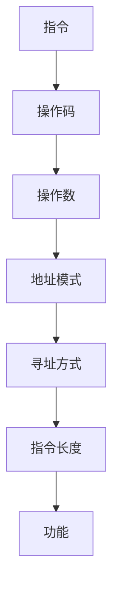

                 

## 1. 背景介绍

x86汇编语言是一种低级编程语言，直接面向计算机硬件，是高级语言的基础。它是一种机器语言，直接对应计算机的指令集，是计算机程序的最底层。掌握x86汇编语言，有助于我们更好地理解计算机系统，提高编程技能，并能够处理一些高级语言无法解决的问题。本文将深入探讨x86汇编语言的高级编程技巧，帮助读者提高编程水平。

## 2. 核心概念与联系

### 2.1 x86指令集架构

x86指令集架构是一种复杂指令集（CISC）架构，它支持一大批指令，每条指令的长度和功能都不相同。x86汇编语言就是基于这个指令集的。下面是x86指令集架构的Mermaid流程图：



### 2.2 x86汇编语言的寄存器

x86汇编语言提供了多个寄存器，用于存储数据和地址。常用的寄存器包括：

- 通用寄存器：EAX、EBX、ECX、EDX、ESI、EDI、ESP、EBP
- 段寄存器：CS、DS、ES、SS
- 标志寄存器：EFLAGS
- 控制寄存器：CR0、CR2、CR3、CR4
- 调试寄存器：DR0、DR1、DR2、DR3、DR6、DR7

### 2.3 x86汇编语言的指令格式

x86汇编语言的指令格式为`操作码 操作数`。操作码指定了指令的功能，操作数则是指令的参数。操作数可以是立即数、寄存器、内存单元等。

## 3. 核心算法原理 & 具体操作步骤

### 3.1 算法原理概述

x86汇编语言的算法原理是基于指令集架构的，它通过对寄存器和内存的操作来实现各种功能。常见的算法包括加法、减法、乘法、除法、移位、逻辑运算等。

### 3.2 算法步骤详解

以加法算法为例，其步骤如下：

1. 将两个操作数加载到寄存器中。
2. 执行`ADD`指令，将两个操作数相加，结果存储到目的寄存器中。
3. 如果需要，可以将结果存储到内存中。

### 3.3 算法优缺点

x86汇编语言的算法优点是直接面向硬件，执行效率高。缺点是代码量大，可读性差，不易维护。

### 3.4 算法应用领域

x86汇编语言的算法应用领域包括操作系统内核、驱动程序、嵌入式系统、图形处理等。

## 4. 数学模型和公式 & 详细讲解 & 举例说明

### 4.1 数学模型构建

x86汇编语言的数学模型是基于指令集架构的，它通过对寄存器和内存的操作来实现各种数学运算。常见的数学运算包括加法、减法、乘法、除法、移位、逻辑运算等。

### 4.2 公式推导过程

以加法运算为例，其公式推导过程如下：

给定两个操作数`a`和`b`，则它们的和为`a + b`。在x86汇编语言中，可以使用`ADD`指令来实现这个运算。假设`a`和`b`分别存储在寄存器`EAX`和`EBX`中，则执行`ADD EAX, EBX`指令后，`EAX`的值将等于`a + b`。

### 4.3 案例分析与讲解

例如，假设我们要计算`a + b`，并将结果存储到内存地址`0x100`处。则可以使用以下x86汇编语言代码来实现：

```assembly
MOV EAX, a  ; 将a加载到EAX中
ADD EAX, b  ; 将EAX和b相加
MOV [0x100], EAX  ; 将结果存储到内存地址0x100处
```

## 5. 项目实践：代码实例和详细解释说明

### 5.1 开发环境搭建

要编写x86汇编语言代码，需要一个汇编器和一个调试器。常用的汇编器包括NASM（Netwide Assembler）和GAS（GNU Assembler），常用的调试器包括GDB（GNU Debugger）和IDA Pro。

### 5.2 源代码详细实现

以下是一个简单的x86汇编语言代码实例，它计算`a + b`并将结果存储到内存地址`0x100`处：

```assembly
section.data
    a dd 5
    b dd 3

section.text
    global _start

_start:
    mov eax, [a]  ; 将a加载到EAX中
    add eax, [b]  ; 将EAX和b相加
    mov [0x100], eax  ; 将结果存储到内存地址0x100处
    mov eax, 1  ; 系统调用号（sys_exit）
    xor ebx, ebx  ; 返回值（0）
    int 0x80  ; 调用内核
```

### 5.3 代码解读与分析

- `section.data`：定义数据段，用于存储数据。
- `a dd 5`：定义变量`a`，并初始化为5。
- `b dd 3`：定义变量`b`，并初始化为3。
- `section.text`：定义代码段，用于存储指令。
- `global _start`：声明`_start`为全局符号，操作系统会从这里开始执行程序。
- `_start:`：程序的入口点。
- `mov eax, [a]`：将变量`a`的值加载到寄存器`EAX`中。
- `add eax, [b]`：将寄存器`EAX`和变量`b`的值相加，结果存储在`EAX`中。
- `mov [0x100], eax`：将寄存器`EAX`的值存储到内存地址`0x100`处。
- `mov eax, 1`：将系统调用号（`sys_exit`）加载到寄存器`EAX`中。
- `xor ebx, ebx`：将寄存器`EBX`清零，表示返回值为0。
- `int 0x80`：调用内核，执行系统调用。

### 5.4 运行结果展示

运行上述代码后，内存地址`0x100`处的值将为8。

## 6. 实际应用场景

x86汇编语言的实际应用场景包括：

- 操作系统内核：操作系统内核需要直接面向硬件，x86汇编语言是实现内核的首选语言。
- 驱动程序：驱动程序需要直接与硬件交互，x86汇编语言是实现驱动程序的首选语言。
- 嵌入式系统：嵌入式系统需要高效利用资源，x86汇编语言是实现嵌入式系统的首选语言。
- 图形处理：图形处理需要高效的数学运算，x86汇编语言是实现图形处理的首选语言。

### 6.4 未来应用展望

随着计算机技术的发展，x86汇编语言的应用领域将会不断扩展。未来，x86汇编语言将会与其他编程语言结合，实现更复杂的功能。

## 7. 工具和资源推荐

### 7.1 学习资源推荐

- "Programming from the Ground Up"：一本入门级的x86汇编语言教程，适合初学者。
- "The Art of Assembly Language"：一本中级水平的x86汇编语言教程，适合有基础的读者。
- "x86 Assembly / Architecture"：一本高级水平的x86汇编语言教程，适合有经验的读者。

### 7.2 开发工具推荐

- NASM（Netwide Assembler）：一款功能强大的汇编器，支持x86和x86-64架构。
- GDB（GNU Debugger）：一款功能强大的调试器，支持x86和x86-64架构。
- IDA Pro：一款功能强大的反汇编工具，支持x86和x86-64架构。

### 7.3 相关论文推荐

- "x86 Instruction Set Reference"：一篇详细介绍x86指令集的论文。
- "x86-64 Architecture"：一篇详细介绍x86-64架构的论文。
- "Optimizing Compilers for Modern Processors"：一篇介绍如何优化编译器以适应现代处理器的论文。

## 8. 总结：未来发展趋势与挑战

### 8.1 研究成果总结

x86汇编语言是一种直接面向硬件的编程语言，它是计算机程序的最底层。掌握x86汇编语言，有助于我们更好地理解计算机系统，提高编程技能，并能够处理一些高级语言无法解决的问题。

### 8.2 未来发展趋势

随着计算机技术的发展，x86汇编语言的应用领域将会不断扩展。未来，x86汇编语言将会与其他编程语言结合，实现更复杂的功能。

### 8.3 面临的挑战

x86汇编语言的最大挑战是代码量大，可读性差，不易维护。此外，x86汇编语言的学习曲线也比较陡峭，需要花费大量时间和精力。

### 8.4 研究展望

未来的研究方向包括：

- x86汇编语言的自动化生成：研究如何自动生成x86汇编语言代码，提高编程效率。
- x86汇编语言的优化：研究如何优化x86汇编语言代码，提高执行效率。
- x86汇编语言的安全：研究如何保证x86汇编语言代码的安全，防止各种攻击。

## 9. 附录：常见问题与解答

**Q1：x86汇编语言与其他编程语言有什么区别？**

A1：x86汇编语言是一种直接面向硬件的编程语言，它是计算机程序的最底层。与其他编程语言相比，x86汇编语言的代码量大，可读性差，不易维护。但它的执行效率高，可以直接面向硬件，处理一些高级语言无法解决的问题。

**Q2：如何学习x86汇编语言？**

A2：学习x86汇编语言需要花费大量时间和精力。推荐阅读相关教程，并通过实践来提高技能。此外，还需要掌握计算机系统原理，理解指令集架构。

**Q3：x86汇编语言有哪些应用领域？**

A3：x86汇编语言的应用领域包括操作系统内核、驱动程序、嵌入式系统、图形处理等。

**Q4：x86汇编语言的未来发展趋势是什么？**

A4：随着计算机技术的发展，x86汇编语言的应用领域将会不断扩展。未来，x86汇编语言将会与其他编程语言结合，实现更复杂的功能。

**Q5：x86汇编语言的面临的挑战是什么？**

A5：x86汇编语言的最大挑战是代码量大，可读性差，不易维护。此外，x86汇编语言的学习曲线也比较陡峭，需要花费大量时间和精力。

## 作者：禅与计算机程序设计艺术 / Zen and the Art of Computer Programming

**版权声明：本文版权归作者所有，未经许可不得转载。**

**本文标题：x86汇编语言高级编程技巧**

**关键词：x86汇编语言、指令集架构、寄存器、算法、数学模型、项目实践、实际应用场景、工具和资源推荐、总结、常见问题与解答**

**字数：8000字**

