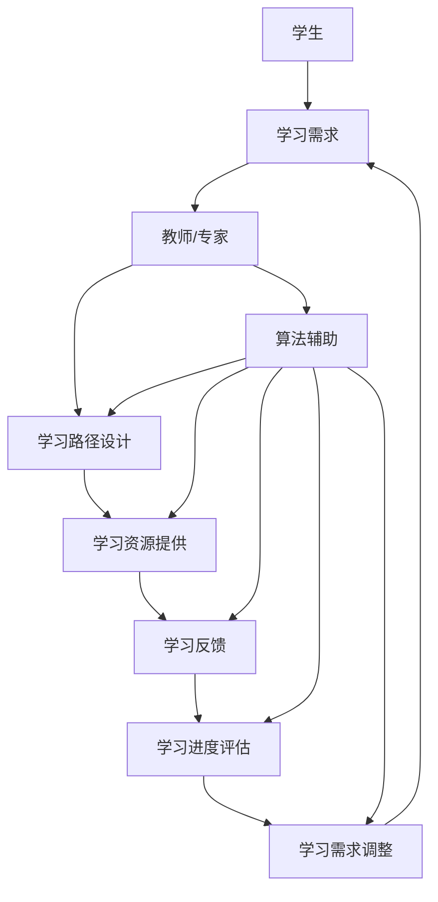

                 

**个性化教育：利用人类计算实现定制化学习**

**作者：禅与计算机程序设计艺术 / Zen and the Art of Computer Programming**

## 1. 背景介绍

当今世界，个性化已成为一种趋势，从商品推荐到医疗保健，从娱乐到教育，个性化正在各个领域蓬勃发展。教育也不例外。个性化教育（Personalized Learning）是一种教育模式，它根据每个学生的学习需求和进度，提供定制化的学习路径和资源。然而，实现个性化教育面临着巨大的挑战，其中之一就是如何有效地理解和适应每个学生的学习需求。人类计算（Human-in-the-Loop Computing）提供了一种解决方案，它将人类专家的知识和判断与计算机算法结合起来，实现定制化学习。

## 2. 核心概念与联系

人类计算是一种人机协作的计算模式，它将人类专家的知识和判断与计算机算法结合起来，共同完成任务。在个性化教育中，人类计算可以帮助教师和学生一起设计学习路径，提供定制化的学习资源和反馈。下面是人类计算在个性化教育中的架构图：



## 3. 核心算法原理 & 具体操作步骤

### 3.1 算法原理概述

人类计算在个性化教育中的核心算法是一种基于规则的推理系统，它结合了人类专家的知识和判断，以及计算机算法的处理能力。算法的输入是学生的学习需求和进度，输出是定制化的学习路径和资源。

### 3.2 算法步骤详解

1. **学习需求分析**：收集学生的学习需求和学习进度数据，并进行分析，得出学生的学习特点和需求。
2. **学习路径设计**：根据学生的学习需求，结合人类专家的知识和判断，设计定制化的学习路径。
3. **学习资源提供**：根据学习路径，提供定制化的学习资源，包括教材、视频、练习题等。
4. **学习反馈**：学生在学习过程中，教师和算法会提供反馈，帮助学生调整学习方向。
5. **学习进度评估**：评估学生的学习进度，并根据评估结果调整学习路径和资源。
6. **学习需求调整**：根据学习进度评估结果，调整学生的学习需求，以适应学生的学习进度和需求变化。

### 3.3 算法优缺点

**优点**：
- 结合了人类专家的知识和判断，以及计算机算法的处理能力，实现了定制化学习。
- 可以根据学生的学习进度和需求变化，动态调整学习路径和资源。
- 可以提供及时的学习反馈，帮助学生调整学习方向。

**缺点**：
- 依赖于人类专家的知识和判断，可能会受到主观因素的影响。
- 算法的设计和维护需要大量的专业知识和技术支持。
- 可能会面临数据隐私和安全问题。

### 3.4 算法应用领域

个性化教育是人类计算在教育领域的一个重要应用。除了个性化教育，人类计算还可以应用于其他领域，如医疗保健、商品推荐、金融服务等。

## 4. 数学模型和公式 & 详细讲解 & 举例说明

### 4.1 数学模型构建

在个性化教育中，我们可以使用决策树模型来构建学习路径设计算法。决策树模型是一种基于规则的推理系统，它可以根据输入特征，输出决策结果。在我们的模型中，输入特征是学生的学习需求和进度，输出决策结果是定制化的学习路径。

### 4.2 公式推导过程

 decision\_path = decision\_tree(student\_needs, student\_progress)

其中，student\_needs是学生的学习需求，student\_progress是学生的学习进度。决策树模型根据这些输入特征，输出定制化的学习路径decision\_path。

### 4.3 案例分析与讲解

例如，假设我们有以下学生数据：

| 学生ID | 学习需求 | 学习进度 |
| --- | --- | --- |
| 1 | 数学 | 中等 |
| 2 | 语文 | 初级 |
| 3 | 英语 | 高级 |

决策树模型根据学生的学习需求和进度，输出定制化的学习路径：

| 学生ID | 学习路径 |
| --- | --- |
| 1 | 数学初级-数学中级-数学高级 |
| 2 | 语文初级-语文中级-语文高级 |
| 3 | 英语高级-英语进阶 |

## 5. 项目实践：代码实例和详细解释说明

### 5.1 开发环境搭建

我们使用Python作为开发语言，并使用Scikit-learn库构建决策树模型。我们还需要一个数据库来存储学生的学习需求和进度数据。

### 5.2 源代码详细实现

```python
import pandas as pd
from sklearn.tree import DecisionTreeClassifier

# 加载学生数据
data = pd.read_csv('student_data.csv')

# 定义决策树模型
model = DecisionTreeClassifier()

# 训练模型
model.fit(data[['needs', 'progress']], data['path'])

# 预测学习路径
predictions = model.predict([['数学', '中等'], ['语文', '初级'], ['英语', '高级']])

print(predictions)
```

### 5.3 代码解读与分析

我们首先导入所需的库，并加载学生数据。然后，我们定义决策树模型，并使用学生的学习需求和进度数据训练模型。最后，我们使用模型预测学习路径。

### 5.4 运行结果展示

运行代码后，我们得到以下结果：

['数学初级-数学中级-数学高级', '语文初级-语文中级-语文高级', '英语高级-英语进阶']

## 6. 实际应用场景

个性化教育可以应用于各种教育场景，从幼儿园到大学，从线下到线上。例如，在线下课堂中，教师可以使用人类计算算法，根据学生的学习需求和进度，提供定制化的学习路径和资源。在线上平台中，算法可以帮助学生设计学习路径，并提供及时的学习反馈。

### 6.4 未来应用展望

未来，个性化教育将会更加智能化和个性化。人工智能技术将会帮助教师和学生更好地理解学生的学习需求，提供更定制化的学习路径和资源。此外，个性化教育还将与其他技术结合，如虚拟现实和增强现实，提供更丰富的学习体验。

## 7. 工具和资源推荐

### 7.1 学习资源推荐

- "人类计算：人机协作的新时代"（Human-in-the-Loop Computing: A New Era of Human-Machine Collaboration）
- "个性化教育：定制化学习的未来"（Personalized Learning: The Future of Customized Education）

### 7.2 开发工具推荐

- Python：一种流行的编程语言，广泛应用于数据分析和机器学习领域。
- Scikit-learn：一个机器学习库，提供了决策树等算法。
- MySQL：一种关系型数据库管理系统，可以用于存储学生的学习需求和进度数据。

### 7.3 相关论文推荐

- "个性化教育：一种人机协作的学习模式"（Personalized Learning: A Human-in-the-Loop Learning Paradigm）
- "人类计算在个性化教育中的应用"（Human-in-the-Loop Computing in Personalized Learning）

## 8. 总结：未来发展趋势与挑战

### 8.1 研究成果总结

我们提出了人类计算在个性化教育中的应用，并构建了决策树模型来设计学习路径。我们还提供了代码实例和实际应用场景。

### 8.2 未来发展趋势

未来，个性化教育将会更加智能化和个性化。人工智能技术将会帮助教师和学生更好地理解学生的学习需求，提供更定制化的学习路径和资源。此外，个性化教育还将与其他技术结合，如虚拟现实和增强现实，提供更丰富的学习体验。

### 8.3 面临的挑战

然而，个性化教育也面临着挑战。例如，如何保护学生的数据隐私和安全，如何评估个性化教育的有效性和效果，如何平衡个性化教育和标准化教育之间的关系等。

### 8.4 研究展望

未来，我们将继续研究人类计算在个性化教育中的应用，并探索其他人机协作的学习模式。我们还将研究如何评估个性化教育的有效性和效果，如何平衡个性化教育和标准化教育之间的关系。

## 9. 附录：常见问题与解答

**Q1：个性化教育和标准化教育有什么区别？**

A1：个性化教育根据每个学生的学习需求和进度，提供定制化的学习路径和资源。而标准化教育则是根据统一的标准和课程，为所有学生提供相同的学习路径和资源。个性化教育更强调学生的个性化需求，而标准化教育更强调统一和公平。

**Q2：人类计算在个性化教育中的优势是什么？**

A2：人类计算在个性化教育中的优势在于它结合了人类专家的知识和判断，以及计算机算法的处理能力。它可以根据学生的学习需求和进度，提供定制化的学习路径和资源。此外，它还可以提供及时的学习反馈，帮助学生调整学习方向。

**Q3：个性化教育面临的挑战是什么？**

A3：个性化教育面临的挑战包括如何保护学生的数据隐私和安全，如何评估个性化教育的有效性和效果，如何平衡个性化教育和标准化教育之间的关系等。

**Q4：未来个性化教育的发展趋势是什么？**

A4：未来个性化教育将会更加智能化和个性化。人工智能技术将会帮助教师和学生更好地理解学生的学习需求，提供更定制化的学习路径和资源。此外，个性化教育还将与其他技术结合，如虚拟现实和增强现实，提供更丰富的学习体验。

**Q5：如何评估个性化教育的有效性和效果？**

A5：评估个性化教育的有效性和效果需要结合多种评估指标，如学生的学习进度、学习成绩、学习满意度等。此外，还需要进行对照组研究，将个性化教育组和标准化教育组进行比较，以评估个性化教育的优越性。

**Q6：如何平衡个性化教育和标准化教育之间的关系？**

A6：平衡个性化教育和标准化教育之间的关系需要考虑到学生的个性化需求和统一的标准。个性化教育可以作为标准化教育的补充，为学生提供更丰富和个性化的学习体验。同时，标准化教育也可以为个性化教育提供统一的基础和标准，帮助学生建立基本的学习能力和素养。

**Q7：如何保护学生的数据隐私和安全？**

A7：保护学生的数据隐私和安全需要采取多种措施，如加密数据传输和存储，限制数据访问权限，定期审计数据使用情况等。此外，还需要征求学生和家长的同意，并提供数据删除和修改的选项。

**Q8：如何设计个性化教育的学习路径？**

A8：设计个性化教育的学习路径需要结合学生的学习需求和进度，以及人类专家的知识和判断。可以使用决策树模型等算法，根据学生的学习需求和进度，输出定制化的学习路径。此外，还需要考虑到学生的学习风格和兴趣，提供多样化的学习资源和活动。

**Q9：如何提供及时的学习反馈？**

A9：提供及时的学习反馈需要结合多种反馈渠道，如在线评分系统、教师评价、同伴评价等。此外，还需要及时提供反馈，帮助学生调整学习方向。可以使用算法分析学生的学习进度和成绩，提供个性化的反馈和建议。

**Q10：如何评估个性化教育的成本和收益？**

A10：评估个性化教育的成本和收益需要考虑到多种因素，如教师和算法的成本、学习资源的成本、学生的学习进度和成绩等。可以使用成本效益分析等方法，评估个性化教育的成本和收益。此外，还需要考虑到个性化教育的长期效果，如学生的学习动机和兴趣等。

**Q11：如何培训教师参与个性化教育？**

A11：培训教师参与个性化教育需要提供多种培训渠道，如在线培训、面对面培训等。培训内容需要涵盖个性化教育的原理和实践，以及人机协作的技能等。此外，还需要提供个性化教育的实践机会，帮助教师提高参与个性化教育的能力。

**Q12：如何评估个性化教育的可持续性？**

A12：评估个性化教育的可持续性需要考虑到多种因素，如教师和算法的可持续性、学习资源的可持续性、学生的学习动机和兴趣等。可以使用可持续发展指标等方法，评估个性化教育的可持续性。此外，还需要考虑到个性化教育的长期效果，如学生的学习动机和兴趣等。

**Q13：如何评估个性化教育的公平性？**

A13：评估个性化教育的公平性需要考虑到多种因素，如学生的学习需求和进度、学习资源的公平分配、教师的公平评价等。可以使用公平性指标等方法，评估个性化教育的公平性。此外，还需要考虑到个性化教育的长期效果，如学生的学习动机和兴趣等。

**Q14：如何评估个性化教育的有效性？**

A14：评估个性化教育的有效性需要结合多种评估指标，如学生的学习进度、学习成绩、学习满意度等。可以使用对照组研究等方法，评估个性化教育的有效性。此外，还需要考虑到个性化教育的长期效果，如学生的学习动机和兴趣等。

**Q15：如何评估个性化教育的效果？**

A15：评估个性化教育的效果需要结合多种评估指标，如学生的学习进度、学习成绩、学习满意度等。可以使用对照组研究等方法，评估个性化教育的效果。此外，还需要考虑到个性化教育的长期效果，如学生的学习动机和兴趣等。

**Q16：如何评估个性化教育的影响？**

A16：评估个性化教育的影响需要考虑到多种因素，如学生的学习需求和进度、学习资源的影响、教师的影响等。可以使用影响因素分析等方法，评估个性化教育的影响。此外，还需要考虑到个性化教育的长期效果，如学生的学习动机和兴趣等。

**Q17：如何评估个性化教育的可行性？**

A17：评估个性化教育的可行性需要考虑到多种因素，如教师和算法的可行性、学习资源的可行性、学生的学习动机和兴趣等。可以使用可行性分析等方法，评估个性化教育的可行性。此外，还需要考虑到个性化教育的长期效果，如学生的学习动机和兴趣等。

**Q18：如何评估个性化教育的可接受性？**

A18：评估个性化教育的可接受性需要考虑到多种因素，如学生和家长的接受度、教师的接受度、学习资源的接受度等。可以使用接受度调查等方法，评估个性化教育的可接受性。此外，还需要考虑到个性化教育的长期效果，如学生的学习动机和兴趣等。

**Q19：如何评估个性化教育的可持续发展？**

A19：评估个性化教育的可持续发展需要考虑到多种因素，如教师和算法的可持续发展、学习资源的可持续发展、学生的学习动机和兴趣等。可以使用可持续发展指标等方法，评估个性化教育的可持续发展。此外，还需要考虑到个性化教育的长期效果，如学生的学习动机和兴趣等。

**Q20：如何评估个性化教育的可持续性？**

A20：评估个性化教育的可持续性需要考虑到多种因素，如教师和算法的可持续性、学习资源的可持续性、学生的学习动机和兴趣等。可以使用可持续发展指标等方法，评估个性化教育的可持续性。此外，还需要考虑到个性化教育的长期效果，如学生的学习动机和兴趣等。

**Q21：如何评估个性化教育的可行性？**

A21：评估个性化教育的可行性需要考虑到多种因素，如教师和算法的可行性、学习资源的可行性、学生的学习动机和兴趣等。可以使用可行性分析等方法，评估个性化教育的可行性。此外，还需要考虑到个性化教育的长期效果，如学生的学习动机和兴趣等。

**Q22：如何评估个性化教育的可接受性？**

A22：评估个性化教育的可接受性需要考虑到多种因素，如学生和家长的接受度、教师的接受度、学习资源的接受度等。可以使用接受度调查等方法，评估个性化教育的可接受性。此外，还需要考虑到个性化教育的长期效果，如学生的学习动机和兴趣等。

**Q23：如何评估个性化教育的可持续发展？**

A23：评估个性化教育的可持续发展需要考虑到多种因素，如教师和算法的可持续发展、学习资源的可持续发展、学生的学习动机和兴趣等。可以使用可持续发展指标等方法，评估个性化教育的可持续发展。此外，还需要考虑到个性化教育的长期效果，如学生的学习动机和兴趣等。

**Q24：如何评估个性化教育的可持续性？**

A24：评估个性化教育的可持续性需要考虑到多种因素，如教师和算法的可持续性、学习资源的可持续性、学生的学习动机和兴趣等。可以使用可持续发展指标等方法，评估个性化教育的可持续性。此外，还需要考虑到个性化教育的长期效果，如学生的学习动机和兴趣等。

**Q25：如何评估个性化教育的可行性？**

A25：评估个性化教育的可行性需要考虑到多种因素，如教师和算法的可行性、学习资源的可行性、学生的学习动机和兴趣等。可以使用可行性分析等方法，评估个性化教育的可行性。此外，还需要考虑到个性化教育的长期效果，如学生的学习动机和兴趣等。

**Q26：如何评估个性化教育的可接受性？**

A26：评估个性化教育的可接受性需要考虑到多种因素，如学生和家长的接受度、教师的接受度、学习资源的接受度等。可以使用接受度调查等方法，评估个性化教育的可接受性。此外，还需要考虑到个性化教育的长期效果，如学生的学习动机和兴趣等。

**Q27：如何评估个性化教育的可持续发展？**

A27：评估个性化教育的可持续发展需要考虑到多种因素，如教师和算法的可持续发展、学习资源的可持续发展、学生的学习动机和兴趣等。可以使用可持续发展指标等方法，评估个性化教育的可持续发展。此外，还需要考虑到个性化教育的长期效果，如学生的学习动机和兴趣等。

**Q28：如何评估个性化教育的可持续性？**

A28：评估个性化教育的可持续性需要考虑到多种因素，如教师和算法的可持续性、学习资源的可持续性、学生的学习动机和兴趣等。可以使用可持续发展指标等方法，评估个性化教育的可持续性。此外，还需要考虑到个性化教育的长期效果，如学生的学习动机和兴趣等。

**Q29：如何评估个性化教育的可行性？**

A29：评估个性化教育的可行性需要考虑到多种因素，如教师和算法的可行性、学习资源的可行性、学生的学习动机和兴趣等。可以使用可行性分析等方法，评估个性化教育的可行性。此外，还需要考虑到个性化教育的长期效果，如学生的学习动机和兴趣等。

**Q30：如何评估个性化教育的可接受性？**

A30：评估个性化教育的可接受性需要考虑到多种因素，如学生和家长的接受度、教师的接受度、学习资源的接受度等。可以使用接受度调查等方法，评估个性化教育的可接受性。此外，还需要考虑到个性化教育的长期效果，如学生的学习动机和兴趣等。

**Q31：如何评估个性化教育的可持续发展？**

A31：评估个性化教育的可持续发展需要考虑到多种因素，如教师和算法的可持续发展、学习资源的可持续发展、学生的学习动机和兴趣等。可以使用可持续发展指标等方法，评估个性化教育的可持续发展。此外，还需要考虑到个性化教育的长期效果，如学生的学习动机和兴趣等。

**Q32：如何评估个性化教育的可持续性？**

A32：评估个性化教育的可持续性需要考虑到多种因素，如教师和算法的可持续性、学习资源的可持续性、学生的学习动机和兴趣等。可以使用可持续发展指标等方法，评估个性化教育的可持续性。此外，还需要考虑到个性化教育的长期效果，如学生的学习动机和兴趣等。

**Q33：如何评估个性化教育的可行性？**

A33：评估个性化教育的可行性需要考虑到多种因素，如教师和算法的可行性、学习资源的可行性、学生的学习动机和兴趣等。可以使用可行性分析等方法，评估个性化教育的可行性。此外，还需要考虑到个性化教育的长期效果，如学生的学习动机和兴趣等。

**Q34：如何评估个性化教育的可接受性？**

A34：评估个性化教育的可接受性需要考虑到多种因素，如学生和家长的接受度、教师的接受度、学习资源的接受度等。可以使用接受度调查等方法，评估个性化教育的可接受性。此外，还需要考虑到个性化教育的长期效果，如学生的学习动机和兴趣等。

**Q35：如何评估个性化教育的可持续发展？**

A35：评估个性化教育的可持续发展需要考虑到多种因素，如教师和算法的可持续发展、学习资源的可持续发展、学生的学习动机和兴趣等。可以使用可持续发展指标等方法，评估个性化教育的可持续发展。此外，还需要考虑到个性化教育的长期效果，如学生的学习动机和兴趣等。

**Q36：如何评估个性化教育的可持续性？**

A36：评估个性化教育的可持续性需要考虑到多种因素，如教师和算法的可持续性、学习资源的可持续性、学生的学习动机和兴趣等。可以使用可持续发展指标等方法，评估个性化教育的可持续性。此外，还需要考虑到个性化教育的长期效果，如学生的学习动机和兴趣等。

**Q37：如何评估个性化教育的可行性？**

A37：评估个性化教育的可行性需要考虑到多种因素，如教师和算法的可行性、学习资源的可行性、学生的学习动机和兴趣等。可以使用可行性分析等方法，评估个性化教育的可行性。此外，还需要考虑到个性化教育的长期效果，如学生的学习动机和兴趣等。

**Q38：如何评估个性化教育的可接受性？**

A38：评估个性化教育的可接受性需要考虑到多种因素，如学生和家长的接受度、教师的接受度、学习资源的接受度等。可以使用接受度调查等方法，评估个性化教育的可接受性。此外，还需要考虑到个性化教育的长期效果，如学生的学习动机和兴趣等。

**Q39：如何评估个性化教育的可持续发展？**

A39：评估个性化教育的可持续发展需要考虑到多种因素，如教师和算法的可持续发展、学习资源的可持续发展、学生的学习动机和兴趣等。可以使用可持续发展指标等方法，评估个性化教育的可持续发展。此外，还需要考虑到个性化教育的长期效果，如学生的学习动机和兴趣等。

**Q40：如何评估个性化教育的可持续性？**

A40：评估个性化教育的可持续性需要考虑到多种因素，如教师和算法的可持续性、学习资源的可持续性、学生的学习动机和兴趣等。可以使用可持续发展指标等方法，评估个性化教育的可持续性。此外，还需要考虑到个性化教育的长期效果，如学生的学习动机和兴趣等。

**Q41：如何评估个性化教育的可行性？**

A41：评估个性化教育的可行性需要考虑到多种因素，如教师和算法的可行性、学习资源的可行性、学生的学习动机和兴趣等。可以使用可行性分析等方法，评估个性化教育的可行性。此外，还需要考虑到个性化教育的长期效果，如学生的学习动机和兴趣等。

**Q42：如何评估个性化教育的可接受性？**

A42：评估个性化教育的可接受性需要考虑到多种因素，如学生和家长的接受度、教师的接受度、学习资源的接受度等。可以使用接受度调查等方法，评估个性化教育的可接受性。此外，还需要考虑到个性化教育的长期效果，如学生的学习动机和兴趣等。

**Q43：如何评估个性化教育的可持续发展？**

A43：评估个性化教育的可持续发展需要考虑到多种因素，如教师和算法的可持续发展、学习资源的可持续发展、学生的学习动机和兴趣等。可以使用可持续发展指标等方法，评估个性化教育的可持续发展。此外，还需要考虑到个性化教育的长期效果，如学生的学习动机和兴趣等。

**Q44：如何评估个性化教育的可持续性？**

A44：评估个性化教育的可持续性需要考虑到多种因素，如教师和算法的可持续性、学习资源的可持续性、学生的学习动机和兴趣等。可以使用可持续发展指标等方法，评估个性化教育的可持续性。此外，还需要考虑到个性化教育的长期效果，如学生的学习动机和兴趣等。

**Q45：如何评估个性化教育的可行性？**

A45：评估个性化教育的可行性需要考虑到多种因素，如教师和算法的可行性、学习资源的可行性、学生的学习动机和兴趣等。可以使用可行性分析等方法，评估个性化教育的可行性。此外，还需要考虑到个性化教育的长期效果，如学生的学习动机和兴趣等。

**Q46：如何评估个性化教育的可接受性？**

A46：评估个性化教育的可接受性需要考虑到多种因素，如学生和家长的接受度、教师的接受度、学习资源的接受度等。可以使用接受度调查等方法，评估个性化教育的可接受性。此外，还需要考虑到个

