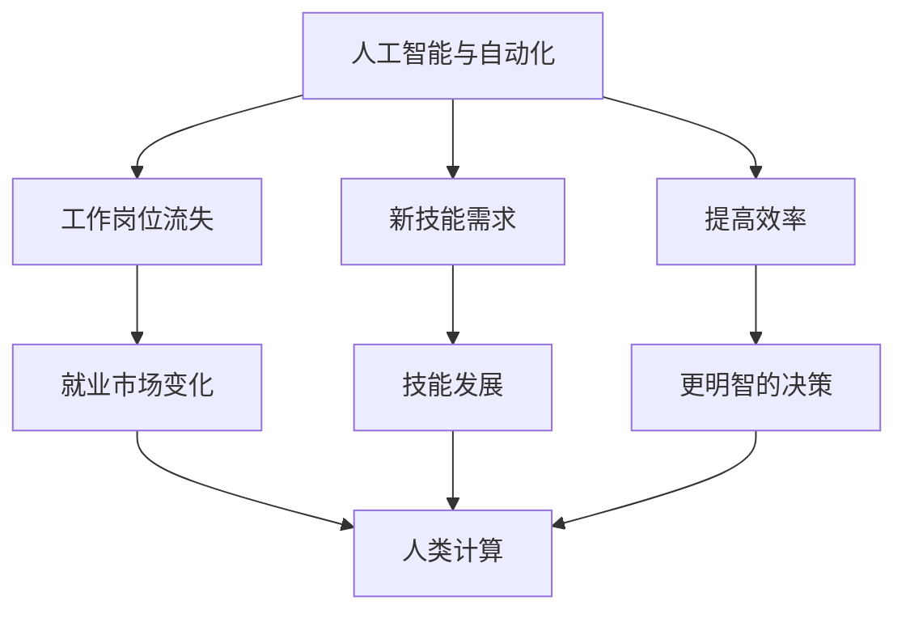

                 

**人类计算：AI时代的未来就业市场趋势与技能发展**

> 关键词：人工智能、就业市场、技能发展、未来趋势、自动化、人机协作、再培训、数字鸿沟

## 1. 背景介绍

在人工智能（AI）和自动化技术日益普及的今天，就业市场正在发生巨大变化。根据世界经济论坛的报告，到2025年，全球将有8500万个工作岗位受到自动化的影响。然而，AI也将创造出新的就业机会，预计到2025年，全球将需要1000万个与AI相关的工作岗位。本文将探讨AI时代的未来就业市场趋势，分析哪些技能将变得更加重要，以及如何帮助工人适应这些变化。

## 2. 核心概念与联系

### 2.1 AI和自动化的影响

AI和自动化技术正在改变各行各业的工作方式。它们可以执行重复性任务，提高效率，并帮助人们做出更明智的决策。然而，它们也可能导致工作岗位流失，要求工人具备新的技能。



### 2.2 人类计算

人类计算是指人类和机器共同工作，发挥各自优势的概念。人类计算强调人类的创造力、判断力和沟通能力，而机器则擅长处理大量数据和执行重复性任务。在AI时代，人类计算将变得越来越重要，因为它可以帮助我们最大化人类和机器的潜能。

## 3. 核心算法原理 & 具体操作步骤

### 3.1 算法原理概述

AI算法的核心原理是学习。机器学习算法可以从数据中学习，改进其性能，并做出预测。深度学习是一种机器学习方法，它使用神经网络模拟人类大脑的工作原理。

### 3.2 算法步骤详解

1. 数据收集：收集与问题相关的数据。
2. 数据预处理：清洗、标记和格式化数据。
3. 模型选择：选择适合问题的机器学习算法。
4. 模型训练：使用训练数据训练模型。
5. 模型评估：评估模型的性能。
6. 模型部署：将模型集成到应用程序中。
7. 模型监控：监控模型的性能，并进行必要的调整。

### 3.3 算法优缺点

优点：AI算法可以处理大量数据，并从中学习。它们可以自动化重复性任务，提高效率，并帮助做出更明智的决策。

缺点：AI算法需要大量数据进行训练，并且可能会导致工作岗位流失。它们也可能会出现偏见，因为它们学习的是人类创建的数据。

### 3.4 算法应用领域

AI算法应用于各行各业，包括医疗保健、金融、制造业、交通运输等。它们可以帮助医生做出更明智的决策，帮助银行检测欺诈行为，帮助制造商提高生产效率，并帮助交通运输系统提高效率。

## 4. 数学模型和公式 & 详细讲解 & 举例说明

### 4.1 数学模型构建

数学模型是用数学语言描述系统行为的工具。在AI中，数学模型用于描述机器学习算法的行为。例如，线性回归模型可以描述输入特征和输出结果之间的线性关系。

### 4.2 公式推导过程

线性回归模型的公式推导过程如下：

1. 定义目标函数：最小化预测误差的平方和。
2. 定义参数：回归系数和偏置项。
3. 定义梯度下降算法：更新参数以最小化目标函数。
4. 定义学习率：控制梯度下降步长的参数。

### 4.3 案例分析与讲解

例如，假设我们想要预测房价。我们可以使用线性回归模型，将房屋面积作为输入特征，房价作为输出结果。我们可以使用梯度下降算法训练模型，并使用学习率控制模型的训练速度。

## 5. 项目实践：代码实例和详细解释说明

### 5.1 开发环境搭建

要构建AI项目，我们需要安装Python、TensorFlow和Jupyter Notebook。我们还需要收集与问题相关的数据。

### 5.2 源代码详细实现

以下是使用TensorFlow构建线性回归模型的示例代码：

```python
import tensorflow as tf
import numpy as np

# 定义输入特征和输出结果
x_train = np.array([1, 2, 3, 4, 5], dtype=float)
y_train = np.array([2, 4, 6, 8, 10], dtype=float)

# 定义模型参数
W = tf.Variable(1.0)
b = tf.Variable(0.2)

# 定义目标函数
error = 0
for x, y in zip(x_train, y_train):
    y_hat = W * x + b  # 预测结果
    error += (y_hat - y) ** 2  # 计算误差

# 定义梯度下降算法
optimizer = tf.train.GradientDescentOptimizer(learning_rate=0.01)
train = optimizer.minimize(error)

# 训练模型
init = tf.global_variables_initializer()
sess = tf.Session()
sess.run(init)
for i in range(100):
    sess.run(train)
```

### 5.3 代码解读与分析

这段代码使用TensorFlow构建了一个简单的线性回归模型。它定义了输入特征和输出结果，并使用梯度下降算法训练模型。学习率控制模型的训练速度。

### 5.4 运行结果展示

运行这段代码后，模型的参数W和b将被更新，以最小化预测误差。我们可以使用训练好的模型预测新数据。

## 6. 实际应用场景

### 6.1 当前应用

AI当前正在各行各业得到广泛应用。例如，在医疗保健领域，AI可以帮助医生诊断疾病，并预测病情发展。在金融领域，AI可以帮助银行检测欺诈行为，并预测客户流失。在制造业，AI可以帮助提高生产效率，并预测设备故障。

### 6.2 未来应用展望

未来，AI将继续渗透到各行各业。例如，自动驾驶汽车将变得更加普及，并可能改变交通运输系统。AI也将帮助我们解决环境问题，如气候变化和资源短缺。然而，AI也可能带来挑战，如工作岗位流失和数字鸿沟。

## 7. 工具和资源推荐

### 7.1 学习资源推荐

* "机器学习：.trade" by Andrew Ng
* "深度学习" by Ian Goodfellow, Yoshua Bengio, and Aaron Courville
* "Python机器学习：机器学习和深度学习的实用指南" by Sebastian Raschka and Vahid Mirjalili

### 7.2 开发工具推荐

* TensorFlow
* PyTorch
* Keras
* Scikit-learn

### 7.3 相关论文推荐

* "ImageNet Classification with Deep Convolutional Neural Networks" by Krizhevsky, Sutskever, and Hinton
* "Attention Is All You Need" by Vaswani, et al.
* "Generative Adversarial Networks" by Goodfellow, et al.

## 8. 总结：未来发展趋势与挑战

### 8.1 研究成果总结

本文讨论了AI时代的未来就业市场趋势，分析了哪些技能将变得更加重要，并提出了帮助工人适应这些变化的建议。我们还讨论了AI算法的原理，并提供了构建线性回归模型的示例代码。

### 8.2 未来发展趋势

未来，AI将继续渗透到各行各业，并创造出新的就业机会。然而，AI也将导致工作岗位流失，要求工人具备新的技能。人类计算将变得越来越重要，因为它可以帮助我们最大化人类和机器的潜能。

### 8.3 面临的挑战

AI面临的挑战包括工作岗位流失、数字鸿沟、偏见和隐私保护。我们需要开发新的政策和框架，帮助工人适应这些变化，并确保AI的公平和透明。

### 8.4 研究展望

未来的研究将关注AI的解释性、公平性和可靠性。我们需要开发新的算法和技术，帮助我们理解AI的决策过程，并确保它们是公平和可靠的。我们还需要开发新的政策和框架，帮助工人适应AI的影响，并确保AI的福祉最大化。

## 9. 附录：常见问题与解答

**Q：AI会导致工作岗位流失吗？**

**A：**是的，AI和自动化技术可能会导致工作岗位流失。根据世界经济论坛的报告，到2025年，全球将有8500万个工作岗位受到自动化的影响。然而，AI也将创造出新的就业机会，预计到2025年，全球将需要1000万个与AI相关的工作岗位。

**Q：如何帮助工人适应AI的影响？**

**A：**帮助工人适应AI的影响需要多管齐下的策略。这包括提供再培训和教育机会，帮助工人发展新的技能，并鼓励人机协作。我们还需要开发新的政策和框架，帮助工人适应这些变化，并确保AI的福祉最大化。

**Q：AI是否会导致偏见？**

**A：**是的，AI可能会导致偏见，因为它们学习的是人类创建的数据。如果数据中存在偏见，那么AI模型也会受到偏见的影响。我们需要开发新的技术和方法，帮助我们检测和消除AI中的偏见。

**Q：如何确保AI的隐私保护？**

**A：**确保AI的隐私保护需要开发新的技术和方法，帮助我们保护个人数据。这包括使用匿名数据、加密技术和差分隐私。我们还需要开发新的政策和框架，帮助我们监管AI的使用，并确保它们符合隐私保护标准。

## 作者：禅与计算机程序设计艺术 / Zen and the Art of Computer Programming

