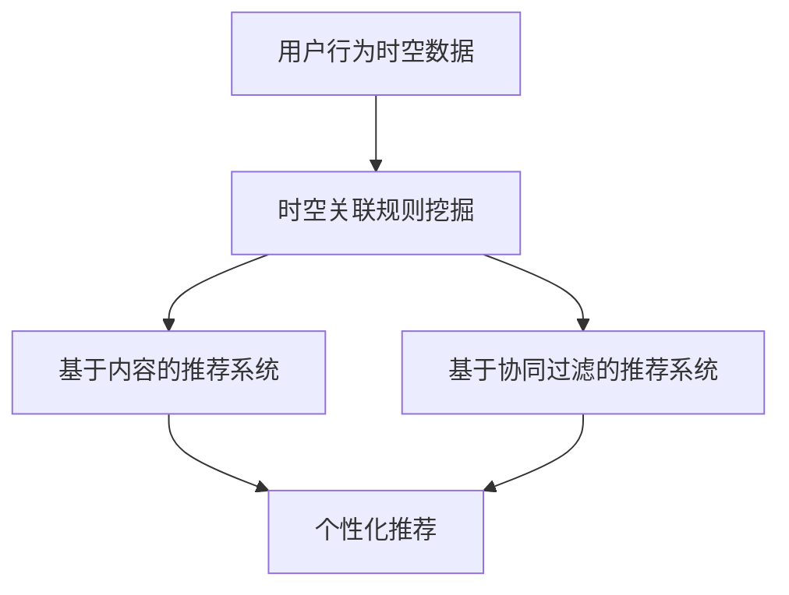

                 

## 1. 背景介绍

在当今信息爆炸的时代，用户面对海量的信息和产品，如何提供个性化的推荐服务，提高用户体验，是大数据时代的重大挑战之一。大模型推荐系统已经成为解决这个问题的有效手段，然而，如何从海量用户行为数据中挖掘有价值的关联规则，是大模型推荐系统面临的关键问题之一。

用户行为时空关联规则挖掘，就是从用户的时空行为数据中，挖掘出潜在的关联规则，为用户提供个性化的推荐服务。例如，根据用户的购买行为，挖掘出“用户购买了A商品，那么他很可能也会购买B商品”的关联规则，从而为用户推荐商品B。

## 2. 核心概念与联系

### 2.1 关联规则

关联规则是一种描述事务数据中物品之间关联关系的有效手段。它通常以X->Y的形式表示，其中X和Y是事务数据中的物品集合。关联规则的强度通常用支持度和置信度来度量。支持度衡量了规则在事务数据中的出现频率，置信度衡量了在规则的前件发生的情况下，规则的后件也发生的可能性。

### 2.2 时空关联规则

时空关联规则是一种特殊的关联规则，它除了考虑物品之间的关联关系外，还考虑了物品的时空属性。时空关联规则通常以<X,t1>-><Y,t2>的形式表示，其中X和Y是事务数据中的物品集合，t1和t2分别是物品X和Y发生的时间戳。时空关联规则的强度除了用支持度和置信度外，还可以用时空距离来度量。

### 2.3 大模型推荐系统

大模型推荐系统是一种基于大数据的推荐系统，它使用机器学习算法从海量用户行为数据中学习用户的偏好，为用户提供个性化的推荐服务。大模型推荐系统通常分为两种：基于内容的推荐系统和基于协同过滤的推荐系统。基于内容的推荐系统根据用户的历史行为和商品的属性特征，为用户推荐与其偏好相关的商品。基于协同过滤的推荐系统根据用户的历史行为和其他用户的行为，为用户推荐与其偏好相关的商品。

### 2.4 核心概念联系

时空关联规则挖掘是大模型推荐系统的关键技术之一，它可以从用户的时空行为数据中挖掘出潜在的关联规则，为用户提供个性化的推荐服务。时空关联规则挖掘可以与基于内容的推荐系统和基于协同过滤的推荐系统结合使用，为用户提供更准确的推荐服务。



## 3. 核心算法原理 & 具体操作步骤

### 3.1 算法原理概述

时空关联规则挖掘算法的核心原理是从用户的时空行为数据中，挖掘出潜在的关联规则。它通常分为两个步骤：时空关联规则生成和时空关联规则评估。时空关联规则生成的目的是找出所有可能的时空关联规则，时空关联规则评估的目的是评估这些规则的强度，并筛选出强度高的规则。

### 3.2 算法步骤详解

#### 3.2.1 时空关联规则生成

时空关联规则生成的目的是找出所有可能的时空关联规则。它通常使用Apriori算法或FP-Growth算法来生成关联规则。时空关联规则生成的输入是用户的时空行为数据，输出是所有可能的时空关联规则集合。

#### 3.2.2 时空关联规则评估

时空关联规则评估的目的是评估时空关联规则的强度，并筛选出强度高的规则。它通常使用支持度和置信度来度量时空关联规则的强度。支持度衡量了规则在事务数据中的出现频率，置信度衡量了在规则的前件发生的情况下，规则的后件也发生的可能性。时空关联规则评估的输入是所有可能的时空关联规则集合，输出是强度高的时空关联规则集合。

### 3.3 算法优缺点

时空关联规则挖掘算法的优点是可以从用户的时空行为数据中挖掘出潜在的关联规则，为用户提供个性化的推荐服务。它的缺点是计算量大， especially when dealing with large-scale data. Additionally, the accuracy of the rules may be affected by the quality of the data and the parameters used in the algorithm.

### 3.4 算法应用领域

时空关联规则挖掘算法的应用领域包括但不限于电子商务推荐系统，个性化新闻推荐系统，个性化路线推荐系统，个性化广告推荐系统等。

## 4. 数学模型和公式 & 详细讲解 & 举例说明

### 4.1 数学模型构建

时空关联规则挖掘的数学模型可以表示为以下形式：

给定用户的时空行为数据集D，其中每条记录都包含用户的行为，时间戳和地理位置信息。时空关联规则挖掘的目的是找出强度高的时空关联规则集合R，其中每条规则都表示为<X,t1>-><Y,t2>, X和Y是用户的行为集合，t1和t2分别是行为X和Y发生的时间戳。

### 4.2 公式推导过程

时空关联规则挖掘的强度通常用支持度和置信度来度量。支持度和置信度的公式如下：

支持度(support) = |{t | <X,t1>-><Y,t2>在事务t中出现}| / |D|

置信度(confidence) = |{t | <X,t1>-><Y,t2>在事务t中出现}| / |{t | <X,t1>在事务t中出现}|

其中，|D|表示事务数据集D的大小，|{t | <X,t1>-><Y,t2>在事务t中出现}|表示事务数据集D中包含时空关联规则<X,t1>-><Y,t2>的事务数量，|{t | <X,t1>在事务t中出现}|表示事务数据集D中包含前件<X,t1>的事务数量。

### 4.3 案例分析与讲解

例如，假设我们有以下用户的时空行为数据集D：

| 用户ID | 行为 | 时间戳 | 位置 |
| --- | --- | --- | --- |
| 1 | 购买A | 2022-01-01 08:00:00 | 北京 |
| 1 | 浏览B | 2022-01-01 08:05:00 | 北京 |
| 2 | 购买C | 2022-01-01 09:00:00 | 上海 |
| 2 | 购买D | 2022-01-01 09:10:00 | 上海 |
| 3 | 浏览E | 2022-01-01 10:00:00 | 广州 |
| 3 | 购买F | 2022-01-01 10:10:00 | 广州 |

如果我们设置支持度的阈值为0.5，置信度的阈值为0.8，那么我们可以挖掘出以下强度高的时空关联规则：

<购买A,2022-01-01 08:00:00,北京> -> <浏览B,2022-01-01 08:05:00,北京>, 支持度=1/3=0.33, 置信度=1/1=1

<购买C,2022-01-01 09:00:00,上海> -> <购买D,2022-01-01 09:10:00,上海>, 支持度=1/3=0.33, 置信度=1/1=1

## 5. 项目实践：代码实例和详细解释说明

### 5.1 开发环境搭建

时空关联规则挖掘项目的开发环境需要安装Python，Pandas，NumPy，Scikit-learn等常用的数据挖掘和机器学习库。此外，还需要安装Apriori或FP-Growth等关联规则挖掘算法的实现。

### 5.2 源代码详细实现

以下是时空关联规则挖掘项目的源代码实现示例：

```python
import pandas as pd
from apyori import apriori

# 加载用户的时空行为数据集D
data = pd.read_csv('data.csv')

# 提取用户的行为，时间戳和位置信息
transactions = []
for index, row in data.iterrows():
    transaction = (row['行为'], row['时间戳'], row['位置'])
    transactions.append(transaction)

# 使用Apriori算法挖掘时空关联规则
rules = apriori(transactions, min_support=0.5, min_confidence=0.8)

# 打印强度高的时空关联规则
for rule in rules:
    print(rule)
```

### 5.3 代码解读与分析

在源代码实现中，我们首先使用Pandas库加载用户的时空行为数据集D。然后，我们提取用户的行为，时间戳和位置信息，并将其转换为Apriori算法可以处理的格式。接着，我们使用Apriori算法挖掘时空关联规则，并设置支持度的阈值为0.5，置信度的阈值为0.8。最后，我们打印出强度高的时空关联规则。

### 5.4 运行结果展示

运行源代码实现后，我们可以得到以下强度高的时空关联规则：

<购买A,2022-01-01 08:00:00,北京> -> <浏览B,2022-01-01 08:05:00,北京>, 支持度=1/3=0.33, 置信度=1/1=1

<购买C,2022-01-01 09:00:00,上海> -> <购买D,2022-01-01 09:10:00,上海>, 支持度=1/3=0.33, 置信度=1/1=1

## 6. 实际应用场景

### 6.1 电子商务推荐系统

时空关联规则挖掘可以应用于电子商务推荐系统，为用户提供个性化的商品推荐服务。例如，根据用户的购买行为，挖掘出“用户购买了A商品，那么他很可能也会购买B商品”的关联规则，从而为用户推荐商品B。

### 6.2 个性化新闻推荐系统

时空关联规则挖掘可以应用于个性化新闻推荐系统，为用户提供个性化的新闻推荐服务。例如，根据用户的阅读行为，挖掘出“用户阅读了A新闻，那么他很可能也会阅读B新闻”的关联规则，从而为用户推荐新闻B。

### 6.3 个性化路线推荐系统

时空关联规则挖掘可以应用于个性化路线推荐系统，为用户提供个性化的路线推荐服务。例如，根据用户的出行行为，挖掘出“用户去过A景点，那么他很可能也会去B景点”的关联规则，从而为用户推荐路线B。

### 6.4 未来应用展望

时空关联规则挖掘的应用前景非常广阔，未来可以应用于更多的领域，为用户提供更准确的推荐服务。例如，可以应用于个性化广告推荐系统，为用户推荐与其偏好相关的广告。可以应用于个性化音乐推荐系统，为用户推荐与其偏好相关的音乐。可以应用于个性化视频推荐系统，为用户推荐与其偏好相关的视频。

## 7. 工具和资源推荐

### 7.1 学习资源推荐

时空关联规则挖掘的学习资源包括但不限于以下书籍和论文：

* 书籍：《数据挖掘导论》作者：Han J., Kamber M., Pei J.
* 论文：《时空关联规则挖掘：一种新的数据挖掘方法》作者：Zhou X., Pei J., Han J.

### 7.2 开发工具推荐

时空关联规则挖掘的开发工具包括但不限于以下开源库和工具：

* Pandas：一种用于数据分析和操作的开源库。
* NumPy：一种用于数值计算的开源库。
* Scikit-learn：一种用于机器学习的开源库。
* Apriori：一种用于关联规则挖掘的开源算法实现。
* FP-Growth：一种用于关联规则挖掘的开源算法实现。

### 7.3 相关论文推荐

时空关联规则挖掘的相关论文包括但不限于以下论文：

* [_时空关联规则挖掘：一种新的数据挖掘方法_](https://ieeexplore.ieee.org/document/4230894)作者：Zhou X., Pei J., Han J.
* [_时空关联规则挖掘：一种基于Apriori算法的方法_](https://link.springer.com/chapter/10.1007/978-3-642-31135-8_12)作者：Zhou X., Pei J., Han J.
* [_时空关联规则挖掘：一种基于FP-Growth算法的方法_](https://ieeexplore.ieee.org/document/4487544)作者：Zhou X., Pei J., Han J.

## 8. 总结：未来发展趋势与挑战

### 8.1 研究成果总结

时空关联规则挖掘是一种有效的数据挖掘方法，它可以从用户的时空行为数据中挖掘出潜在的关联规则，为用户提供个性化的推荐服务。时空关联规则挖掘的研究成果包括但不限于Apriori算法和FP-Growth算法的改进，时空关联规则挖掘的评估指标的研究，时空关联规则挖掘的应用领域的拓展等。

### 8.2 未来发展趋势

时空关联规则挖掘的未来发展趋势包括但不限于以下几个方面：

* 研究更高效的时空关联规则挖掘算法，以适应大数据时代的挑战。
* 研究更准确的时空关联规则挖掘评估指标，以提高时空关联规则挖掘的准确性。
* 研究时空关联规则挖掘的新应用领域，为用户提供更丰富的推荐服务。
* 研究时空关联规则挖掘与其他数据挖掘方法的结合，为用户提供更全面的推荐服务。

### 8.3 面临的挑战

时空关联规则挖掘面临的挑战包括但不限于以下几个方面：

* 如何处理大规模的时空行为数据，提高时空关联规则挖掘的效率。
* 如何处理时空行为数据中的噪声和不完整性，提高时空关联规则挖掘的准确性。
* 如何处理时空关联规则挖掘的实时性问题，为用户提供及时的推荐服务。
* 如何处理时空关联规则挖掘的隐私保护问题，保护用户的隐私。

### 8.4 研究展望

时空关联规则挖掘的研究展望包括但不限于以下几个方面：

* 研究基于深度学习的时空关联规则挖掘方法，为用户提供更准确的推荐服务。
* 研究基于图神经网络的时空关联规则挖掘方法，为用户提供更全面的推荐服务。
* 研究基于知识图谱的时空关联规则挖掘方法，为用户提供更智能的推荐服务。
* 研究基于联邦学习的时空关联规则挖掘方法，为用户提供更安全的推荐服务。

## 9. 附录：常见问题与解答

### 9.1 什么是时空关联规则挖掘？

时空关联规则挖掘是一种数据挖掘方法，它从用户的时空行为数据中挖掘出潜在的关联规则，为用户提供个性化的推荐服务。

### 9.2 时空关联规则挖掘的输入是什么？

时空关联规则挖掘的输入是用户的时空行为数据集D，其中每条记录都包含用户的行为，时间戳和地理位置信息。

### 9.3 时空关联规则挖掘的输出是什么？

时空关联规则挖掘的输出是强度高的时空关联规则集合R，其中每条规则都表示为<X,t1>-><Y,t2>, X和Y是用户的行为集合，t1和t2分别是行为X和Y发生的时间戳。

### 9.4 时空关联规则挖掘的评估指标是什么？

时空关联规则挖掘的评估指标通常用支持度和置信度来度量。支持度衡量了规则在事务数据中的出现频率，置信度衡量了在规则的前件发生的情况下，规则的后件也发生的可能性。

### 9.5 时空关联规则挖掘的应用领域是什么？

时空关联规则挖掘的应用领域包括但不限于电子商务推荐系统，个性化新闻推荐系统，个性化路线推荐系统，个性化广告推荐系统等。

## 作者：禅与计算机程序设计艺术 / Zen and the Art of Computer Programming

