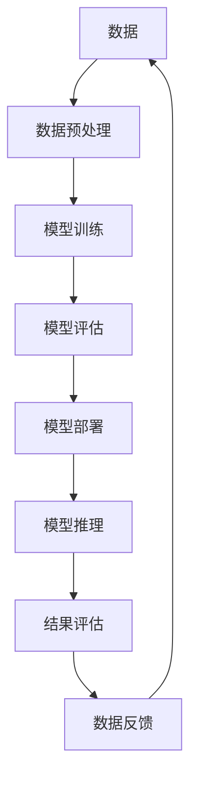

                 

**大模型时代创业新挑战：数据壁垒与算力瓶颈**

## 1. 背景介绍

随着人工智能的飞速发展，大模型逐渐成为各行业关注的焦点。大模型的优势在于其强大的学习和推理能力，可以处理复杂的任务，并提供更准确的预测。然而，大模型的训练和部署也面临着两大主要挑战：数据壁垒和算力瓶颈。本文将深入探讨这些挑战，并提供解决方案。

## 2. 核心概念与联系

### 2.1 数据壁垒

数据壁垒是指企业或组织无法访问或共享所需数据的情况。在大模型时代，数据壁垒可能会限制模型的性能和泛化能力。

### 2.2 算力瓶颈

算力瓶颈是指系统或设备无法满足计算需求的情况。在大模型时代，算力瓶颈可能会限制模型的规模和训练速度。

## 3. 核心算法原理 & 具体操作步骤

### 3.1 算法原理概述

大模型通常基于深度学习算法，如transformer模型。这些模型使用大量参数进行训练，需要大量的数据和计算资源。

### 3.2 算法步骤详解

大模型的训练过程包括数据预处理、模型构建、模型训练、模型评估和模型部署等步骤。模型推理过程则包括输入数据预处理、模型推理和结果评估等步骤。

### 3.3 算法优缺点

大模型的优点在于其强大的学习和推理能力，可以处理复杂的任务。然而，大模型的缺点在于其对数据和计算资源的高需求，以及模型解释性较差的问题。

### 3.4 算法应用领域

大模型在自然语言处理、计算机视觉、推荐系统等领域有着广泛的应用。此外，大模型还可以用于科学研究、金融分析等领域。

## 4. 数学模型和公式 & 详细讲解 & 举例说明

### 4.1 数学模型构建

大模型的数学模型通常基于深度学习算法，如transformer模型。模型的参数可以使用梯度下降算法进行优化。

### 4.2 公式推导过程

大模型的训练过程涉及到损失函数的最小化。损失函数可以使用交叉熵函数或其他函数进行定义。梯度下降算法则用于更新模型的参数。

### 4.3 案例分析与讲解

例如，在自然语言处理任务中，大模型可以用于文本分类、机器翻译等任务。在计算机视觉任务中，大模型可以用于图像分类、目标检测等任务。

## 5. 项目实践：代码实例和详细解释说明

### 5.1 开发环境搭建

大模型的开发环境通常包括GPU服务器、深度学习框架（如PyTorch或TensorFlow）等。

### 5.2 源代码详细实现

大模型的源代码通常包括数据预处理、模型构建、模型训练、模型评估和模型部署等部分。

### 5.3 代码解读与分析

大模型的代码通常包含大量的注释，可以帮助开发者理解代码的功能和实现细节。

### 5.4 运行结果展示

大模型的运行结果通常包括模型的性能指标（如准确率、精确度、召回率等）、模型的推理结果等。

## 6. 实际应用场景

### 6.1 当前应用场景

大模型当前在自然语言处理、计算机视觉、推荐系统等领域有着广泛的应用。

### 6.2 未来应用展望

未来，大模型有望在更多领域得到应用，如自动驾驶、医疗诊断等领域。

## 7. 工具和资源推荐

### 7.1 学习资源推荐

推荐阅读相关的学术论文、深度学习教程等资源。

### 7.2 开发工具推荐

推荐使用深度学习框架（如PyTorch或TensorFlow）进行大模型的开发。

### 7.3 相关论文推荐

推荐阅读相关的学术论文，如"Attention is All You Need"、"BERT: Pre-training of Deep Bidirectional Transformers for Language Understanding"等。

## 8. 总结：未来发展趋势与挑战

### 8.1 研究成果总结

大模型在各行业有着广泛的应用，并取得了显著的成果。

### 8.2 未来发展趋势

未来，大模型有望在更多领域得到应用，并取得更好的性能。

### 8.3 面临的挑战

然而，大模型仍然面临着数据壁垒和算力瓶颈等挑战。

### 8.4 研究展望

未来的研究方向包括模型压缩、模型解释性、模型泛化能力等方面。

## 9. 附录：常见问题与解答

### 9.1 问题一：大模型的优势是什么？

大模型的优势在于其强大的学习和推理能力，可以处理复杂的任务。

### 9.2 问题二：大模型的缺点是什么？

大模型的缺点在于其对数据和计算资源的高需求，以及模型解释性较差的问题。

### 9.3 问题三：如何解决数据壁垒问题？

可以通过数据增强、数据共享等方法解决数据壁垒问题。

### 9.4 问题四：如何解决算力瓶颈问题？

可以通过模型压缩、模型并行化等方法解决算力瓶颈问题。

## 作者：禅与计算机程序设计艺术 / Zen and the Art of Computer Programming

