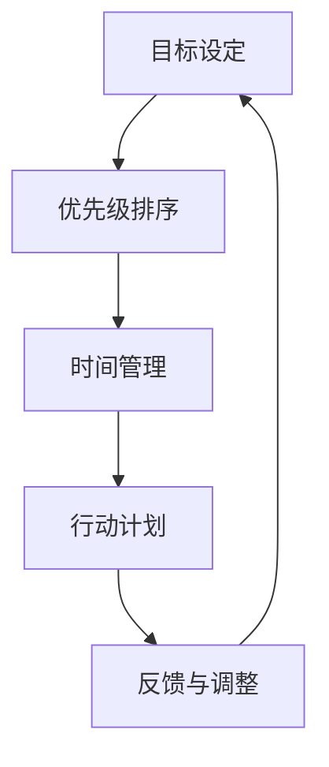

                 

## 1. 背景介绍

在当今快节奏的世界中，高效行动是成功的关键。然而，建立一个高效的行动体系并非易事。本文将指导您建立一个有效的行动体系，帮助您提高个人和团队的生产力，实现目标。

## 2. 核心概念与联系

### 2.1 关键概念

- **目标设定（Goal Setting）**：清晰明确的目标是高效行动的基础。
- **优先级排序（Prioritization）**：有效地管理任务优先级，确保重点放在最重要的任务上。
- **时间管理（Time Management）**：合理利用时间，提高工作效率。
- **行动计划（Action Plan）**：将目标分解为具体的行动步骤。
- **反馈与调整（Feedback and Adjustment）**：定期收集反馈，调整行动计划以提高效率。

### 2.2 核心概念联系



## 3. 核心算法原理 & 具体操作步骤

### 3.1 算法原理概述

建立高效行动体系的算法基于目标驱动、优先级排序、时间管理、行动计划和反馈调整这五个步骤。

### 3.2 算法步骤详解

1. **目标设定**：使用SMART原则（Specific、Measurable、Achievable、Relevant、Time-bound）设定清晰明确的目标。
2. **优先级排序**：使用Eisenhower盒子法则将任务分为四类：紧急且重要、不紧急但重要、紧急但不重要、不紧急也不重要，并优先处理前两类任务。
3. **时间管理**：使用 Pomodoro Technique 等时间管理技巧，合理安排工作和休息时间。
4. **行动计划**：将目标分解为具体的行动步骤，并设定完成每个步骤的时间节点。
5. **反馈与调整**：定期收集反馈，评估进度，并根据需要调整行动计划。

### 3.3 算法优缺点

**优点**：有助于提高个人和团队生产力，帮助实现目标。

**缺点**：可能需要花费大量时间来设定目标和优先级，且需要定期调整计划以适应变化。

### 3.4 算法应用领域

该算法适用于各种个人和团队目标，如项目管理、个人发展计划、企业战略规划等。

## 4. 数学模型和公式 & 详细讲解 & 举例说明

### 4.1 数学模型构建

我们可以使用PERT（Program Evaluation and Review Technique）网络来表示目标和任务的关系。每个任务被表示为一个节点，任务之间的关系被表示为有向边。

### 4.2 公式推导过程

PERT网络的关键路径（Critical Path）是网络中最长的路径，它决定了项目的最短完成时间。关键路径上的任务是项目的瓶颈，需要优先处理。

### 4.3 案例分析与讲解

假设我们要组织一场会议，任务包括预算、场地、邀请嘉宾等。使用PERT网络表示任务关系，并计算关键路径，我们可以优先处理关键路径上的任务，确保会议按时举行。

## 5. 项目实践：代码实例和详细解释说明

### 5.1 开发环境搭建

我们将使用Python和Pydot库来构建PERT网络。

### 5.2 源代码详细实现

```python
import pydot

def create_pet_network( tasks, dependencies):
    graph = pydot.Dot(graph_type='digraph')
    for task in tasks:
        graph.add_node(pydot.Node(task))
    for dep in dependencies:
        graph.add_edge(pydot.Edge(dep[0], dep[1]))
    return graph

tasks = ['预算', '场地', '邀请嘉宾', '会议材料', '会议']
dependencies = [('预算', '场地'), ('预算', '邀请嘉宾'), ('场地', '会议'), ('邀请嘉宾', '会议'), ('会议材料', '会议')]
network = create_pet_network(tasks, dependencies)
network.write('会议PERT网络.dot')
```

### 5.3 代码解读与分析

该代码创建了一个PERT网络，表示会议组织任务的关系。任务和依赖关系分别作为输入，网络图被保存为DOT格式。

### 5.4 运行结果展示

运行代码后，会生成一个名为“会议PERT网络.dot”的文件，可以使用Graphviz工具查看网络图。

## 6. 实际应用场景

### 6.1 项目管理

在项目管理中，高效行动体系可以帮助团队有效地规划和执行项目。

### 6.2 个人发展

个人可以使用该体系设定目标，如学习新技能、改善健康习惯等。

### 6.3 未来应用展望

未来，人工智能和机器学习技术可以帮助自动优化行动计划，根据实时数据调整优先级。

## 7. 工具和资源推荐

### 7.1 学习资源推荐

- "Getting Things Done" by David Allen
- "The 7 Habits of Highly Effective People" by Stephen Covey

### 7.2 开发工具推荐

- Trello：项目管理工具
- Asana：任务管理工具
- Pomodoro Tracker：时间管理工具

### 7.3 相关论文推荐

- "PERT and CPM: Two Major Advances in Project Management" by John F. P. Mulvey

## 8. 总结：未来发展趋势与挑战

### 8.1 研究成果总结

本文介绍了建立高效行动体系的步骤，包括目标设定、优先级排序、时间管理、行动计划和反馈调整。我们还介绍了PERT网络模型来表示任务关系。

### 8.2 未来发展趋势

未来，人工智能和机器学习技术将帮助自动优化行动计划，根据实时数据调整优先级。

### 8.3 面临的挑战

挑战包括设定目标和优先级的主观性，以及调整计划以适应变化的需要。

### 8.4 研究展望

未来的研究可以探索如何使用人工智能和机器学习技术自动优化行动计划，以及如何更好地量化目标和优先级。

## 9. 附录：常见问题与解答

**Q：如何设定合理的目标？**

**A：使用SMART原则（Specific、Measurable、Achievable、Relevant、Time-bound）设定清晰明确的目标。**

**Q：如何管理时间？**

**A：使用Pomodoro Technique等时间管理技巧，合理安排工作和休息时间。**

**Q：如何调整行动计划？**

**A：定期收集反馈，评估进度，并根据需要调整行动计划。**

## 作者：禅与计算机程序设计艺术 / Zen and the Art of Computer Programming

