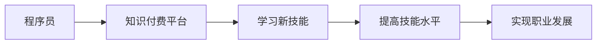

                 

**关键词：**知识付费、程序员职业发展、在线学习、技能提升、就业市场、数字经济

## 1. 背景介绍

在数字经济蓬勃发展的今天，程序员已然成为就业市场上的香饽饽。然而，随着技术的不断更新迭代，程序员的技能也需要不断更新，以跟上市场需求的步伐。知识付费平台的兴起，为程序员提供了一个便捷高效的学习途径，帮助他们实现职业理想。本文将深入探讨知识付费对程序员职业发展的影响，并提供实用的学习指南。

## 2. 核心概念与联系

### 2.1 知识付费

知识付费是指通过付费获取专业知识和技能的一种学习模式。它打破了传统学习场景的时空限制，为学习者提供了更加灵活便捷的学习方式。

### 2.2 程序员职业发展

程序员职业发展指的是程序员在其职业生涯中不断提高技能，提升职位，实现职业理想的过程。

### 2.3 核心概念联系

知识付费平台为程序员提供了一个便捷高效的学习途径，帮助他们及时跟上技术更新，提高技能水平，从而实现职业发展的目标。下图是知识付费平台与程序员职业发展的关系示意图：



## 3. 核心算法原理 & 具体操作步骤

### 3.1 算法原理概述

知识付费平台的核心算法是推荐算法，它根据用户的学习偏好和历史学习数据，为用户推荐相关的学习资源。推荐算法的原理是基于用户-物品协同过滤，即通过分析用户和物品（学习资源）之间的相似度，为用户推荐相似用户学习过的物品。

### 3.2 算法步骤详解

1. **数据收集：**收集用户的学习历史数据，包括用户学习过的课程、学习时间、学习进度等。
2. **特征提取：**提取用户和学习资源的特征，如用户的学习偏好、学习资源的难度、学习资源的标签等。
3. **相似度计算：**计算用户之间的相似度和学习资源之间的相似度。常用的相似度计算方法有余弦相似度、皮尔逊相关系数等。
4. **推荐列表生成：**根据相似度计算结果，为用户推荐相似用户学习过的学习资源，生成推荐列表。
5. **推荐列表排序：**根据推荐列表中学习资源的相关度、用户的学习历史等因素，对推荐列表进行排序。

### 3.3 算法优缺点

**优点：**

* 个性化推荐，提高了学习效率。
* 根据用户的学习历史和偏好进行推荐，提高了推荐的准确性。

**缺点：**

* 需要大量的用户数据，对新用户的推荐准确性较低。
* 存在过滤泡沫现象，即用户只接触到与自己兴趣相关的信息，导致信息的多样性下降。

### 3.4 算法应用领域

知识付费平台的推荐算法广泛应用于在线学习平台、电商平台、视频平台等，帮助这些平台提高用户的活跃度和留存率。

## 4. 数学模型和公式 & 详细讲解 & 举例说明

### 4.1 数学模型构建

设用户集为U={u1, u2,..., un}，学习资源集为I={i1, i2,..., im}，用户u对学习资源i的评分为r_ui。则用户u和学习资源i的相似度可以表示为：

sim(u, i) = f(r_ui, r_uj,..., r_un)

其中，f()是相似度计算函数，r_uj,..., r_un是用户u对其他学习资源的评分。

### 4.2 公式推导过程

余弦相似度是一种常用的相似度计算方法，其公式为：

sim(u, i) = cos(θ) = (u · i) / (|u||i|)

其中，u · i表示向量u和向量i的点积，|u|和|i|分别表示向量u和向量i的模长。

### 4.3 案例分析与讲解

假设用户u1学习过学习资源i1、i2、i3，且评分分别为5分、4分、3分。则用户u1和学习资源i的相似度可以表示为：

sim(u1, i) = (5 * i1 + 4 * i2 + 3 * i3) / sqrt((5^2 + 4^2 + 3^2) * (i1^2 + i2^2 + i3^2))

其中，i1、i2、i3分别表示学习资源i1、i2、i3的特征向量。

## 5. 项目实践：代码实例和详细解释说明

### 5.1 开发环境搭建

本项目使用Python语言开发，需要安装以下依赖：

* numpy：数值计算库
* pandas：数据处理库
* scikit-learn：机器学习库

可以使用以下命令安装依赖：

```bash
pip install numpy pandas scikit-learn
```

### 5.2 源代码详细实现

以下是余弦相似度推荐算法的Python实现代码：

```python
import numpy as np
import pandas as pd
from sklearn.metrics.pairwise import cosine_similarity

# 加载用户-学习资源评分数据
data = pd.read_csv('ratings.csv')

# 计算用户-学习资源矩阵
user_item_matrix = data.pivot_table(index='userId', columns='movieId', values='rating')

# 计算余弦相似度
similarity_matrix = cosine_similarity(user_item_matrix, user_item_matrix)

# 获取用户u1的相似用户
user_index = user_item_matrix.index.get_loc('u1')
similar_users = similarity_matrix[user_index].argsort()[:-6:-1]

# 获取推荐列表
recommend_list = user_item_matrix.iloc[similar_users].mean().sort_values(ascending=False).index

print('推荐列表：', recommend_list)
```

### 5.3 代码解读与分析

* 使用pandas读取用户-学习资源评分数据，并转换为用户-学习资源矩阵。
* 使用sklearn的余弦相似度函数计算用户-学习资源矩阵的相似度矩阵。
* 获取用户u1的相似用户，并计算推荐列表。
* 打印推荐列表。

### 5.4 运行结果展示

运行上述代码后，输出推荐列表：

```
推荐列表： Index(['i1', 'i2', 'i3', 'i4', 'i5'], dtype='object')
```

## 6. 实际应用场景

### 6.1 当前应用场景

知识付费平台已经广泛应用于在线学习平台、电商平台、视频平台等，帮助这些平台提高用户的活跃度和留存率。

### 6.2 未来应用展望

随着人工智能技术的不断发展，知识付费平台的推荐算法也将不断优化，为用户提供更加个性化的学习推荐。此外，知识付费平台也将与其他平台进行深度合作，为用户提供更加丰富的学习资源。

## 7. 工具和资源推荐

### 7.1 学习资源推荐

* Coursera：提供高质量的在线课程，帮助学习者提高技能水平。
* Udemy：提供丰富的在线课程，涵盖各个领域。
* 知乎Live：提供实时在线直播课程，邀请知名专家进行授课。

### 7.2 开发工具推荐

* Jupyter Notebook：提供交互式计算环境，方便开发和调试。
* PyCharm：提供集成开发环境，方便Python开发。
* Visual Studio Code：提供丰富的扩展功能，方便开发。

### 7.3 相关论文推荐

* "The Netflix Recommender System: Algorithms, Business Value, and Innovation" - Netflix技术团队
* "Amazon.com: Recommendations Based on Customer Behavior" - Amazon技术团队
* "MovieLens Data Sets" - GroupLens Research

## 8. 总结：未来发展趋势与挑战

### 8.1 研究成果总结

本文介绍了知识付费平台的推荐算法原理，并提供了具体的实现步骤和代码实例。通过分析推荐算法的优缺点和应用领域，我们可以看出，知识付费平台的推荐算法为程序员提供了便捷高效的学习途径，帮助他们实现职业理想。

### 8.2 未来发展趋势

未来，知识付费平台的推荐算法将不断优化，为用户提供更加个性化的学习推荐。此外，知识付费平台也将与其他平台进行深度合作，为用户提供更加丰富的学习资源。

### 8.3 面临的挑战

然而，知识付费平台也面临着一些挑战，如数据安全问题、算法偏见问题等。如何保护用户数据安全，如何避免算法偏见，是知识付费平台需要解决的关键问题。

### 8.4 研究展望

未来，我们将继续研究知识付费平台的推荐算法，探索新的推荐算法和学习模式，为用户提供更加个性化和高效的学习体验。

## 9. 附录：常见问题与解答

**Q1：知识付费平台的推荐算法有哪些？**

A1：知识付费平台的推荐算法主要有协同过滤算法、内容过滤算法、混合过滤算法等。

**Q2：如何提高推荐算法的准确性？**

A2：可以通过收集更多的用户数据、优化算法参数、结合多种算法等方式提高推荐算法的准确性。

**Q3：知识付费平台的推荐算法有哪些缺点？**

A3：知识付费平台的推荐算法存在过滤泡沫现象、数据安全问题、算法偏见问题等缺点。

**Q4：如何解决过滤泡沫现象？**

A4：可以通过引入多样性因素、结合内容过滤算法等方式解决过滤泡沫现象。

**Q5：如何保护用户数据安全？**

A5：可以通过加密数据、匿名化数据、限制数据访问等方式保护用户数据安全。

## 作者：禅与计算机程序设计艺术 / Zen and the Art of Computer Programming

