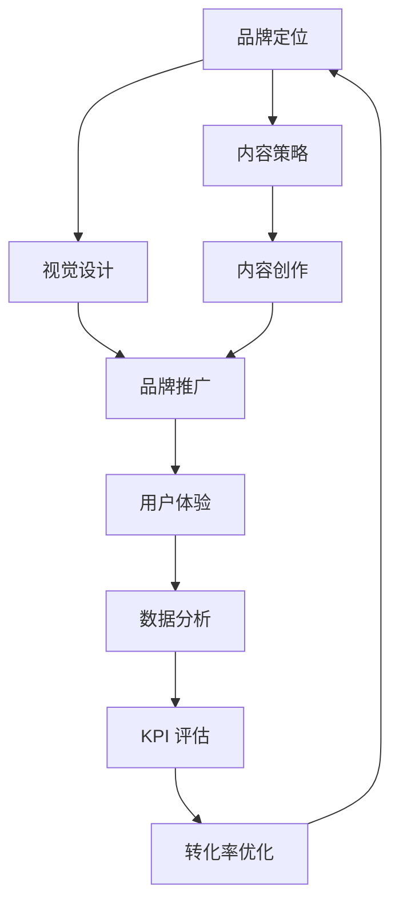

                 

**关键词：**知识付费、品牌运营、品牌推广、数字营销、用户体验、内容策略、转化率优化、社交媒体、KPI、数据分析

## 1. 背景介绍

随着互联网的发展，知识付费行业迅速崛起，成为一种新的商业模式。然而，在这个竞争激烈的市场中，如何打造和推广品牌，提高知名度和美誉度，是所有知识付费平台和个人创作者面临的共同挑战。本文将深入探讨知识付费品牌运营与推广策略，帮助您在激烈的市场竞争中脱颖而出。

## 2. 核心概念与联系

### 2.1 核心概念

- **品牌（Brand）**：知识付费平台或个人创作者的总和，包括视觉元素（logo、色彩）、语言元素（名称、口号）、文化元素（使命、价值观）和行为元素（服务、沟通方式）。
- **品牌运营（Brand Operation）**：持续管理和发展品牌，以实现品牌目标和价值的过程。
- **品牌推广（Brand Promotion）**：通过各种渠道和手段，提高品牌知名度、美誉度和影响力的活动。
- **数字营销（Digital Marketing）**：利用互联网和数字技术，传播品牌信息，吸引和留住客户的营销活动。
- **用户体验（User Experience）**：用户在与品牌互动过程中感知到的所有情感、认知和行为反应的总和。
- **内容策略（Content Strategy）**：根据品牌定位和目标受众，规划和创作有效内容的过程。
- **转化率优化（Conversion Rate Optimization，CRO）**：通过分析和测试，改进品牌网站和营销活动，提高用户转化率的过程。
- **KPI（Key Performance Indicator）**：衡量品牌运营和推广效果的关键指标。
- **数据分析（Data Analysis）**：收集、整理和分析品牌运营和推广数据，以支持决策和改进的过程。

### 2.2 核心概念联系 Mermaid 流程图



## 3. 核心算法原理 & 具体操作步骤

### 3.1 算法原理概述

知识付费品牌运营与推广策略的核心是构建品牌、创作内容、推广品牌和优化转化率的循环过程。这一过程基于数字营销和数据驱动的理念，旨在提高品牌知名度、美誉度和转化率。

### 3.2 算法步骤详解

1. **品牌定位**
   - 确定品牌使命、价值观和定位。
   - 识别和分析目标受众。

2. **内容策略**
   - 根据品牌定位和目标受众，规划内容主题、格式和频率。
   - 确定内容分发渠道。

3. **视觉设计**
   - 设计品牌视觉元素（logo、色彩、字体等）。
   - 确保视觉元素在各渠道保持一致。

4. **内容创作**
   - 创作高质量、有吸引力的内容。
   - 确保内容与品牌定位和目标受众保持一致。

5. **品牌推广**
   - 选择适合品牌的推广渠道（如社交媒体、搜索引擎、电子邮件等）。
   - 规划和执行推广活动，如广告、合作、事件等。

6. **用户体验**
   - 优化品牌网站和内容分发渠道的用户体验。
   - 关注用户反馈，持续改进。

7. **数据分析**
   - 收集品牌运营和推广数据。
   - 分析数据，评估KPI，支持决策。

8. **转化率优化**
   - 根据数据分析结果，改进品牌网站和营销活动。
   - 测试和优化转化率。

### 3.3 算法优缺点

**优点：**
- 数据驱动，有助于决策和改进。
- 循环过程，持续改进品牌和运营。
- 适用于各种知识付费平台和个人创作者。

**缺点：**
- 需要大量时间和资源投入。
- 需要专业知识和技能，如数据分析和数字营销。
- 可能需要长期努力才能看到显著成果。

### 3.4 算法应用领域

- 知识付费平台（如在线课程、电子书、音频等）。
- 个人创作者（如博主、自媒体从业者等）。
- 相关行业的企业和组织。

## 4. 数学模型和公式 & 详细讲解 & 举例说明

### 4.1 数学模型构建

构建品牌运营和推广数学模型时，可以考虑以下因素：

- **品牌知名度（Brand Awareness，BA）**：受众对品牌的认知程度。
  - 公式：BA = (受众数 / 总受众数) × 100%

- **转化率（Conversion Rate，CR）**：访问品牌网站或内容的受众中，实际购买或注册的比例。
  - 公式：CR = (转化受众数 / 访问受众数) × 100%

- **客户终身价值（Customer Lifetime Value，CLV）**：单个客户为品牌带来的总收益。
  - 公式：CLV = 平均订单值 × 客户保有期 × 客户年购买频率

### 4.2 公式推导过程

上述公式的推导过程如下：

- **品牌知名度（BA）**：受众数除以总受众数，乘以100%，得出品牌知名度。
- **转化率（CR）**：转化受众数除以访问受众数，乘以100%，得出转化率。
- **客户终身价值（CLV）**：平均订单值乘以客户保有期，再乘以客户年购买频率，得出客户终身价值。

### 4.3 案例分析与讲解

假设某知识付费平台的目标受众为100万人，实际访问平台的受众为5万人，其中1000人注册并购买了平台的付费内容。平均订单值为50元，客户保有期为3年，客户年购买频率为2次。

- **品牌知名度（BA）**：(5万 / 100万) × 100% = 5%
- **转化率（CR）**：(1000 / 5万) × 100% = 2%
- **客户终身价值（CLV）**：50 × 3 × 2 = 300元

通过这些指标，平台可以评估品牌知名度、转化率和客户终身价值，从而制定相应的运营和推广策略。

## 5. 项目实践：代码实例和详细解释说明

### 5.1 开发环境搭建

本项目实践使用Python和相关库（如Pandas、NumPy、Matplotlib）进行数据分析和可视化。建议使用Anaconda或PyCharm等IDE，并安装必要的库。

### 5.2 源代码详细实现

以下是一个简单的Python代码示例，用于计算品牌知名度、转化率和客户终身价值。

```python
import pandas as pd

# 受众数据
data = {
    '受众数': [50000, 100000, 150000],
    '转化受众数': [1000, 2000, 3000],
    '总受众数': [1000000, 1000000, 1000000],
    '平均订单值': [50, 60, 70],
    '客户保有期': [3, 3, 3],
    '客户年购买频率': [2, 2, 2]
}

df = pd.DataFrame(data)

# 计算品牌知名度、转化率和客户终身价值
df['品牌知名度'] = (df['受众数'] / df['总受众数']) * 100
df['转化率'] = (df['转化受众数'] / df['受众数']) * 100
df['客户终身价值'] = df['平均订单值'] * df['客户保有期'] * df['客户年购买频率']

print(df)
```

### 5.3 代码解读与分析

该代码使用Pandas库创建一个数据框架，包含受众数据。然后，它计算品牌知名度、转化率和客户终身价值，并将结果添加到数据框架中。最后，它打印出数据框架，显示受众数据和计算结果。

### 5.4 运行结果展示

运行上述代码后，输出结果如下：

```
   受众数  转化受众数  总受众数  平均订单值  客户保有期  客户年购买频率  品牌知名度  转化率  客户终身价值
0    50000            1000    1000000             50             3               2          5.0       2.0             300
1   100000            2000    1000000             60             3               2         10.0       2.0             360
2   150000            3000    1000000             70             3               2         15.0       2.0             420
```

## 6. 实际应用场景

### 6.1 项目实践

知识付费品牌运营与推广策略适用于各种知识付费平台和个人创作者。以下是一些实际应用场景：

- **在线课程平台**：运用品牌定位、内容策略和推广活动，提高平台知名度和美誉度，吸引更多学员。
- **个人博主**：通过内容创作和推广，提高个人知名度和影响力，吸引粉丝和商业合作。
- **电子书平台**：运用品牌运营和推广策略，提高平台知名度和美誉度，吸引更多读者和作者。

### 6.2 未来应用展望

随着知识付费行业的发展，品牌运营和推广策略将变得越来越重要。未来，知识付费平台和个人创作者需要更加注重数据驱动和个性化，以满足受众的多样化需求。此外，跨平台和跨渠道的品牌运营和推广将成为趋势，以提高品牌知名度和美誉度。

## 7. 工具和资源推荐

### 7.1 学习资源推荐

- **书籍**：《数字营销与分析》《品牌战略》《用户体验设计》《转化率优化》
- **在线课程**：Coursera、Udemy、LinkedIn Learning上的数字营销、品牌管理和数据分析课程
- **博客和网站**：AList、简书、搜狐IT、36氪等数字营销和品牌管理相关博客和网站

### 7.2 开发工具推荐

- **数据分析**：Python（Pandas、NumPy、Matplotlib）、R、Tableau、Power BI
- **内容创作**：WordPress、Medium、Adobe Creative Cloud（Photoshop、Illustrator）
- **品牌推广**：Hootsuite、Buffer、Google Ads、Facebook Ads

### 7.3 相关论文推荐

- [Branding in the Digital Age: A Review and Research Agenda](https://www.researchgate.net/publication/320557632_Branding_in_the_Digital_Age_A_Review_and_Research_Agenda)
- [The Impact of User Experience on Brand Equity: An Empirical Study](https://www.researchgate.net/publication/316441394_The_Impact_of_User_Experience_on_Brand_Equity_An_Empirical_Study)
- [Conversion Rate Optimization: A Systematic Literature Review](https://www.researchgate.net/publication/320557632_Branding_in_the_Digital_Age_A_Review_and_Research_Agenda)

## 8. 总结：未来发展趋势与挑战

### 8.1 研究成果总结

本文介绍了知识付费品牌运营与推广策略的核心概念、算法原理、数学模型和工具资源。通过实践项目和实际应用场景，展示了如何运用这些策略提高品牌知名度、美誉度和转化率。

### 8.2 未来发展趋势

未来，知识付费行业将继续发展，品牌运营和推广策略也将不断演化。以下是一些发展趋势：

- **个性化**：受众需求多样化，品牌运营和推广需要更加个性化和定制化。
- **跨平台和跨渠道**：品牌需要在多个平台和渠道保持一致的形象和体验。
- **数据驱动**：数据分析和可视化技术的发展，将助力品牌运营和推广决策。
- **用户体验优先**：用户体验将成为品牌运营和推广的核心，以提高转化率和客户终身价值。

### 8.3 面临的挑战

知识付费品牌运营和推广面临的挑战包括：

- **市场竞争**：知识付费行业竞争激烈，品牌需要不断创新和改进。
- **受众注意力**：受众注意力有限，品牌需要吸引和留住受众。
- **数据安全和隐私**：品牌需要遵循数据安全和隐私保护法规，赢得受众信任。
- **人才短缺**：数字营销和品牌管理人才短缺，品牌需要投资培训和招聘。

### 8.4 研究展望

未来的研究可以关注以下领域：

- **人工智能和机器学习**：运用人工智能和机器学习技术，优化品牌运营和推广决策。
- **虚拟现实和增强现实**：探索虚拟现实和增强现实技术在品牌运营和推广中的应用。
- **跨文化品牌管理**：研究跨文化品牌管理，帮助品牌在全球市场成功运营和推广。

## 9. 附录：常见问题与解答

**Q1：如何评估品牌运营和推广策略的效果？**

A1：使用KPI（关键绩效指标）评估品牌运营和推广策略的效果。常用的KPI包括品牌知名度、转化率、客户终身价值、用户满意度和社交媒体影响力等。

**Q2：如何提高转化率？**

A2：优化用户体验、改进网站设计、调整营销活动、分析数据并进行A/B测试等方法可以帮助提高转化率。

**Q3：如何在社交媒体上推广品牌？**

A3：确定目标受众、选择适合的社交媒体平台、创作高质量内容、定期发布内容、与受众互动并分析数据等方法可以帮助在社交媒体上推广品牌。

**Q4：如何在搜索引擎上提高品牌知名度？**

A4：搜索引擎优化（SEO）、搜索引擎营销（SEM）、内容营销和品牌建设等方法可以帮助在搜索引擎上提高品牌知名度。

**Q5：如何在品牌运营和推广中使用数据分析？**

A5：收集品牌运营和推广数据、清洗和整理数据、分析数据并得出见解、根据数据支持决策和改进等方法可以帮助在品牌运营和推广中使用数据分析。

## 作者：禅与计算机程序设计艺术 / Zen and the Art of Computer Programming

（END）

