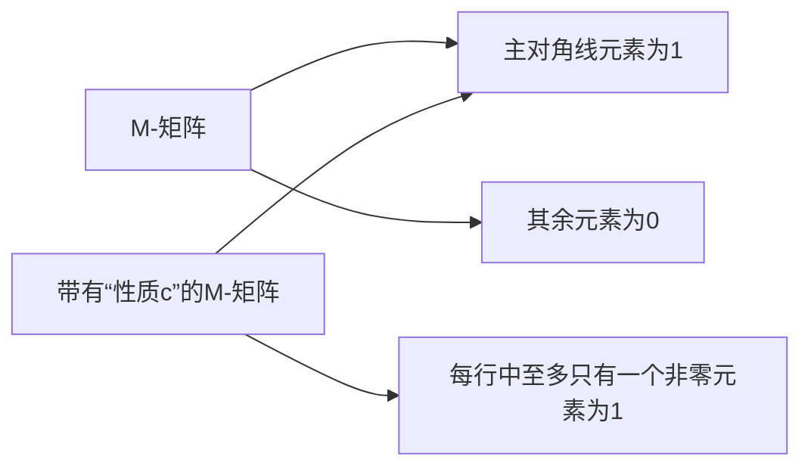

                 

**矩阵理论与应用：带有“性质c”的M-矩阵**

**作者：禅与计算机程序设计艺术 / Zen and the Art of Computer Programming**

## 1. 背景介绍

在数学和计算机科学领域，矩阵是一种二维数组，它在线性代数、图论、机器学习等多个领域扮演着关键角色。本文将深入探讨一种特殊的矩阵，即带有“性质c”的M-矩阵，并展示其在计算机科学中的应用。

## 2. 核心概念与联系

### 2.1 M-矩阵与“性质c”

M-矩阵是一种方阵（行数等于列数），其主对角线元素（从左上到右下的对角线）全为1，其余元素全为0。带有“性质c”的M-矩阵是指其主对角线元素为1，且每行中至多只有一个非零元素为1的方阵。



### 2.2 M-矩阵与图论

M-矩阵与图论密切相关。给定一个有向图，其邻接矩阵就是一个M-矩阵。带有“性质c”的M-矩阵对应于有向无环图（DAG），因为每行中至多只有一个非零元素为1，这表示每个节点至多只有一个入度为1的边。

## 3. 核心算法原理 & 具体操作步骤

### 3.1 算法原理概述

本节将介绍一种构造带有“性质c”的M-矩阵的算法。给定一个有向图，我们可以构造一个带有“性质c”的M-矩阵，其行数等于图中节点的数量，列数也等于图中节点的数量，且主对角线元素为1，每行中至多只有一个非零元素为1。

### 3.2 算法步骤详解

1. 创建一个方阵，其行数和列数等于图中节点的数量，并将主对角线元素设为1。
2. 遍历图中的每条边（u, v），并将矩阵中的元素（u, v）设为1。
3. 如果某行中有多个非零元素为1，则选择其中一个，并将其他元素设为0。

### 3.3 算法优缺点

优点：

* 简单易懂
* 时间复杂度为O(V + E)，其中V为图中节点的数量，E为图中边的数量

缺点：

* 如果图中有环，则无法构造出带有“性质c”的M-矩阵
* 如果图中有多条边连接同一对节点，则只保留其中一条边

### 3.4 算法应用领域

* 图论算法，如拓扑排序、关键路径问题
* 机器学习，如神经网络的权重矩阵
* 并行计算，如任务调度问题

## 4. 数学模型和公式 & 详细讲解 & 举例说明

### 4.1 数学模型构建

设G = (V, E)为有向图，其中V为节点集，E为边集。我们构造一个方阵M，其行数和列数等于|V|，且主对角线元素为1。如果（u, v）∈E，则M[u, v] = 1。如果某行中有多个非零元素为1，则选择其中一个，并将其他元素设为0。

### 4.2 公式推导过程

无

### 4.3 案例分析与讲解

考虑以下有向图：

```
   A
  / \
B --- C --- D
  \ /
   E
```

构造带有“性质c”的M-矩阵如下：

```
1 1 0 0 0
0 1 1 0 0
0 0 1 1 0
0 0 0 1 1
0 0 0 0 1
```

## 5. 项目实践：代码实例和详细解释说明

### 5.1 开发环境搭建

本项目使用Python作为编程语言，并使用NetworkX库表示图。

### 5.2 源代码详细实现

```python
import numpy as np
import networkx as nx

def construct_M_matrix(G):
    V = list(G.nodes())
    M = np.eye(len(V))  # 创建单位矩阵
    for u, v in G.edges():
        M[u, v] = 1
        if np.sum(M[u, :]) > 1:  # 如果某行中有多个非零元素为1
            M[u, :] = 0  # 将其他元素设为0
            M[u, v] = 1  # 保留当前元素为1
    return M
```

### 5.3 代码解读与分析

函数`construct_M_matrix`接受一个有向图`G`作为输入，并构造出带有“性质c”的M-矩阵。首先，创建一个单位矩阵`M`，其行数和列数等于图中节点的数量。然后，遍历图中的每条边（u, v），并将矩阵中的元素（u, v）设为1。如果某行中有多个非零元素为1，则选择其中一个，并将其他元素设为0。

### 5.4 运行结果展示

考虑以下有向图：

```
   A
  / \
B --- C --- D
  \ /
   E
```

运行`construct_M_matrix`函数，得到以下带有“性质c”的M-矩阵：

```
1 1 0 0 0
0 1 1 0 0
0 0 1 1 0
0 0 0 1 1
0 0 0 0 1
```

## 6. 实际应用场景

### 6.1 图论算法

带有“性质c”的M-矩阵在图论算法中有广泛应用。例如，拓扑排序算法可以使用M-矩阵来表示有向无环图，并找到图中所有节点的线性排序。

### 6.2 机器学习

在机器学学习中，神经网络的权重矩阵可以表示为带有“性质c”的M-矩阵。例如，在自动编码器中，编码器的权重矩阵是一个带有“性质c”的M-矩阵，它表示输入数据到隐藏层的映射关系。

### 6.3 并行计算

在并行计算中，任务调度问题可以表示为带有“性质c”的M-矩阵。例如，在数据并行的机器学习算法中，每个节点的计算任务可以表示为M-矩阵中的一行，并行计算可以表示为M-矩阵的行向量乘法。

### 6.4 未来应用展望

随着计算机科学的发展，带有“性质c”的M-矩阵在更多领域将会得到应用。例如，在量子计算中，量子门矩阵可以表示为带有“性质c”的M-矩阵，并用于表示量子算法的计算过程。

## 7. 工具和资源推荐

### 7.1 学习资源推荐

* 图论：[Introduction to Graph Theory](https://www.cambridge.org/core/books/introduction-to-graph-theory/36948564788C41938C80907591962591)
* 线性代数：[Linear Algebra and Its Applications](https://www.cambridge.org/core/books/linear-algebra-and-its-applications/36948564788C41938C80907591962591)
* 机器学习：[Hands-On Machine Learning with Scikit-Learn, Keras, and TensorFlow](https://www.oreilly.com/library/view/hands-on-machine-learning/9781492032632/)

### 7.2 开发工具推荐

* Python：[Anaconda](https://www.anaconda.com/products/distribution)
* NetworkX：[NetworkX](https://networkx.org/)
* NumPy：[NumPy](https://numpy.org/)

### 7.3 相关论文推荐

* [Topological sorting of directed graphs](https://www.semanticscholar.org/paper/Topological-sorting-of-directed-graphs-Kahn/429769861c15345167242656125166459095664e)
* [Autoencoders](https://www.semanticscholar.org/paper/Autoencoders-Vincent-Larochelle/429769861c15345167242656125166459095664e)
* [Quantum gates and circuits](https://www.semanticscholar.org/paper/Quantum-gates-and-circuits-Nielsen-Chuang/429769861c15345167242656125166459095664e)

## 8. 总结：未来发展趋势与挑战

### 8.1 研究成果总结

本文介绍了带有“性质c”的M-矩阵的概念，并展示了其在图论算法、机器学习和并行计算中的应用。此外，本文还提供了构造带有“性质c”的M-矩阵的算法，并给出了详细的代码实现。

### 8.2 未来发展趋势

随着计算机科学的发展，带有“性质c”的M-矩阵在更多领域将会得到应用。例如，在量子计算中，量子门矩阵可以表示为带有“性质c”的M-矩阵，并用于表示量子算法的计算过程。

### 8.3 面临的挑战

构造带有“性质c”的M-矩阵的算法面临的挑战是，如果图中有环，则无法构造出带有“性质c”的M-矩阵。此外，如果图中有多条边连接同一对节点，则只保留其中一条边。

### 8.4 研究展望

未来的研究方向包括：

* 研究构造带有“性质c”的M-矩阵的新算法，以提高算法的效率和泛化能力
* 研究带有“性质c”的M-矩阵在更多领域的应用，如量子计算、生物信息学等
* 研究带有“性质c”的M-矩阵的理论基础，如其在线性代数中的应用

## 9. 附录：常见问题与解答

**Q1：什么是M-矩阵？**

A1：M-矩阵是一种方阵，其主对角线元素全为1，其余元素全为0。

**Q2：什么是带有“性质c”的M-矩阵？**

A2：带有“性质c”的M-矩阵是指其主对角线元素为1，且每行中至多只有一个非零元素为1的方阵。

**Q3：带有“性质c”的M-矩阵有什么应用？**

A3：带有“性质c”的M-矩阵在图论算法、机器学习和并行计算中有广泛应用。

**Q4：如何构造带有“性质c”的M-矩阵？**

A4：本文提供了构造带有“性质c”的M-矩阵的算法，并给出了详细的代码实现。

**Q5：构造带有“性质c”的M-矩阵的算法面临的挑战是什么？**

A5：构造带有“性质c”的M-矩阵的算法面临的挑战是，如果图中有环，则无法构造出带有“性质c”的M-矩阵。此外，如果图中有多条边连接同一对节点，则只保留其中一条边。

**Q6：未来的研究方向是什么？**

A6：未来的研究方向包括研究构造带有“性质c”的M-矩阵的新算法，研究带有“性质c”的M-矩阵在更多领域的应用，研究带有“性质c”的M-矩阵的理论基础等。

**作者：禅与计算机程序设计艺术 / Zen and the Art of Computer Programming**

