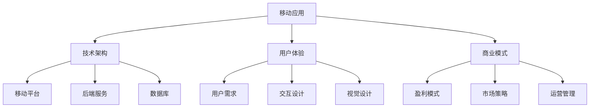

                 

移动互联网、创业、商业模式、用户体验、移动应用、市场竞争、风险投资、创业成功要素

## 1. 背景介绍

随着智能手机的普及和移动互联网的发展，移动互联网创业已经成为当今商业创新的热点领域。移动互联网创业的成功，不仅可以创造巨大的商业价值，还可以改善人们的生活方式，推动社会进步。然而，移动互联网创业也面临着激烈的市场竞争和各种挑战。本文将从技术、商业模式、用户体验、市场竞争和风险投资等方面，对移动互联网创业进行深入分析，并提供实用的建议和指南。

## 2. 核心概念与联系

移动互联网创业的核心是开发移动应用，为用户提供便捷、高效、个性化的服务。移动应用的开发需要考虑多个因素，包括技术架构、用户体验、商业模式等。下面是移动互联网创业的核心概念及其联系的 Mermaid 流程图：



## 3. 核心算法原理 & 具体操作步骤

### 3.1 算法原理概述

移动应用的开发离不开算法的支撑。常见的算法包括搜索算法、排序算法、图算法等。本文重点介绍推荐算法，因为它是移动应用中常见且关键的算法之一。

### 3.2 算法步骤详解

推荐算法的目的是为用户提供个性化的内容推荐。常见的推荐算法包括内容过滤、协同过滤和混合推荐等。本文介绍基于内容的推荐算法：

1. 数据收集：收集用户行为数据（如点击、浏览、购买等）和内容数据（如商品描述、标签等）。
2. 特征提取：提取用户和内容的特征向量，如 TF-IDF、Word2Vec 等。
3. 相似度计算：计算用户和内容之间的相似度，如余弦相似度、皮尔逊相关系数等。
4. 推荐列表生成：根据相似度排序，生成推荐列表。

### 3.3 算法优缺点

基于内容的推荐算法优点是简单易行，缺点是无法利用用户之间的相似性，推荐结果可能不够个性化。混合推荐算法则可以结合内容和协同过滤的优点，提高推荐的准确性。

### 3.4 算法应用领域

推荐算法在移动应用中广泛应用，如电商推荐、视频推荐、新闻推荐等。它可以提高用户的活跃度和忠诚度，从而提高移动应用的价值。

## 4. 数学模型和公式 & 详细讲解 & 举例说明

### 4.1 数学模型构建

在移动应用的开发中，数学模型常用于描述和预测用户行为。本文介绍用户生命周期价值（LTV）模型：

LTV = ARPU \* retention rate \* average customer lifetime

其中，ARPU 是平均收入 per user，retention rate 是用户保留率，average customer lifetime 是平均客户生命周期。

### 4.2 公式推导过程

LTV 模型的推导过程如下：

1. ARPU = monthly revenue / number of users
2. retention rate = (CE - CN) / (CS - CN)
   其中，CE 是当前月份的活跃用户数，CN 是新增用户数，CS 是上个月的活跃用户数。
3. average customer lifetime = 1 / (1 - retention rate)

### 4.3 案例分析与讲解

假设某移动应用的月收入为 100 万元，活跃用户数为 10 万，新增用户数为 2 万，上个月的活跃用户数为 9 万。则：

ARPU = 100 万元 / 10 万 = 10 元
retention rate = (10 万 - 2 万) / (9 万 - 2 万) = 0.8
average customer lifetime = 1 / (1 - 0.8) = 5 个月
LTV = 10 \* 0.8 \* 5 = 40 元

## 5. 项目实践：代码实例和详细解释说明

### 5.1 开发环境搭建

本文使用 Python 和 Flask 框架开发移动应用的后端服务。开发环境包括 Python 3.7、Flask 1.1、虚拟环境等。

### 5.2 源代码详细实现

以下是推荐算法的 Python 实现代码：

```python
from sklearn.feature_extraction.text import TfidfVectorizer
from sklearn.metrics.pairwise import cosine_similarity

# 数据收集和特征提取
def get_tfidf(data):
    vectorizer = TfidfVectorizer()
    tfidf = vectorizer.fit_transform(data)
    return tfidf

# 相似度计算
def get_similarity(tfidf, user, content):
    similarity = cosine_similarity(tfidf[user], tfidf[content]).flatten()
    return similarity

# 推荐列表生成
def get_recommendation(tfidf, user, content, n=5):
    similarity = get_similarity(tfidf, user, content)
    indices = similarity.argsort()[-n:][::-1]
    return indices

# 示例数据
users = ["user1", "user2", "user3"]
contents = ["content1", "content2", "content3"]
data = users + contents

# 运行推荐算法
tfidf = get_tfidf(data)
recommendation = get_recommendation(tfidf, "user1", "content")
print(recommendation)
```

### 5.3 代码解读与分析

代码首先使用 TF-IDF 算法提取用户和内容的特征向量。然后，计算用户和内容之间的余弦相似度。最后，根据相似度排序，生成推荐列表。

### 5.4 运行结果展示

运行推荐算法后，输出推荐列表的索引。开发人员可以根据索引获取推荐内容的详细信息，并将其展示给用户。

## 6. 实际应用场景

### 6.1 移动电商

移动电商是移动互联网创业的热门领域之一。推荐算法可以为用户提供个性化的商品推荐，提高购买转化率。此外，移动电商还需要考虑移动支付、物流配送等因素。

### 6.2 移动娱乐

移动娱乐包括移动游戏、视频、音乐等。推荐算法可以为用户提供个性化的内容推荐，提高用户的活跃度和忠诚度。此外，移动娱乐还需要考虑用户体验、社交功能等因素。

### 6.3 未来应用展望

随着人工智能和大数据技术的发展，移动互联网创业将面临新的机遇和挑战。未来的移动应用将更加智能化、个性化，为用户提供更加便捷、高效的服务。

## 7. 工具和资源推荐

### 7.1 学习资源推荐

* 移动互联网创业相关书籍：《创业维基》《移动互联网商业模式》《移动互联网创业实战》等
* 在线课程： Coursera、 Udacity、 edX 等平台上的移动互联网创业课程

### 7.2 开发工具推荐

* 移动应用开发：React Native、Flutter、Ionic 等跨平台开发框架
* 后端服务开发：Node.js、Python、Java 等后端语言和框架
* 数据库：MySQL、MongoDB、Redis 等数据库管理系统

### 7.3 相关论文推荐

* [推荐系统的发展与未来](https://www.jianshu.com/p/54755266)
* [移动应用推荐算法的研究进展](https://www.cnblogs.com/liangyonghua/p/10254631.html)
* [移动电商的商业模式与创新](https://www.jianshu.com/p/8553503c636f)

## 8. 总结：未来发展趋势与挑战

### 8.1 研究成果总结

本文从技术、商业模式、用户体验、市场竞争和风险投资等方面，对移动互联网创业进行了深入分析。我们介绍了推荐算法的原理和实现，并提供了 Python 实现代码。此外，我们还介绍了 LTV 模型，并进行了案例分析。

### 8.2 未来发展趋势

未来的移动互联网创业将更加注重用户体验、个性化服务和智能化技术。移动应用将朝着小程序化、轻量化、无缝化的方向发展。此外，人工智能、物联网、区块链等技术也将为移动互联网创业带来新的机遇。

### 8.3 面临的挑战

移动互联网创业面临的挑战包括激烈的市场竞争、用户获取成本高、盈利模式单一等。此外，数据安全、隐私保护等问题也亟待解决。

### 8.4 研究展望

未来的研究方向包括移动应用的智能化、个性化、无缝化等。此外，人工智能、物联网、区块链等技术在移动互联网创业中的应用也值得深入研究。

## 9. 附录：常见问题与解答

**Q1：移动互联网创业需要哪些技能？**

A1：移动互联网创业需要多种技能，包括移动应用开发、商业模式设计、用户体验设计、市场营销等。此外，创业者还需要具备创新思维、沟通能力、团队管理等软技能。

**Q2：如何评估移动应用的成功？**

A2：评估移动应用成功的指标包括用户量、活跃度、留存率、收入等。此外，用户反馈、市场地位等因素也需要考虑。

**Q3：如何获取风险投资？**

A3：获取风险投资需要准备详细的商业计划书、产品原型、市场分析等材料。此外，创业者还需要具备说服力、沟通能力等软技能。

**Q4：如何应对移动互联网创业的挑战？**

A4：应对移动互联网创业的挑战需要不断学习、创新、适应市场变化。此外，创业者还需要具备韧性、坚持、乐观等心理素质。

**Q5：如何保护移动应用的数据安全？**

A5：保护移动应用数据安全需要采取多种措施，包括数据加密、访问控制、安全审计等。此外，创业者还需要遵循相关法律法规，保护用户隐私。

## 作者：禅与计算机程序设计艺术 / Zen and the Art of Computer Programming

