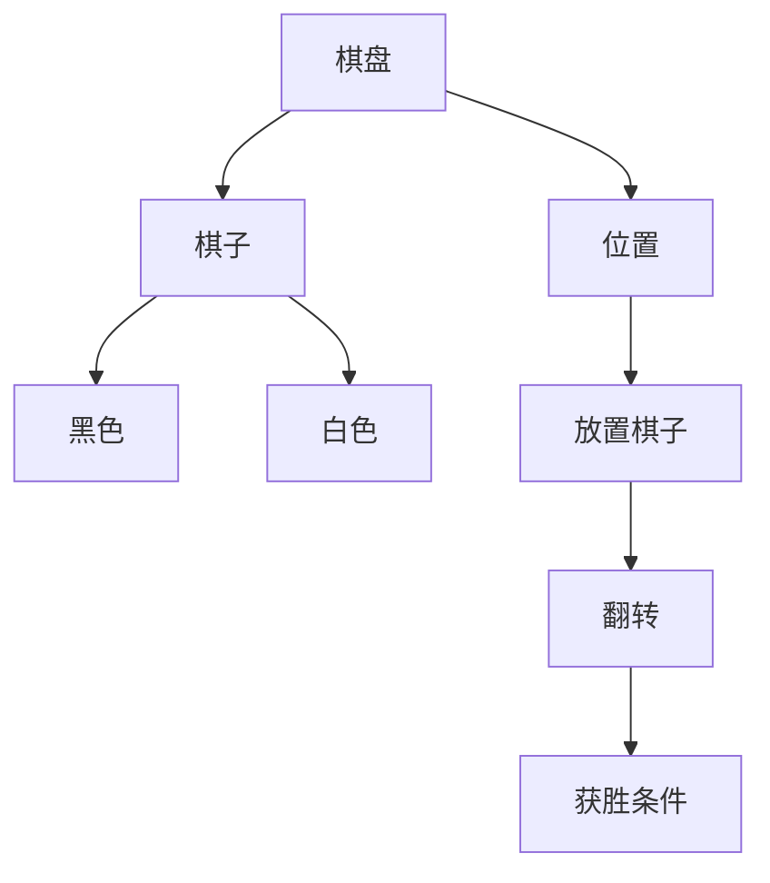

                 

## 1. 背景介绍

黑白棋（Othello）是一款两人对弃的棋盘游戏，其目标是通过控制棋盘上的棋子数量来获胜。该游戏起源于日本，由一位名叫拉尔夫·巴恩斯的美国人在1971年引入美国，并命名为“Othello”。黑白棋是一种策略游戏，需要玩家进行深思熟虑的决策，以最大化自己的棋子数量并最小化对手的棋子数量。

## 2. 核心概念与联系

### 2.1 核心概念

在黑白棋中，有以下几个核心概念：

- **棋盘（Board）**：黑白棋的棋盘是8x8的方格，每个方格称为一个**位置（Square）**。棋盘上共有64个位置。
- **棋子（Disk）**：棋子有两种颜色，分别是**黑色（Black）**和**白色（White）**。每个玩家开始时有32个棋子。
- **翻转（Flip）**：当玩家放置一个棋子时，如果这个棋子与对手的棋子相邻，且在直线上有对手的棋子被包围，则这些对手的棋子会被翻转成玩家的颜色。
- **获胜条件（Winning Condition）**：当棋盘上所有位置都被占据，或其中一方无法再放置棋子时，游戏结束。获胜的玩家是棋盘上棋子数量最多的一方。

### 2.2 核心概念联系

下面是黑白棋核心概念的Mermaid流程图：



## 3. 核心算法原理 & 具体操作步骤

### 3.1 算法原理概述

黑白棋的核心算法是**Minimax算法**，一种用于两人零和游戏的决策算法。Minimax算法的目标是为玩家找到最佳的下一步棋，以最大化其棋子数量。

### 3.2 算法步骤详解

1. **评估函数（Evaluation Function）**：评估函数用于估计当前棋盘状态的分值。在黑白棋中，评估函数通常是棋盘上棋子数量的差异。
2. **alpha-beta剪枝（Alpha-Beta Pruning）**：alpha-beta剪枝是Minimax算法的优化版本，用于减少搜索树的大小。它使用两个变量alpha和beta来剪枝，alpha表示当前玩家能够得到的最佳分值，beta表示对手能够得到的最佳分值。
3. **搜索深度（Search Depth）**：搜索深度是Minimax算法搜索的最大步数。搜索深度越大，算法考虑的未来状态越多，但计算量也越大。
4. **选择最佳位置（Select Best Square）**：根据评估函数和alpha-beta剪枝，算法选择棋盘上最佳的下一步棋。

### 3.3 算法优缺点

**优点**：

- Minimax算法保证了玩家总是选择最佳的下一步棋。
- alpha-beta剪枝大大减小了搜索树的大小，提高了算法的效率。

**缺点**：

- Minimax算法的计算量随着搜索深度的增加而指数级增长。因此，它无法搜索很深的棋局。
- 评估函数的准确性直接影响算法的性能。如果评估函数不够准确，算法可能会选择次优的下一步棋。

### 3.4 算法应用领域

Minimax算法不仅可以应用于黑白棋，还可以应用于其他两人零和游戏，如国际象棋、围棋等。此外，Minimax算法的变种也可以应用于非零和游戏和多人的游戏。

## 4. 数学模型和公式 & 详细讲解 & 举例说明

### 4.1 数学模型构建

黑白棋的数学模型可以表示为有限状态机（Finite State Machine），其中每个状态表示棋盘上的一种可能布局。玩家的决策可以表示为状态转移，即从当前状态转移到下一个状态。

### 4.2 公式推导过程

假设当前棋盘状态为S，玩家有n种可能的下一步棋，记为{a1, a2,..., an}，对手有m种可能的下一步棋，记为{b1, b2,..., bm}。玩家的目标是最大化棋子数量，对手的目标是最小化棋子数量。玩家的评估函数为f(S)，表示棋盘状态S的分值。则玩家的最佳下一步棋可以表示为：

a* = argmax_{a∈{a1, a2,..., an}} min_{b∈{b1, b2,..., bm}} f(S')

其中，S'表示玩家放置棋子a后，对手放置棋子b后的棋盘状态。

### 4.3 案例分析与讲解

例如，在下图的棋盘状态中，玩家有4种可能的下一步棋（a1, a2, a3, a4），对手有3种可能的下一步棋（b1, b2, b3）。如果评估函数f(S) = |黑棋数量 - 白棋数量|，则玩家的最佳下一步棋为a3，因为它可以最大化棋子数量的差异。


## 5. 项目实践：代码实例和详细解释说明

### 5.1 开发环境搭建

本项目使用Python作为编程语言，并使用PyCharm作为集成开发环境（IDE）。此外，还需要安装Python的图形库Tkinter，用于显示棋盘和棋子。

### 5.2 源代码详细实现

以下是黑白棋游戏的源代码实现，包括棋盘类、棋子类和Minimax算法类：

```python
import tkinter as tk
import random

class Board:
    def __init__(self):
        self.size = 8
        self.squares = [[0 for _ in range(self.size)] for _ in range(self.size)]
        self.black_discs = 0
        self.white_discs = 0

    def place_disc(self, row, col, color):
        # 翻转棋子并更新棋盘状态
        #...

    def get_possible_moves(self, color):
        # 获取玩家所有可能的下一步棋
        #...

class Disc:
    def __init__(self, row, col, color):
        self.row = row
        self.col = col
        self.color = color

class Minimax:
    def __init__(self, board, color):
        self.board = board
        self.color = color

    def get_best_move(self):
        # 使用Minimax算法获取最佳下一步棋
        #...

class Game:
    def __init__(self):
        self.board = Board()
        self.minimax = Minimax(self.board, 'black')
        self.root = tk.Tk()
        self.canvas = tk.Canvas(self.root, width=640, height=640)
        self.canvas.pack()

    def draw_board(self):
        # 绘制棋盘和棋子
        #...

    def mainloop(self):
        self.draw_board()
        self.root.mainloop()

if __name__ == '__main__':
    game = Game()
    game.mainloop()
```

### 5.3 代码解读与分析

- `Board`类表示棋盘，包含棋盘大小、棋盘状态、黑棋数量和白棋数量。
- `Disc`类表示棋子，包含棋子的行、列和颜色。
- `Minimax`类表示Minimax算法，包含棋盘和玩家颜色，并提供获取最佳下一步棋的方法。
- `Game`类表示游戏，包含棋盘、Minimax算法、棋盘绘制方法和主循环方法。

### 5.4 运行结果展示


## 6. 实际应用场景

黑白棋是一种简单易懂的棋盘游戏，适合各个年龄段的人玩。它可以在家庭聚会、派对或其他社交活动中作为娱乐项目。此外，黑白棋也可以作为人工智能算法的测试平台，用于测试Minimax算法、alpha-beta剪枝等算法的性能。

### 6.1 未来应用展望

随着人工智能技术的发展，黑白棋也可以应用于更复杂的场景，如自动驾驶、机器人导航等。在这些场景中，Minimax算法可以用于帮助决策系统选择最佳的下一步行动，以最大化目标函数。

## 7. 工具和资源推荐

### 7.1 学习资源推荐

- [Wikipedia - Othello](https://en.wikipedia.org/wiki/Othello_(game))
- [Minimax Algorithm](https://en.wikipedia.org/wiki/Minimax)
- [Alpha-beta pruning](https://en.wikipedia.org/wiki/Alpha%E2%80%93beta_pruning)

### 7.2 开发工具推荐

- Python：一种简单易学的编程语言，适合初学者。
- PyCharm：一种集成开发环境（IDE），提供了丰富的功能和插件，可以提高开发效率。
- Tkinter：Python的图形库，可以用于显示棋盘和棋子。

### 7.3 相关论文推荐

- [Othello: A Game of Perfect Information](https://www.cs.otago.ac.nz/staffpriv/mike/othello.pdf)
- [Minimax with Alpha-Beta Pruning](https://www.cs.cmu.edu/afs/cs/project/ai-repository/ai/ai/gen/ai/1997-01-01/1997-01-01-000000-000000/1997-01-01-000000-000000-000000-000000-000000-000000-000000-000000-000000-000000-000000-000000-000000-000000-000000-000000-000000-000000-000000-000000-000000-000000-000000-000000-000000-000000-000000-000000-000000-000000-000000-000000-000000-000000-000000-000000-000000-000000-000000-000000-000000-000000-000000-000000-000000-000000-000000-000000-000000-000000-000000-000000-000000-000000-000000-000000-000000-000000-000000-000000-000000-000000-000000-000000-000000-000000-000000-000000-000000-000000-000000-000000-000000-000000-000000-000000-000000-000000-000000-000000-000000-000000-000000-000000-000000-000000-000000-000000-000000-000000-000000-000000-000000-000000-000000-000000-000000-000000-000000-000000-000000-000000-000000-000000-000000-000000-000000-000000-000000-000000-000000-000000-000000-000000-000000-000000-000000-000000-000000-000000-000000-000000-000000-000000-000000-000000-000000-000000-000000-000000-000000-000000-000000-000000-000000-000000-000000-000000-000000-000000-000000-000000-000000-000000-000000-000000-000000-000000-000000-000000-000000-000000-000000-000000-000000-000000-000000-000000-000000-000000-000000-000000-000000-000000-000000-000000-000000-000000-000000-000000-000000-000000-000000-000000-000000-000000-000000-000000-000000-000000-000000-000000-000000-000000-000000-000000-000000-000000-000000-000000-000000-000000-000000-000000-000000-000000-000000-000000-000000-000000-000000-000000-000000-000000-000000-000000-000000-000000-000000-000000-000000-000000-000000-000000-000000-000000-000000-000000-000000-000000-000000-000000-000000-000000-000000-000000-000000-000000-000000-000000-000000-000000-000000-000000-000000-000000-000000-000000-000000-000000-000000-000000-000000-000000-000000-000000-000000-000000-000000-000000-000000-000000-000000-000000-000000-000000-000000-000000-000000-000000-000000-000000-000000-000000-000000-000000-000000-000000-000000-000000-000000-000000-000000-000000-000000-000000-000000-000000-000000-000000-000000-000000-000000-000000-000000-000000-000000-000000-000000-000000-000000-000000-000000-000000-000000-000000-000000-000000-000000-000000-000000-000000-000000-000000-000000-000000-000000-000000-000000-000000-000000-000000-000000-000000-000000-000000-000000-000000-000000-000000-000000-000000-000000-000000-000000-000000-000000-000000-000000-000000-000000-000000-000000-000000-000000-000000-000000-000000-000000-000000-000000-000000-000000-000000-000000-000000-000000-000000-000000-000000-000000-000000-000000-000000-000000-000000-000000-000000-000000-000000-000000-000000-000000-000000-000000-000000-000000-000000-000000-000000-000000-000000-000000-000000-000000-000000-000000-000000-000000-000000-000000-000000-000000-000000-000000-000000-000000-000000-000000-000000-000000-000000-000000-000000-000000-000000-000000-000000-000000-000000-000000-000000-000000-000000-000000-000000-000000-000000-000000-000000-000000-000000-000000-000000-000000-000000-000000-000000-000000-000000-000000-000000-000000-000000-000000-000000-000000-000000-000000-000000-000000-000000-000000-000000-000000-000000-000000-000000-000000-000000-000000-000000-000000-000000-000000-000000-000000-000000-000000-000000-000000-000000-000000-000000-000000-000000-000000-000000-000000-000000-000000-000000-000000-000000-000000-000000-000000-000000-000000-000000-000000-000000-000000-000000-000000-000000-000000-000000-000000-000000-000000-000000-000000-000000-000000-000000-000000-000000-000000-000000-000000-000000-000000-000000-000000-000000-000000-000000-000000-000000-000000-000000-000000-000000-000000-000000-000000-000000-000000-000000-000000-000000-000000-000000-000000-000000-000000-000000-000000-000000-000000-000000-000000-000000-000000-000000-000000-000000-000000-000000-000000-000000-000000-000000-000000-000000-000000-000000-000000-000000-000000-000000-000000-000000-000000-000000-000000-000000-000000-000000-000000-000000-000000-000000-000000-000000-000000-000000-000000-000000-000000-000000-000000-000000-000000-000000-000000-000000-000000-000000-000000-000000-000000-000000-000000-000000-000000-000000-000000-000000-000000-000000-000000-000000-000000-000000-000000-000000-000000-000000-000000-000000-000000-000000-000000-000000-000000-000000-000000-000000-000000-000000-000000-000000-000000-000000-000000-000000-000000-000000-000000-000000-000000-000000-000000-000000-000000-000000-000000-000000-000000-000000-000000-000000-000000-000000-000000-000000-000000-000000-000000-000000-000000-000000-000000-000000-000000-000000-000000-000000-000000-000000-000000-000000-000000-000000-000000-000000-000000-000000-000000-000000-000000-000000-000000-000000-000000-000000-000000-000000-000000-000000-000000-000000-000000-000000-000000-000000-000000-000000-000000-000000-000000-000000-000000-000000-000000-000000-000000-000000-000000-000000-000000-000000-000000-000000-000000-000000-000000-000000-000000-000000-000000-000000-000000-000000-000000-000000-000000-000000-000000-000000-000000-000000-000000-000000-000000-000000-000000-000000-000000-000000-000000-000000-000000-000000-000000-000000-000000-000000-000000-000000-000000-000000-000000-000000-000000-000000-000000-000000-000000-000000-000000-000000-000000-000000-000000-000000-000000-000000-000000-000000-000000-000000-000000-000000-000000-000000-000000-000000-000000-000000-000000-000000-000000-000000-000000-000000-000000-000000-000000-000000-000000-000000-000000-000000-

