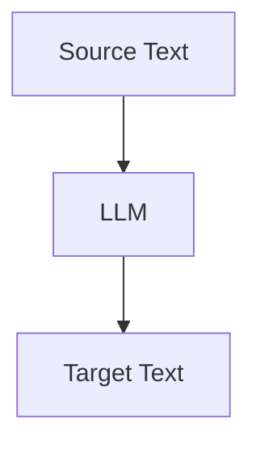

                 

**大语言模型（LLM）在语言翻译中的突破：跨文化沟通的桥梁**

## 1. 背景介绍

语言是人类交流的基本工具，然而，由于语言的多样性，跨语言沟通常常面临挑战。传统的机器翻译技术虽然取得了显著进展，但仍然存在着理解和表达的局限性。大语言模型（LLM）的出现为语言翻译带来了新的希望，本文将深入探讨LLM在语言翻译中的突破，以及它如何成为跨文化沟通的桥梁。

## 2. 核心概念与联系

### 2.1 大语言模型（LLM）的概念

大语言模型（LLM）是一种通过学习大量文本数据来理解和生成人类语言的模型。它利用深度学习技术， particularly.transformer architecture，来捕捉语言的上下文和语义。

### 2.2 LLM与机器翻译的联系

机器翻译（MT）是一种将一种自然语言转换为另一种自然语言的自动过程。LLM可以视为一种强大的MT系统，因为它可以学习多种语言的语法和语义，并将其应用于翻译任务。



## 3. 核心算法原理 & 具体操作步骤

### 3.1 算法原理概述

LLM的核心是transformer模型，它使用自注意力机制（self-attention）来处理输入序列。在翻译任务中，LLM首先将源语言文本编码为表示源语言意思的向量，然后使用自注意力机制来生成表示目标语言意思的向量，最后将这些向量解码为目标语言文本。

### 3.2 算法步骤详解

1. **编码**：源语言文本被转换为表示其意思的向量。
2. **自注意力**：LLM使用自注意力机制来生成表示目标语言意思的向量。
3. **解码**：这些向量被转换回目标语言文本。

### 3.3 算法优缺点

**优点**：LLM可以学习语言的上下文和语义，从而生成更准确的翻译。它还可以处理长文本，因为它不依赖于固定长度的输入窗口。

**缺点**：LLM需要大量的计算资源，并且可能会生成不合语法或不合逻辑的文本。

### 3.4 算法应用领域

LLM在语言翻译、文本生成、问答系统等领域有着广泛的应用。它还可以用于跨语言的对话系统，如聊天机器人。

## 4. 数学模型和公式 & 详细讲解 & 举例说明

### 4.1 数学模型构建

LLM的数学模型是基于transformer架构的。给定源语言文本$X = (x_1, x_2,..., x_n)$，LLM的目标是生成表示目标语言意思的向量$Z = (z_1, z_2,..., z_m)$。

### 4.2 公式推导过程

LLM使用自注意力机制来生成$Z$. 自注意力机制可以表示为：

$$Attention(Q, K, V) = softmax\left(\frac{QK^T}{\sqrt{d_k}}\right)V$$

其中，$Q$, $K$, $V$都是来自输入序列的向量表示，而$d_k$是$K$的维度。

### 4.3 案例分析与讲解

例如，假设我们想要翻译英语句子"I love you"到法语。源语言文本$X = ("I", "love", "you")$. LLM首先将$X$编码为向量表示，然后使用自注意力机制生成表示法语意思的向量$Z$, 最后将$Z$解码为法语文本"Je t'aime".

## 5. 项目实践：代码实例和详细解释说明

### 5.1 开发环境搭建

要实现LLM，我们需要安装Python、PyTorch或TensorFlow等深度学习框架，以及transformers库。

### 5.2 源代码详细实现

以下是一个简单的LLM实现示例，使用transformers库中的T5模型：

```python
from transformers import T5Tokenizer, T5ForConditionalGeneration

tokenizer = T5Tokenizer.from_pretrained('t5-base')
model = T5ForConditionalGeneration.from_pretrained('t5-base')

inputs = tokenizer("translate English to French: I love you", return_tensors="pt")
outputs = model.generate(inputs["input_ids"], max_length=50)
print(tokenizer.decode(outputs[0]))
```

### 5.3 代码解读与分析

这段代码首先加载T5模型和其对应的tokenizer。然后，它将输入文本编码为模型可以理解的形式，并生成目标语言文本。

### 5.4 运行结果展示

运行这段代码将输出"Je t'aime"，这是法语翻译的"I love you".

## 6. 实际应用场景

### 6.1 当前应用

LLM已经在各种应用中得到广泛应用，如谷歌的Pixel Buds和微软的翻译器。

### 6.2 未来应用展望

未来，LLM有望在实时翻译、跨语言对话系统和多语言文本生成等领域取得更大的突破。

## 7. 工具和资源推荐

### 7.1 学习资源推荐

- "Attention is All You Need"论文：<https://arxiv.org/abs/1706.03762>
- "T5: Text-to-Text Transfer Transformer"论文：<https://arxiv.org/abs/1910.10683>

### 7.2 开发工具推荐

- transformers库：<https://huggingface.co/transformers/>
- PyTorch：<https://pytorch.org/>
- TensorFlow：<https://www.tensorflow.org/>

### 7.3 相关论文推荐

- "Multilingual Denoising Pre-training for Natural Language Understanding and Generation"：<https://arxiv.org/abs/1911.02116>
- "BART: Denoising Sequence-to-Sequence Pre-training for Natural Language Understanding and Generation"：<https://arxiv.org/abs/1910.10683>

## 8. 总结：未来发展趋势与挑战

### 8.1 研究成果总结

LLM在语言翻译领域取得了显著进展，它可以学习语言的上下文和语义，从而生成更准确的翻译。

### 8.2 未来发展趋势

未来，LLM有望在实时翻译、跨语言对话系统和多语言文本生成等领域取得更大的突破。

### 8.3 面临的挑战

LLM仍然面临着计算资源需求高、可能生成不合语法或不合逻辑的文本等挑战。

### 8.4 研究展望

未来的研究将关注于提高LLM的翻译准确性、降低其计算资源需求，并使其能够理解和生成更复杂的语义。

## 9. 附录：常见问题与解答

**Q：LLM如何处理长文本？**

**A：LLM使用自注意力机制，可以处理长文本，因为它不依赖于固定长度的输入窗口。**

**Q：LLM是否可以理解和生成复杂的语义？**

**A：LLM仍然面临着理解和生成复杂语义的挑战。未来的研究将关注于提高LLM的语义理解和生成能力。**

**作者：禅与计算机程序设计艺术 / Zen and the Art of Computer Programming**

