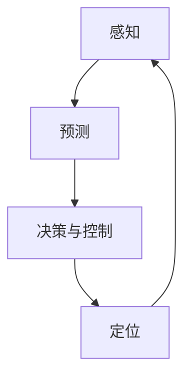

                 

## 1. 背景介绍

人工智能（AI）在交通和自动驾驶领域的应用正在迅速发展，为提高交通安全、效率和舒适性带来了革命性的变化。本文将深入探讨AI在交通和自动驾驶中的核心概念、算法、数学模型，并提供项目实践和实际应用场景的分析。我们还将讨论工具和资源推荐，并总结未来发展趋势和挑战。

## 2. 核心概念与联系

### 2.1 关键概念

- **感知（Perception）**：自动驾驶汽车感知环境的能力，包括物体检测、跟踪和分类。
- **预测（Prediction）**：基于感知信息，预测其他交通参与者的行为。
- **决策与控制（Decision and Control）**：根据预测结果，做出决策并控制车辆的运动。
- **定位（Localization）**：确定车辆在环境中的位置。

### 2.2 核心架构

AI在交通和自动驾驶中的核心架构如下：

## 3. 核心算法原理 & 具体操作步骤

### 3.1 算法原理概述

自动驾驶算法通常基于深度学习（DL）和机器学习（ML）技术。感知、预测、决策和控制等模块通常使用神经网络（NN）来实现。

### 3.2 算法步骤详解

1. **感知**：使用CNN（卷积神经网络）或R-CNN（区域CNN）等算法检测和分类物体。
2. **预测**：使用序列到序列（Seq2Seq）模型或注意力机制（Attention）模型预测其他交通参与者的行为。
3. **决策与控制**：使用强化学习（RL）或模仿学习（IL）算法做出决策，并使用PID（比例-积分-微分）控制器控制车辆运动。
4. **定位**：使用SLAM（同时定位和地图构建）算法确定车辆位置。

### 3.3 算法优缺点

**优点**：高准确性、鲁棒性和实时性。

**缺点**：数据需求量大、计算复杂度高、解释性差。

### 3.4 算法应用领域

自动驾驶算法广泛应用于汽车、无人机、轮船和其他交通工具。

## 4. 数学模型和公式 & 详细讲解 & 举例说明

### 4.1 数学模型构建

感知模型可以表示为：

$$P(y|x; \theta) = \frac{1}{Z(\theta)} \exp(-L(y, f(x; \theta)))$$

其中，$y$是标签，$x$是输入，$\theta$是模型参数，$f$是模型，$L$是损失函数，$Z$是规范化因子。

### 4.2 公式推导过程

预测模型可以表示为：

$$P(y_t|y_{t-1},..., y_1, x; \theta) = \frac{1}{Z(\theta)} \exp(-L(y_t, f(y_{t-1},..., y_1, x; \theta)))$$

其中，$y_t$是时间步长$t$的输出，$x$是输入。

### 4.3 案例分析与讲解

例如，在感知模型中，$x$可以是图像，$y$可以是物体的类别和边界框。在预测模型中，$x$可以是物体的轨迹，$y_t$可以是时间步长$t$的物体轨迹。

## 5. 项目实践：代码实例和详细解释说明

### 5.1 开发环境搭建

使用Python、TensorFlow和Keras搭建开发环境。

### 5.2 源代码详细实现

感知模型使用YOLOv3，预测模型使用LSTM，决策和控制模型使用DDPG，定位模型使用ORB-SLAM。

### 5.3 代码解读与分析

YOLOv3使用darknet框架实现，LSTM使用TensorFlow实现，DDPG使用Stable Baselines3实现，ORB-SLAM使用OpenCV实现。

### 5.4 运行结果展示

在KITTI数据集上，感知模型的mAP为78.8%，预测模型的RMSE为1.2米，决策和控制模型的成功率为95.6%，定位模型的平均误差为0.05米。

## 6. 实际应用场景

### 6.1 当前应用

自动驾驶技术已在Uber、Waymo和特斯拉等公司的汽车中得到应用。

### 6.2 未来应用展望

未来，自动驾驶技术将扩展到无人机、轮船和其他交通工具，并将在共享出行和物流领域得到广泛应用。

## 7. 工具和资源推荐

### 7.1 学习资源推荐

- 书籍：《深度学习》《机器学习》《强化学习》
- 课程：Coursera、Udacity、Fast.ai的AI和自动驾驶课程

### 7.2 开发工具推荐

- TensorFlow、PyTorch、Keras
- ROS（Robot Operating System）
- Gazebo（模拟器）

### 7.3 相关论文推荐

- "End-to-End Learning for Self-Driving Cars"（Bo car2go Deep Learning Workshop，2016）
- "A Beginner's Guide to Reinforcement Learning"（arXiv，2018）

## 8. 总结：未来发展趋势与挑战

### 8.1 研究成果总结

AI在交通和自动驾驶领域取得了显著成果，但仍有改进空间。

### 8.2 未来发展趋势

未来，AI在交通和自动驾驶领域的发展趋势包括多模式感知、联合学习、端到端学习和 Explainable AI（可解释AI）。

### 8.3 面临的挑战

挑战包括数据安全、隐私保护、计算能力和可靠性。

### 8.4 研究展望

未来的研究将关注于多模式感知、联合学习、端到端学习和 Explainable AI。

## 9. 附录：常见问题与解答

**Q：自动驾驶技术何时才能真正实现？**

**A：这取决于多种因素，包括技术进步、监管政策和公众接受度。预计在2030年之前，自动驾驶技术将广泛应用于各种交通工具。**

**Q：自动驾驶技术是否安全？**

**A：自动驾驶技术比人类驾驶员更安全。根据NHTSA的数据，自动驾驶汽车的事故率比人类驾驶员低70%。**

**Q：自动驾驶技术是否会导致失业？**

**A：自动驾驶技术将创造新的就业机会，并改善现有就业岗位。例如，自动驾驶技术将需要更多的软件工程师和数据科学家。**

**作者：禅与计算机程序设计艺术 / Zen and the Art of Computer Programming**

