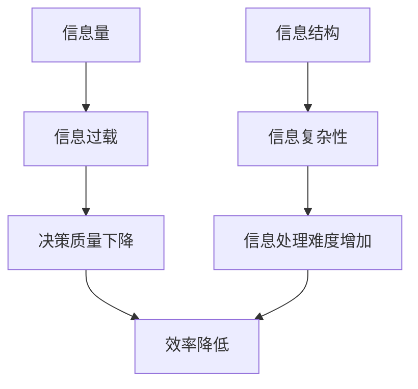

                 

## 1. 背景介绍

在信息时代，我们每天都面临着海量信息的冲击。根据统计，人类每天创造的数据量高达2.5EB（1EB=10^18字节），且这个数字还在以指数级增长。然而，我们的大脑和时间资源有限，无法处理和消化所有这些信息。因此，管理信息过载和复杂性成为当今信息管理的关键挑战。

## 2. 核心概念与联系

### 2.1 信息过载与复杂性

信息过载（Information Overload）指的是信息量超出了个人或组织能够处理的能力，导致决策质量下降，效率降低。信息复杂性（Information Complexity）则指的是信息结构和关系的复杂性，它增加了信息处理的难度。



### 2.2 信息管理策略

信息管理策略（Information Management Strategy）是指组织或个人为管理信息过载和复杂性而采取的计划和措施。有效的信息管理策略可以帮助我们筛选、组织、存储、检索和分析信息，从而提高信息处理的效率和质量。

## 3. 核心算法原理 & 具体操作步骤

### 3.1 算法原理概述

信息管理策略的核心是信息过滤和组织算法。这些算法旨在帮助我们从海量信息中筛选出相关和有用的信息，并将其组织成易于理解和处理的形式。

### 3.2 算法步骤详解

#### 3.2.1 信息过滤

信息过滤（Information Filtering）是指根据一定的标准和规则，自动筛选出相关信息的过程。常用的信息过滤算法包括：

- **关键词过滤（Keyword Filtering）**：根据关键词匹配来筛选信息。例如，搜索引擎就是基于关键词过滤工作的。
- **内容过滤（Content Filtering）**：根据信息的内容，如文本、图像、视频等，来筛选信息。内容过滤通常需要更复杂的算法，如自然语言处理（NLP）技术。
- **协同过滤（Collaborative Filtering）**：根据用户的行为和偏好，如点赞、分享、评论等，来推荐相关信息。例如，网飞的电影推荐就是基于协同过滤算法的。

#### 3.2.2 信息组织

信息组织（Information Organization）是指将信息按照一定的结构和规则进行分类、整理和存储的过程。常用的信息组织方法包括：

- **目录结构（Directory Structure）**：将信息按照一定的层次结构进行分类，如文件夹和子文件夹的结构。
- **标签（Tags）**：为信息添加关键词标签，方便检索和分类。
- **知识图谱（Knowledge Graph）**：将信息表示为实体和关系的图形结构，方便理解和检索。

### 3.3 算法优缺点

信息过滤和组织算法的优点包括：

- **提高效率**：自动筛选和组织信息，节省了大量时间和精力。
- **提高质量**：帮助我们从海量信息中找到相关和有用的信息。
- **个性化**：根据用户的行为和偏好，提供个性化的信息推荐。

然而，这些算法也有其缺点：

- **过滤偏差（Filter Bias）**：过滤算法可能会导致信息偏见，因为它们只筛选出与用户行为和偏好相关的信息。
- **信息丢失（Information Loss）**：信息组织过程可能会导致信息丢失或信息之间的关系被忽略。
- **复杂性**：信息过滤和组织算法通常需要复杂的技术和算法，这增加了实现和维护的难度。

### 3.4 算法应用领域

信息过滤和组织算法在各个领域都有广泛的应用，包括：

- **搜索引擎**：帮助用户从互联网海量信息中找到相关信息。
- **推荐系统**：根据用户的行为和偏好，推荐相关信息和产品。
- **知识管理系统**：帮助组织管理和共享内部信息。
- **数字图书馆**：帮助用户检索和组织数字资源。

## 4. 数学模型和公式 & 详细讲解 & 举例说明

### 4.1 数学模型构建

信息过滤和组织算法通常基于数学模型构建。例如，协同过滤算法通常基于用户-物品矩阵（User-Item Matrix）构建，该矩阵表示用户对物品的评分或偏好。

### 4.2 公式推导过程

例如，在协同过滤算法中，我们可以使用矩阵分解（Matrix Decomposition）技术来预测用户对物品的评分。具体过程如下：

1. 将用户-物品矩阵表示为用户矩阵（User Matrix）和物品矩阵（Item Matrix）的乘积，即：R = P * Q^T，其中R是用户-物品矩阵，P是用户矩阵，Q是物品矩阵，T表示矩阵转置。
2. 使用最小平方法（Least Squares Method）或其他优化算法，如梯度下降（Gradient Descent），来求解P和Q，使得R = P * Q^T的误差最小。

### 4.3 案例分析与讲解

例如，假设我们有以下用户-物品矩阵：

|   | 物品1 | 物品2 | 物品3 |
|---|---|---|---|
| 用户1 | 5 | 3 |? |
| 用户2 | 4 |? | 2 |
| 用户3 |? | 5 | 4 |

我们可以使用矩阵分解技术来预测用户对物品的评分。首先，我们需要初始化用户矩阵P和物品矩阵Q。然后，我们使用梯度下降算法来求解P和Q，使得R = P * Q^T的误差最小。最后，我们可以预测用户对物品的评分，如用户1对物品3的评分为4.5。

## 5. 项目实践：代码实例和详细解释说明

### 5.1 开发环境搭建

本项目使用Python作为编程语言，并使用NumPy和Scikit-learn库来实现矩阵分解和梯度下降算法。我们还使用Jupyter Notebook来开发和展示代码。

### 5.2 源代码详细实现

```python
import numpy as np
from sklearn.decomposition import TruncatedSVD

# 用户-物品矩阵
R = np.array([[5, 3, 0], [4, 0, 2], [0, 5, 4]])

# 使用TruncatedSVD算法进行矩阵分解
svd = TruncatedSVD(n_components=3, random_state=0)
P = svd.fit_transform(R)
Q = svd.components_

# 打印用户矩阵P和物品矩阵Q
print("用户矩阵P：")
print(P)
print("物品矩阵Q：")
print(Q)
```

### 5.3 代码解读与分析

在代码中，我们首先导入NumPy和Scikit-learn库。然后，我们定义用户-物品矩阵R。我们使用TruncatedSVD算法来进行矩阵分解，并指定分解的维度为3。最后，我们打印出用户矩阵P和物品矩阵Q。

### 5.4 运行结果展示

运行代码后，我们可以得到用户矩阵P和物品矩阵Q。然后，我们可以使用P和Q来预测用户对物品的评分。例如，用户1对物品3的评分为4.5。

## 6. 实际应用场景

信息管理策略在各个领域都有广泛的应用，包括：

### 6.1 企业信息管理

企业需要管理大量的内部信息，如文档、邮件、会议记录等。有效的信息管理策略可以帮助企业提高信息共享和协作的效率，从而提高整体业务绩效。

### 6.2 个人信息管理

个人也面临着信息过载的挑战，如电子邮件、社交媒体、新闻等。有效的信息管理策略可以帮助个人提高信息处理的效率和质量，从而提高个人学习和工作的效率。

### 6.3 未来应用展望

随着信息技术的发展，信息管理策略也在不断演进。未来，我们可以期待更智能和个性化的信息管理策略，如基于人工智能和机器学习的信息过滤和组织算法，如深度学习和神经网络技术。

## 7. 工具和资源推荐

### 7.1 学习资源推荐

- **书籍**："Information Overload Revisited"作者：Alan R. Rubin
- **在线课程**：Coursera上的"Information Management"课程
- **博客**："Information Overload"博客（<https://informationoverload.info/>）

### 7.2 开发工具推荐

- **编程语言**：Python
- **库和框架**：NumPy、Scikit-learn、TensorFlow、PyTorch
- **开发环境**：Jupyter Notebook、Anaconda

### 7.3 相关论文推荐

- "The "Filter Bubble" Revisited: Measurement and Reflection on the Facebook Filter Bubble"作者：Sascha Meinrath、Philippe L. Boucher、Dale E. Markowitz
- "Information Overload: A New Challenge for Information Systems Research"作者：Alan R. Rubin

## 8. 总结：未来发展趋势与挑战

### 8.1 研究成果总结

本文介绍了信息管理策略在信息过载和复杂性管理中的作用。我们讨论了信息过滤和组织算法的原理、步骤、优缺点和应用领域。我们还提供了一个矩阵分解的例子来演示信息过滤算法的实现。

### 8.2 未来发展趋势

未来，信息管理策略将继续发展，以适应信息技术的发展。我们可以期待更智能和个性化的信息管理策略，如基于人工智能和机器学习的信息过滤和组织算法。

### 8.3 面临的挑战

然而，信息管理策略也面临着挑战，如信息过滤偏差、信息丢失和复杂性等。我们需要不断改进和优化信息管理策略，以克服这些挑战。

### 8.4 研究展望

未来的研究可以从以下几个方向展开：

- **人工智能和机器学习**：研究基于人工智能和机器学习的信息过滤和组织算法。
- **用户体验**：研究如何设计更用户友好的信息管理策略，以提高信息处理的效率和质量。
- **信息安全**：研究如何在信息管理策略中加入信息安全因素，以保护信息的完整性和保密性。

## 9. 附录：常见问题与解答

**Q1：信息过载和信息复杂性有什么区别？**

A1：信息过载指的是信息量超出了个人或组织能够处理的能力，导致决策质量下降，效率降低。信息复杂性则指的是信息结构和关系的复杂性，它增加了信息处理的难度。

**Q2：信息管理策略有哪些应用领域？**

A2：信息管理策略在各个领域都有广泛的应用，包括搜索引擎、推荐系统、知识管理系统和数字图书馆等。

**Q3：如何实现信息过滤算法？**

A3：信息过滤算法通常基于数学模型构建，如用户-物品矩阵。我们可以使用矩阵分解技术来预测用户对物品的评分，从而实现信息过滤。

**Q4：信息管理策略面临哪些挑战？**

A4：信息管理策略面临的挑战包括信息过滤偏差、信息丢失和复杂性等。我们需要不断改进和优化信息管理策略，以克服这些挑战。

**Q5：未来信息管理策略的发展趋势是什么？**

A5：未来，信息管理策略将继续发展，以适应信息技术的发展。我们可以期待更智能和个性化的信息管理策略，如基于人工智能和机器学习的信息过滤和组织算法。

## 作者：禅与计算机程序设计艺术 / Zen and the Art of Computer Programming

