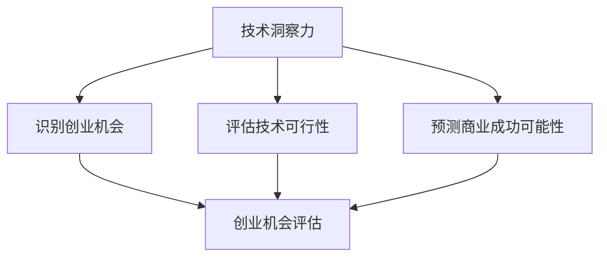

                 

**利用技术洞察力进行创业机会评估**

## 1. 背景介绍

在当今快速变化的商业环境中，创业机会评估（Venture Opportunity Assessment, VOA）是创业者和投资者面临的关键挑战。技术洞察力，即对技术趋势、创新和其商业应用的理解，是进行有效VOA的关键。本文将介绍如何利用技术洞察力进行创业机会评估，从而帮助创业者和投资者做出明智的决策。

## 2. 核心概念与联系

### 2.1 技术洞察力

技术洞察力是指对技术趋势、创新和其商业应用的理解，它是创业成功的关键因素之一。技术洞察力包括对技术的理解、对市场需求的洞察，以及将二者结合以创造商业价值的能力。

### 2.2 创业机会评估

创业机会评估是指对创业项目的商业可行性和技术可行性进行评估的过程。VOA的目的是帮助创业者和投资者做出明智的决策，以最大化创业项目的成功概率。

### 2.3 技术洞察力与创业机会评估的联系

技术洞察力是VOA的关键输入，它帮助创业者和投资者理解技术趋势、创新和其商业应用。通过技术洞察力，创业者和投资者可以识别有前途的创业机会，评估其技术可行性，并预测其商业成功的可能性。



## 3. 核心算法原理 & 具体操作步骤

### 3.1 算法原理概述

技术洞察力驱动的创业机会评估算法（TD-VOA）是一种基于技术洞察力的VOA方法。TD-VOA包括四个步骤：识别创业机会、评估技术可行性、预测商业成功可能性，以及综合评估。

### 3.2 算法步骤详解

#### 3.2.1 识别创业机会

技术洞察力帮助创业者和投资者识别有前途的创业机会。这一步骤包括：

1. 跟踪技术趋势：跟踪关键技术领域的最新发展，如人工智能、物联网、区块链等。
2. 识别创新：识别具有商业应用潜力的创新技术。
3. 分析市场需求：分析市场需求，识别有增长潜力的市场。

#### 3.2.2 评估技术可行性

这一步骤包括：

1. 技术评估：评估创业项目的技术可行性，包括技术成熟度、技术风险等。
2. 专利和知识产权评估：评估创业项目的专利和知识产权保护情况。
3. 技术团队评估：评估创业项目的技术团队的能力和经验。

#### 3.2.3 预测商业成功可能性

这一步骤包括：

1. 商业模式评估：评估创业项目的商业模式，包括收入来源、成本结构等。
2. 市场分析：分析目标市场，包括市场规模、竞争格局等。
3. 客户需求分析：分析客户需求，评估创业项目的产品或服务是否满足客户需求。

#### 3.2.4 综合评估

综合评估是将技术可行性和商业成功可能性进行综合评估，以做出最终决策。这一步骤包括：

1. 权衡技术可行性和商业成功可能性。
2. 考虑风险因素，如市场风险、技术风险等。
3. 做出最终决策：是否投资或推进创业项目。

### 3.3 算法优缺点

**优点：**

* TD-VOA有助于创业者和投资者识别有前途的创业机会。
* TD-VOA帮助创业者和投资者评估创业项目的技术可行性和商业成功可能性。
* TD-VOA考虑了技术洞察力，这是创业成功的关键因素之一。

**缺点：**

* TD-VOA需要创业者和投资者具备一定的技术洞察力。
* TD-VOA是一个复杂的过程，需要大量的时间和资源。

### 3.4 算法应用领域

TD-VOA适用于任何需要评估创业机会的领域， particularly in technology-intensive industries such as information technology, biotechnology, and clean energy.

## 4. 数学模型和公式 & 详细讲解 & 举例说明

### 4.1 数学模型构建

创业机会评估可以使用决策树模型进行数学建模。决策树模型是一种基于树形结构的分类模型，它可以帮助创业者和投资者做出明智的决策。

### 4.2 公式推导过程

决策树模型的公式推导过程如下：

1. 定义决策节点：决策节点表示需要做出决策的点。在VOA中，决策节点可以是识别创业机会、评估技术可行性、预测商业成功可能性等。
2. 定义叶节点：叶节点表示决策的结果。在VOA中，叶节点可以是投资或不投资等。
3. 定义边：边表示决策的结果。在VOA中，边可以表示技术可行性、商业成功可能性等。
4. 定义路径：路径表示从根节点到叶节点的路径。在VOA中，路径表示从识别创业机会到做出最终决策的路径。
5. 定义路径概率：路径概率表示路径的可能性。在VOA中，路径概率可以表示技术可行性和商业成功可能性的组合。

### 4.3 案例分析与讲解

假设创业项目A具有高技术可行性（0.8）和高商业成功可能性（0.7）。根据决策树模型，创业项目A的最终决策概率为0.56（0.8 \* 0.7 = 0.56）。这意味着创业项目A有56%的可能性成功。

## 5. 项目实践：代码实例和详细解释说明

### 5.1 开发环境搭建

本项目使用Python作为编程语言，并使用Scikit-learn库构建决策树模型。开发环境包括：

* Python 3.8
* Scikit-learn 0.24.2
* Jupyter Notebook 6.1.4

### 5.2 源代码详细实现

```python
from sklearn.tree import DecisionTreeClassifier
from sklearn.model_selection import train_test_split
import pandas as pd

# Load data
data = pd.read_csv('VOA_data.csv')

# Define features and target
X = data[['Technical_Feasibility', 'Business_Success_Probability']]
y = data['Investment_Decision']

# Split data into training and testing sets
X_train, X_test, y_train, y_test = train_test_split(X, y, test_size=0.2, random_state=42)

# Create decision tree classifier
clf = DecisionTreeClassifier()

# Train the classifier
clf.fit(X_train, y_train)

# Evaluate the classifier
accuracy = clf.score(X_test, y_test)
print('Accuracy:', accuracy)
```

### 5.3 代码解读与分析

上述代码使用Scikit-learn库构建决策树模型。首先，加载VOA数据集，定义特征（技术可行性和商业成功可能性）和目标（投资决策）。然后，将数据集分成训练集和测试集。接着，创建决策树分类器，并使用训练集训练分类器。最后，评估分类器的准确性。

### 5.4 运行结果展示

运行上述代码后，输出的准确性表示决策树模型的性能。例如，如果准确性为0.85，则表示决策树模型有85%的可能性正确预测投资决策。

## 6. 实际应用场景

### 6.1 创业者

创业者可以使用TD-VOA识别有前途的创业机会，评估其技术可行性和商业成功可能性，并做出明智的决策。

### 6.2 投资者

投资者可以使用TD-VOA评估创业项目的技术可行性和商业成功可能性，从而做出明智的投资决策。

### 6.3 未来应用展望

未来，TD-VOA可以与其他技术结合，如区块链、人工智能等，以提高VOA的准确性和效率。

## 7. 工具和资源推荐

### 7.1 学习资源推荐

* "创业机会评估"课程： coursera.org/learn/venture-opportunity-assessment
* "技术洞察力"课程： udacity.com/course/technological-foresight--nd501

### 7.2 开发工具推荐

* Python：python.org/
* Scikit-learn：scikit-learn.org/
* Jupyter Notebook：jupyter.org/

### 7.3 相关论文推荐

* "Technological Foresight: A Review of the Literature"：ssrn.com/abstract=2245140
* "Venture Opportunity Assessment: A Systematic Literature Review"：ssrn.com/abstract=3185413

## 8. 总结：未来发展趋势与挑战

### 8.1 研究成果总结

本文介绍了如何利用技术洞察力进行创业机会评估。TD-VOA是一种基于技术洞察力的VOA方法，它包括识别创业机会、评估技术可行性、预测商业成功可能性，以及综合评估。TD-VOA可以帮助创业者和投资者做出明智的决策。

### 8.2 未来发展趋势

未来，VOA将越来越依赖于技术洞察力。随着技术的发展，创业者和投资者需要具备更强的技术洞察力，以识别有前途的创业机会。

### 8.3 面临的挑战

面临的挑战包括：

* 技术洞察力的主观性：技术洞察力是主观的，这可能会导致VOA的结果不一致。
* VOA的复杂性：VOA是一个复杂的过程，需要大量的时间和资源。

### 8.4 研究展望

未来的研究可以探索以下方向：

* 开发VOA的客观指标，以减少主观性。
* 研究VOA的自动化工具，以提高VOA的效率。

## 9. 附录：常见问题与解答

**Q1：什么是技术洞察力？**

**A1：**技术洞察力是指对技术趋势、创新和其商业应用的理解。

**Q2：什么是创业机会评估？**

**A2：**创业机会评估是指对创业项目的商业可行性和技术可行性进行评估的过程。

**Q3：技术洞察力与创业机会评估有什么联系？**

**A3：**技术洞察力是创业机会评估的关键输入，它帮助创业者和投资者理解技术趋势、创新和其商业应用。

## 作者：禅与计算机程序设计艺术 / Zen and the Art of Computer Programming

