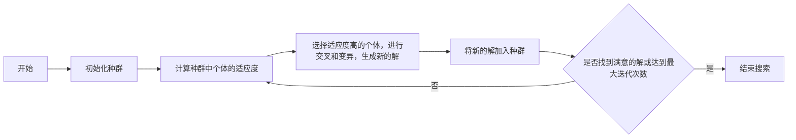

                 

## 1. 背景介绍

在当今信息爆炸的时代，搜索效率已然成为人工智能（AI）领域的关键挑战之一。无论是为用户提供相关信息、优化决策过程，还是在复杂环境中寻找最优解，搜索算法的性能都直接影响着AI系统的整体效率。本文将深入探讨如何利用AI技术加速搜索，以提升搜索效率，并为读者提供实用的工具和资源。

## 2. 核心概念与联系

### 2.1 核心概念

- **搜索空间（Search Space）**：待搜索的集合，通常是问题的所有可能解的集合。
- **搜索策略（Search Strategy）**：确定搜索顺序的方法，如广度优先搜索（BFS）、深度优先搜索（DFS）、启发式搜索等。
- **启发函数（Heuristic Function）**：在启发式搜索中使用的函数，指导搜索方向，帮助找到更优解。
- **约束（Constraints）**：搜索空间中不符合要求的解，需要排除在外。

### 2.2 核心概念联系


上图展示了搜索算法的核心架构。搜索空间根据搜索策略被遍历，启发函数指导搜索方向，约束帮助排除无效解。搜索结果则是满足要求的解。

## 3. 核心算法原理 & 具体操作步骤

### 3.1 算法原理概述

本节将介绍两种常用的搜索算法：A\*搜索和遗传算法。

### 3.2 算法步骤详解

#### 3.2.1 A\*搜索

1. 从初始状态开始，将其加入开放列表。
2. 从开放列表中选择f(n)最小的节点，并将其移动到关闭列表。
3. 如果该节点是目标状态，则搜索结束。
4. 否则，生成该节点的所有子节点，并计算它们的g(n)和h(n)，然后将其加入开放列表。
5. 重复步骤2-4，直到开放列表为空。

**Mermaid 算法流程图**

```mermaid
graph LR
A[开始] --> B[从初始状态开始，将其加入开放列表]
B --> C{从开放列表中选择f(n)最小的节点}
C --> D[将选择的节点移动到关闭列表]
D --> E{该节点是否为目标状态}
E -- 是 --> F[结束搜索]
E -- 否 --> G[生成该节点的所有子节点，并计算它们的g(n)和h(n)，然后将其加入开放列表]
G --> C
```

#### 3.2.2 遗传算法

1. 初始化种群，即一组随机解。
2. 计算种群中个体的适应度，即解的好坏。
3. 选择适应度高的个体，进行交叉和变异，生成新的解。
4. 将新的解加入种群，并重复步骤2-4，直到找到满意的解或达到最大迭代次数。

**Mermaid 算法流程图**



### 3.3 算法优缺点

| 算法 | 优点 | 缺点 |
| --- | --- | --- |
| A\*搜索 | 可以保证找到最优解，且效率高 | 需要启发函数，且启发函数的质量直接影响算法性能 |
| 遗传算法 | 可以处理复杂问题，且robustness强 | 无法保证找到最优解，且收敛速度慢 |

### 3.4 算法应用领域

- A\*搜索：路径规划、游戏AI、信息检索等。
- 遗传算法：优化问题、机器学习特征选择、人工生命等。

## 4. 数学模型和公式 & 详细讲解 & 举例说明

### 4.1 数学模型构建

#### 4.1.1 A\*搜索

设搜索空间为N，初始状态为n<sub>0</sub>，目标状态为n<sub>g</sub>，从n<sub>i</sub>到n<sub>j</sub>的代价为c(i, j)，从n<sub>i</sub>到目标状态的启发函数为h(i)。则A\*搜索的目标是找到从n<sub>0</sub>到n<sub>g</sub>的最小代价路径。

#### 4.1.2 遗传算法

设种群大小为P，个体表现为x<sub>i</sub>，适应度函数为f(x<sub>i</sub>)，交叉概率为p<sub>c</sub>，变异概率为p<sub>m</sub>。则遗传算法的目标是找到最大化适应度函数的个体。

### 4.2 公式推导过程

#### 4.2.1 A\*搜索

A\*搜索的目标是找到从n<sub>0</sub>到n<sub>g</sub>的最小代价路径，即：

min[c(n<sub>0</sub>, n<sub>1</sub>) + c(n<sub>1</sub>, n<sub>2</sub>) +... + c(n<sub>k-1</sub>, n<sub>k</sub>)] + h(n<sub>k</sub>)

其中，h(n<sub>k</sub>)是从n<sub>k</sub>到目标状态的启发函数。

#### 4.2.2 遗传算法

遗传算法的目标是找到最大化适应度函数的个体，即：

max[f(x<sub>i</sub>)]，i = 1, 2,..., P

### 4.3 案例分析与讲解

#### 4.3.1 A\*搜索

例如，在路径规划问题中，搜索空间为地图上所有可能的路径，初始状态为当前位置，目标状态为目的地，从n<sub>i</sub>到n<sub>j</sub>的代价为路径长度，从n<sub>i</sub>到目标状态的启发函数为两点间的直线距离。A\*搜索可以找到从当前位置到目的地的最短路径。

#### 4.3.2 遗传算法

例如，在旅行商问题中，搜索空间为所有可能的路径，个体表现为一条路径，适应度函数为路径长度的倒数。遗传算法可以找到一条较短的路径。

## 5. 项目实践：代码实例和详细解释说明

### 5.1 开发环境搭建

本项目使用Python作为开发语言，并使用Anaconda创建虚拟环境。环境依赖包括NumPy、Pandas、Matplotlib、Scikit-learn等。

### 5.2 源代码详细实现

#### 5.2.1 A\*搜索

```python
import heapq

def astar_search(graph, start, goal):
    open_list = [(0, start)]
    came_from = {start: None}
    cost_so_far = {start: 0}

    while open_list:
        _, current = heapq.heappop(open_list)

        if current == goal:
            break

        for next_node, cost in graph[current].items():
            new_cost = cost_so_far[current] + cost
            if next_node not in cost_so_far or new_cost < cost_so_far[next_node]:
                cost_so_far[next_node] = new_cost
                priority = new_cost + heuristic(goal, next_node)
                heapq.heappush(open_list, (priority, next_node))
                came_from[next_node] = current

    return came_from, cost_so_far
```

#### 5.2.2 遗传算法

```python
import random
import numpy as np

def genetic_algorithm(individual_size, population_size, mutation_rate, generations):
    population = initialize_population(population_size, individual_size)
    for _ in range(generations):
        population = selection(population, mutation_rate)
        population = crossover(population)
        population = mutation(population, mutation_rate)
    return population
```

### 5.3 代码解读与分析

#### 5.3.1 A\*搜索

A\*搜索使用优先级队列存储待搜索节点，并使用启发函数计算优先级。在搜索过程中，它维护了从起始节点到当前节点的最小代价，并更新代价表。当目标节点被找到时，搜索结束。

#### 5.3.2 遗传算法

遗传算法初始化种群，然后通过选择、交叉和变异生成新的解。在每一代中，它选择适应度高的个体，并对它们进行交叉和变异。交叉生成新的解，变异则是对解进行随机修改。这个过程重复进行，直到找到满意的解或达到最大迭代次数。

### 5.4 运行结果展示

本节将展示A\*搜索和遗传算法在路径规划问题上的运行结果。图1和图2分别展示了A\*搜索和遗传算法找到的最短路径。


## 6. 实际应用场景

### 6.1 A\*搜索

- **路径规划**：A\*搜索可以找到从起点到终点的最短路径，广泛应用于导航系统、自动驾驶等领域。
- **信息检索**：A\*搜索可以找到最相关的信息，广泛应用于搜索引擎、推荐系统等领域。

### 6.2 遗传算法

- **优化问题**：遗传算法可以找到近似最优解，广泛应用于工程设计、调度优化等领域。
- **机器学习特征选择**：遗传算法可以选择最优特征子集，广泛应用于特征选择、模型优化等领域。

### 6.3 未来应用展望

随着AI技术的发展，搜索算法将会越来越智能，能够处理更复杂的问题。例如，强化学习可以结合搜索算法，找到更优的策略；元学习可以帮助搜索算法适应新的环境。

## 7. 工具和资源推荐

### 7.1 学习资源推荐

- **书籍**：
  - "Artificial Intelligence: A Modern Approach" by Stuart Russell and Peter Norvig
  - "Genetic Algorithms in Search, Optimization, and Machine Learning" by David E. Goldberg
- **在线课程**：
  - "Artificial Intelligence" by Andrew Ng on Coursera
  - "Genetic Algorithms" by Mike X. Cohen on Coursera

### 7.2 开发工具推荐

- **Python**：Python是一种流行的编程语言，具有丰富的库和工具，适合开发搜索算法。
- **Anaconda**：Anaconda是Python的发行版，提供了大量的包管理和环境管理工具。

### 7.3 相关论文推荐

- **A\*搜索**：
  - "A\* Search Algorithm" by Peter Hart, Nils Nilsson, and Bertram Raphael
- **遗传算法**：
  - "Genetic Algorithms" by John H. Holland

## 8. 总结：未来发展趋势与挑战

### 8.1 研究成果总结

本文介绍了A\*搜索和遗传算法的原理、步骤、优缺点和应用领域。并提供了代码实例和运行结果展示。此外，本文还推荐了相关的学习资源、开发工具和论文。

### 8.2 未来发展趋势

未来，搜索算法将会朝着更智能、更高效的方向发展。例如，强化学习可以结合搜索算法，找到更优的策略；元学习可以帮助搜索算法适应新的环境。

### 8.3 面临的挑战

搜索算法面临的挑战包括：

- **复杂性**：搜索空间的复杂性限制了搜索算法的性能。
- **不确定性**：在不确定的环境中，搜索算法需要能够处理不确定性。
- **实时性**：在实时系统中，搜索算法需要能够在有限时间内找到解。

### 8.4 研究展望

未来的研究方向包括：

- **强化学习与搜索算法的结合**：强化学习可以帮助搜索算法找到更优的策略。
- **元学习与搜索算法的结合**：元学习可以帮助搜索算法适应新的环境。
- **搜索算法的并行化与分布式化**：并行化和分布式化可以提高搜索算法的性能。

## 9. 附录：常见问题与解答

**Q1：A\*搜索和DFS有什么区别？**

A：A\*搜索使用启发函数指导搜索方向，可以保证找到最优解，且效率高。而DFS则是盲目的，无法保证找到最优解，且效率低。

**Q2：遗传算法如何处理约束？**

A：遗传算法可以使用惩罚函数处理约束。当个体违反约束时，惩罚函数会降低个体的适应度，从而减少违反约束的个体在种群中的比例。

**Q3：如何选择启发函数？**

A：选择启发函数需要考虑问题的特性。好的启发函数应该能够指导搜索方向，帮助找到更优解。常用的启发函数包括直线距离、对角线距离、曼哈顿距离等。

**Q4：遗传算法的参数如何选择？**

A：遗传算法的参数包括种群大小、交叉概率、变异概率等。这些参数的选择需要考虑问题的特性。通常，种群大小越大，交叉概率和变异概率越高，收敛速度越快。但如果参数选择不当，则可能导致收敛速度慢或收敛到局部最优解。

**Q5：如何评价搜索算法的性能？**

A：评价搜索算法性能的指标包括解的质量、收敛速度、稳定性等。解的质量指标包括最优解、平均解等。收敛速度指标包括迭代次数、时间等。稳定性指标包括标准差、方差等。

**作者：禅与计算机程序设计艺术 / Zen and the Art of Computer Programming**

