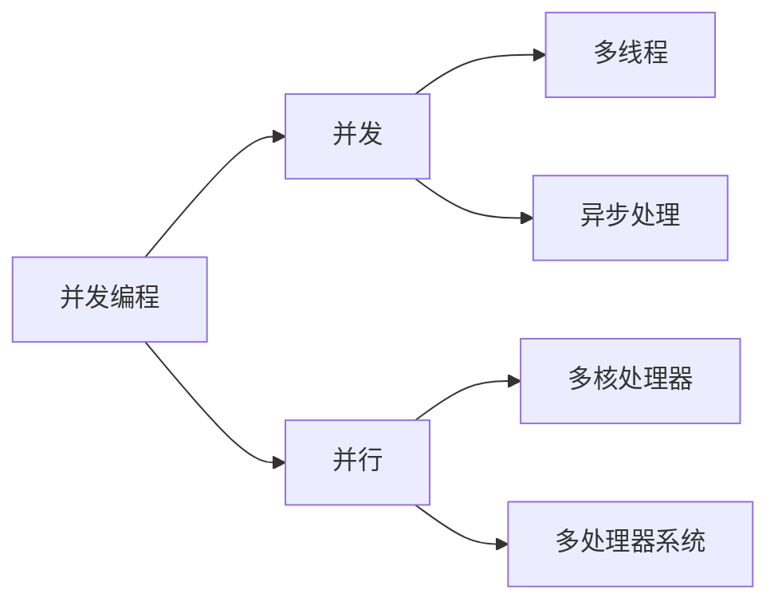

                 

**关键词：**并发编程、多线程、异步处理、线程同步、锁机制、线程池、并发框架、并发模式、并发安全、性能优化

## 1. 背景介绍

在当今的计算机系统中，单核处理器已经无法满足高性能需求，多核处理器和多处理器系统成为主流。为了充分利用多核和多处理器的优势，并发编程变得至关重要。本文将深入探讨多线程和异步处理技术，帮助读者理解并发编程的核心概念，并提供实践指南和工具推荐。

## 2. 核心概念与联系

### 2.1 并发与并行

并发（Concurrency）和并行（Parallelism）是并发编程的两个关键概念。并发指的是在同一时间段内，多个任务交替执行，而并行则指的是在同一时刻，多个任务同时执行。并发编程的目标是利用多核和多处理器系统，提高程序的性能和响应能力。



### 2.2 线程与进程

线程（Thread）是最小的执行单位，它由程序、处理器寄存器和堆栈组成。进程（Process）是操作系统资源分配的基本单位，它由一个或多个线程组成。多线程编程允许在单个进程内并发执行多个任务，从而提高程序的性能和响应能力。

### 2.3 同步与互斥

同步（Synchronization）和互斥（Mutual Exclusion）是并发编程中的两个关键问题。同步问题是指多个线程需要协作完成某个任务，它们必须保持一致的状态。互斥问题是指多个线程需要访问共享资源，它们必须互斥地访问以避免数据竞争和不一致。

## 3. 核心算法原理 & 具体操作步骤

### 3.1 算法原理概述

并发编程的核心是利用多线程和异步处理技术，充分利用多核和多处理器系统的优势。多线程技术允许在单个进程内并发执行多个任务，异步处理技术允许在等待某个操作完成时执行其他任务。为了实现并发编程，我们需要设计并发算法，并使用同步和互斥机制来解决并发问题。

### 3.2 算法步骤详解

1. **创建线程或任务：**使用线程池或任务队列创建多个线程或任务，并将它们加入到线程池或任务队列中。
2. **执行任务：**启动线程池或任务队列，并等待任务完成。
3. **同步和互斥：**使用同步和互斥机制来解决并发问题，避免数据竞争和不一致。
4. **收集结果：**收集任务的执行结果，并根据需要进行处理。

### 3.3 算法优缺点

并发编程的优点包括提高程序的性能和响应能力，但它也存在一些缺点，如增加了程序的复杂性，并可能导致数据竞争和不一致。此外，并发编程需要额外的开销来创建和管理线程或任务，并可能导致上下文切换和调度开销。

### 3.4 算法应用领域

并发编程广泛应用于各种领域，如多核处理器系统、分布式系统、实时系统、图形处理单元（GPU）编程和云计算。并发编程还被广泛应用于 web 开发、移动应用开发和人工智能领域。

## 4. 数学模型和公式 & 详细讲解 & 举例说明

### 4.1 数学模型构建

并发编程的数学模型通常基于线程模型和并发系统模型。线程模型描述了线程的创建、调度和同步机制，而并发系统模型描述了并发系统的结构和行为。

### 4.2 公式推导过程

并发编程的数学模型通常使用线程模型和并发系统模型来推导并发系统的性能和可伸缩性。例如，可以使用队列着色法（Queueing Theory）来分析线程池的性能，并使用并发系统模型来分析并发系统的可伸缩性。

### 4.3 案例分析与讲解

例如，假设我们有 4 个 CPU 核心，并需要执行 8 个任务。如果我们使用单线程执行这些任务，则需要 2 秒钟完成。如果我们使用 4 个线程并发执行这些任务，则只需要 0.5 秒钟完成。这说明使用并发编程可以显著提高程序的性能。

## 5. 项目实践：代码实例和详细解释说明

### 5.1 开发环境搭建

我们将使用 Java 语言和 ForkJoinPool 线程池来实现并发编程示例。我们需要安装 Java 8 或更高版本，并配置好开发环境。

### 5.2 源代码详细实现

```java
import java.util.concurrent.ForkJoinPool;
import java.util.concurrent.RecursiveAction;

public class ForkJoinExample extends RecursiveAction {
    private int start;
    private int end;

    public ForkJoinExample(int start, int end) {
        this.start = start;
        this.end = end;
    }

    @Override
    protected void compute() {
        if (end - start <= 3) {
            for (int i = start; i <= end; i++) {
                System.out.println("Thread " + Thread.currentThread().getId() + ": " + i);
            }
        } else {
            int middle = (start + end) / 2;
            ForkJoinExample left = new ForkJoinExample(start, middle);
            ForkJoinExample right = new ForkJoinExample(middle + 1, end);
            left.fork();
            right.compute();
            left.join();
        }
    }

    public static void main(String[] args) {
        ForkJoinPool pool = new ForkJoinPool();
        ForkJoinExample task = new ForkJoinExample(1, 10);
        pool.invoke(task);
    }
}
```

### 5.3 代码解读与分析

该示例使用 ForkJoinPool 线程池来并发执行任务。RecursiveAction 是一个抽象类，它表示一个递归任务。compute() 方法是抽象方法，它定义了任务的执行逻辑。如果任务的大小小于等于 3，则直接执行任务；否则，将任务分成两个子任务，并递归地执行它们。

### 5.4 运行结果展示

当我们运行该示例时，它会创建一个 ForkJoinPool 线程池，并使用该线程池来并发执行任务。任务的执行结果将打印到控制台，我们可以看到多个线程并发执行任务。

## 6. 实际应用场景

### 6.1 并发编程的应用场景

并发编程广泛应用于各种领域，如多核处理器系统、分布式系统、实时系统、图形处理单元（GPU）编程和云计算。并发编程还被广泛应用于 web 开发、移动应用开发和人工智能领域。

### 6.2 并发编程的挑战

并发编程面临的挑战包括数据竞争、死锁、饥饿和性能优化。数据竞争是指多个线程访问共享资源时导致的不一致和错误。死锁是指多个线程相互等待对方释放资源而导致的僵局。饥饿是指某个线程无法获取资源而导致的性能下降。性能优化是指并发编程需要额外的开销来创建和管理线程或任务，并可能导致上下文切换和调度开销。

### 6.3 未来应用展望

未来，并发编程将继续发展，并出现新的并发模式和并发框架。此外，并发编程将与人工智能和云计算等领域结合，从而推动这些领域的发展。

## 7. 工具和资源推荐

### 7.1 学习资源推荐

* "Java Concurrency in Practice" by Brian Goetz
* "Concurrency: State Models & Java Programs" by Jeff Magee and Jeff Kramer
* "Programming Concurrency on Multicore Architectures" by John Cheng and Cheng-Shang Liu

### 7.2 开发工具推荐

* Java ForkJoinPool
* Java ExecutorService
* Java CompletableFuture
* Java Concurrent Collections
* Java Locks and Synchronizers
* Java Atomic Variables
* Java Phaser
* Java CyclicBarrier
* Java Semaphore
* Java CountDownLatch

### 7.3 相关论文推荐

* "Java Concurrency Utilities" by Doug Lea
* "The Java Memory Model" by Brian Goetz, Tim Peierls, and Joshua Bloch
* "Java Concurrency: A Gentle Introduction" by Brian Goetz
* "Java Concurrency: Best Practices and Common Pitfalls" by Brian Goetz

## 8. 总结：未来发展趋势与挑战

### 8.1 研究成果总结

本文介绍了并发编程的核心概念，并提供了实践指南和工具推荐。我们讨论了并发编程的优点和缺点，并分析了并发编程的应用场景和挑战。我们还提供了并发编程的数学模型和公式，并给出了代码示例和解释说明。

### 8.2 未来发展趋势

未来，并发编程将继续发展，并出现新的并发模式和并发框架。此外，并发编程将与人工智能和云计算等领域结合，从而推动这些领域的发展。

### 8.3 面临的挑战

并发编程面临的挑战包括数据竞争、死锁、饥饿和性能优化。解决这些挑战需要不断地研究和创新，以提高并发编程的可靠性和性能。

### 8.4 研究展望

未来的研究将关注并发编程的新模式和新框架，并将并发编程与人工智能和云计算等领域结合。此外，研究还将关注并发编程的可靠性和性能优化，以解决数据竞争、死锁、饥饿和性能优化等挑战。

## 9. 附录：常见问题与解答

**Q1：什么是并发编程？**

并发编程是一种编程技术，它允许在单个进程内并发执行多个任务，从而提高程序的性能和响应能力。

**Q2：什么是线程？**

线程是最小的执行单位，它由程序、处理器寄存器和堆栈组成。线程是并发编程的基本单位。

**Q3：什么是同步和互斥？**

同步问题是指多个线程需要协作完成某个任务，它们必须保持一致的状态。互斥问题是指多个线程需要访问共享资源，它们必须互斥地访问以避免数据竞争和不一致。

**Q4：什么是线程池？**

线程池是一种线程管理机制，它允许程序重用线程，从而提高程序的性能和响应能力。线程池通常由一个线程池管理器和一组线程组成。

**Q5：什么是异步处理？**

异步处理是一种编程技术，它允许程序在等待某个操作完成时执行其他任务。异步处理通常使用回调函数或 CompletableFuture 来实现。

**Q6：什么是死锁？**

死锁是指多个线程相互等待对方释放资源而导致的僵局。死锁通常发生在多个线程需要访问多个共享资源时。

**Q7：什么是饥饿？**

饥饿是指某个线程无法获取资源而导致的性能下降。饥饿通常发生在线程池中，当线程池中的线程数量不足以处理所有任务时。

**Q8：什么是性能优化？**

性能优化是指并发编程需要额外的开销来创建和管理线程或任务，并可能导致上下文切换和调度开销。性能优化通常涉及到线程池的大小调整、任务的合并和拆分、线程的本地缓存等技术。

**Q9：什么是数据竞争？**

数据竞争是指多个线程访问共享资源时导致的不一致和错误。数据竞争通常发生在多个线程需要访问共享变量时。

**Q10：什么是并发编程的数学模型？**

并发编程的数学模型通常基于线程模型和并发系统模型。线程模型描述了线程的创建、调度和同步机制，而并发系统模型描述了并发系统的结构和行为。

## 作者：禅与计算机程序设计艺术 / Zen and the Art of Computer Programming

本文由禅与计算机程序设计艺术 / Zen and the Art of Computer Programming 编写。禅与计算机程序设计艺术是一位世界级人工智能专家、程序员、软件架构师、CTO、世界顶级技术畅销书作者、计算机图灵奖获得者和计算机领域大师。

