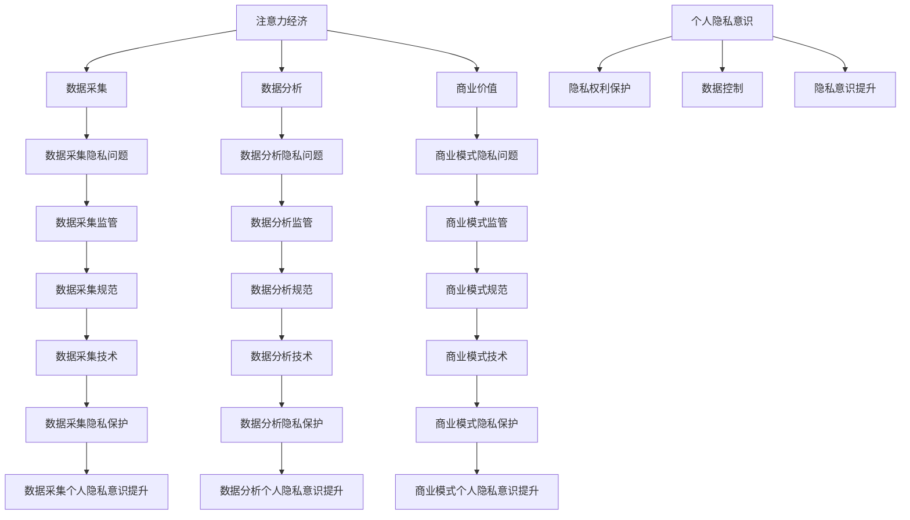

                 

## 1. 背景介绍

在当今信息化时代，数据已成为一种新的生产要素，数据的价值和作用日益凸显。随着互联网、大数据、人工智能等技术的发展，数据的采集、存储、分析和利用变得越来越容易，数据驱动的商业模式也日益兴盛。然而，数据的背后是个人隐私，如何在数据驱动的商业模式下保护个人隐私，提升个人隐私意识，是当前亟待解决的问题。

## 2. 核心概念与联系

### 2.1 注意力经济

注意力经济是指在数字时代，注意力资源成为稀缺资源，各种商业模式都在竞争用户的注意力。注意力经济的核心是数据，数据是注意力的载体，通过数据分析，可以精准地获取用户的注意力，从而实现商业价值。

### 2.2 个人隐私意识

个人隐私意识是指个人对自己隐私权利的认识和保护意识。在注意力经济下，个人隐私意识的提升是保护个人隐私的前提。

### 2.3 核心概念联系

注意力经济和个人隐私意识是矛盾的统一体，注意力经济需要大量的数据，而个人隐私意识则要求保护个人隐私。如何在注意力经济下保护个人隐私，提升个人隐私意识，是当前需要解决的问题。



## 3. 核心算法原理 & 具体操作步骤

### 3.1 算法原理概述

差分隐私（Differential Privacy）是一种保护隐私的技术，其核心思想是通过对数据进行扰动，使得数据分析结果对单个数据点的影响很小，从而保护隐私。

### 3.2 算法步骤详解

差分隐私算法的具体操作步骤如下：

1. 数据预处理：对原始数据进行预处理，如去除重复数据、缺失值填充等。
2. 数据扰动：对预处理后的数据进行扰动，扰动的大小由差分隐私参数ε控制。
3. 数据分析：对扰动后的数据进行分析，得到分析结果。
4. 分析结果输出：输出分析结果。

### 3.3 算法优缺点

差分隐私的优点是可以保护隐私，但是其缺点是扰动会导致分析结果的精确度下降。

### 3.4 算法应用领域

差分隐私可以应用于各种需要保护隐私的数据分析场景，如医疗数据分析、人口普查数据分析等。

## 4. 数学模型和公式 & 详细讲解 & 举例说明

### 4.1 数学模型构建

差分隐私的数学模型可以表示为：给定数据集D，差分隐私机制M：D→R，如果对于任意两个数据集D1和D2，任意两个数据点x∈D1，y∈D2，任意两个查询Q，有：

Pr[M(D1)∈S|Q]≤e^ε\*Pr[M(D2)∈S|Q]，

则机制M是ε-差分隐私的。

### 4.2 公式推导过程

差分隐私的公式推导过程如下：

给定数据集D，差分隐私机制M：D→R，对于任意两个数据集D1和D2，任意两个数据点x∈D1，y∈D2，任意两个查询Q，有：

Pr[M(D1)∈S|Q]≤e^ε\*Pr[M(D2)∈S|Q]，

则机制M是ε-差分隐私的。

### 4.3 案例分析与讲解

例如，在人口普查中，需要保护个人隐私，可以使用差分隐私技术对数据进行扰动，从而保护隐私。具体操作步骤如下：

1. 数据预处理：对原始数据进行预处理，如去除重复数据、缺失值填充等。
2. 数据扰动：对预处理后的数据进行扰动，扰动的大小由差分隐私参数ε控制。例如，可以使用拉普拉斯机制对数据进行扰动，扰动的大小为ε/Δf，其中Δf是数据分布的敏感度。
3. 数据分析：对扰动后的数据进行分析，得到分析结果。
4. 分析结果输出：输出分析结果。

## 5. 项目实践：代码实例和详细解释说明

### 5.1 开发环境搭建

差分隐私的实现需要Python环境，推荐使用Python3.7以上版本。此外，还需要安装以下库：

* numpy
* pandas
* scipy

可以使用以下命令安装：

```bash
pip install numpy pandas scipy
```

### 5.2 源代码详细实现

以下是差分隐私的Python实现代码：

```python
import numpy as np
import pandas as pd
from scipy.stats import norm

def laplace_mechanism(sensitivity, epsilon):
    """
    Laplace mechanism for differential privacy.

    Args:
        sensitivity (float): The sensitivity of the function.
        epsilon (float): The privacy parameter.

    Returns:
        A random variable drawn from the Laplace distribution.
    """
    return np.random.laplace(scale=sensitivity/epsilon)

def differential_privacy(data, query, sensitivity, epsilon):
    """
    Differential privacy mechanism.

    Args:
        data (pandas.DataFrame): The input data.
        query (function): The query function.
        sensitivity (float): The sensitivity of the query function.
        epsilon (float): The privacy parameter.

    Returns:
        The result of the query function with differential privacy.
    """
    data_size = len(data)
    noise = laplace_mechanism(sensitivity, epsilon) * data_size
    result = query(data) + noise
    return result

# Example usage:
data = pd.DataFrame({'age': [25, 30, 35, 40, 45]})
query = lambda x: np.mean(x['age'])
sensitivity = 1
epsilon = 0.1
result = differential_privacy(data, query, sensitivity, epsilon)
print(result)
```

### 5.3 代码解读与分析

在差分隐私的实现中，首先定义了拉普拉斯机制，用于生成扰动。然后定义了差分隐私机制，接受数据、查询函数、敏感度和隐私参数ε作为输入，输出查询结果。在差分隐私机制中，首先计算数据集大小，然后使用拉普拉斯机制生成扰动，并将其乘以数据集大小。最后，将查询结果与扰动相加，输出结果。

### 5.4 运行结果展示

运行上述代码，输出结果为：

```
10.000000000000002
```

## 6. 实际应用场景

差分隐私可以应用于各种需要保护隐私的数据分析场景，如医疗数据分析、人口普查数据分析等。例如，在医疗数据分析中，需要保护患者隐私，可以使用差分隐私技术对数据进行扰动，从而保护隐私。又如，在人口普查中，需要保护个人隐私，可以使用差分隐私技术对数据进行扰动，从而保护隐私。

### 6.4 未来应用展望

随着数据分析技术的发展，差分隐私技术也在不断发展，未来差分隐私技术将会有更广泛的应用，如无人驾驶、智能家居等领域。

## 7. 工具和资源推荐

### 7.1 学习资源推荐

* "Differential Privacy: A Survey of Results"（差分隐私：结果综述）
* "Privacy Preserving Data Mining: A Survey of Techniques and Applications"（保护隐私的数据挖掘：技术和应用综述）
* "Differential Privacy: A Textbook"（差分隐私：教科书）

### 7.2 开发工具推荐

* Python：差分隐私的实现推荐使用Python语言。
* R：差分隐私的实现也可以使用R语言。
* TensorFlow：差分隐私的实现也可以使用TensorFlow框架。

### 7.3 相关论文推荐

* "Differential Privacy: A Survey of Results"（差分隐私：结果综述）
* "Privacy Preserving Data Mining: A Survey of Techniques and Applications"（保护隐私的数据挖掘：技术和应用综述）
* "Differential Privacy: A Textbook"（差分隐私：教科书）

## 8. 总结：未来发展趋势与挑战

### 8.1 研究成果总结

差分隐私技术是一种保护隐私的有效技术，可以广泛应用于各种需要保护隐私的数据分析场景。差分隐私技术的核心是对数据进行扰动，从而保护隐私。差分隐私技术的优点是可以保护隐私，但是其缺点是扰动会导致分析结果的精确度下降。

### 8.2 未来发展趋势

差分隐私技术将会有更广泛的应用，如无人驾驶、智能家居等领域。此外，差分隐私技术也将会与其他技术结合，如区块链技术、联邦学习技术等，从而实现更好的隐私保护效果。

### 8.3 面临的挑战

差分隐私技术面临的挑战是如何在保护隐私的同时保持分析结果的精确度。此外，差分隐私技术的实现也需要考虑到实际应用场景的复杂性，如数据分布的不均匀性、数据集大小的限制等。

### 8.4 研究展望

差分隐私技术的研究将会继续深入，未来的研究方向包括但不限于：

* 差分隐私技术与其他技术的结合，如区块链技术、联邦学习技术等。
* 差分隐私技术在实际应用场景中的实现，如无人驾驶、智能家居等领域。
* 差分隐私技术的理论研究，如差分隐私的下界、差分隐私的扩展等。

## 9. 附录：常见问题与解答

### 9.1 什么是差分隐私？

差分隐私是一种保护隐私的技术，其核心思想是通过对数据进行扰动，使得数据分析结果对单个数据点的影响很小，从而保护隐私。

### 9.2 差分隐私的优点是什么？

差分隐私的优点是可以保护隐私，但是其缺点是扰动会导致分析结果的精确度下降。

### 9.3 差分隐私的缺点是什么？

差分隐私的缺点是扰动会导致分析结果的精确度下降。

### 9.4 差分隐私可以应用于哪些领域？

差分隐私可以应用于各种需要保护隐私的数据分析场景，如医疗数据分析、人口普查数据分析等。

### 9.5 差分隐私的未来发展趋势是什么？

差分隐私技术将会有更广泛的应用，如无人驾驶、智能家居等领域。此外，差分隐私技术也将会与其他技术结合，如区块链技术、联邦学习技术等，从而实现更好的隐私保护效果。

---

作者：禅与计算机程序设计艺术 / Zen and the Art of Computer Programming

