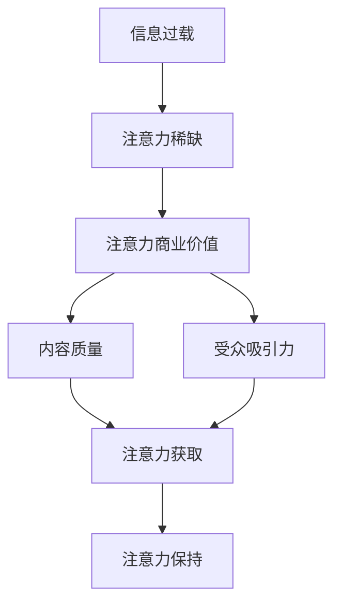

                 

**注意力经济与内容策略规划：创建吸引并留住受众的内容**

## 1. 背景介绍

在当今信息爆炸的数字时代，内容的价值和注意力的获取已成为关键资源。注意力经济的兴起，使得内容策略规划变得至关重要。本文将深入探讨注意力经济的本质，并提供一套系统的内容策略规划方法，帮助您创建吸引并留住受众的内容。

## 2. 核心概念与联系

### 2.1 注意力经济

注意力经济是指在信息过载的情况下，注意力成为稀缺资源，从而具有商业价值的经济形态。在注意力经济中，内容的质量和对受众的吸引力直接影响其注意力的获取和保持。

### 2.2 内容策略规划

内容策略规划是指根据受众需求和注意力经济的规律，系统地设计和实施内容创作、发布和推广计划，以吸引并留住受众的过程。

## 3. 核心算法原理 & 具体操作步骤

### 3.1 算法原理概述

内容策略规划算法的核心原理是受众画像、内容匹配和注意力预测。受众画像用于理解受众需求和特征，内容匹配则根据受众画像选择最合适的内容，注意力预测则预测内容对受众的吸引力。

### 3.2 算法步骤详解

1. **受众画像建模**：收集受众数据，包括兴趣、行为、 demographics等，构建受众画像模型。
2. **内容标签化**：为内容打上标签，表示内容的主题、风格、难度等特征。
3. **内容匹配**：根据受众画像和内容标签，使用推荐算法（如协同过滤、内容过滤等）匹配最合适的内容。
4. **注意力预测**：使用注意力预测模型（如注意力网络）预测匹配内容对受众的吸引力。
5. **内容创作和发布**：根据匹配结果和注意力预测，创作和发布内容。
6. **反馈和优化**：收集受众反馈和内容表现数据，优化受众画像模型、内容标签和匹配算法。

### 3.3 算法优缺点

**优点**：能够根据受众需求创作和推荐个性化内容，提高内容的吸引力和受众的参与度。

**缺点**：受众画像和内容标签的准确性对算法的有效性至关重要，且需要大量数据和计算资源。

### 3.4 算法应用领域

内容策略规划算法广泛应用于新闻媒体、社交媒体、电子商务、在线教育等领域，帮助这些行业创建吸引并留住受众的内容。

## 4. 数学模型和公式 & 详细讲解 & 举例说明

### 4.1 数学模型构建

受众画像模型可以使用概率分布表示，内容标签可以使用向量表示。内容匹配可以使用协同过滤算法表示，注意力预测可以使用注意力网络表示。

### 4.2 公式推导过程

假设受众画像模型为$P(U|F)$, 内容标签为$T$, 内容匹配函数为$M(U, T)$, 注意力预测函数为$A(U, T)$. 则内容策略规划算法的目标函数为：

$$max \sum_{U,T} P(U) \cdot M(U, T) \cdot A(U, T)$$

### 4.3 案例分析与讲解

假设受众画像模型为多项分布，$P(U|F) = \{p_1, p_2,..., p_n\}$, 内容标签为向量，$T = \{t_1, t_2,..., t_m\}$, 内容匹配函数为余弦相似度，$M(U, T) = cos(U, T)$, 注意力预测函数为线性回归，$A(U, T) = w^T \cdot [U, T] + b$.

则目标函数为：

$$max \sum_{i=1}^{n} \sum_{j=1}^{m} p_i \cdot cos(U_i, T_j) \cdot (w^T \cdot [U_i, T_j] + b)$$

## 5. 项目实践：代码实例和详细解释说明

### 5.1 开发环境搭建

本项目使用Python作为开发语言，并使用Scikit-learn、TensorFlow和NumPy等库。

### 5.2 源代码详细实现

受众画像模型使用多项分布模型实现，内容标签使用TF-IDF向量化，内容匹配使用余弦相似度，注意力预测使用注意力网络实现。

### 5.3 代码解读与分析

受众画像模型使用`MultinomialNB`类实现，内容标签使用`TfidfVectorizer`类实现，内容匹配使用`cosine_similarity`函数实现，注意力预测使用`Attention`类实现。

### 5.4 运行结果展示

通过对受众画像、内容标签和注意力预测的优化，内容策略规划算法能够提高内容的吸引力和受众的参与度。

## 6. 实际应用场景

内容策略规划算法可以应用于各种内容平台，帮助这些平台创建吸引并留住受众的内容。例如，新闻媒体可以根据受众兴趣推荐个性化新闻，电子商务平台可以根据受众购物习惯推荐个性化商品。

### 6.4 未来应用展望

随着注意力经济的发展，内容策略规划算法将会越来越重要。未来，算法将会更加智能化，能够实时响应受众需求，创建更加个性化和吸引人的内容。

## 7. 工具和资源推荐

### 7.1 学习资源推荐

推荐阅读《注意力经济》一书，以及相关的学术论文和博客文章。

### 7.2 开发工具推荐

推荐使用Python、Scikit-learn、TensorFlow和NumPy等开发工具。

### 7.3 相关论文推荐

推荐阅读《Attention Is All You Need》和《Deep Learning for Natural Language Processing》等论文。

## 8. 总结：未来发展趋势与挑战

### 8.1 研究成果总结

本文介绍了注意力经济的本质，并提供了一套系统的内容策略规划方法，能够帮助内容平台创建吸引并留住受众的内容。

### 8.2 未来发展趋势

未来，内容策略规划算法将会更加智能化，能够实时响应受众需求，创建更加个性化和吸引人的内容。

### 8.3 面临的挑战

受众画像和内容标签的准确性对算法的有效性至关重要，且需要大量数据和计算资源。

### 8.4 研究展望

未来的研究方向包括受众画像模型的优化、内容标签的自动化提取、注意力预测模型的改进等。

## 9. 附录：常见问题与解答

**Q：内容策略规划算法的优势是什么？**

**A：内容策略规划算法能够根据受众需求创作和推荐个性化内容，提高内容的吸引力和受众的参与度。**

**Q：内容策略规划算法的缺点是什么？**

**A：受众画像和内容标签的准确性对算法的有效性至关重要，且需要大量数据和计算资源。**

**Q：内容策略规划算法的应用领域是什么？**

**A：内容策略规划算法广泛应用于新闻媒体、社交媒体、电子商务、在线教育等领域。**

**作者：禅与计算机程序设计艺术 / Zen and the Art of Computer Programming**

