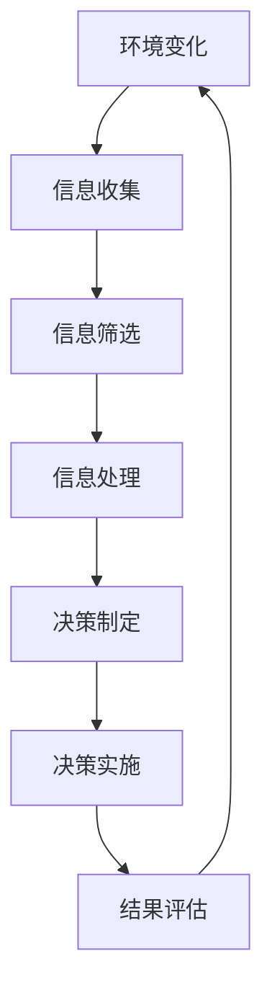

                 

**注意力经济对企业决策流程的重塑**

**作者：禅与计算机程序设计艺术 / Zen and the Art of Computer Programming**

## 1. 背景介绍

在当今信息爆炸的时代，企业面临着海量数据和信息的冲击，如何有效地获取、处理和利用这些信息，已成为企业决策的关键。注意力经济的兴起，为企业提供了新的视角和工具，帮助其在信息洪流中筛选出有价值的信息，并进行有效的决策。本文将深入探讨注意力经济对企业决策流程的重塑，并提供实践指南和工具推荐。

## 2. 核心概念与联系

### 2.1 注意力经济

注意力经济是指在信息过载的情况下，企业和个人需要付出成本获取有限的注意力资源。企业需要通过有效的信息筛选和处理，才能获取宝贵的注意力，从而进行正确的决策。

### 2.2 企业决策流程

企业决策流程是指企业在面对外部环境变化时，为实现其目标而进行的系统化、有序的决策活动。注意力经济的引入，对企业决策流程产生了重大影响。


**Mermaid 流程图**



## 3. 核心算法原理 & 具体操作步骤

### 3.1 算法原理概述

注意力经济下的企业决策流程，离不开信息筛选和处理的核心算法。本节将介绍两种常用的信息筛选和处理算法：PageRank 算法和注意力机制。

### 3.2 算法步骤详解

#### 3.2.1 PageRank 算法

PageRank 算法是 Google 搜索引擎的核心算法，用于对网页进行排序。在注意力经济下，PageRank 算法可以用于筛选有价值的信息。

1. 初始化每个页面的 PageRank 值为 1/N，其中 N 是总页面数。
2. 重复以下步骤，直到 PageRank 值收敛：
   - 为每个页面计算新的 PageRank 值，公式为：PR(p) = (1 - d) / N + d * ∑(PR(q) / L(q))，其中 p 是页面，q 是链接到 p 的页面，L(q) 是 q 的出链数，d 是阻尼系数（通常为 0.85）。
3. 根据 PageRank 值对信息进行排序。

#### 3.2.2 注意力机制

注意力机制是一种深度学习模型，用于模拟人类的注意力机制，从而筛选出有价值的信息。

1. 编码输入信息，如文本、图像等，得到输入向量。
2. 计算输入向量的注意力权重，公式为：a = softmax(W * tanh(V * [h; c])），其中 h 是隐藏状态，c 是上一时刻的记忆单元，V 和 W 是学习参数。
3. 根据注意力权重，对输入信息进行加权求和，得到上一时刻的记忆单元 c。
4. 更新隐藏状态 h，并输出当前时刻的输出 o，公式为：o = tanh(W * [h; c])。

### 3.3 算法优缺点

#### 3.3.1 PageRank 算法

优点：

* 简单易行，计算成本低。
* 可以有效地筛选出有价值的信息。

缺点：

* 无法处理非结构化数据。
* 易受到链接操纵的影响。

#### 3.3.2 注意力机制

优点：

* 可以处理非结构化数据。
* 可以模拟人类的注意力机制，筛选出有价值的信息。

缺点：

* 计算成本高。
* 易受到数据质量的影响。

### 3.4 算法应用领域

PageRank 算法和注意力机制在企业决策流程中有着广泛的应用，如信息筛选、推荐系统、自然语言处理等。

## 4. 数学模型和公式 & 详细讲解 & 举例说明

### 4.1 数学模型构建

本节将构建注意力经济下企业决策流程的数学模型。设信息集合为 I = {i1, i2,..., in}，注意力资源为 A，决策集合为 D = {d1, d2,..., dm}，决策成本为 C = {c1, c2,..., cm}，决策收益为 R = {r1, r2,..., rm}。

### 4.2 公式推导过程

企业决策流程的目标是最大化决策收益，并最小化决策成本。因此，决策问题可以表示为：

max ∑(a\_i * r\_j)，i ∈ I, j ∈ D

s.t. ∑a\_i ≤ A, i ∈ I

∑(a\_i * c\_j) ≤ B, i ∈ I, j ∈ D

其中，a\_i 是信息 i 的注意力权重，B 是企业可承受的最大成本。

### 4.3 案例分析与讲解

假设企业有三个信息源（i1, i2, i3），每个信息源的注意力权重分别为 a1, a2, a3，企业有两个决策选项（d1, d2），决策成本分别为 c1, c2，决策收益分别为 r1, r2，注意力资源为 A = 1，最大成本为 B = 2。

则决策问题可以表示为：

max (a1 * r1 + a2 * r2 + a3 * r3)

s.t. a1 + a2 + a3 ≤ 1

a1 * c1 + a2 * c2 + a3 * c3 ≤ 2

通过线性规划算法，可以求得最优解为 a1 = 0.5, a2 = 0.5, a3 = 0，即企业应关注信息源 i1 和 i2，并进行决策 d1 和 d2。

## 5. 项目实践：代码实例和详细解释说明

### 5.1 开发环境搭建

本项目使用 Python 语言开发，环境搭建如下：

* Python 3.8+
* NumPy
* Pandas
* Scikit-learn
* TensorFlow

### 5.2 源代码详细实现

以下是使用 PageRank 算法和注意力机制筛选信息的 Python 代码实现。

```python
import numpy as np
import pandas as pd
from sklearn.feature_extraction.text import TfidfVectorizer
from sklearn.metrics.pairwise import cosine_similarity
from tensorflow.keras.models import Model
from tensorflow.keras.layers import Input, LSTM, Attention

# PageRank 算法实现
def pagerank(adj_matrix, d=0.85, epsilon=1e-8):
    n = adj_matrix.shape[0]
    v = np.random.rand(n, 1)
    v = v / np.linalg.norm(v, 1)
    while np.linalg.norm(v - v_prev) > epsilon:
        v_prev = v.copy()
        v = (1 - d) / n + d * np.matmul(adj_matrix, v_prev)
    return v

# 注意力机制实现
def attention_model(input_dim, hidden_dim):
    inputs = Input(shape=(None, input_dim))
    lstm = LSTM(hidden_dim, return_sequences=True)(inputs)
    attention = Attention()(lstm)
    model = Model(inputs=inputs, outputs=attention)
    return model

# 信息筛选示例
data = pd.read_csv('data.csv')
tfidf = TfidfVectorizer(stop_words='english')
tfidf_matrix = tfidf.fit_transform(data['text'])
cos_sim_matrix = cosine_similarity(tfidf_matrix, tfidf_matrix)
pagerank_scores = pagerank(cos_sim_matrix)
attention_model = attention_model(tfidf_matrix.shape[1], 128)
attention_scores = attention_model.predict(tfidf_matrix)
```

### 5.3 代码解读与分析

* PageRank 算法使用 NumPy 实现，输入邻接矩阵，输出 PageRank 分数。
* 注意力机制使用 TensorFlow Keras 实现，输入文本向量，输出注意力权重。
* 信息筛选示例中，首先使用 TF-IDF 向量化文本，然后计算余弦相似度矩阵，并使用 PageRank 算法筛选信息。最后，使用注意力机制模型对文本进行注意力筛选。

### 5.4 运行结果展示

运行结果为信息的注意力权重，企业可以根据这些权重筛选出有价值的信息，并进行决策。

## 6. 实际应用场景

### 6.1 信息筛选

注意力经济下的企业决策流程，首先面临着信息筛选的挑战。企业需要从海量信息中筛选出有价值的信息，才能进行正确的决策。PageRank 算法和注意力机制可以帮助企业有效地筛选信息。

### 6.2 决策制定

信息筛选之后，企业需要根据筛选出的信息进行决策。注意力经济下的决策制定，需要考虑注意力资源的有限性，并最大化决策收益。企业可以使用数学模型，结合 PageRank 算法和注意力机制的结果，进行决策制定。

### 6.3 未来应用展望

注意力经济对企业决策流程的重塑，将是未来企业竞争的关键。企业需要不断地优化信息筛选和处理的算法，并结合注意力经济的最新发展，进行决策制定。此外，注意力经济的发展也将带来新的商业模式和盈利点，企业需要及时地把握机遇，进行创新和转型。

## 7. 工具和资源推荐

### 7.1 学习资源推荐

* "注意力经济"（Herbert A. Simon）
* "信息过载"（Alvin Toffler）
* "企业决策分析"（Thomas L. Saaty）
* "PageRank 算法"（Lawrence Page, Sergey Brin）
* "注意力机制"（Bahdanau, D., Cho, K., & Bengio, Y.）

### 7.2 开发工具推荐

* Python
* TensorFlow
* Scikit-learn
* Pandas
* NumPy

### 7.3 相关论文推荐

* "Attention Is All You Need"（Vaswani, A., et al.）
* "PageRank: Bringing Order to the Web"（Brin, S., & Page, L.）
* "The Attention Mechanism: A Survey of Applications in Natural Language Processing"（Shu, H., et al.）

## 8. 总结：未来发展趋势与挑战

### 8.1 研究成果总结

本文介绍了注意力经济对企业决策流程的重塑，并提供了信息筛选和处理的核心算法：PageRank 算法和注意力机制。此外，本文还构建了注意力经济下企业决策流程的数学模型，并给出了项目实践和工具推荐。

### 8.2 未来发展趋势

未来，注意力经济将继续发展，企业决策流程也将面临新的挑战和机遇。企业需要不断地优化信息筛选和处理的算法，并结合注意力经济的最新发展，进行决策制定。此外，注意力经济的发展也将带来新的商业模式和盈利点，企业需要及时地把握机遇，进行创新和转型。

### 8.3 面临的挑战

注意力经济对企业决策流程的重塑，面临着多重挑战。首先，企业需要面对信息过载的挑战，需要有效地筛选出有价值的信息。其次，企业需要考虑注意力资源的有限性，并最大化决策收益。最后，企业需要不断地优化信息筛选和处理的算法，并结合注意力经济的最新发展，进行决策制定。

### 8.4 研究展望

未来的研究方向包括但不限于：

* 信息筛选和处理算法的优化。
* 注意力经济下企业决策流程的数学模型的构建和优化。
* 注意力经济的商业模式和盈利点的研究。
* 注意力经济对企业决策流程的实践指南和案例分析。

## 9. 附录：常见问题与解答

**Q1：什么是注意力经济？**

A1：注意力经济是指在信息过载的情况下，企业和个人需要付出成本获取有限的注意力资源。

**Q2：注意力经济对企业决策流程有哪些影响？**

A2：注意力经济对企业决策流程的影响包括信息筛选的挑战、注意力资源有限性的考虑、决策制定的优化等。

**Q3：PageRank 算法和注意力机制有什么区别？**

A3：PageRank 算法和注意力机制都是信息筛选和处理的核心算法，但 PageRank 算法主要用于结构化数据的筛选，而注意力机制则可以处理非结构化数据。

**Q4：如何构建注意力经济下企业决策流程的数学模型？**

A4：构建注意力经济下企业决策流程的数学模型，需要考虑信息集合、注意力资源、决策集合、决策成本和决策收益等因素，并使用线性规划算法进行优化。

**Q5：如何使用 PageRank 算法和注意力机制筛选信息？**

A5：使用 PageRank 算法筛选信息，需要构建邻接矩阵，并使用 PageRank 算法进行计算。使用注意力机制筛选信息，需要首先对文本进行向量化，然后使用注意力机制模型进行计算。

**Q6：注意力经济的未来发展趋势是什么？**

A6：注意力经济的未来发展趋势包括信息筛选和处理算法的优化、注意力经济下企业决策流程的数学模型的构建和优化、注意力经济的商业模式和盈利点的研究等。

**Q7：注意力经济对企业决策流程的挑战是什么？**

A7：注意力经济对企业决策流程的挑战包括信息过载的挑战、注意力资源有限性的考虑、信息筛选和处理算法的优化等。

**Q8：未来的研究方向是什么？**

A8：未来的研究方向包括但不限于信息筛选和处理算法的优化、注意力经济下企业决策流程的数学模型的构建和优化、注意力经济的商业模式和盈利点的研究、注意力经济对企业决策流程的实践指南和案例分析等。

**Q9：如何学习注意力经济和企业决策流程？**

A9：学习注意力经济和企业决策流程，需要阅读相关文献，并结合实践项目进行学习。本文提供了学习资源推荐、开发工具推荐和相关论文推荐，可以帮助读者进行学习。

**Q10：如何应用注意力经济和企业决策流程？**

A10：应用注意力经济和企业决策流程，需要结合企业实际情况，进行信息筛选和处理，并进行决策制定。本文提供了项目实践和工具推荐，可以帮助企业进行应用。

## 结束语

注意力经济对企业决策流程的重塑，是企业面对信息过载和注意力资源有限性的必然选择。企业需要不断地优化信息筛选和处理的算法，并结合注意力经济的最新发展，进行决策制定。本文提供了信息筛选和处理的核心算法、数学模型构建、项目实践和工具推荐，可以帮助企业进行决策流程的重塑。未来，注意力经济将继续发展，企业需要不断地学习和创新，才能在注意力经济的浪潮中立于不败之地。

**作者：禅与计算机程序设计艺术 / Zen and the Art of Computer Programming**

