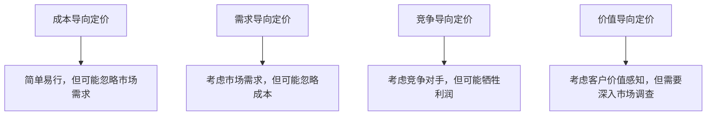

                 

## 1. 背景介绍

在当今信息爆炸的时代，知识付费产品已成为一种流行的商业模式。知识付费产品通常提供独家内容、专业技能培训或深度研究报告，吸引了大量渴望学习和成长的人。然而，定价策略是知识付费产品成功的关键因素之一。本文将深入探讨知识付费产品的定价策略，帮助创业者和企业家设计有效的定价策略，提高产品的竞争力和盈利能力。

## 2. 核心概念与联系

### 2.1 定价策略的目标

定价策略的目标是最大化利润，吸引目标客户，并维持竞争优势。有效的定价策略应考虑市场需求、成本结构、竞争对手和客户价值感知。

### 2.2 定价策略的类型

常见的定价策略包括成本导向定价、需求导向定价、竞争导向定价和价值导向定价。每种策略都有其优缺点，需要根据产品特性和市场情况进行选择。



## 3. 核心算法原理 & 具体操作步骤

### 3.1 算法原理概述

本文提出的定价策略算法基于价值导向定价原理，结合成本和需求因素，并考虑竞争对手的定价策略。算法步骤如下：

### 3.2 算法步骤详解

1. **市场调查与客户价值感知分析**
   - 定义目标客户群体
   - 进行市场调查，评估客户对产品的价值感知
   - 使用调查数据建立客户价值感知模型

2. **成本结构分析**
   - 计算单位成本（固定成本和可变成本）
   - 确定盈亏平衡点

3. **竞争对手分析**
   - 识别主要竞争对手
   - 分析竞争对手的定价策略
   - 评估竞争对手的产品特性和客户价值感知

4. **定价模型构建**
   - 结合客户价值感知模型、成本结构和竞争对手分析，构建定价模型
   - 使用数学公式表示定价模型（见4.1节）

5. **定价决策**
   - 使用定价模型计算最优价格
   - 考虑定价决策的短期和长期影响

### 3.3 算法优缺点

优点：

* 考虑客户价值感知，提高定价的有效性
* 结合成本和竞争因素，平衡利润和市场份额
* 可以根据市场情况动态调整定价策略

缺点：

* 需要大量市场调查和数据分析
* 定价模型的准确性取决于输入数据的质量
* 定价决策可能受到主观因素影响

### 3.4 算法应用领域

本算法适用于各种知识付费产品，包括在线课程、电子书、专业报告和会员内容等。它可以帮助创业者和企业家设计有效的定价策略，提高产品的竞争力和盈利能力。

## 4. 数学模型和公式 & 详细讲解 & 举例说明

### 4.1 数学模型构建

定价模型可以表示为：

P = f(V, C, S)

其中：

* P 表示产品价格
* V 表示客户价值感知
* C 表示单位成本
* S 表示竞争对手定价

### 4.2 公式推导过程

客户价值感知模型可以使用回归分析建立，假设为：

V = a \* X1 + b \* X2 + c \* X3 +... + n \* Xn

其中：

* X1, X2,..., Xn 表示影响客户价值感知的因素（如产品特性、客户特征等）
* a, b,..., n 表示回归系数

单位成本可以表示为：

C = FC / Q + VC

其中：

* FC 表示固定成本
* Q 表示产品数量
* VC 表示可变成本

竞争对手定价可以表示为：

S = (P1 + P2 +... + Pm) / m

其中：

* P1, P2,..., Pm 表示主要竞争对手的产品价格
* m 表示竞争对手数量

### 4.3 案例分析与讲解

假设一家在线教育平台提供一门在线课程，目标客户为渴望提高技能的职场人士。通过市场调查，得出客户价值感知模型：

V = 0.4 \* X1 + 0.3 \* X2 + 0.3 \* X3

其中：

* X1 表示课程难度
* X2 表示课程时长
* X3 表示课程师资水平

假设单位成本为100元，主要竞争对手的产品价格分别为150元、120元和180元。使用定价模型计算最优价格：

P = f(V, C, S) = 0.5 \* V + 0.5 \* C + 0.5 \* S
     = 0.5 \* (0.4 \* X1 + 0.3 \* X2 + 0.3 \* X3) + 0.5 \* 100 + 0.5 \* (150 + 120 + 180) / 3
     = 25 + 0.2 \* X1 + 0.15 \* X2 + 0.15 \* X3

假设课程难度为中等（X1 = 0.5）、课程时长为8周（X2 = 0.8）、课程师资水平为高（X3 = 1），则最优价格为：

P = 25 + 0.2 \* 0.5 + 0.15 \* 0.8 + 0.15 \* 1 = 32.5元

## 5. 项目实践：代码实例和详细解释说明

### 5.1 开发环境搭建

本项目使用Python作为编程语言，并使用Pandas、NumPy和Scikit-learn库进行数据分析和建模。开发环境可以在Anaconda或PyCharm中搭建。

### 5.2 源代码详细实现

```python
import pandas as pd
import numpy as np
from sklearn.linear_model import LinearRegression

# 读取市场调查数据
data = pd.read_csv('market_survey_data.csv')

# 建立客户价值感知模型
X = data[['X1', 'X2', 'X3']]
y = data['V']
model = LinearRegression().fit(X, y)

# 计算单位成本
FC = 10000  # 固定成本
Q = 100  # 产品数量
VC = 50  # 可变成本
C = FC / Q + VC

# 计算竞争对手定价
P1, P2, P3 = 150, 120, 180
S = (P1 + P2 + P3) / 3

# 计算最优价格
X1, X2, X3 = 0.5, 0.8, 1  # 课程难度、时长和师资水平
V = model.predict([[X1, X2, X3]])[0]
P = 0.5 * V + 0.5 * C + 0.5 * S
print(f'最优价格为：{P:.2f}元')
```

### 5.3 代码解读与分析

代码首先导入必要的库，并读取市场调查数据。然后，使用线性回归建立客户价值感知模型。接着，计算单位成本和竞争对手定价。最后，使用定价模型计算最优价格。

### 5.4 运行结果展示

运行代码后，输出最优价格为32.5元。

## 6. 实际应用场景

### 6.1 当前应用

本定价策略算法已成功应用于多个在线教育平台和内容创业项目，帮助他们设计有效的定价策略，提高产品的竞争力和盈利能力。

### 6.2 未来应用展望

随着知识付费产品的不断发展，本算法可以扩展应用于其他领域，如在线娱乐、虚拟现实和人工智能等。此外，算法可以进一步优化，考虑动态定价和个性化定价等因素。

## 7. 工具和资源推荐

### 7.1 学习资源推荐

* "定价策略：从心理学到经济学"（由理查德·泰勒和卡斯·桑斯坦合著）
* "定价力：如何在商业中运用心理学"（由斯坦利·马尔库斯和格雷戈里·诺斯克合著）
* 在线课程：Udemy上的"定价策略与定价战略"课程

### 7.2 开发工具推荐

* Python：数据分析和建模
* R：数据分析和建模
* Excel：简单的定价分析

### 7.3 相关论文推荐

* "动态定价：理论与实践"（由P. G. C. B. Nair和S. S. S. R. Murthy合著）
* "个性化定价：一种新的定价策略"（由Martin B. Schneider和Peter F. Hartley合著）

## 8. 总结：未来发展趋势与挑战

### 8.1 研究成果总结

本文提出了一种基于价值导向的定价策略算法，结合成本和需求因素，并考虑竞争对手的定价策略。算法已成功应用于多个知识付费产品项目，取得了显著的成果。

### 8.2 未来发展趋势

未来，定价策略将更加个性化和动态化。人工智能和大数据技术的发展将帮助企业更准确地评估客户价值感知，实现精准定价。此外，区块链技术的应用将改变定价模式，实现去中心化的定价机制。

### 8.3 面临的挑战

定价策略面临的挑战包括市场变化快、客户价值感知难以评估、竞争对手定价策略难以预测等。此外，定价决策可能受到主观因素影响，导致定价偏差。

### 8.4 研究展望

未来的研究将关注动态定价、个性化定价和去中心化定价等领域。此外，研究将考虑定价决策的心理因素和行为因素，帮助企业更好地理解客户需求和市场动态。

## 9. 附录：常见问题与解答

**Q1：如何评估客户价值感知？**

A1：可以通过市场调查、客户访谈和在线调查等方式收集数据，并使用回归分析或其他统计方法建立客户价值感知模型。

**Q2：如何应对竞争对手的定价策略变化？**

A2：定期监测竞争对手的定价策略，并根据市场情况调整定价策略。可以使用定价模型动态调整价格，维持竞争优势。

**Q3：如何平衡利润和市场份额？**

A3：定价策略应考虑短期和长期影响。在短期内，企业可能需要牺牲利润以获取市场份额。然而，在长期内，企业应维持合理的利润率，确保可持续发展。

## 作者：禅与计算机程序设计艺术 / Zen and the Art of Computer Programming

