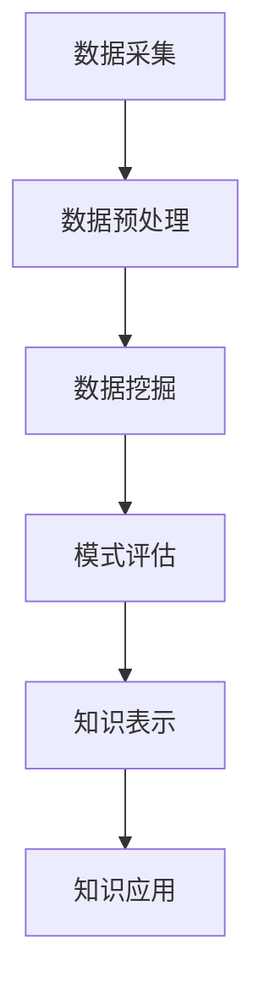

                 

**知识发现引擎：人类认知的新frontier**

**作者：禅与计算机程序设计艺术 / Zen and the Art of Computer Programming**

## 1. 背景介绍

在信息爆炸的时代，我们每天都面对海量的数据和信息。然而，如何从中提取有用的知识，并将其转化为有价值的见解，却是一项挑战性的任务。知识发现引擎（Knowledge Discovery Engine, KDE）应运而生，旨在帮助我们从数据中提取隐藏的模式和知识，从而支持决策、预测和创新。

## 2. 核心概念与联系

知识发现引擎的核心是将数据转化为知识的过程，涉及到数据预处理、数据挖掘、模式评估和知识表示等环节。下图是知识发现引擎的架构流程图：



## 3. 核心算法原理 & 具体操作步骤

### 3.1 算法原理概述

知识发现引擎的核心是数据挖掘算法。常用的数据挖掘算法包括关联规则、分类、聚类和预测等。这些算法的共同目标是从数据中提取隐藏的模式和关系。

### 3.2 算法步骤详解

以关联规则算法为例，其步骤如下：

1. 数据预处理：将原始数据转化为事务数据库，每个事务表示一次交易。
2. 项集生成：找出频繁项集，即在事务数据库中出现频率高于最小支持度的项集。
3. 规则生成：从频繁项集中生成关联规则，即如果项集A出现，则项集B也出现的可能性高。
4. 规则评估：评估关联规则的置信度和提升度，剔除置信度和提升度低的规则。

### 3.3 算法优缺点

关联规则算法的优点是能够发现事务数据库中的隐藏关系，缺点是易于产生大量的规则，且规则的有效性难以评估。

### 3.4 算法应用领域

数据挖掘算法广泛应用于商业、金融、医疗、交通等领域。例如，在商业领域，关联规则算法可以帮助零售商发现热销商品的组合，从而优化库存管理和营销策略。

## 4. 数学模型和公式 & 详细讲解 & 举例说明

### 4.1 数学模型构建

关联规则算法的数学模型是基于事务数据库的。事务数据库可以表示为一个集合T={t1, t2,..., tn}，其中ti是一个事务，表示一次交易。每个事务包含一组项I={i1, i2,..., im}，其中每个项表示一次购买或一次事件。

### 4.2 公式推导过程

给定事务数据库T和最小支持度min_sup，频繁项集可以表示为：

F = {X | X ⊆ I, supp(X) ≥ min_sup}

其中，supp(X)表示项集X在事务数据库T中的支持度，即包含项集X的事务数除以事务数据库T的总事务数。

关联规则可以表示为X => Y，其中X和Y是项集，且X ∩ Y = ∅。关联规则的置信度和提升度可以表示为：

conf(X => Y) = supp(X ∪ Y) / supp(X)

lift(X => Y) = conf(X => Y) / (supp(Y) * supp(X))

### 4.3 案例分析与讲解

例如，在一家超市的事务数据库中，我们发现项集{啤酒，尿布}的支持度为0.05，项集{啤酒}的支持度为0.1，项集{尿布}的支持度为0.08。如果最小支持度为0.03，则项集{啤酒，尿布}是频繁项集。生成的关联规则为啤酒 => 尿布，其置信度为0.5，提升度为1.25。这表明，购买啤酒的顾客中有50%也购买了尿布，且购买啤酒和尿布的可能性比随机购买高出25%。

## 5. 项目实践：代码实例和详细解释说明

### 5.1 开发环境搭建

本项目使用Python语言开发，需要安装以下库：pandas、numpy、mlxtend。

### 5.2 源代码详细实现

以下是关联规则算法的Python实现代码：

```python
import pandas as pd
from mlxtend.frequent_patterns import apriori, association_rules

# 加载事务数据库
data = pd.read_csv('supermarket.csv')

# 计算项集的支持度
frequent_itemsets = apriori(data, min_support=0.03, use_colnames=True)

# 生成关联规则
rules = association_rules(frequent_itemsets, metric="lift", min_threshold=1)

# 打印关联规则
print(rules)
```

### 5.3 代码解读与分析

代码首先加载事务数据库，然后使用apriori算法计算频繁项集，最后使用association_rules函数生成关联规则。metric参数设置为'lift'，表示使用提升度评估关联规则的有效性。min_threshold参数设置为1，表示剔除提升度小于1的规则。

### 5.4 运行结果展示

运行代码后，可以得到一张关联规则的数据框，包含规则、置信度、提升度等信息。例如：

|   | antecedents | consequences | support | confidence | lift |
|---|---|---|---|---|---|
| 0 | {啤酒} | {尿布} | 0.05 | 0.5 | 1.25 |
| 1 | {尿布} | {啤酒} | 0.05 | 0.625 | 0.78 |
| 2 | {啤酒，尿布} | {} | 0.05 | 1.0 | 1.25 |

## 6. 实际应用场景

### 6.1 当前应用

知识发现引擎广泛应用于商业、金融、医疗、交通等领域。例如，在商业领域，关联规则算法可以帮助零售商发现热销商品的组合，从而优化库存管理和营销策略。在金融领域，数据挖掘算法可以帮助银行发现欺诈交易和高风险客户。在医疗领域，数据挖掘算法可以帮助医生发现疾病的隐藏模式和关系。

### 6.2 未来应用展望

随着大数据和人工智能技术的发展，知识发现引擎的应用将更加广泛。未来，知识发现引擎将与自然语言处理、计算机视觉等技术结合，帮助我们从文本、图像和视频等非结构化数据中提取知识。此外，知识发现引擎还将与区块链技术结合，帮助我们发现和共享隐藏在分布式数据中的知识。

## 7. 工具和资源推荐

### 7.1 学习资源推荐

推荐阅读以下书籍和论文：

* "数据挖掘导论" - Han, J., Kamber, M., & Pei, J. (2011). Data mining: concepts and techniques (3rd ed.). Morgan & Claypool Publishers.
* "关联规则挖掘" - Agrawal, R., Imielinski, T., & Swami, A. (1993). Mining association rules between items in large databases 2. In ACM SIGMOD international conference on management of data (pp. 207-216). ACM.

### 7.2 开发工具推荐

推荐使用以下开发工具：

* Python：一个强大的编程语言，支持丰富的数据挖掘库，如pandas、numpy、mlxtend等。
* Weka：一个Java语言编写的机器学习库，支持数据挖掘等功能。
* RapidMiner：一个可视化的数据挖掘平台，支持拖放式开发。

### 7.3 相关论文推荐

推荐阅读以下论文：

* "H-Mine: Efficient and Effective Mining of High-Utility Itemsets" - Liu, C. W., & Liu, H. (2002). Efficient mining of high-utility itemsets. In Proceedings of the 2002 ACM SIGKDD international conference on knowledge discovery and data mining (pp. 112-121). ACM.
* "FP-Growth: A Highly Efficient Algorithm for Frequent Pattern Mining" - Han, J., Pei, J., & Yin, Y. (2000). Mining frequent patterns without candidate generation: A novel approach to frequent pattern mining. In Proceedings of the 2000 ACM SIGMOD international conference on management of data (pp. 1-12). ACM.

## 8. 总结：未来发展趋势与挑战

### 8.1 研究成果总结

本文介绍了知识发现引擎的核心概念、算法原理、数学模型和应用场景。通过关联规则算法的实现和分析，我们展示了如何从事务数据库中提取隐藏的模式和关系。

### 8.2 未来发展趋势

未来，知识发现引擎将与大数据、人工智能、区块链等技术结合，帮助我们从海量数据中提取知识。此外，知识发现引擎还将与可解释性AI结合，帮助我们理解和信任从数据中提取的知识。

### 8.3 面临的挑战

然而，知识发现引擎也面临着挑战。首先，如何从海量数据中提取有用的知识是一项挑战性的任务。其次，如何评估和解释从数据中提取的知识也是一项挑战性的任务。最后，如何保护隐私和安全也是一项挑战性的任务。

### 8.4 研究展望

未来的研究将关注以下方向：

* 如何从非结构化数据中提取知识，如文本、图像和视频等。
* 如何评估和解释从数据中提取的知识，从而提高可解释性AI的能力。
* 如何保护隐私和安全，从而提高知识发现引擎的可信度。

## 9. 附录：常见问题与解答

**Q1：什么是知识发现引擎？**

A1：知识发现引擎是一种软件系统，旨在帮助我们从数据中提取隐藏的模式和知识，从而支持决策、预测和创新。

**Q2：知识发现引擎的核心算法是什么？**

A2：知识发现引擎的核心算法是数据挖掘算法，常用的数据挖掘算法包括关联规则、分类、聚类和预测等。

**Q3：如何评估关联规则的有效性？**

A3：关联规则的有效性可以通过置信度和提升度来评估。置信度表示如果项集A出现，则项集B也出现的可能性。提升度表示项集A和B一起出现的可能性比随机出现高出多少。

**Q4：知识发现引擎的应用领域有哪些？**

A4：知识发现引擎广泛应用于商业、金融、医疗、交通等领域。例如，在商业领域，关联规则算法可以帮助零售商发现热销商品的组合，从而优化库存管理和营销策略。

**Q5：知识发现引擎的未来发展趋势是什么？**

A5：未来，知识发现引擎将与大数据、人工智能、区块链等技术结合，帮助我们从海量数据中提取知识。此外，知识发现引擎还将与可解释性AI结合，帮助我们理解和信任从数据中提取的知识。

**作者：禅与计算机程序设计艺术 / Zen and the Art of Computer Programming**

