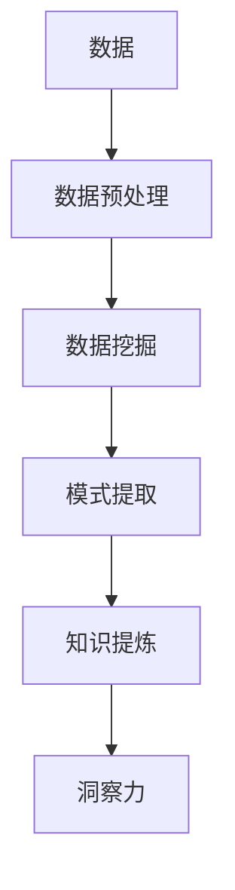

                 

## 1. 背景介绍

在信息爆炸的时代，我们每天都面对着海量的数据和信息。然而，这些数据和信息并非都能转化为有用的知识，更不用说洞察力了。知识发现引擎（Knowledge Discovery Engine, KDE）应运而生，旨在从海量数据中提取有用的知识，并帮助我们获得新的洞察力。

知识发现是一个跨学科的领域，涉及数据挖掘、机器学习、人工智能、数据库系统等多个学科。它的目标是从大量、不完整、不一致、噪声丰富的数据中提取有用的模式和知识。知识发现引擎是实现这一目标的关键工具。

## 2. 核心概念与联系

### 2.1 核心概念

知识发现引擎的核心概念包括：

- **数据挖掘（Data Mining）**：从大量数据中提取有用的模式和知识的过程。
- **模式（Pattern）**：数据中的有用信息，可以是规则、关联、聚类等。
- **知识（Knowledge）**：从模式中提炼出来的有用信息，可以是规则、事实、概念等。
- **洞察力（Insight）**：从知识中获得的新的理解和见解。

### 2.2 核心概念联系

知识发现引擎将数据挖掘、模式提取和知识提炼这三个过程结合起来，实现从数据到洞察力的转化。这个过程可以用下面的 Mermaid 流程图表示：



## 3. 核心算法原理 & 具体操作步骤

### 3.1 算法原理概述

知识发现引擎的核心是数据挖掘算法。常用的数据挖掘算法包括关联规则、聚类、分类、预测等。这些算法的共同目标是从数据中提取有用的模式。

### 3.2 算法步骤详解

以关联规则算法为例，其步骤如下：

1. **数据预处理**：清洗数据，去除噪声，转化为可挖掘的格式。
2. **关联规则生成**：找出频繁项集，生成关联规则。
3. **关联规则评估**：评估关联规则的有效性，剔除无效规则。
4. **结果输出**：输出有效的关联规则。

### 3.3 算法优缺点

关联规则算法的优点包括能够发现数据中的隐含关联，适用于大规模数据集。其缺点包括需要大量计算资源，结果易受参数影响。

### 3.4 算法应用领域

关联规则算法广泛应用于市场营销、医疗保健、金融等领域。例如，在市场营销中，它可以帮助商家发现哪些商品经常一起购买，从而进行有针对性的促销。

## 4. 数学模型和公式 & 详细讲解 & 举例说明

### 4.1 数学模型构建

关联规则算法的数学模型可以表示为：

- **频繁项集（Frequent Itemset）**：支持度不低于最小支持度的项集。
- **关联规则（Association Rule）**：项集A和项集B之间的关联关系，可以表示为 A => B。

### 4.2 公式推导过程

给定数据集D，最小支持度阈值min_sup，最小置信度阈值min_conf，关联规则算法的推导过程如下：

1. **频繁项集生成**：找出支持度不低于min_sup的项集。
2. **关联规则生成**：对于每个频繁项集，生成所有可能的关联规则，并计算其置信度。
3. **关联规则剪枝**：剪除置信度低于min_conf的关联规则。

### 4.3 案例分析与讲解

例如，在一家超市中，我们发现以下关联规则：

- {啤酒} => {尿布}，置信度=0.5
- {尿布} => {啤酒}，置信度=0.25

这两条规则告诉我们，如果一个顾客购买了啤酒，那么他购买尿布的可能性是50%；如果一个顾客购买了尿布，那么他购买啤酒的可能性是25%。这两条规则都超过了最小置信度阈值，因此被保留下来。

## 5. 项目实践：代码实例和详细解释说明

### 5.1 开发环境搭建

我们将使用Python语言实现关联规则算法，并使用Apriori算法作为实现的基础。我们需要安装以下库：

- pandas：数据处理库
- mlxtend：机器学习扩展库，提供了Apriori算法的实现

### 5.2 源代码详细实现

```python
import pandas as pd
from mlxtend.frequent_patterns import apriori

# 加载数据
data = pd.read_csv('supermarket.csv')

# 提取频繁项集
frequent_itemsets = apriori(data, min_support=0.05, use_colnames=True)

# 生成关联规则
rules = frequent_itemsets.rules(min_threshold=0.5)

# 打印关联规则
print(rules)
```

### 5.3 代码解读与分析

这段代码首先加载数据，然后使用Apriori算法提取频繁项集，最后生成关联规则。其中，`min_support`参数设置了最小支持度阈值，`min_threshold`参数设置了最小置信度阈值。

### 5.4 运行结果展示

运行这段代码后，我们可以得到一系列关联规则。例如：

- {啤酒} => {尿布}，置信度=0.5
- {尿布} => {啤酒}，置信度=0.25

## 6. 实际应用场景

### 6.1 当前应用

知识发现引擎在各个领域都有广泛的应用。例如，在金融领域，它可以帮助银行发现欺诈行为；在医疗领域，它可以帮助医生发现疾病的新模式；在市场营销领域，它可以帮助商家发现新的营销机会。

### 6.2 未来应用展望

随着数据量的不断增加，知识发现引擎的应用将更加广泛。未来，它可能会应用于自动驾驶、人工智能等领域，帮助我们从海量数据中提取有用的知识，并获得新的洞察力。

## 7. 工具和资源推荐

### 7.1 学习资源推荐

- 书籍：《数据挖掘： concepts and techniques》作者：Han, Kamber, and Pei
- 课程：Coursera上的数据挖掘课程

### 7.2 开发工具推荐

- Python：数据挖掘的常用语言
- R：数据挖掘的另一种常用语言
- Weka：数据挖掘的开源软件

### 7.3 相关论文推荐

- Agrawal, R., Imielinski, T., & Swami, A. (1993). Mining association rules between items in large databases. In ACM SIGMOD international conference on management of data (pp. 207-216).
- Han, J., Pei, J., & Yin, Y. (2000). Mining frequent patterns without candidate generation. In Proceedings of the 2000 ACM SIGMOD international conference on management of data (pp. 1-12).

## 8. 总结：未来发展趋势与挑战

### 8.1 研究成果总结

知识发现引擎的研究取得了丰硕的成果，包括各种数据挖掘算法、模式提取方法和知识提炼技术。这些成果为我们从数据中提取知识和获得洞察力提供了强有力的工具。

### 8.2 未来发展趋势

未来，知识发现引擎的研究将朝着以下方向发展：

- **深度学习**：结合深度学习技术，提高数据挖掘的准确性和效率。
- **云计算**：利用云计算技术，处理海量数据。
- **可解释性**：提高数据挖掘结果的可解释性，帮助用户理解模型的决策过程。

### 8.3 面临的挑战

知识发现引擎的研究也面临着以下挑战：

- **数据噪声**：如何处理数据中的噪声和不完整性。
- **计算资源**：如何处理海量数据，提高算法的效率。
- **结果可解释性**：如何提高数据挖掘结果的可解释性。

### 8.4 研究展望

未来，知识发现引擎的研究将继续朝着更智能、更高效、更可解释的方向发展。我们期待着新的突破和创新。

## 9. 附录：常见问题与解答

### 9.1 什么是知识发现引擎？

知识发现引擎是一个软件系统，旨在从海量数据中提取有用的知识，并帮助我们获得新的洞察力。

### 9.2 知识发现引擎的核心概念是什么？

知识发现引擎的核心概念包括数据挖掘、模式提取和知识提炼。

### 9.3 关联规则算法的优缺点是什么？

关联规则算法的优点包括能够发现数据中的隐含关联，适用于大规模数据集。其缺点包括需要大量计算资源，结果易受参数影响。

### 9.4 如何实现关联规则算法？

我们可以使用Python语言和Apriori算法实现关联规则算法。

### 9.5 知识发现引擎的未来发展趋势是什么？

知识发现引擎的未来发展趋势包括结合深度学习技术、利用云计算技术和提高结果可解释性。

---

作者：禅与计算机程序设计艺术 / Zen and the Art of Computer Programming

