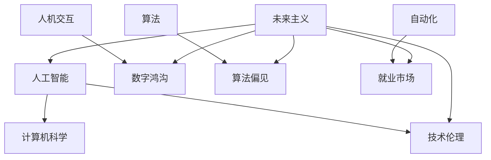

                 

**人工智能**, **计算机科学**, **技术伦理**, **人机交互**, **数字鸿沟**, **算法偏见**, **自动化**, **就业市场**, **未来主义**

## 1. 背景介绍

自从人类发明了计算机以来，我们的世界就被数字技术深刻地改变了。从早期的机械式计算机到当今的量子计算机，计算能力的提升推动了人类文明的进步。然而，随着计算技术的发展，我们也面临着一系列的挑战和问题，这些问题需要我们认真地思考和解决。

## 2. 核心概念与联系

### 2.1 核心概念

- **人工智能 (AI)**: AI是指模拟人类智能的计算机系统，它能够通过学习、推理、问题解决等方式来处理各种任务。
- **计算机科学 (CS)**: CS是研究计算机及其应用的科学，它涵盖了计算机系统的设计、软件开发、算法设计等各个方面。
- **技术伦理 (Ethics)**: 技术伦理是指研究技术发展对人类社会产生的道德和伦理影响的学科。
- **人机交互 (HCI)**: HCI是指人与计算机之间的交互过程，它涉及到用户界面设计、用户体验等方面。
- **数字鸿沟 (Digital Divide)**: 数字鸿沟是指由于缺乏信息技术和互联网接入而导致的社会不平等现象。
- **算法偏见 (Algorithmic Bias)**: 算法偏见是指由于算法设计不当而导致的结果不公平或不准确的现象。
- **自动化 (Automation)**: 自动化是指使用机器或计算机系统来执行人类的工作任务。
- **就业市场 (Labor Market)**: 就业市场是指劳动力市场，它涉及到劳动力供求关系、薪酬水平等方面。
- **未来主义 (Futurism)**: 未来主义是指研究未来发展趋势的学科，它涉及到技术、社会、经济等各个方面。

### 2.2 核心概念联系

人类计算的发展对上述概念产生了深远的影响。AI的发展推动了CS的进步，但也带来了技术伦理方面的挑战。HCI的发展改善了人机交互的体验，但也加剧了数字鸿沟。算法的广泛应用带来了算法偏见的问题。自动化的发展改善了生产效率，但也对就业市场产生了影响。未来主义者正在研究这些问题，以指导我们未来的发展方向。

## 3. 核心算法原理 & 具体操作步骤

### 3.1 算法原理概述

算法是计算机科学的核心，它是一系列明确的指令，用于解决特定的问题。算法的原理是基于数学和逻辑的，它涉及到数据结构、控制结构等方面。

### 3.2 算法步骤详解

算法的步骤通常包括输入、处理、输出等环节。输入是指算法需要的数据，处理是指算法对数据进行的操作，输出是指算法的结果。算法的步骤需要清晰明确，以便于计算机系统执行。

### 3.3 算法优缺点

算法的优点包括效率高、准确性好、可重复性强等。算法的缺点包括设计复杂、易出错等。算法的优缺点需要根据具体的应用场景来权衡。

### 3.4 算法应用领域

算法的应用领域非常广泛，包括图像处理、自然语言处理、机器学习等。算法的应用需要根据具体的问题来选择合适的算法。

## 4. 数学模型和公式 & 详细讲解 & 举例说明

### 4.1 数学模型构建

数学模型是描述复杂系统行为的工具，它需要根据具体的问题来构建。数学模型需要简化真实世界的复杂性，以便于进行数学分析。

### 4.2 公式推导过程

数学模型需要使用数学公式来描述，公式的推导过程需要严格地遵循数学逻辑。公式的推导过程需要清晰明确，以便于其他人进行检验和理解。

### 4.3 案例分析与讲解

数学模型的应用需要通过具体的案例来进行讲解。例如，在机器学习领域，数学模型可以用于描述数据的分布，并预测新数据的类别。数学模型的应用需要根据具体的问题来进行选择和调整。

## 5. 项目实践：代码实例和详细解释说明

### 5.1 开发环境搭建

项目实践需要一个合适的开发环境，开发环境需要包括编程语言、开发工具等。开发环境的搭建需要根据具体的项目需求来进行选择和配置。

### 5.2 源代码详细实现

项目实践需要编写源代码，源代码需要清晰明确，以便于其他人进行阅读和理解。源代码的编写需要遵循编程规范和最佳实践。

### 5.3 代码解读与分析

源代码的解读和分析需要从代码的结构、逻辑等方面进行。代码的解读和分析需要清晰明确，以便于其他人进行学习和理解。

### 5.4 运行结果展示

项目实践需要展示运行结果，运行结果需要清晰明确，以便于其他人进行评估和理解。运行结果的展示需要根据具体的项目需求来进行选择和设计。

## 6. 实际应用场景

### 6.1 当前应用场景

人类计算的应用场景非常广泛，包括金融、医疗、交通等领域。人类计算的当前应用需要根据具体的问题来进行选择和设计。

### 6.2 未来应用展望

人类计算的未来应用需要根据技术发展趋势来进行预测和设计。未来应用需要考虑技术的可靠性、安全性等方面。

## 7. 工具和资源推荐

### 7.1 学习资源推荐

学习资源包括书籍、视频、在线课程等。学习资源需要根据具体的学习需求来进行选择和推荐。

### 7.2 开发工具推荐

开发工具包括编辑器、调试器、集成开发环境等。开发工具需要根据具体的项目需求来进行选择和推荐。

### 7.3 相关论文推荐

相关论文包括学术会议论文、期刊论文等。相关论文需要根据具体的研究需求来进行选择和推荐。

## 8. 总结：未来发展趋势与挑战

### 8.1 研究成果总结

人类计算的研究成果需要进行总结和评估，总结需要清晰明确，以便于其他人进行学习和理解。评估需要根据具体的研究需求来进行选择和设计。

### 8.2 未来发展趋势

人类计算的未来发展趋势需要根据技术发展趋势来进行预测和设计。未来发展趋势需要考虑技术的可靠性、安全性等方面。

### 8.3 面临的挑战

人类计算面临的挑战包括技术挑战、伦理挑战等。技术挑战需要根据具体的技术需求来进行选择和设计。伦理挑战需要根据具体的伦理需求来进行选择和设计。

### 8.4 研究展望

人类计算的研究展望需要根据技术发展趋势和伦理需求来进行设计。研究展望需要考虑技术的可靠性、安全性等方面。

## 9. 附录：常见问题与解答

常见问题包括技术问题、伦理问题等。常见问题需要根据具体的问题需求来进行选择和设计。解答需要清晰明确，以便于其他人进行学习和理解。

## 作者署名

作者：禅与计算机程序设计艺术 / Zen and the Art of Computer Programming

