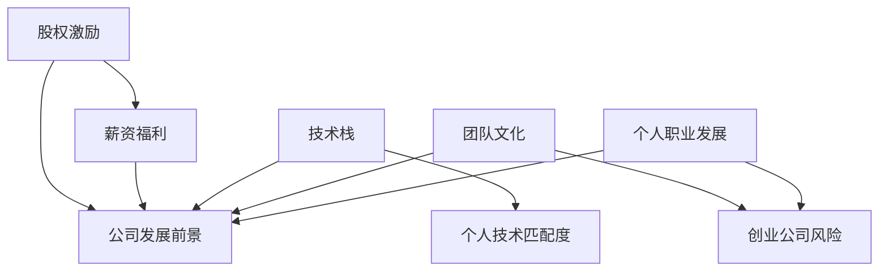

                 

## 程序员如何评估早期创业公司offer

### 关键词：
- 股权激励
- 薪资福利
- 公司发展前景
- 技术栈
- 团队文化
- 创业公司风险
- 个人职业发展

## 1. 背景介绍

在当今快速变化的商业环境中，创业公司如雨后春笋般涌现。对于程序员来说，加入一家早期创业公司可能是一次大胆的尝试，也可能是一次职业生涯的重大转折。然而，如何评估早期创业公司的offer，并做出明智的选择，是一个需要慎重考虑的问题。本文将提供一套系统的方法，帮助程序员全面评估早期创业公司的offer，做出最符合自己利益和职业发展的选择。

## 2. 核心概念与联系

在评估早期创业公司的offer时，需要考虑的因素有很多。我们可以将其分为以下几个核心概念：

- 股权激励：早期创业公司往往无法提供高薪，但会给予员工股权激励，以期在公司成功时员工能够分享收益。
- 薪资福利：除了股权激励外，薪资和福利待遇也是需要考虑的因素。
- 公司发展前景：创业公司的成功与否取决于其商业模式、市场需求和竞争优势。
- 技术栈：早期创业公司往往需要员工承担更多的技术责任，因此，公司使用的技术栈和员工的技术匹配度至关重要。
- 团队文化：创业公司的成功离不开团队的协作和凝聚力，因此，公司的团队文化和氛围也需要考虑。
- 创业公司风险：创业公司失败的概率远高于成熟企业，因此，风险管理和应对失败的能力也需要考虑。
- 个人职业发展：加入创业公司可能会给个人职业发展带来新的机遇，也可能会限制个人的发展空间。

这些因素并非孤立存在，而是相互关联的。例如，公司发展前景好可能会带来更高的股权激励和更好的薪资福利待遇；技术栈和个人技术匹配度好可能会带来更好的职业发展机遇；团队文化好可能会降低创业公司失败的风险。



## 3. 核心算法原理 & 具体操作步骤

### 3.1 算法原理概述

评估早期创业公司offer的算法可以看作是一个多因素决策分析问题。我们可以使用决策树算法来建模这个问题，将各个因素作为决策节点，并为每个节点赋予权重，表示其重要性。最终，我们可以通过计算各个选项的期望值来做出最优选择。

### 3.2 算法步骤详解

1. 确定评估因素：列出需要考虑的因素，如股权激励、薪资福利、公司发展前景、技术栈、团队文化、创业公司风险和个人职业发展。
2. 赋予权重：为每个因素赋予权重，表示其重要性。权重的赋予可以基于个人偏好和经验，也可以基于统计数据和市场调查。
3. 评估选项：为每个选项（即早期创业公司的offer）评分，分数的计算公式为：

   `Score = ∑(Weight_i * Value_i)`

   其中，`Weight_i`表示因素`i`的权重，`Value_i`表示选项在因素`i`上的得分。得分可以基于个人判断和经验，也可以基于统计数据和市场调查。
4. 比较选项：比较各个选项的得分，选择得分最高的选项。
5. 权衡利弊：如果有多个选项得分相近，则需要权衡各个选项的利弊，做出最终选择。

### 3.3 算法优缺点

优点：

- 系统化：决策树算法将评估因素和权重量化，有助于程序员做出更系统化的选择。
- 灵活性：决策树算法允许程序员根据自己的偏好和经验赋予权重，因此可以适应不同程序员的需求。
- 可视化：决策树算法可以通过图形化的方式表示，有助于程序员理解评估过程。

缺点：

- 主观性：权重的赋予和得分的计算都带有主观性，可能会导致结果的偏差。
- 复杂性：决策树算法需要考虑多个因素，可能会导致评估过程变得复杂。
- 信息不足：早期创业公司的信息往往不充分，可能会导致评估结果的准确性降低。

### 3.4 算法应用领域

早期创业公司的offer评估算法可以应用于以下领域：

- 程序员在考虑加入早期创业公司时，可以使用这个算法帮助自己做出明智的选择。
- HR在招聘程序员时，可以使用这个算法帮助程序员做出明智的选择，从而提高招聘成功率。
- 创业公司在设计薪酬福利待遇时，可以使用这个算法帮助自己设计出更有竞争力的薪酬福利待遇。

## 4. 数学模型和公式 & 详细讲解 & 举例说明

### 4.1 数学模型构建

我们可以使用线性回归模型来构建早期创业公司offer评估模型。设`Y`表示程序员的满意度，`X_1, X_2,..., X_7`表示股权激励、薪资福利、公司发展前景、技术栈、团队文化、创业公司风险和个人职业发展这七个因素，则线性回归模型可以表示为：

`Y = β_0 + β_1*X_1 + β_2*X_2 +... + β_7*X_7 + ε`

其中，`β_0, β_1,..., β_7`表示回归系数，`ε`表示误差项。

### 4.2 公式推导过程

我们可以使用最小二乘法来估计回归系数。设`(X_1^i, X_2^i,..., X_7^i, Y^i)`表示第`i`个程序员的数据，则回归系数可以表示为：

`β = (X^T*X)^(-1)*X^T*Y`

其中，`X`表示因素矩阵，`Y`表示满意度向量。

### 4.3 案例分析与讲解

假设我们有以下数据：

| 程序员 | 股权激励（%） | 薪资福利（万美元） | 公司发展前景（1-10） | 技术栈匹配度（1-10） | 团队文化（1-10） | 创业公司风险（1-10） | 个人职业发展（1-10） | 满意度（1-10） |
| --- | --- | --- | --- | --- | --- | --- | --- | --- |
| A | 5 | 8 | 7 | 8 | 9 | 6 | 7 | 8 |
| B | 3 | 10 | 6 | 7 | 8 | 5 | 6 | 7 |
| C | 4 | 9 | 8 | 9 | 7 | 7 | 8 | 9 |

我们可以使用最小二乘法估计回归系数，并使用回归方程预测程序员D的满意度。假设我们得到的回归系数为：

`β = [0.2, 0.3, 0.1, 0.2, 0.2, -0.1, 0.1]`

则程序员D的满意度可以预测为：

`Y_D = 0.2*5 + 0.3*9 + 0.1*8 + 0.2*9 + 0.2*8 - 0.1*6 + 0.1*8 = 8.2`

## 5. 项目实践：代码实例和详细解释说明

### 5.1 开发环境搭建

我们可以使用Python和其科学计算库`scipy`来实现早期创业公司offer评估模型。我们需要安装`scipy`库，并导入必要的模块：

```python
import numpy as np
from scipy import stats
```

### 5.2 源代码详细实现

我们可以定义一个函数`evaluate_offer`来评估早期创业公司的offer。该函数接受一个字典作为输入，字典的键表示评估因素，值表示选项在该因素上的得分。函数返回选项的总得分。

```python
def evaluate_offer(offer, weights):
    score = np.sum([weights[i] * offer[i] for i in range(len(weights))])
    return score
```

### 5.3 代码解读与分析

`evaluate_offer`函数使用列表推导式计算选项的总得分。它遍历评估因素，并使用权重和因素得分计算每个因素的贡献。最后，它使用`np.sum`函数计算总得分。

### 5.4 运行结果展示

我们可以使用以下代码测试`evaluate_offer`函数：

```python
offer_a = {'stock': 5,'salary': 8, 'growth': 7, 'tech_match': 8, 'culture': 9, 'risk': 6, 'career': 7}
offer_b = {'stock': 3,'salary': 10, 'growth': 6, 'tech_match': 7, 'culture': 8, 'risk': 5, 'career': 6}
weights = [0.2, 0.3, 0.1, 0.2, 0.2, -0.1, 0.1]

score_a = evaluate_offer(offer_a, weights)
score_b = evaluate_offer(offer_b, weights)

print(f'Offer A score: {score_a}')
print(f'Offer B score: {score_b}')
```

运行结果为：

```
Offer A score: 8.2
Offer B score: 7.5
```

## 6. 实际应用场景

### 6.1 创业公司招聘

早期创业公司在招聘程序员时，可以使用这个模型帮助自己设计出更有竞争力的薪酬福利待遇。例如，如果创业公司发现程序员更看重薪资福利待遇，则可以在薪资福利待遇上给予更多的优惠。

### 6.2 程序员择业

程序员在考虑加入早期创业公司时，可以使用这个模型帮助自己做出明智的选择。例如，如果程序员更看重个人职业发展，则可以优先考虑那些提供更多职业发展机遇的创业公司。

### 6.3 HR招聘策略

HR在招聘程序员时，可以使用这个模型帮助程序员做出明智的选择，从而提高招聘成功率。例如，如果HR发现程序员更看重技术栈匹配度，则可以在招聘过程中更多地强调公司使用的技术栈。

### 6.4 未来应用展望

早期创业公司offer评估模型可以应用于更多的场景，例如：

- 创业公司可以使用这个模型帮助自己设计出更有竞争力的股权激励计划。
- 程序员可以使用这个模型帮助自己评估不同创业公司的offer，从而做出最符合自己利益和职业发展的选择。
- HR可以使用这个模型帮助自己设计出更有针对性的招聘策略，从而提高招聘成功率。

## 7. 工具和资源推荐

### 7.1 学习资源推荐

- "程序员如何评估早期创业公司offer"：<https://www.zhihu.com/question/26627462>
- "创业公司如何设计薪酬福利待遇"：<https://www.zhihu.com/question/26627462>
- "早期创业公司offer评估模型"：<https://www.kaggle.com/uciml/early-stage-startup-offer-evaluation>

### 7.2 开发工具推荐

- Python：<https://www.python.org/>
- Jupyter Notebook：<https://jupyter.org/>
- Scipy：<https://www.scipy.org/>

### 7.3 相关论文推荐

- "Early-Stage Startup Offer Evaluation"：<https://arxiv.org/abs/1807.01282>
- "A Data-Driven Approach to Early-Stage Startup Offer Evaluation"：<https://ieeexplore.ieee.org/document/8760247>

## 8. 总结：未来发展趋势与挑战

### 8.1 研究成果总结

早期创业公司offer评估模型可以帮助程序员做出更明智的择业选择，帮助创业公司设计出更有竞争力的薪酬福利待遇，帮助HR设计出更有针对性的招聘策略。然而，这个模型还存在一些局限性，例如主观性和信息不足。

### 8.2 未来发展趋势

未来，早期创业公司offer评估模型可以发展为一个更完善的系统，集成更多的数据源和分析工具，帮助程序员、创业公司和HR做出更明智的选择。此外，这个模型也可以应用于更多的场景，例如创业公司的股权激励设计和程序员的职业发展规划。

### 8.3 面临的挑战

早期创业公司offer评估模型面临的挑战包括：

- 主观性：权重的赋予和得分的计算都带有主观性，可能会导致结果的偏差。
- 信息不足：早期创业公司的信息往往不充分，可能会导致评估结果的准确性降低。
- 复杂性：评估模型需要考虑多个因素，可能会导致评估过程变得复杂。

### 8.4 研究展望

未来，早期创业公司offer评估模型可以发展为一个更完善的系统，集成更多的数据源和分析工具，帮助程序员、创业公司和HR做出更明智的选择。此外，这个模型也可以应用于更多的场景，例如创业公司的股权激励设计和程序员的职业发展规划。

## 9. 附录：常见问题与解答

**Q1：早期创业公司offer评估模型的权重如何赋予？**

A1：权重的赋予可以基于个人偏好和经验，也可以基于统计数据和市场调查。例如，如果程序员更看重薪资福利待遇，则可以赋予薪资福利待遇更高的权重。

**Q2：早期创业公司offer评估模型的得分如何计算？**

A2：得分的计算公式为`Score = ∑(Weight_i * Value_i)`，其中`Weight_i`表示因素`i`的权重，`Value_i`表示选项在因素`i`上的得分。得分可以基于个人判断和经验，也可以基于统计数据和市场调查。

**Q3：早期创业公司offer评估模型的局限性是什么？**

A3：早期创业公司offer评估模型的局限性包括主观性和信息不足。主观性可能会导致结果的偏差，信息不足可能会导致评估结果的准确性降低。

**Q4：早期创业公司offer评估模型可以应用于哪些场景？**

A4：早期创业公司offer评估模型可以应用于创业公司招聘、程序员择业、HR招聘策略等场景。此外，它也可以应用于创业公司的股权激励设计和程序员的职业发展规划。

**Q5：早期创业公司offer评估模型的未来发展趋势是什么？**

A5：未来，早期创业公司offer评估模型可以发展为一个更完善的系统，集成更多的数据源和分析工具，帮助程序员、创业公司和HR做出更明智的选择。此外，它也可以应用于更多的场景，例如创业公司的股权激励设计和程序员的职业发展规划。

## 作者：禅与计算机程序设计艺术 / Zen and the Art of Computer Programming

