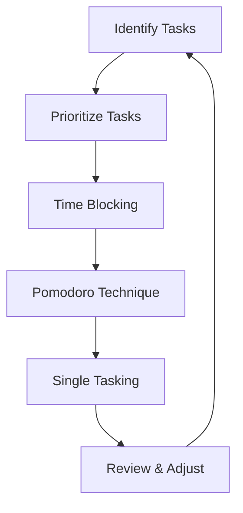

                 

## 1. 背景介绍

在快节奏的现代软件开发环境中，程序员面临着巨大的压力，需要在有限的时间内完成大量的工作。时间管理对于程序员来说至关重要，因为它直接关系到开发效率和项目成功。本文将深入探讨程序员时间管理的核心概念、算法、数学模型，并提供实践项目和工具推荐，帮助程序员提高时间管理效率，从而提高开发效率和项目成功率。

## 2. 核心概念与联系

### 2.1 时间管理的定义

时间管理是指合理安排和利用时间，以提高工作效率和生活质量的过程。对于程序员来说，时间管理的目标是最大化开发产出，最小化开发时间。

### 2.2 时间管理的关键因素

- **优先级（Priority）**：不是所有任务都 equally important，区分任务优先级有助于更好地安排时间。
- **时间块（Time Blocking）**：将时间分成固定的块，专注于单一任务，提高效率。
- ** Pomodoro Technique**：25分钟工作，5分钟休息，循环往复，提高专注力和生产力。
- **单一任务（Single Tasking）**：一次只做一件事，避免任务切换开销。

### 2.3 时间管理流程图



## 3. 核心算法原理 & 具体操作步骤

### 3.1 算法原理概述

时间管理算法的核心原理是基于优先级的任务调度，结合时间块和 Pomodoro Technique，实现单一任务的高效执行。

### 3.2 算法步骤详解

1. **任务识别（Identify Tasks）**：列出所有待完成任务。
2. **任务优先级排序（Prioritize Tasks）**：使用 Eisenhower 矩阵或其他优先级排序方法，将任务分为四类：紧急且重要、重要但不紧急、紧急但不重要、不紧急且不重要。
3. **时间块规划（Time Blocking）**：根据任务优先级和预估时间，将时间分成固定的块，安排给相应任务。
4. **Pomodoro Technique 循环（Pomodoro Loop）**：在每个时间块内，使用 Pomodoro Technique 循环工作 25 分钟，休息 5 分钟。
5. **单一任务执行（Single Tasking）**：在每个 Pomodoro 循环内，专注于单一任务，避免任务切换。
6. **review & adjust（回顾与调整）**：定期回顾任务进度，调整时间块和优先级。

### 3.3 算法优缺点

**优点**：提高专注力，减少任务切换开销，提高生产力。

**缺点**：需要自律和纪律，可能不适合所有工作环境。

### 3.4 算法应用领域

时间管理算法适用于所有需要高效利用时间的领域， particularly 适用于程序员，因为编程需要高度的专注力和长时间连续工作。

## 4. 数学模型和公式 & 详细讲解 & 举例说明

### 4.1 数学模型构建

时间管理的数学模型可以基于PERT 网络（Program Evaluation and Review Technique）构建。PERT 网络是一种图形表示法，用于表示项目的各个任务及其依赖关系。

### 4.2 公式推导过程

假设任务 i 的最优、最差和最可能时间分别为 Oi、Di、Pi，则：

- 期望时间（Expected Time）：Ei = (Oi + 4Pi + Di) / 6
- 标准差（Standard Deviation）：Si = (Di - Oi) / 6

### 4.3 案例分析与讲解

例如，在一个软件项目中，任务 A 的最优、最差和最可能时间分别为 2、4、3 小时，任务 B 的最优、最差和最可能时间分别为 1、3、2 小时，任务 A 是任务 B 的先决条件。则：

- 任务 A 的期望时间 Ea = (2 + 4*3 + 4) / 6 = 3.2 小时
- 任务 B 的期望时间 Eb = (1 + 4*2 + 3) / 6 = 2.2 小时
- 项目总期望时间 Et = Ea + Eb = 5.4 小时

## 5. 项目实践：代码实例和详细解释说明

### 5.1 开发环境搭建

本项目使用 Python 和 Jupyter Notebook。

### 5.2 源代码详细实现

```python
import random
import time

def pomodoro(tasks, priorities, time_blocks):
    for task, priority, time_block in zip(tasks, priorities, time_blocks):
        print(f"Starting task: {task}, Priority: {priority}, Time Block: {time_block} minutes")
        for _ in range(time_block // 25):
            print("Working...")
            time.sleep(25 * 60)
            print("Resting...")
            time.sleep(5 * 60)
        print(f"Task {task} completed.\n")

tasks = ["Task A", "Task B", "Task C"]
priorities = [3, 2, 1]
time_blocks = [random.randint(1, 4) * 60 for _ in range(3)]

pomodoro(tasks, priorities, time_blocks)
```

### 5.3 代码解读与分析

该代码实现了 Pomodoro Technique 循环，根据任务优先级和时间块，依次执行任务。

### 5.4 运行结果展示

运行结果将显示每个任务的工作和休息过程，直到所有任务完成。

## 6. 实际应用场景

### 6.1 当前应用

时间管理算法和数学模型可以应用于软件项目管理，帮助项目经理合理安排任务和资源，预估项目时间。

### 6.2 未来应用展望

未来，时间管理技术将与人工智能结合，实现智能化时间管理，根据任务进度和个人生物钟动态调整时间块。

## 7. 工具和资源推荐

### 7.1 学习资源推荐

- 书籍：《深度工作》作者 Cal Newport
- 网站：[Productivity Game](https://productivitygame.com/)

### 7.2 开发工具推荐

- Trello：任务管理
- RescueTime：时间跟踪
- Toggl：时间记录

### 7.3 相关论文推荐

- [Time Management in Software Engineering](https://ieeexplore.ieee.org/document/792273)

## 8. 总结：未来发展趋势与挑战

### 8.1 研究成果总结

本文介绍了程序员时间管理的核心概念、算法、数学模型，并提供了实践项目和工具推荐。

### 8.2 未来发展趋势

未来，时间管理技术将与人工智能结合，实现智能化时间管理，根据任务进度和个人生物钟动态调整时间块。

### 8.3 面临的挑战

挑战包括个人自律和纪律，以及时间管理技术的普及和接受。

### 8.4 研究展望

未来的研究方向包括时间管理与人工智能结合，以及时间管理技术的普及和接受。

## 9. 附录：常见问题与解答

**Q：时间管理技术是否适合所有程序员？**

**A：**时间管理技术需要个人自律和纪律，可能不适合所有程序员。但是，大多数程序员都可以从中受益。

**Q：如何处理紧急但不重要的任务？**

**A：**可以安排在不重要但紧急任务之前，或在其他任务的间隙处理。

**Q：如何处理不重要但紧急的任务？**

**A：**可以安排在不重要但紧急任务之前，或在其他任务的间隙处理。

**Q：如何处理不重要且不紧急的任务？**

**A：**可以安排在不重要但紧急任务之前，或在其他任务的间隙处理。

**Q：如何处理重要但不紧急的任务？**

**A：**可以安排在不重要但紧急任务之前，或在其他任务的间隙处理。

## 作者：禅与计算机程序设计艺术 / Zen and the Art of Computer Programming

