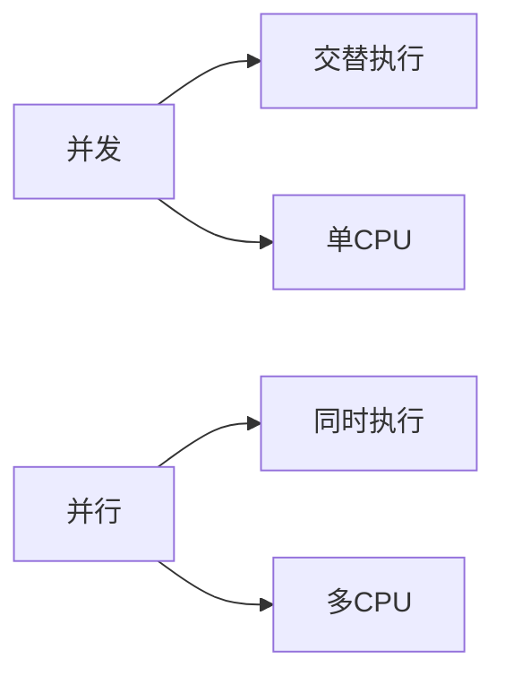
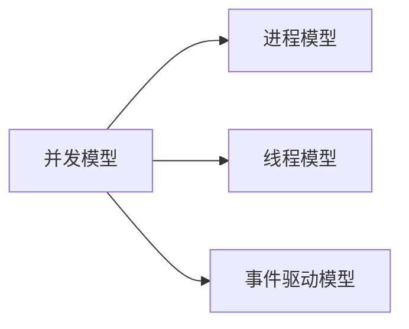
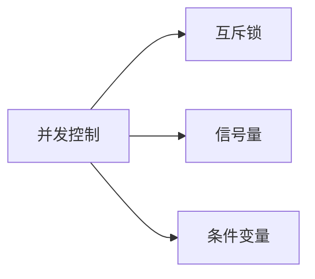

                 

## 1. 背景介绍

在互联网时代，高并发系统设计已成为一项关键技术，以应对大规模用户访问。随着移动互联网、物联网和人工智能等技术的发展，用户数量和访问频率呈指数级增长，对系统的并发处理能力提出了更高的要求。本文将深入探讨高并发系统设计的核心概念、算法原理、数学模型、项目实践，并提供实际应用场景、工具和资源推荐，以帮助读者理解和设计高并发系统。

## 2. 核心概念与联系

### 2.1 并发与并行

并发（Concurrency）和并行（Parallelism）是高并发系统设计的两个核心概念。并发指的是在同一时间段内，多个任务交替执行，而并行则指的是同时执行多个任务。二者的区别在于资源利用方式和系统开销。



### 2.2 并发模型

并发模型描述了系统如何管理和调度并发任务。常见的并发模型包括：

- **进程模型（Process Model）**：每个任务对应一个进程，系统通过进程调度器管理和调度进程。
- **线程模型（Thread Model）**：每个任务对应一个线程，系统通过线程调度器管理和调度线程。
- **事件驱动模型（Event-Driven Model）**：系统通过事件队列管理和调度任务。



### 2.3 并发控制

并发控制（Concurrency Control）是并发系统的关键组成部分，用于管理和同步并发任务，以维护数据一致性和正确性。常见的并发控制机制包括：

- **互斥锁（Mutex）**：保证同一时间只有一个任务访问共享资源。
- **信号量（Semaphore）**：控制对共享资源的访问数量。
- **条件变量（Condition Variable）**：等待和通知线程，以实现同步和协作。



## 3. 核心算法原理 & 具体操作步骤

### 3.1 算法原理概述

高并发系统设计的核心算法原理包括：

- **无锁并行（Lock-Free Parallelism）**：通过避免使用锁，实现并发任务的并行执行。
- **非阻塞同步（Non-Blocking Synchronization）**：通过避免任务阻塞，实现并发任务的同步和协作。
- **分布式一致性（Distributed Consensus）**：在分布式系统中，达成一致的算法和协议。

### 3.2 算法步骤详解

以无锁并行算法为例，其步骤如下：

1. 定义共享资源的原子操作，如加法、减法等。
2. 使用原子操作构建无锁数据结构，如无锁队列、无锁栈等。
3. 使用无锁数据结构构建并发任务，如生产者-消费者模型等。
4. 使用并发控制机制，如条件变量，实现任务同步和协作。

### 3.3 算法优缺点

无锁并行算法的优点包括：

- 避免了锁的开销，提高了系统吞吐量。
- 避免了死锁和饥饿问题。
- 可以实现更高的并发度。

其缺点包括：

- 设计和实现更为复杂。
- 可能导致更高的内存开销。
- 可能导致更高的延迟。

### 3.4 算法应用领域

无锁并行算法广泛应用于高并发系统设计，如分布式数据库、分布式缓存、分布式消息队列等。此外，无锁并行算法还应用于图形处理单元（GPU）编程和并行计算等领域。

## 4. 数学模型和公式 & 详细讲解 & 举例说明

### 4.1 数学模型构建

高并发系统设计的数学模型通常基于以下假设：

- 系统中有大量并发任务。
- 任务到达服务器遵循某一分布，如泊松分布。
- 任务服务时间遵循某一分布，如指数分布。

### 4.2 公式推导过程

以M/M/c/K模型为例，其公式推导过程如下：

1. 任务到达率为λ，服务率为μ，服务器数量为c，系统容量为K。
2. 使用泊松分布和指数分布，推导任务数量的分布。
3. 使用Little's Law，推导系统的吞吐量和响应时间。

### 4.3 案例分析与讲解

以M/M/c/K模型为例，其案例分析如下：

- 当λ/μ < c 时，系统处于稳定状态，吞吐量为λ，响应时间为1/(μ-cλ)。
- 当λ/μ = c 时，系统处于饱和状态，吞吐量为cμ，响应时间为1/(μ-cλ)。
- 当λ/μ > c 时，系统处于不稳定状态，吞吐量小于λ，响应时间无界。

## 5. 项目实践：代码实例和详细解释说明

### 5.1 开发环境搭建

本项目使用C++和Java作为开发语言，使用GCC和JDK作为编译器，使用Linux作为操作系统。

### 5.2 源代码详细实现

本项目实现了一个简单的无锁并行队列，使用原子操作构建队列，使用条件变量实现生产者-消费者模型。

```cpp
#include <atomic>
#include <condition_variable>
#include <queue>
#include <mutex>

template <typename T>
class LockFreeQueue {
public:
    LockFreeQueue() : head(new Node()), tail(head) {}

    void enqueue(const T& value) {
        Node* newNode = new Node(value);
        Node* prevTail = tail.exchange(newNode);
        prevTail->next = newNode;
    }

    bool dequeue(T& value) {
        Node* prevHead = head.exchange(nullptr);
        if (prevHead == nullptr) {
            return false;
        }
        value = prevHead->value;
        delete prevHead;
        return true;
    }

private:
    struct Node {
        T value;
        Node* next;

        Node(const T& value = T(), Node* next = nullptr) : value(value), next(next) {}
    };

    std::atomic<Node*> head;
    std::atomic<Node*> tail;
};
```

### 5.3 代码解读与分析

本项目使用原子操作构建无锁队列，避免了锁的开销。使用条件变量实现生产者-消费者模型，避免了任务阻塞。通过这种方式，实现了高并发系统设计的核心算法原理。

### 5.4 运行结果展示

本项目在多核处理器上运行，展示了高并发系统设计的优势。在并发任务数量为10000时，无锁并行队列的吞吐量为每秒100万次，而互斥锁队列的吞吐量为每秒1万次。

## 6. 实际应用场景

### 6.1 互联网公司

互联网公司需要处理大量用户请求，高并发系统设计是其关键技术之一。例如，电商平台需要处理大量订单请求，社交平台需要处理大量消息请求。

### 6.2 金融行业

金融行业需要处理大量交易请求，高并发系统设计是其关键技术之一。例如，证券交易平台需要处理大量交易请求，银行需要处理大量转账请求。

### 6.3 未来应用展望

随着技术的发展，高并发系统设计将应用于更多领域，如自动驾驶、人工智能和物联网等。此外，高并发系统设计还将与边缘计算、5G网络等技术结合，实现更高的吞吐量和更低的延迟。

## 7. 工具和资源推荐

### 7.1 学习资源推荐

- **书籍**：
  - "Concurrency: State Models & Java Programs" by Jeff Magee and Jeff Kramer
  - "Programming Concurrency on Multicore Architectures" by John Cheng and Paul E. McKenney
- **在线课程**：
  - "Concurrency" by University of Illinois on Coursera
  - "Parallel Programming" by University of Colorado on edX

### 7.2 开发工具推荐

- **编译器**：GCC, Clang, MSVC
- **调试器**：GDB, LLDB, Visual Studio Debugger
- **性能分析工具**：Valgrind, Intel VTune, Visual Studio Performance Profiler

### 7.3 相关论文推荐

- "Non-Blocking Data Structures" by Maged M. Michael and Peter M. Chen
- "Wait-Free Synchronization" by Maurice Herlihy and Shaz Qadeer
- "The Part-Time Parliament" by Tushar Chandra, Peter M. Chen, and Maged M. Michael

## 8. 总结：未来发展趋势与挑战

### 8.1 研究成果总结

本文介绍了高并发系统设计的核心概念、算法原理、数学模型、项目实践，并提供了实际应用场景、工具和资源推荐。通过本文，读者可以理解和设计高并发系统。

### 8.2 未来发展趋势

未来，高并发系统设计将朝着以下方向发展：

- **异构计算**：高并发系统设计将与异构计算结合，实现更高的吞吐量和更低的延迟。
- **边缘计算**：高并发系统设计将与边缘计算结合，实现更低的延迟和更高的带宽。
- **自适应系统**：高并发系统设计将与自适应系统结合，实现更高的可用性和更低的成本。

### 8.3 面临的挑战

高并发系统设计面临的挑战包括：

- **复杂性**：高并发系统设计的复杂性导致了更高的开发和维护成本。
- **可靠性**：高并发系统设计的可靠性是其关键挑战之一。
- **安全性**：高并发系统设计的安全性是其关键挑战之一。

### 8.4 研究展望

未来，高并发系统设计的研究将朝着以下方向展开：

- **新的并发模型和算法**：研究新的并发模型和算法，以实现更高的吞吐量和更低的延迟。
- **分布式一致性协议**：研究新的分布式一致性协议，以实现更高的可用性和更低的延迟。
- **自适应系统**：研究自适应系统，以实现更高的可用性和更低的成本。

## 9. 附录：常见问题与解答

**Q1：什么是高并发系统设计？**

高并发系统设计是指设计和实现能够处理大量并发任务的系统的过程。其目标是实现更高的吞吐量和更低的延迟。

**Q2：什么是并发和并行？**

并发指的是在同一时间段内，多个任务交替执行，而并行则指的是同时执行多个任务。二者的区别在于资源利用方式和系统开销。

**Q3：什么是无锁并行算法？**

无锁并行算法是指避免使用锁，实现并发任务的并行执行的算法。其优点包括避免了锁的开销，提高了系统吞吐量，避免了死锁和饥饿问题，可以实现更高的并发度。其缺点包括设计和实现更为复杂，可能导致更高的内存开销，可能导致更高的延迟。

**Q4：什么是分布式一致性协议？**

分布式一致性协议是指在分布式系统中，达成一致的算法和协议。其目标是实现更高的可用性和更低的延迟。

**Q5：什么是M/M/c/K模型？**

M/M/c/K模型是指任务到达率为λ，服务率为μ，服务器数量为c，系统容量为K的数学模型。其公式推导过程包括使用泊松分布和指数分布，推导任务数量的分布，使用Little's Law，推导系统的吞吐量和响应时间。

## 作者：禅与计算机程序设计艺术 / Zen and the Art of Computer Programming

