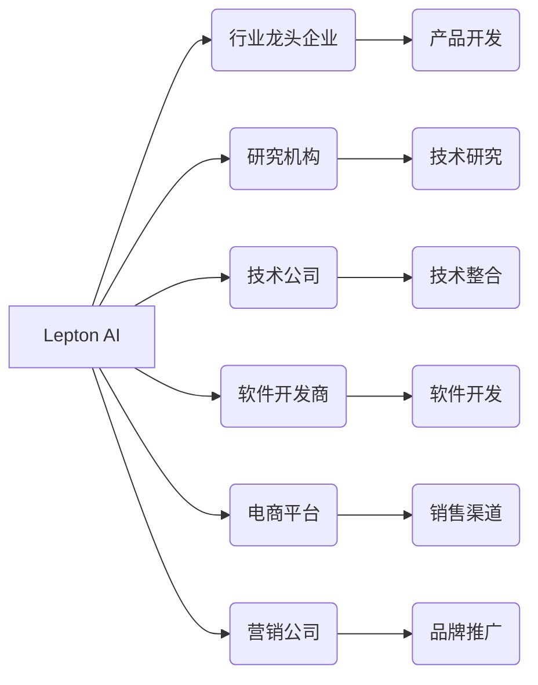

                 

## AI创业的跨界合作：Lepton AI的伙伴关系建设

> 关键词：人工智能创业、跨界合作、伙伴关系、Lepton AI、技术赋能、商业模式创新、生态系统建设

### 1. 背景介绍

人工智能（AI）技术近年来发展迅速，正在深刻地改变着各行各业。AI创业蓬勃发展，涌现出众多创新型企业，但AI创业面临着诸多挑战，例如技术壁垒高、数据获取困难、人才短缺等。跨界合作已成为AI创业的重要发展趋势，通过与不同领域的企业和机构合作，可以有效解决AI创业面临的挑战，加速AI技术的落地应用。

Lepton AI作为一家专注于人工智能技术的创业公司，深谙跨界合作的重要性。Lepton AI致力于通过与合作伙伴的协同创新，构建一个开放、共享的AI生态系统，推动AI技术在各个领域的应用。

### 2. 核心概念与联系

**2.1 跨界合作的本质**

跨界合作是指不同行业、不同领域、不同背景的企业或机构之间建立合作关系，共同开发新产品、新服务或新商业模式。

**2.2 伙伴关系的构建**

伙伴关系的构建是跨界合作的基础，需要双方建立信任、共享资源、共同目标和利益。Lepton AI通过以下方式构建伙伴关系：

* **战略联盟:** 与行业龙头企业、研究机构等建立长期战略合作关系，共同开发核心技术、共享数据资源、推动产业发展。
* **技术合作:** 与技术公司、软件开发商等合作，整合技术资源、加速产品开发、提升产品竞争力。
* **渠道合作:** 与电商平台、营销公司等合作，拓展销售渠道、提升品牌知名度、扩大市场份额。

**2.3 跨界合作的优势**

* **资源整合:** 不同合作伙伴拥有不同的资源和优势，通过合作可以整合资源，形成合力，提升整体竞争力。
* **技术创新:** 跨界合作可以打破行业壁垒，促进技术交叉融合，加速技术创新。
* **市场拓展:** 合作伙伴可以互相借鉴经验，拓展新的市场，扩大市场份额。
* **风险分担:** 跨界合作可以分散风险，降低创业风险。

**2.4 伙伴关系架构**



### 3. 核心算法原理 & 具体操作步骤

**3.1 算法原理概述**

Lepton AI的核心算法基于深度学习技术，采用卷积神经网络（CNN）和循环神经网络（RNN）等模型，能够实现图像识别、自然语言处理、语音识别等功能。

**3.2 算法步骤详解**

1. **数据收集和预处理:** 收集大量相关数据，并进行清洗、格式化、标注等预处理工作。
2. **模型构建:** 根据具体任务选择合适的深度学习模型，并进行参数设置。
3. **模型训练:** 使用训练数据训练模型，调整模型参数，使其能够准确地完成目标任务。
4. **模型评估:** 使用测试数据评估模型的性能，并进行调整和优化。
5. **模型部署:** 将训练好的模型部署到实际应用场景中，实现自动化处理。

**3.3 算法优缺点**

* **优点:** 
    * 能够处理复杂的数据模式，识别复杂的特征。
    * 具有较高的准确率和鲁棒性。
    * 可以进行端到端的学习，无需人工特征工程。
* **缺点:** 
    * 需要大量的训练数据。
    * 训练过程耗时和耗能。
    * 模型解释性较差。

**3.4 算法应用领域**

* **图像识别:** 人脸识别、物体检测、图像分类等。
* **自然语言处理:** 文本分类、情感分析、机器翻译等。
* **语音识别:** 语音转文本、语音助手等。
* **医疗诊断:** 影像分析、疾病预测等。
* **金融风险控制:** 欺诈检测、信用评估等。

### 4. 数学模型和公式 & 详细讲解 & 举例说明

**4.1 数学模型构建**

深度学习模型通常采用多层神经网络结构，每个神经元接收多个输入信号，并通过激活函数进行处理，输出一个信号。

**4.2 公式推导过程**

深度学习模型的训练过程基于梯度下降算法，通过不断调整模型参数，使模型输出与真实值之间的误差最小化。

* **损失函数:** 用于衡量模型预测结果与真实值的差异。常见的损失函数包括均方误差（MSE）、交叉熵损失（Cross-Entropy Loss）等。
* **梯度下降:** 用于更新模型参数，使损失函数最小化的算法。常见的梯度下降算法包括随机梯度下降（SGD）、动量梯度下降（Momentum）等。

**4.3 案例分析与讲解**

以图像分类为例，假设我们有一个包含猫和狗的图像数据集，目标是训练一个模型能够区分猫和狗。

* **数据预处理:** 将图像数据进行裁剪、缩放、归一化等处理，使其符合模型输入要求。
* **模型构建:** 使用卷积神经网络（CNN）模型，包含多个卷积层、池化层和全连接层。
* **损失函数:** 使用交叉熵损失函数，衡量模型预测结果与真实标签之间的差异。
* **梯度下降:** 使用随机梯度下降算法，不断调整模型参数，使损失函数最小化。
* **模型评估:** 使用测试数据评估模型的准确率，并进行调整和优化。

### 5. 项目实践：代码实例和详细解释说明

**5.1 开发环境搭建**

Lepton AI的项目开发环境基于Python语言，使用TensorFlow或PyTorch深度学习框架。

**5.2 源代码详细实现**

```python
# 导入必要的库
import tensorflow as tf

# 定义模型结构
model = tf.keras.models.Sequential([
    tf.keras.layers.Conv2D(32, (3, 3), activation='relu', input_shape=(28, 28, 1)),
    tf.keras.layers.MaxPooling2D((2, 2)),
    tf.keras.layers.Conv2D(64, (3, 3), activation='relu'),
    tf.keras.layers.MaxPooling2D((2, 2)),
    tf.keras.layers.Flatten(),
    tf.keras.layers.Dense(10, activation='softmax')
])

# 编译模型
model.compile(optimizer='adam',
              loss='sparse_categorical_crossentropy',
              metrics=['accuracy'])

# 训练模型
model.fit(x_train, y_train, epochs=10)

# 评估模型
loss, accuracy = model.evaluate(x_test, y_test)
print('Test loss:', loss)
print('Test accuracy:', accuracy)
```

**5.3 代码解读与分析**

这段代码定义了一个简单的卷积神经网络模型，用于图像分类任务。

* `tf.keras.models.Sequential` 用于构建一个顺序模型，层级结构清晰。
* `tf.keras.layers.Conv2D` 用于定义卷积层，提取图像特征。
* `tf.keras.layers.MaxPooling2D` 用于定义池化层，降低特征维度。
* `tf.keras.layers.Flatten` 用于将多维特征转换为一维向量。
* `tf.keras.layers.Dense` 用于定义全连接层，进行分类。
* `model.compile` 用于编译模型，指定优化器、损失函数和评价指标。
* `model.fit` 用于训练模型，使用训练数据进行迭代训练。
* `model.evaluate` 用于评估模型，使用测试数据计算损失和准确率。

**5.4 运行结果展示**

训练完成后，模型能够对图像进行分类，并输出分类结果的概率分布。

### 6. 实际应用场景

Lepton AI的AI技术已应用于多个领域，例如：

* **智能医疗:** 辅助医生进行疾病诊断、预测患者风险。
* **智慧城市:** 智能交通管理、环境监测、公共安全保障。
* **金融科技:** 欺诈检测、信用评估、风险管理。
* **教育科技:** 个性化学习推荐、智能答疑系统。

**6.4 未来应用展望**

Lepton AI将继续探索AI技术的应用场景，推动AI技术在更多领域落地应用，为社会带来更多价值。

### 7. 工具和资源推荐

**7.1 学习资源推荐**

* **在线课程:** Coursera、edX、Udacity等平台提供丰富的AI课程。
* **书籍:** 《深度学习》、《机器学习实战》等经典书籍。
* **开源项目:** TensorFlow、PyTorch等开源深度学习框架。

**7.2 开发工具推荐**

* **深度学习框架:** TensorFlow、PyTorch、Keras等。
* **数据处理工具:** Pandas、NumPy等。
* **可视化工具:** Matplotlib、Seaborn等。

**7.3 相关论文推荐**

* **ImageNet Classification with Deep Convolutional Neural Networks**
* **Attention Is All You Need**
* **BERT: Pre-training of Deep Bidirectional Transformers for Language Understanding**

### 8. 总结：未来发展趋势与挑战

**8.1 研究成果总结**

Lepton AI在AI技术研究方面取得了一定的成果，例如在图像识别、自然语言处理等领域取得了领先水平。

**8.2 未来发展趋势**

* **模型规模化:** 模型规模不断扩大，参数量不断增加，提升模型性能。
* **算法创新:** 探索新的AI算法，例如强化学习、迁移学习等。
* **边缘计算:** 将AI模型部署到边缘设备，实现实时处理和低延迟。
* **数据安全与隐私:** 加强数据安全和隐私保护，构建可信的AI生态系统。

**8.3 面临的挑战**

* **数据获取和标注:** 高质量的数据是AI模型训练的基础，数据获取和标注成本高昂。
* **模型解释性:** 深度学习模型的决策过程难以解释，缺乏透明度。
* **伦理问题:** AI技术可能带来伦理问题，例如算法偏见、数据滥用等。

**8.4 研究展望**

Lepton AI将继续致力于AI技术的研发和应用，推动AI技术在各个领域的落地应用，为社会带来更多价值。

### 9. 附录：常见问题与解答

**9.1 如何选择合适的AI算法？**

选择合适的AI算法需要根据具体任务和数据特点进行选择。例如，图像识别任务可以使用卷积神经网络，文本分类任务可以使用循环神经网络。

**9.2 如何解决数据标注问题？**

数据标注是AI模型训练的基础，可以采用人工标注、自动标注、众包标注等方式解决数据标注问题。

**9.3 如何评估AI模型的性能？**

可以使用准确率、召回率、F1-score等指标评估AI模型的性能。


作者：禅与计算机程序设计艺术 / Zen and the Art of Computer Programming 
<end_of_turn>

