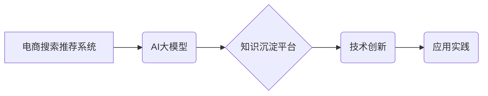

                 

## AI大模型视角下电商搜索推荐的技术创新知识沉淀平台功能优化与应用实践

> 关键词：电商搜索推荐、AI大模型、知识沉淀平台、技术创新、应用实践

## 1. 背景介绍

随着电商行业的蓬勃发展，搜索推荐系统已成为电商平台的核心竞争力之一。传统的搜索推荐系统主要依赖于基于规则和基于内容的算法，但随着用户行为的复杂化和商品信息的爆炸式增长，这些传统方法逐渐难以满足用户个性化需求和平台业务发展。

近年来，深度学习技术的快速发展为电商搜索推荐带来了新的机遇。基于深度学习的AI大模型能够更好地理解用户需求和商品特征，从而提供更精准、更个性化的推荐结果。然而，AI大模型的训练和部署需要大量的计算资源和专业知识，这对电商平台的技术团队提出了新的挑战。

为了解决这些挑战，构建一个AI大模型视角下的电商搜索推荐技术创新知识沉淀平台显得尤为重要。该平台可以帮助电商平台：

* **沉淀和共享AI大模型的知识和经验：** 汇聚平台内各部门的AI大模型开发和应用经验，形成可复用的知识库，降低重复造轮的成本。
* **促进AI大模型的创新和应用：** 提供AI大模型的开发工具和平台，鼓励团队成员进行创新研究和应用探索，加速AI大模型在电商搜索推荐领域的落地。
* **提升AI大模型的效率和效果：** 通过数据共享和模型优化，提升AI大模型的训练效率和推荐效果，为电商平台带来更大的商业价值。

## 2. 核心概念与联系

### 2.1  电商搜索推荐系统

电商搜索推荐系统旨在帮助用户快速找到所需商品，并根据用户的兴趣和偏好提供个性化的商品推荐。它通常由以下几个模块组成：

* **搜索引擎模块：** 处理用户搜索词的解析、匹配和排序，返回相关商品列表。
* **推荐引擎模块：** 基于用户的历史行为、商品特征等信息，推荐用户可能感兴趣的商品。
* **个性化引擎模块：** 根据用户的个人属性、兴趣偏好等信息，对搜索结果和推荐结果进行个性化定制。

### 2.2  AI大模型

AI大模型是指在海量数据上训练的深度学习模型，具有强大的学习和泛化能力。常见的AI大模型包括：

* **Transformer模型：** 擅长处理自然语言文本，例如BERT、GPT-3等。
* **图神经网络模型：** 擅长处理关系数据，例如知识图谱嵌入、推荐系统等。
* **多模态模型：** 能够处理多种数据类型，例如文本、图像、音频等，例如DALL-E、CLIP等。

### 2.3  知识沉淀平台

知识沉淀平台是一个用于收集、存储、整理、共享和利用组织内知识的系统。它可以帮助企业：

* **建立知识库：** 将企业内部的知识资源进行系统化整理，形成可供检索和利用的知识库。
* **促进知识共享：** 提供知识交流和协作平台，方便员工之间共享和学习知识。
* **提升知识利用率：** 通过知识挖掘和推荐，帮助员工更有效地利用知识资源。

**核心概念关系图**



## 3. 核心算法原理 & 具体操作步骤

### 3.1  算法原理概述

在AI大模型视角下，电商搜索推荐系统可以利用以下核心算法：

* **深度学习推荐算法：** 基于深度学习模型，例如协同过滤、因子分解机、深度神经网络等，对用户和商品进行特征提取和表示，并预测用户对商品的兴趣。
* **自然语言处理推荐算法：** 利用自然语言处理技术，例如文本分类、关键词提取、语义分析等，对用户搜索词和商品描述进行理解，并进行推荐。
* **知识图谱推荐算法：** 利用知识图谱数据，例如商品属性、用户兴趣、商品关系等，进行推荐。

### 3.2  算法步骤详解

以深度学习推荐算法为例，其具体操作步骤如下：

1. **数据预处理：** 收集用户行为数据、商品信息数据等，进行清洗、转换和特征工程。
2. **模型构建：** 选择合适的深度学习模型，例如神经网络、循环神经网络等，并进行模型训练。
3. **模型评估：** 利用测试数据对模型进行评估，并根据评估结果进行模型调优。
4. **模型部署：** 将训练好的模型部署到线上环境，并进行实时推荐。

### 3.3  算法优缺点

**深度学习推荐算法**

* **优点：** 能够学习用户和商品之间的复杂关系，推荐效果更精准。
* **缺点：** 需要大量的训练数据，训练时间较长，模型解释性较差。

### 3.4  算法应用领域

深度学习推荐算法广泛应用于电商平台、社交媒体、视频网站等领域，例如：

* **商品推荐：** 根据用户的历史购买记录、浏览记录等信息，推荐用户可能感兴趣的商品。
* **内容推荐：** 根据用户的兴趣爱好、阅读习惯等信息，推荐用户可能感兴趣的文章、视频等内容。
* **广告推荐：** 根据用户的兴趣爱好、行为特征等信息，推荐用户可能感兴趣的广告。

## 4. 数学模型和公式 & 详细讲解 & 举例说明

### 4.1  数学模型构建

深度学习推荐算法通常使用矩阵分解模型，例如协同过滤模型。协同过滤模型假设用户和商品之间存在隐含的特征关系，可以通过矩阵分解的方式学习这些关系。

**用户-商品交互矩阵：**

设用户集合为U，商品集合为I，用户-商品交互矩阵为R，其中R(u,i)表示用户u对商品i的交互行为，例如评分、购买等。

**矩阵分解模型：**

将用户-商品交互矩阵R分解为两个低维矩阵：用户特征矩阵P和商品特征矩阵Q。

R ≈ P * Q^T

其中，P(u,k)表示用户u在第k个特征维度上的特征值，Q(i,k)表示商品i在第k个特征维度上的特征值。

### 4.2  公式推导过程

目标函数：

最小化用户-商品交互矩阵R和分解后的矩阵P * Q^T之间的误差。

损失函数：

常用的损失函数包括均方误差（MSE）和二阶交叉熵（BCE）。

MSE = 1/N * Σ(R(u,i) - P(u,:) * Q(i,:))^2

BCE = -1/N * Σ[R(u,i) * log(σ(P(u,:) * Q(i,:))) + (1 - R(u,i)) * log(1 - σ(P(u,:) * Q(i,:)))]

其中，N是用户-商品交互矩阵的非零元素个数，σ()是sigmoid函数。

### 4.3  案例分析与讲解

假设有一个电商平台，用户集合U={1, 2, 3}, 商品集合I={A, B, C}, 用户-商品交互矩阵R如下：

```
R = [
    [5, 3, 4],
    [4, 5, 2],
    [3, 2, 5]
]
```

可以使用协同过滤模型对R进行分解，得到用户特征矩阵P和商品特征矩阵Q。

通过训练模型，可以得到P和Q的具体值，并利用这些值进行商品推荐。例如，对于用户1，可以根据P(1,:)和Q(A,:)计算用户1对商品A的评分预测值，并将其与其他商品的评分预测值进行比较，推荐用户1可能感兴趣的商品。

## 5. 项目实践：代码实例和详细解释说明

### 5.1  开发环境搭建

* **操作系统：** Linux
* **编程语言：** Python
* **深度学习框架：** TensorFlow或PyTorch
* **其他工具：** Jupyter Notebook、Git等

### 5.2  源代码详细实现

```python
import tensorflow as tf

# 定义用户-商品交互矩阵
R = tf.constant([
    [5, 3, 4],
    [4, 5, 2],
    [3, 2, 5]
])

# 定义用户特征矩阵和商品特征矩阵
P = tf.Variable(tf.random.normal([3, 10]))
Q = tf.Variable(tf.random.normal([3, 10]))

# 定义损失函数
def loss_function(R, P, Q):
    return tf.reduce_mean(tf.square(R - tf.matmul(P, Q, transpose_b=True)))

# 定义优化器
optimizer = tf.keras.optimizers.Adam()

# 训练模型
for epoch in range(100):
    with tf.GradientTape() as tape:
        loss = loss_function(R, P, Q)
    gradients = tape.gradient(loss, [P, Q])
    optimizer.apply_gradients(zip(gradients, [P, Q]))

# 打印训练结果
print("训练完成！")
print("用户特征矩阵：\n", P.numpy())
print("商品特征矩阵：\n", Q.numpy())
```

### 5.3  代码解读与分析

* **数据预处理：** 代码中将用户-商品交互矩阵R定义为一个常数，实际应用中需要从数据库或文件读取数据并进行清洗和转换。
* **模型构建：** 代码中使用协同过滤模型，将用户-商品交互矩阵分解为用户特征矩阵P和商品特征矩阵Q。
* **损失函数：** 代码中使用均方误差作为损失函数，用于衡量模型预测值与真实值的差异。
* **优化器：** 代码中使用Adam优化器，用于更新模型参数。
* **训练模型：** 代码中使用循环迭代的方式训练模型，每次迭代计算损失函数值，并根据梯度更新模型参数。

### 5.4  运行结果展示

训练完成后，代码会打印出用户特征矩阵P和商品特征矩阵Q。这些矩阵可以用于进行商品推荐。例如，可以计算用户对商品的评分预测值，并将其与其他商品的评分预测值进行比较，推荐用户可能感兴趣的商品。

## 6. 实际应用场景

### 6.1  电商平台商品推荐

AI大模型可以根据用户的历史购买记录、浏览记录、收藏记录等信息，推荐用户可能感兴趣的商品。例如，如果用户经常购买运动鞋，AI大模型可以推荐用户其他类型的运动鞋、运动服等相关商品。

### 6.2  搜索引擎结果排序

AI大模型可以根据用户的搜索词和历史搜索记录，对搜索结果进行排序，并推荐用户可能感兴趣的网页。例如，如果用户搜索“智能手机”，AI大模型可以根据用户的搜索历史和偏好，推荐用户最新的智能手机型号、相关评测文章等。

### 6.3  个性化内容推荐

AI大模型可以根据用户的兴趣爱好、阅读习惯、观看记录等信息，推荐用户可能感兴趣的文章、视频、音乐等内容。例如，如果用户喜欢看科幻电影，AI大模型可以推荐用户其他类型的科幻电影、科幻小说等相关内容。

### 6.4  未来应用展望

随着AI技术的不断发展，AI大模型在电商搜索推荐领域的应用场景将更加广泛，例如：

* **多模态推荐：** 利用文本、图像、音频等多种数据类型进行推荐，提供更丰富的用户体验。
* **个性化营销：** 根据用户的个性化需求，进行精准的营销推广，提高营销效果。
* **智能客服：** 利用AI大模型构建智能客服系统，为用户提供更便捷的购物体验。

## 7. 工具和资源推荐

### 7.1  学习资源推荐

* **书籍：**
    * 深度学习
    * 自然语言处理
    * 推荐系统
* **在线课程：**
    * Coursera
    * edX
    * Udacity
* **博客和论坛：**
    * TensorFlow博客
    * PyTorch博客
    * 知乎

### 7.2  开发工具推荐

* **深度学习框架：** TensorFlow、PyTorch
* **数据处理工具：** Pandas、NumPy
* **机器学习库：** scikit-learn
* **云计算平台：** AWS、Azure、GCP

### 7.3  相关论文推荐

* **深度学习推荐系统：**
    * Deep Learning for Recommender Systems
* **协同过滤模型：**
    * Collaborative Filtering: A User-Based Approach
* **自然语言处理推荐系统：**
    * Neural Recommendation Systems: A Survey

## 8. 总结：未来发展趋势与挑战

### 8.1  研究成果总结

AI大模型视角下的电商搜索推荐技术创新知识沉淀平台能够有效地沉淀和共享AI大模型的知识和经验，促进AI大模型的创新和应用，提升AI大模型的效率和效果。

### 8.2  未来发展趋势

* **模型规模和能力的提升：** 未来AI大模型的规模和能力将进一步提升，能够处理更复杂的数据和任务。
* **多模态融合的深入研究：** 多模态融合将成为未来AI大模型发展的重要方向，能够提供更丰富的用户体验。
* **个性化推荐的精准化：** 未来AI大模型将更加注重个性化推荐，能够根据用户的细微需求提供更精准的推荐结果。

### 8.3  面临的挑战

* **数据安全和隐私保护：** AI大模型的训练和应用需要大量用户数据，如何保证数据安全和隐私保护是一个重要的挑战。
* **模型解释性和可信度：** AI大模型的决策过程通常是复杂的，如何提高模型的解释性和可信度是一个重要的研究方向。
* **模型部署和维护成本：** 大型AI大模型的部署和维护成本较高，需要开发更有效的部署和维护方案。

### 8.4  研究展望

未来，AI大模型视角下的电商搜索推荐技术创新知识沉淀平台将继续发展和完善，为电商平台提供更智能、更精准、更个性化的推荐服务，推动电商行业的发展。

## 9. 附录：常见问题与解答

**Q1：如何选择合适的AI大模型？**

A1：选择合适的AI大模型需要根据具体应用场景和数据特点进行选择。例如，对于文本数据，可以使用Transformer模型；对于关系数据，可以使用图神经网络模型。

**Q2：如何保证AI大模型的公平性和不歧视性？**

A2：在训练AI大模型时，需要关注数据偏差问题，并采取措施避免模型产生歧视性结果。例如，可以使用公平性评估指标，并进行数据预处理和模型调优。

**Q3：如何评估AI大模型的推荐效果？**

A3：常用的评估指标包括点击率（CTR）、转化率（CVR）、用户满意度等。

**Q4：如何部署和维护AI大模型？**

A4：可以利用云计算平台部署和维护AI大模型，并使用监控工具跟踪模型性能，及时进行模型更新和维护。


作者：禅与计算机程序设计艺术 / Zen and the Art of Computer Programming<end_of_turn>

