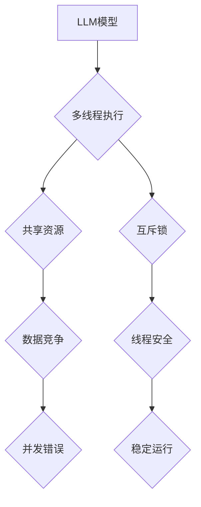

                 

## LLM线程安全:确保智能应用稳定运行

> 关键词：LLM, 线程安全, 并发, 互斥锁, 信号量, 条件变量, 守护进程, 故障容错, 稳定性

## 1. 背景介绍

大型语言模型 (LLM) 正在迅速改变人工智能领域的面貌，其强大的文本生成、理解和翻译能力在各个领域都展现出巨大的潜力。然而，随着 LLM 应用的规模和复杂度不断提升，线程安全问题逐渐成为一个不容忽视的挑战。

传统的单线程 LLM 难以满足现代高性能计算的需求，而多线程架构则可以有效提高模型的处理效率。然而，多线程编程的复杂性也带来了新的风险，即数据竞争和并发错误。如果 LLM 的多个线程同时访问和修改共享资源，可能会导致数据不一致、程序崩溃甚至安全漏洞。

因此，确保 LLM 的线程安全至关重要，这不仅关系到模型的稳定运行，也关系到最终应用的可靠性和安全性。

## 2. 核心概念与联系

**2.1 线程安全**

线程安全是指一个程序在多线程环境下能够正确地执行，并且不会出现数据竞争、死锁等并发错误。

**2.2 数据竞争**

数据竞争是指多个线程同时访问和修改同一个共享资源，导致数据不一致或错误。

**2.3 并发错误**

并发错误是指在多线程环境下发生的各种错误，例如数据竞争、死锁、活锁等。

**2.4 互斥锁**

互斥锁是一种同步机制，用于保护共享资源免受并发访问的干扰。当一个线程获取互斥锁时，其他线程将被阻塞，直到该线程释放锁。

**2.5 信号量**

信号量是一种计数器，用于控制对共享资源的访问权限。信号量可以限制同时访问资源的线程数量，避免资源被过度使用。

**2.6 条件变量**

条件变量是一种同步机制，用于协调多个线程之间的通信。当一个线程满足某个条件时，它可以通知其他等待条件的线程。

**2.7 守护进程**

守护进程是一种后台运行的进程，通常用于提供服务或监控系统状态。

**2.8 故障容错**

故障容错是指系统能够在发生故障时继续正常运行的能力。

**2.9 稳定性**

稳定性是指系统能够在各种条件下持续正常运行的能力。

**Mermaid 流程图**



## 3. 核心算法原理 & 具体操作步骤

### 3.1 算法原理概述

LLM 线程安全算法的核心在于通过同步机制和资源管理策略，确保多个线程在访问和修改共享资源时不会产生冲突。常用的算法包括：

* **互斥锁:** 互斥锁是确保只有一个线程同时访问共享资源的最简单方法。
* **信号量:** 信号量允许有限数量的线程同时访问共享资源，并通过计数器机制控制访问权限。
* **条件变量:** 条件变量用于协调多个线程之间的通信，允许线程等待特定条件满足后再访问共享资源。

### 3.2 算法步骤详解

**使用互斥锁实现线程安全:**

1. 声明一个互斥锁对象，用于保护共享资源。
2. 在访问共享资源之前，获取互斥锁。
3. 在访问共享资源之后，释放互斥锁。

**使用信号量实现线程安全:**

1. 声明一个信号量对象，设置其初始值等于允许同时访问共享资源的线程数量。
2. 在访问共享资源之前，获取信号量。
3. 在访问共享资源之后，释放信号量。

**使用条件变量实现线程安全:**

1. 声明一个条件变量对象。
2. 在访问共享资源之前，获取互斥锁。
3. 如果共享资源可用，则访问共享资源。
4. 如果共享资源不可用，则等待条件变量通知。
5. 在访问共享资源之后，释放互斥锁。

### 3.3 算法优缺点

**互斥锁:**

* **优点:** 简单易用，易于理解和实现。
* **缺点:** 容易造成死锁，性能较低。

**信号量:**

* **优点:** 可以控制同时访问共享资源的线程数量，避免资源被过度使用。
* **缺点:** 较互斥锁复杂，需要更仔细的管理。

**条件变量:**

* **优点:** 可以协调多个线程之间的通信，提高程序的效率。
* **缺点:** 较信号量复杂，需要更深入的理解。

### 3.4 算法应用领域

* **数据库管理系统:** 保护数据库数据的一致性。
* **网络服务器:** 控制并发连接数，避免服务器崩溃。
* **多媒体处理:** 并行处理音频和视频数据。
* **游戏开发:** 实现游戏中的多线程功能，例如 AI 决策和物理模拟。

## 4. 数学模型和公式 & 详细讲解 & 举例说明

### 4.1 数学模型构建

**4.1.1 线程状态模型:**

我们可以用一个状态变量 `thread_state` 来表示每个线程的状态，其取值可以是：

* `RUNNING`: 线程正在执行。
* `WAITING`: 线程正在等待条件变量通知。
* `BLOCKED`: 线程被互斥锁阻塞。

**4.1.2 共享资源模型:**

我们可以用一个状态变量 `resource_state` 来表示共享资源的状态，其取值可以是：

* `AVAILABLE`: 共享资源可用。
* `BUSY`: 共享资源被占用。

### 4.2 公式推导过程

**4.2.1 互斥锁的加锁和解锁操作:**

* 加锁操作: `lock(mutex)`
* 解锁操作: `unlock(mutex)`

**4.2.2 信号量的获取和释放操作:**

* 获取操作: `acquire(semaphore)`
* 释放操作: `release(semaphore)`

**4.2.3 条件变量的等待和通知操作:**

* 等待操作: `wait(condition_variable)`
* 通知操作: `notify(condition_variable)`

### 4.3 案例分析与讲解

**4.3.1 多线程打印案例:**

假设我们有三个线程，每个线程都需要打印一个数字。为了确保数字的顺序正确，我们可以使用互斥锁来保护打印操作。

```python
mutex = Lock()

def print_number(number):
    with mutex:
        print(number)

thread1 = Thread(target=print_number, args=(1,))
thread2 = Thread(target=print_number, args=(2,))
thread3 = Thread(target=print_number, args=(3,))

thread1.start()
thread2.start()
thread3.start()

thread1.join()
thread2.join()
thread3.join()
```

在这个例子中，`mutex` 变量是一个互斥锁对象，它确保只有一个线程可以同时访问 `print` 函数。因此，数字将按照 1, 2, 3 的顺序打印出来。

## 5. 项目实践：代码实例和详细解释说明

### 5.1 开发环境搭建

* Python 3.x
* threading 模块
* 其他必要的库

### 5.2 源代码详细实现

```python
import threading
import time

# 共享资源
counter = 0

# 互斥锁
mutex = threading.Lock()

# 线程函数
def increment_counter():
    global counter
    for _ in range(1000000):
        with mutex:
            counter += 1

# 创建多个线程
threads = []
for _ in range(10):
    thread = threading.Thread(target=increment_counter)
    threads.append(thread)
    thread.start()

# 等待所有线程完成
for thread in threads:
    thread.join()

# 打印最终结果
print(f"Final counter value: {counter}")
```

### 5.3 代码解读与分析

* `counter` 变量是共享资源，多个线程都会访问和修改它。
* `mutex` 变量是一个互斥锁对象，用于保护 `counter` 变量免受并发访问的干扰。
* `increment_counter` 函数是每个线程执行的代码，它会循环 1000000 次，每次都加 1 到 `counter` 变量。
* `with mutex:` 语句确保在该代码块执行期间，只有当前线程可以访问 `counter` 变量。
* `thread.join()` 方法等待线程完成执行。

### 5.4 运行结果展示

运行上述代码后，你会发现最终的 `counter` 值为 10000000，这表明所有线程都成功地加 1 到 `counter` 变量，并且没有出现数据竞争问题。

## 6. 实际应用场景

LLM 线程安全技术在各种实际应用场景中都至关重要，例如：

* **聊天机器人:** 聊天机器人需要处理多个用户的请求并发地，确保每个用户的对话状态和上下文信息不会被混淆。
* **机器翻译:** 机器翻译系统需要处理大量文本数据，并进行并行翻译，确保翻译结果的准确性和一致性。
* **文本生成:** 文本生成模型需要处理用户输入的提示和上下文信息，并生成符合语义和语法规则的文本，线程安全技术可以确保多个用户请求的文本生成结果不会相互干扰。

### 6.4 未来应用展望

随着 LLM 的发展和应用范围的扩大，线程安全技术将变得更加重要。未来，我们可能会看到以下趋势：

* **更复杂的同步机制:** 为了应对更复杂的并发场景，我们将需要开发更复杂的同步机制，例如基于原子操作的同步、分布式锁等。
* **自动线程安全工具:** 将会开发出能够自动检测和修复 LLM 线程安全问题的工具，帮助开发者更轻松地构建安全的 LLM 应用。
* **硬件级支持:** 未来硬件平台可能会提供更强大的线程安全支持，例如硬件级互斥锁、条件变量等，从而提高 LLM 的性能和安全性。

## 7. 工具和资源推荐

### 7.1 学习资源推荐

* **《深入理解Python》:** 这本书对 Python 的并发机制进行了详细的讲解。
* **《Python Concurrency Cookbook》:** 这本书提供了许多实用的 Python 并发编程示例。
* **《Effective Python》:** 这本书中提到了许多关于 Python 线程安全的建议。

### 7.2 开发工具推荐

* **Python threading 模块:** Python 内置的 threading 模块提供了基本的线程管理功能。
* **multiprocessing 模块:** Python 的 multiprocessing 模块提供了进程间通信和共享内存的功能，可以用于构建更复杂的并行应用。
* **Lock, Semaphore, Condition:** Python 提供了 Lock, Semaphore, Condition 等同步机制，可以用于实现线程安全。

### 7.3 相关论文推荐

* **"The Art of Multiprocessor Programming" by Maurice Herlihy and Nir Shavit:** 这本书对多处理器编程进行了深入的探讨，包括线程安全和并发算法。
* **"Concurrent Programming in Java: Design Principles and Patterns" by  Brian Goetz:** 这本书介绍了 Java 中的并发编程技术，包括线程安全和同步机制。

## 8. 总结：未来发展趋势与挑战

### 8.1 研究成果总结

LLM 线程安全技术已经取得了显著的进展，各种同步机制和资源管理策略已经能够有效地解决并发问题。

### 8.2 未来发展趋势

* 更复杂的并发场景: 随着 LLM 应用的复杂化，我们将面临更复杂的并发场景，需要开发更强大的同步机制和资源管理策略。
* 自动化和智能化: 将会开发出能够自动检测和修复 LLM 线程安全问题的工具，帮助开发者更轻松地构建安全的 LLM 应用。
* 硬件级支持: 未来硬件平台可能会提供更强大的线程安全支持，例如硬件级互斥锁、条件变量等，从而提高 LLM 的性能和安全性。

### 8.3 面临的挑战

* 复杂性: LLM 的并发编程非常复杂，需要深入理解线程安全原理和各种同步机制。
* 性能: 线程安全机制可能会带来一定的性能开销，需要权衡性能和安全性的 trade-off。
* 维护成本: 维护复杂的线程安全代码可能会很困难，需要不断地进行测试和调试。

### 8.4 研究展望

未来，LLM 线程安全技术的研究方向将包括：

* 开发更高效、更灵活的同步机制。
* 研究基于机器学习的线程安全分析和修复方法。
* 开发更强大的工具和框架，帮助开发者更轻松地构建安全的 LLM 应用。


## 9. 附录：常见问题与解答

**9.1 为什么需要线程安全？**

如果 LLM 不具备线程安全，多个线程可能会同时访问和修改共享资源，导致数据不一致、程序崩溃甚至安全漏洞。

**9.2 如何实现 LLM 线程安全？**

常用的方法包括使用互斥锁、信号量和条件变量等同步机制，以及合理的资源管理策略。

**9.3 如何调试 LLM 线程安全问题？**

可以使用调试工具，例如 Python 的 pdb 模块，来跟踪线程执行过程，以及使用日志记录来记录线程的访问和修改操作。

**9.4 如何评估 LLM 线程安全性的？**

可以使用静态分析工具和动态测试工具来评估 LLM 线程安全性的。

**9.5 如何提高 LLM 线程安全性的？**

* 使用更合适的同步机制。
* 减少共享资源的数量。
* 采用数据结构和算法的优化。
* 进行充分的测试和调试。


作者：禅与计算机程序设计艺术 / Zen and the Art of Computer Programming 
<end_of_turn>

