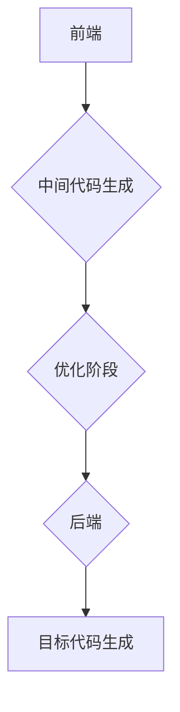

                 

## LLVM优化passes：提升代码性能的技巧

> 关键词：LLVM, 优化passes, 代码性能, 编译器优化, 程序分析, 静态分析, 动态分析, 

## 1. 背景介绍

在现代软件开发中，代码性能至关重要。高效的代码不仅能提升用户体验，还能降低服务器成本和能源消耗。LLVM（Low Level Virtual Machine）是一个开源的编译器框架，它提供了一套强大的工具和技术，用于编译各种编程语言，并进行代码优化。LLVM 的优化流程主要通过一系列称为“优化 passes”的阶段来实现。

LLVM 的优化 passes 是独立的模块，可以按需组合使用。每个 pass 都针对特定的代码优化目标，例如消除冗余代码、简化控制流、提高数据利用率等。通过精心设计和组合这些 passes，LLVM 可以显著提升代码性能。

## 2. 核心概念与联系

### 2.1 LLVM 优化流程

LLVM 的优化流程是一个多阶段的过程，每个阶段都由一个或多个优化 passes 组成。



* **前端:** 将源代码转换为 LLVM 的中间表示形式，即 IR（Intermediate Representation）。
* **中间代码生成:** 将源代码转换为 LLVM 的中间表示形式，即 IR（Intermediate Representation）。
* **优化阶段:** 对 IR 进行一系列优化操作，以提高代码性能。
* **后端:** 将优化后的 IR 转换为目标机器码。
* **目标代码生成:** 生成目标机器码，并将其链接成可执行文件。

### 2.2 优化 passes 的分类

LLVM 的优化 passes 可以根据其作用范围和优化目标进行分类：

* **全局优化 passes:** 针对整个程序进行优化，例如常量折叠、死代码消除、函数合并等。
* **局部优化 passes:** 针对单个函数或代码块进行优化，例如循环展开、指令重排序、数据预取等。
* **针对特定指令的优化 passes:** 针对特定类型的指令进行优化，例如浮点运算、内存访问等。

## 3. 核心算法原理 & 具体操作步骤

### 3.1 算法原理概述

LLVM 的优化 passes 基于一系列算法和数据结构，例如控制流图、数据流分析、抽象语法树等。这些算法和数据结构帮助 LLVM 分析代码结构、识别优化机会，并生成更优化的代码。

### 3.2 算法步骤详解

* **代码分析:** LLVM 首先使用静态分析技术分析代码，构建控制流图、数据流图等数据结构，以便对代码结构和数据流动进行深入理解。
* **优化机会识别:** 基于代码分析结果，LLVM 识别出潜在的优化机会，例如冗余代码、循环冗余、数据依赖等。
* **优化策略选择:** LLVM 根据优化机会和代码特性选择合适的优化策略，例如常量折叠、死代码消除、循环展开等。
* **优化操作执行:** LLVM 执行选定的优化操作，修改代码结构和指令序列，以实现性能提升。
* **代码验证:** LLVM 对优化后的代码进行验证，确保其语义正确性和功能完整性。

### 3.3 算法优缺点

* **优点:** LLVM 的优化 passes 能够显著提升代码性能，并支持多种优化策略，可以针对不同的代码特性进行优化。
* **缺点:** 优化过程可能会增加编译时间，并且过于激进的优化可能会降低代码的可读性和维护性。

### 3.4 算法应用领域

LLVM 的优化 passes 广泛应用于各种软件开发领域，例如：

* **操作系统内核:** 优化内核代码可以提升系统性能和响应速度。
* **嵌入式系统:** 优化嵌入式系统代码可以降低功耗和内存占用。
* **游戏开发:** 优化游戏代码可以提升游戏帧率和画面质量。
* **科学计算:** 优化科学计算代码可以加速计算速度和提高效率。

## 4. 数学模型和公式 & 详细讲解 & 举例说明

### 4.1 数学模型构建

LLVM 的优化 passes 可以用数学模型来描述，例如：

* **代码复杂度:** 可以用代码行数、函数数量、分支数量等指标来衡量代码复杂度。
* **性能指标:** 可以用指令执行次数、内存访问次数、分支预测错误率等指标来衡量代码性能。

### 4.2 公式推导过程

LLVM 的优化 passes 通常会使用一些数学公式来指导优化操作，例如：

* **常量折叠:** 如果一个表达式只包含常量，则可以将其折叠成一个常量值。
* **死代码消除:** 如果一段代码不会被执行，则可以将其删除。

### 4.3 案例分析与讲解

例如，在常量折叠优化过程中，如果遇到一个表达式 `a + 5`，其中 `a` 是一个常量，则可以将其折叠成 `a + 5` 的结果。

## 5. 项目实践：代码实例和详细解释说明

### 5.1 开发环境搭建

* 安装 LLVM 工具链
* 安装 C/C++ 编译器
* 安装代码编辑器

### 5.2 源代码详细实现

```c++
// 原始代码
int add(int a, int b) {
  return a + b;
}

int main() {
  int x = 5;
  int y = 10;
  int sum = add(x, y);
  return 0;
}
```

```c++
// 优化后的代码
int add(int a, int b) {
  return a + b;
}

int main() {
  int x = 5;
  int y = 10;
  int sum = x + y; // 常量折叠优化
  return 0;
}
```

### 5.3 代码解读与分析

在原始代码中，`add` 函数被调用一次，并将 `x` 和 `y` 的值相加。在优化后的代码中，`add` 函数被调用次数减少，`x` 和 `y` 的值直接相加，从而避免了函数调用的开销。

### 5.4 运行结果展示

优化后的代码执行速度会比原始代码快，因为减少了函数调用的开销。

## 6. 实际应用场景

LLVM 的优化 passes 在各种实际应用场景中发挥着重要作用，例如：

* **Web 服务器:** 优化 Web 服务器代码可以提高响应速度和处理能力。
* **数据库系统:** 优化数据库系统代码可以提高查询效率和数据处理速度。
* **人工智能:** 优化人工智能模型代码可以加速训练速度和推理速度。

### 6.4 未来应用展望

随着硬件技术的不断发展，LLVM 的优化 passes 将会更加智能化和高效化，能够针对更复杂的代码结构和更先进的硬件架构进行优化。

## 7. 工具和资源推荐

### 7.1 学习资源推荐

* LLVM 官方文档：https://llvm.org/docs/
* LLVM 优化 passes 指南：https://llvm.org/docs/Passes.html
* LLVM 优化技术书籍：

### 7.2 开发工具推荐

* Clang：LLVM 的前端编译器
* LLVM 工具链：用于构建和分析 LLVM 代码

### 7.3 相关论文推荐

* LLVM 的优化技术论文：https://llvm.org/docs/Papers.html

## 8. 总结：未来发展趋势与挑战

### 8.1 研究成果总结

LLVM 的优化 passes 已经取得了显著的成果，能够有效提升代码性能。

### 8.2 未来发展趋势

* **更智能的优化策略:** 基于机器学习和人工智能技术，开发更智能的优化策略，能够自动识别和解决更复杂的优化问题。
* **针对特定硬件的优化:** 开发针对特定硬件架构的优化 passes，充分利用硬件特性，提升代码性能。
* **动态优化:** 基于运行时信息，动态调整优化策略，以适应不同的运行环境。

### 8.3 面临的挑战

* **优化复杂度:** 随着代码规模和复杂度的增加，优化过程变得更加复杂，需要更强大的算法和数据结构。
* **可维护性:** 过度激进的优化可能会降低代码的可读性和维护性，需要平衡性能提升和代码可维护性。
* **安全性和可靠性:** 优化过程可能会引入新的安全漏洞和可靠性问题，需要进行严格的测试和验证。

### 8.4 研究展望

LLVM 的优化技术将继续朝着更智能、更高效、更安全的方向发展，为软件开发带来更多创新和突破。

## 9. 附录：常见问题与解答

* **LLVM 的优化 passes 是如何工作的？**

LLVM 的优化 passes 是独立的模块，通过一系列算法和数据结构分析代码结构和数据流动，识别优化机会，并执行相应的优化操作。

* **LLVM 的优化 passes 可以提升所有代码的性能吗？**

并非所有代码都能通过 LLVM 的优化 passes 提升性能，有些代码可能已经非常高效，或者优化可能会降低代码的可读性和维护性。

* **如何选择合适的 LLVM 优化 passes？**

选择合适的 LLVM 优化 passes 需要根据代码特性和性能目标进行选择。LLVM 提供了丰富的优化 passes，可以根据需要进行组合使用。


作者：禅与计算机程序设计艺术 / Zen and the Art of Computer Programming 
<end_of_turn>

