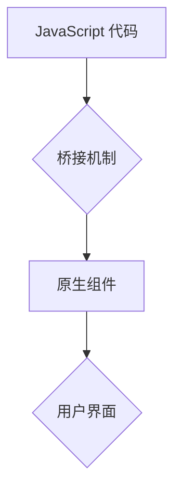

                 

## React Native性能调优

> 关键词：React Native, 性能优化, 渲染优化, 组件化, 状态管理, 网络请求, 异步操作, 调试工具

## 1. 背景介绍

React Native 作为一种跨平台移动应用开发框架，凭借其“写一次代码，运行于 iOS 和 Android”的优势，迅速成为移动开发领域的热门选择。然而，与原生应用相比，React Native 的性能表现往往存在一定的差距。这主要是因为 React Native 需要通过桥接机制将 JavaScript 代码与原生组件进行交互，导致了额外的开销。

随着移动应用功能的不断复杂化，性能问题日益受到重视。如何有效地优化 React Native 应用性能，提升用户体验，成为开发人员需要认真思考的问题。

## 2. 核心概念与联系

React Native 的性能优化涉及多个方面，包括渲染优化、组件化、状态管理、网络请求、异步操作等。这些方面相互关联，共同影响着应用的整体性能。

**2.1 渲染优化**

React Native 的渲染机制基于虚拟 DOM，它将 UI 组件抽象成树状结构，并通过 diffing 算法来比较旧的虚拟 DOM 和新的虚拟 DOM，只更新变化的部分。

**2.2 组件化**

组件化是 React Native 开发的重要原则，它将 UI 界面拆分成独立的组件，每个组件负责特定的功能，有利于代码复用、维护和性能优化。

**2.3 状态管理**

状态管理是指管理应用中数据的流动和更新，React Native 提供了多种状态管理方案，例如 Redux、MobX 等，可以帮助开发者更好地控制数据变化，避免不必要的渲染。

**2.4 网络请求**

网络请求是移动应用中常见的操作，频繁的网络请求会消耗大量的资源，影响应用性能。React Native 提供了 Fetch API 和其他网络请求库，可以帮助开发者优化网络请求，减少网络开销。

**2.5 异步操作**

React Native 中的许多操作都是异步的，例如网络请求、数据处理等。异步操作可以提高应用的响应速度，避免阻塞主线程。

**2.6 Mermaid 流程图**



## 3. 核心算法原理 & 具体操作步骤

### 3.1 算法原理概述

React Native 的渲染机制基于虚拟 DOM，它将 UI 组件抽象成树状结构，并通过 diffing 算法来比较旧的虚拟 DOM 和新的虚拟 DOM，只更新变化的部分。

**3.1.1 虚拟 DOM**

虚拟 DOM 是一个 JavaScript 对象，它代表了 UI 的结构和状态。React Native 将 UI 组件抽象成虚拟 DOM 节点，每个节点都包含了组件的类型、属性和子节点等信息。

**3.1.2 Diffing 算法**

Diffing 算法用于比较旧的虚拟 DOM 和新的虚拟 DOM，找出差异的部分。React Native 使用了一种高效的 diffing 算法，它可以快速地识别出需要更新的节点，并只更新这些节点，从而减少不必要的渲染。

### 3.2 算法步骤详解

1. **创建虚拟 DOM 树:** 当组件的状态发生变化时，React Native 会重新渲染组件，并创建一个新的虚拟 DOM 树。
2. **比较虚拟 DOM 树:** React Native 会使用 diffing 算法比较旧的虚拟 DOM 树和新的虚拟 DOM 树，找出差异的部分。
3. **更新真实 DOM:** React Native 会根据 diffing 算法的结果，更新真实 DOM 树，只更新变化的部分。

### 3.3 算法优缺点

**优点:**

* **高效:** Diffing 算法可以快速地识别出需要更新的节点，减少不必要的渲染。
* **灵活:** 虚拟 DOM 可以方便地进行操作和修改，例如添加、删除、更新节点。

**缺点:**

* **复杂:** 虚拟 DOM 的实现比较复杂，需要对 React Native 的机制有深入的了解。
* **内存消耗:** 虚拟 DOM 树需要占用一定的内存空间。

### 3.4 算法应用领域

虚拟 DOM 和 diffing 算法广泛应用于 React Native 的渲染机制，以及其他 JavaScript 框架的渲染机制。

## 4. 数学模型和公式 & 详细讲解 & 举例说明

### 4.1 数学模型构建

React Native 的渲染性能可以看作是时间复杂度和空间复杂度的函数。

* **时间复杂度:** 指的是渲染过程所需的时间，主要取决于 diffing 算法的复杂度和组件树的深度。
* **空间复杂度:** 指的是渲染过程所需的内存空间，主要取决于虚拟 DOM 树的大小。

### 4.2 公式推导过程

假设组件树的深度为 n，则 diffing 算法的时间复杂度为 O(n)。虚拟 DOM 树的大小为 O(n)。

### 4.3 案例分析与讲解

假设一个 React Native 应用包含 100 个组件，每个组件的深度为 5 层。

* **时间复杂度:** diffing 算法的时间复杂度为 O(100 * 5) = O(500)。
* **空间复杂度:** 虚拟 DOM 树的大小为 O(100 * 5) = O(500)。

## 5. 项目实践：代码实例和详细解释说明

### 5.1 开发环境搭建

1. 安装 Node.js 和 npm。
2. 安装 React Native CLI。
3. 创建新的 React Native 项目。

### 5.2 源代码详细实现

```javascript
import React, { useState, useEffect } from 'react';
import { View, Text, StyleSheet } from 'react-native';

const App = () => {
  const [count, setCount] = useState(0);

  useEffect(() => {
    // 模拟网络请求
    setTimeout(() => {
      setCount(count + 1);
    }, 1000);
  }, [count]);

  return (
    <View style={styles.container}>
      <Text>Count: {count}</Text>
    </View>
  );
};

const styles = StyleSheet.create({
  container: {
    flex: 1,
    justifyContent: 'center',
    alignItems: 'center',
  },
});

export default App;
```

### 5.3 代码解读与分析

* 使用 `useState` hook 管理 `count` 状态。
* 使用 `useEffect` hook 模拟网络请求，每隔 1 秒更新 `count` 状态。
* 组件渲染时，显示 `count` 值。

### 5.4 运行结果展示

运行该代码，你会看到一个计数器，每隔 1 秒计数器会增加 1。

## 6. 实际应用场景

React Native 的性能优化在各种移动应用场景中都至关重要，例如：

* **电商应用:** 频繁的商品列表渲染和购物车操作需要高效的性能优化。
* **社交媒体应用:** 实时消息推送和用户互动需要快速响应和流畅的体验。
* **游戏应用:** 游戏需要高帧率和低延迟，性能优化至关重要。

## 7. 工具和资源推荐

### 7.1 学习资源推荐

* React Native 官方文档: https://reactnative.dev/docs/getting-started
* React Native Performance: https://reactnative.dev/docs/performance

### 7.2 开发工具推荐

* React Native Debugger: https://github.com/jhen0409/react-native-debugger
* Flipper: https://flipper.app/

### 7.3 相关论文推荐

* React Native Performance Optimization Techniques: https://arxiv.org/abs/2003.06987

## 8. 总结：未来发展趋势与挑战

### 8.1 研究成果总结

React Native 的性能优化已经取得了显著的成果，例如虚拟 DOM、diffing 算法、异步操作等技术，有效地提高了应用的性能。

### 8.2 未来发展趋势

* **更先进的渲染算法:** 研究更高效的渲染算法，例如基于 GPU 的渲染。
* **更智能的状态管理:** 开发更智能的状态管理方案，例如基于预测的渲染。
* **更强大的性能分析工具:** 开发更强大的性能分析工具，帮助开发者更深入地了解应用性能瓶颈。

### 8.3 面临的挑战

* **跨平台兼容性:** React Native 需要在不同平台上保持一致的性能表现，这面临着一定的挑战。
* **原生组件性能:** React Native 的原生组件性能可能不如原生应用，需要不断改进。
* **开发者经验:** React Native 开发人员需要具备一定的性能优化经验，才能有效地优化应用性能。

### 8.4 研究展望

未来，React Native 的性能优化将继续是一个重要的研究方向，需要不断探索新的技术和方法，以满足移动应用越来越高的性能需求。

## 9. 附录：常见问题与解答

**问题 1:** 如何使用 React Native Debugger 分析应用性能？

**解答:**

1. 安装 React Native Debugger。
2. 在 React Native 项目中启动调试器。
3. 使用调试器查看组件树、状态变化和性能指标。

**问题 2:** 如何优化 React Native 应用的网络请求性能？

**解答:**

1. 使用 Fetch API 或其他网络请求库。
2. 使用缓存机制减少重复请求。
3. 使用异步操作避免阻塞主线程。


作者：禅与计算机程序设计艺术 / Zen and the Art of Computer Programming 
<end_of_turn>

