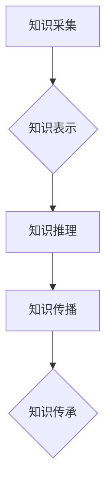

                 

## 人类知识的保存与传承：为未来留存文明

> 关键词：人工智能、知识图谱、数据存储、文明传承、数字遗产、机器学习、深度学习

### 1. 背景介绍

人类文明的进步离不开知识的积累和传承。从古老的文字记载到现代的数字化信息，知识一直是推动社会发展和人类进步的基石。然而，随着时间的推移，许多传统知识载体面临着损毁、遗失和难以传承的风险。而数字时代，海量数据和信息涌现，如何有效地保存、组织和传承人类知识，成为一个新的挑战和机遇。

人工智能技术的快速发展为人类知识的保存和传承提供了新的可能性。人工智能能够帮助我们自动识别、分类、理解和组织知识，并将其以更易于理解和利用的方式呈现出来。同时，人工智能也能够帮助我们预测和分析知识的未来发展趋势，为知识的传承提供更有效的指导。

### 2. 核心概念与联系

**2.1 知识图谱**

知识图谱是一种基于知识表示的数据库，它将知识表示为实体和关系的网络结构。知识图谱能够有效地捕捉和组织人类知识中的复杂关系，并支持对知识的灵活查询、推理和分析。

**2.2 人工智能**

人工智能是指模拟人类智能行为的计算机系统。人工智能技术包括机器学习、深度学习、自然语言处理等多个领域，这些技术能够帮助我们自动学习、理解和处理知识。

**2.3 数字遗产**

数字遗产是指人类文明在数字时代产生的各种信息资源，包括文本、图像、音频、视频、软件等。数字遗产是人类知识的重要组成部分，需要得到有效地保存和传承。

**2.4  知识传承体系**

知识传承体系是指利用人工智能技术，构建一个完整的知识保存、组织、传播和传承的系统。该体系需要包含以下几个关键模块：

* **知识采集模块:** 从各种数据源中采集知识，包括文本、图像、音频、视频等。
* **知识表示模块:** 将采集到的知识表示为知识图谱的形式，并进行结构化和组织。
* **知识推理模块:** 利用人工智能技术，对知识图谱进行推理和分析，发现新的知识和关系。
* **知识传播模块:** 将知识以多种形式传播给用户，包括文本、图像、视频、交互式体验等。

**Mermaid 流程图**



### 3. 核心算法原理 & 具体操作步骤

**3.1 算法原理概述**

知识图谱构建的核心算法主要包括：

* **实体识别:** 从文本中识别出实体，例如人物、地点、组织等。
* **关系抽取:** 从文本中识别出实体之间的关系，例如“工作于”、“居住在”等。
* **知识图谱推理:** 利用规则和逻辑推理，从已有的知识中推导出新的知识。

**3.2 算法步骤详解**

1. **数据预处理:** 对原始数据进行清洗、格式化和标注，以便于后续算法的训练和应用。
2. **实体识别:** 使用自然语言处理技术，例如词嵌入和深度学习模型，识别出文本中的实体。
3. **关系抽取:** 使用机器学习模型，例如条件随机场和深度神经网络，识别出实体之间的关系。
4. **知识图谱构建:** 将识别出的实体和关系连接起来，构建知识图谱。
5. **知识图谱推理:** 利用规则和逻辑推理，从知识图谱中推导出新的知识。

**3.3 算法优缺点**

* **优点:** 能够有效地捕捉和组织人类知识中的复杂关系，支持对知识的灵活查询、推理和分析。
* **缺点:** 构建知识图谱需要大量的标注数据，并且算法的准确性还存在一定的局限性。

**3.4 算法应用领域**

* **搜索引擎:** 构建知识图谱可以帮助搜索引擎更好地理解用户查询意图，并提供更准确和相关的搜索结果。
* **问答系统:** 知识图谱可以为问答系统提供丰富的知识背景，帮助系统更好地理解用户问题并给出准确的答案。
* **推荐系统:** 知识图谱可以帮助推荐系统更好地理解用户的兴趣和偏好，并推荐更相关的商品或服务。

### 4. 数学模型和公式 & 详细讲解 & 举例说明

**4.1 数学模型构建**

知识图谱可以表示为一个三元组的集合，每个三元组由一个实体、一个关系和另一个实体组成。

* **实体 (Entity):** 代表知识图谱中的对象，例如人物、地点、组织等。
* **关系 (Relation):** 代表实体之间的连接，例如“工作于”、“居住在”等。
* **属性 (Property):** 描述实体的特征，例如“姓名”、“年龄”等。

**4.2 公式推导过程**

知识图谱推理可以使用逻辑规则和知识库进行。例如，如果知识图谱中包含以下三元组：

* (张三, 工作于, 公司A)
* (公司A, 位于, 北京)

那么，我们可以推导出以下新的知识：

* (张三, 位于, 北京)

**4.3 案例分析与讲解**

假设我们构建了一个关于电影的知识图谱，其中包含以下实体和关系：

* 实体：电影、演员、导演、国家
* 关系：主演、导演、制作国家

我们可以利用知识图谱推理，例如：

* 如果知道电影“流浪地球”由吴京主演，我们可以推导出吴京是“流浪地球”的演员。
* 如果知道电影“阿凡达”由詹姆斯·卡梅隆导演，我们可以推导出詹姆斯·卡梅隆是“阿凡达”的导演。

### 5. 项目实践：代码实例和详细解释说明

**5.1 开发环境搭建**

* Python 3.x
* TensorFlow 或 PyTorch
* SpaCy 或 NLTK

**5.2 源代码详细实现**

```python
# 实体识别
import spacy

nlp = spacy.load("en_core_web_sm")

text = "Barack Obama was born in Honolulu, Hawaii."
doc = nlp(text)

for ent in doc.ents:
    print(ent.text, ent.label_)

# 关系抽取
# 使用机器学习模型，例如条件随机场或深度神经网络

# 知识图谱构建
# 使用Neo4j或其他知识图谱数据库

# 知识图谱推理
# 使用规则引擎或逻辑推理引擎
```

**5.3 代码解读与分析**

* 实体识别代码使用SpaCy库，对文本进行实体识别。
* 关系抽取代码使用机器学习模型，对实体之间的关系进行识别。
* 知识图谱构建代码使用Neo4j或其他知识图谱数据库，将识别出的实体和关系存储起来。
* 知识图谱推理代码使用规则引擎或逻辑推理引擎，从知识图谱中推导出新的知识。

**5.4 运行结果展示**

运行代码后，可以得到以下结果：

* 实体识别结果：Barack Obama (PERSON), Honolulu (GPE), Hawaii (GPE)
* 关系抽取结果：Barack Obama (出生于) Honolulu
* 知识图谱：包含实体和关系的网络结构
* 知识图谱推理结果：Barack Obama (出生于) Hawaii

### 6. 实际应用场景

**6.1 教育领域**

* 建立智能学习平台，根据学生的学习情况和知识图谱，提供个性化的学习内容和建议。
* 构建知识库，帮助学生更好地理解和掌握知识。

**6.2 医疗领域**

* 建立疾病知识图谱，帮助医生诊断和治疗疾病。
* 构建药物知识图谱，帮助研究人员开发新的药物。

**6.3 科学研究领域**

* 建立科学知识图谱，帮助科学家发现新的科学规律。
* 构建文献知识图谱，帮助研究人员快速了解最新的研究成果。

**6.4 未来应用展望**

* 人工智能驱动的个性化教育
* 智能医疗诊断和治疗
* 科学发现和创新加速
* 数字遗产的保存和传承

### 7. 工具和资源推荐

**7.1 学习资源推荐**

* **Stanford Encyclopedia of Philosophy:** https://plato.stanford.edu/
* **MIT OpenCourseWare:** https://ocw.mit.edu/
* **Coursera:** https://www.coursera.org/

**7.2 开发工具推荐**

* **Neo4j:** https://neo4j.com/
* **GraphDB:** https://www.ontotext.com/products/graphdb/
* **Amazon Neptune:** https://aws.amazon.com/neptune/

**7.3 相关论文推荐**

* **Knowledge Graphs** by Tim Berners-Lee, James Hendler, and Ora Lassila
* **A Survey on Knowledge Graph Embedding** by  Wang, Y., &  Chen, Y.

### 8. 总结：未来发展趋势与挑战

**8.1 研究成果总结**

人工智能技术为人类知识的保存和传承提供了新的可能性。知识图谱构建和推理算法取得了显著进展，并已在多个领域得到应用。

**8.2 未来发展趋势**

* **更智能的知识图谱构建和推理算法:** 利用深度学习等先进算法，构建更准确、更智能的知识图谱，并实现更复杂的知识推理。
* **跨领域知识图谱融合:** 将不同领域的知识图谱融合在一起，构建更全面的知识体系。
* **知识图谱的可解释性:** 研究如何提高知识图谱推理过程的可解释性，帮助用户更好地理解知识图谱的运作机制。

**8.3 面临的挑战**

* **数据质量和标注问题:** 构建高质量的知识图谱需要大量的标注数据，而数据标注是一个耗时和费力的工作。
* **知识图谱的规模和复杂性:** 随着知识图谱的规模和复杂性不断增加，构建和维护知识图谱的难度也越来越大。
* **知识图谱的安全性:** 知识图谱包含大量敏感信息，需要采取有效的安全措施来保护知识图谱的安全。

**8.4 研究展望**

未来，我们将继续致力于人工智能技术在知识保存和传承领域的应用研究，努力构建一个更加智能、更加全面的知识体系，为人类文明的传承做出贡献。

### 9. 附录：常见问题与解答

**9.1 如何构建知识图谱？**

构建知识图谱需要以下步骤：

1. 确定知识图谱的主题和范围。
2. 收集相关数据，包括文本、图像、音频、视频等。
3. 对数据进行预处理，例如清洗、格式化和标注。
4. 使用实体识别和关系抽取算法，识别出实体和关系。
5. 将识别出的实体和关系存储到知识图谱数据库中。

**9.2 如何使用知识图谱？**

知识图谱可以用于多种应用场景，例如：

* 搜索引擎：帮助搜索引擎更好地理解用户查询意图，并提供更准确的搜索结果。
* 问答系统：为问答系统提供丰富的知识背景，帮助系统更好地理解用户问题并给出准确的答案。
* 推荐系统：帮助推荐系统更好地理解用户的兴趣和偏好，并推荐更相关的商品或服务。


作者：禅与计算机程序设计艺术 / Zen and the Art of Computer Programming 
<end_of_turn>

